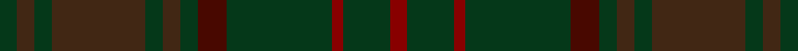

This page is one **sett** — a single exact thread-count. It belongs to the [tartan](/setts/dg3do3dg3do16dg3do3dg3dr5dg18r2dg8r3/)
(the same proportion at any scale), whose colour order is pattern [GBGBGBGBGRGR](/stripes/gbgbgbgbgrgr/).

Sourced from register-of-tartans.  It is a [12 stripe tartan](/stripes/stripes12/).

Original link https://www.tartanregister.gov.uk/tartanDetails.aspx?ref=999

2 attestations — the source records this cloth was collapsed from (oldest owns this page)

<ul>
<li>01/01/1996 — Dublin, County (register-of-tartans, <a href="https://www.tartanregister.gov.uk/tartanDetails.aspx?ref=999">record</a>)  <em>Designed by Polly Wittering of House of Edgar.Stricly speaking this should be categorised as a 'Fashion' tartan rather than a 'District'. The Scottish Tartans Authority now requires documentary proof that a District tartan has been authorised/accepted by an authoritative body connected with the area in question.</em></li>
<li>1997 — Dublin, County (District) (tartans-authority, <a href="https://www.tartanregister.gov.uk/tartanDetails.aspx?ref=2250">record</a>)  <em>One of a series of Irish District tartans designed by Polly Wittering of the House of Edgar. These were not 'officially sanctioned' District tartans but, like many of their historic district tartan predecessors have apparently proved popular enough to be regarded as 'District' rather than their original categorisation of 'Fashion'. Sample in STA's Johnston Collection.</em></li>
</ul>

Dataset <small>— provenance for this record, inherited from the source manifest</small>

<dl class="dataset-prov">
<dt>source</dt><dd><a href="/sources/register-of-tartans/">Scottish Register of Tartans</a></dd>
<dt>data captured from</dt><dd><a href="https://github.com/thetartan/tartan-database/blob/master/data/register-of-tartans/data.csv">https://github.com/thetartan/tartan-database/blob/master/data/register-of-tartans/data.csv</a></dd>
<dt>data date</dt><dd>1996 <small>(this record)</small></dd>
<dt>licence</dt><dd><a href="https://www.tartanregister.gov.uk/copyright">Crown copyright</a></dd>
</dl>

Capture chain <small>— the hands this data passed through, oldest first; each capture carries its own licence</small>

<ol class="capture-chain">
<li><a href="https://www.tartanregister.gov.uk/">Scottish Register of Tartans</a> · <a href="https://www.tartanregister.gov.uk/copyright">Crown copyright</a> <small>the living register — still published by National Records of Scotland</small></li>
<li><a href="https://github.com/thetartan/tartan-database">thetartan/tartan-database</a> <small>2016-2017</small> · <a href="https://creativecommons.org/licenses/by-nc-nd/4.0/">CC BY-NC-ND 4.0</a> <small>Levko Kravets's frozen compilation — the capture we vendored, and where its CC licence text came from</small></li>
<li>this dictionary <small>captured 2026-06-10 · commit 5bf86c7566</small> <small>each re-capture is a git commit to data/sources</small></li>
</ol>

## Register references

External register numbers recorded for this tartan.

- Scottish Register of Tartans: [999](https://www.tartanregister.gov.uk/tartanDetails.aspx?ref=999)
- Scottish Tartans Authority (ITI): 2250
- Scottish Tartans World Register: 2250

## Thread count
DG/6 DO6 DG6 DO32 DG6 DO6 DG6 DR10 DG36 R4 DG16 R/6

One full sett is **268 threads**.

## Palette
<table><thead><tr><th>Colour</th><th>Shade</th><th>OKLCh</th></tr></thead><tbody><tr><td>DO</td><td><code style="background-color:#412714;">#412714</code> <small style="color:#888">#412714</small></td><td><small style="color:#888">oklch(30.1% 0.050 55.7)</small></td></tr><tr><td>R</td><td><code style="background-color:#880000;">#880000</code> <small style="color:#888">#880000</small></td><td><small style="color:#888">oklch(39.4% 0.162 29.2)</small></td></tr><tr><td>DR</td><td><code style="background-color:#480800;">#480800</code> <small style="color:#888">#480800</small></td><td><small style="color:#888">oklch(26.1% 0.096 33.1)</small></td></tr><tr><td>DG</td><td><code style="background-color:#053819;">#053819</code> <small style="color:#888">#053819</small></td><td><small style="color:#888">oklch(30.0% 0.075 151.3)</small></td></tr></tbody></table>

# Sample pattern

ID: /variants/s12/dg3do3dg3do16dg3do3dg3dr5dg18r2dg8r3~x2~dr1004029-r1606028/
