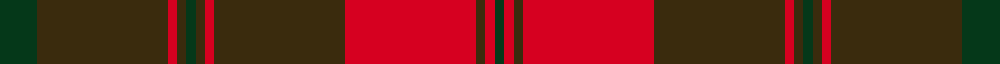
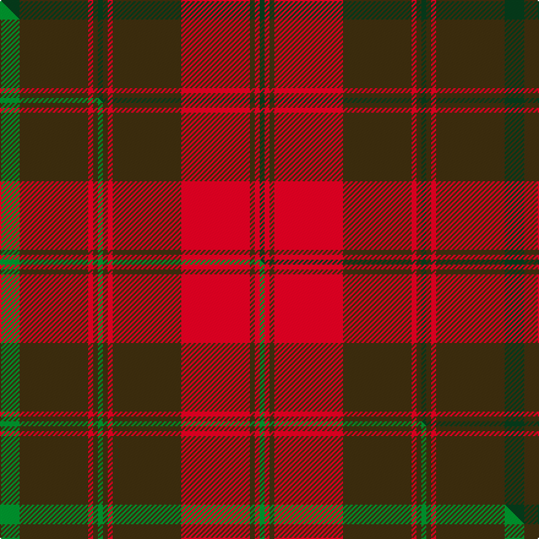

This is one **variant** — a specific cloth: this exact thread count and colourway, with its own
provenance below. It is one weaving of the [sett](/setts/dg4dy14r1dy1dg1dy1r1dy14r14dy1r1dg1/) (the scale-free proportion — the
same cloth at any scale or shade), whose colour order is pattern [GGRGGGRGRGRG](/stripes/ggrgggrgrgrg/).

Part of the [Frame](/tartans/f/fr/frame-3/) tartan — the named design grouping this sett with its other cloths.

Sourced from tartans-authority.  It is a [12 stripe tartan](/stripes/stripes12/).

Original link [https://www.tartanregister.gov.uk/tartanDetails.aspx?ref=10614](https://www.tartanregister.gov.uk/tartanDetails.aspx?ref=10614)

Dataset <small>— provenance for this record, inherited from the source manifest</small>

<dl class="dataset-prov">
<dt>source</dt><dd><a href="/sources/tartans-authority/">Scottish Tartans Authority</a></dd>
<dt>data captured from</dt><dd><a href="https://github.com/thetartan/tartan-database/blob/master/data/tartans-authority/data.csv">https://github.com/thetartan/tartan-database/blob/master/data/tartans-authority/data.csv</a></dd>
<dt>data date</dt><dd>25/03/2010 <small>(this record)</small></dd>
<dt>licence</dt><dd><a href="https://creativecommons.org/licenses/by-nc-nd/4.0/">CC BY-NC-ND 4.0</a></dd>
</dl>

Capture chain <small>— the hands this data passed through, oldest first; each capture carries its own licence</small>

<ol class="capture-chain">
<li><a href="https://www.tartansauthority.com/">Scottish Tartans Authority</a> <small>the heritage body's archive — its tartan-ferret record browser is retired (links repaired to the SRT, above)</small></li>
<li><a href="https://github.com/thetartan/tartan-database">thetartan/tartan-database</a> <small>2016-2017</small> · <a href="https://creativecommons.org/licenses/by-nc-nd/4.0/">CC BY-NC-ND 4.0</a> <small>Levko Kravets's frozen compilation — the capture we vendored, and where its CC licence text came from</small></li>
<li>this dictionary <small>captured 2026-06-10 · commit 5bf86c7566</small> <small>each re-capture is a git commit to data/sources</small></li>
</ol>

## Register references

External register numbers recorded for this tartan.

- Scottish Register of Tartans: [10614](https://www.tartanregister.gov.uk/tartanDetails?ref=10614)
- Scottish Tartans Authority (ITI): 10614

## Thread count
DG/16 DY56 R4 DY4 DG4 DY4 R4 DY56 R56 DY4 R4 DG/4

One full sett is **412 threads**.

## Palette
<table><thead><tr><th>Colour</th><th>Shade</th><th>OKLCh</th></tr></thead><tbody><tr><td>DG</td><td><code style="background-color:#053819;">#053819</code> <small style="color:#888">#053819</small></td><td><small style="color:#888">oklch(30.0% 0.075 151.3)</small></td></tr><tr><td>R</td><td><code style="background-color:#D60020;">#D60020</code> <small style="color:#888">#D60020</small></td><td><small style="color:#888">oklch(55.2% 0.224 25.5)</small></td></tr><tr><td>DY</td><td><code style="background-color:#3A2B0D;">#3A2B0D</code> <small style="color:#888">#3A2B0D</small></td><td><small style="color:#888">oklch(30.0% 0.049 82.0)</small></td></tr></tbody></table>

# Sample pattern

## Compared to the master

This cloth is one sett of its design; the master sett (the exemplar the design is anchored on) is below for comparison.

Its **ΔTartan distance** from the master is **0.07** — the same measure the nearest-tartans table ranks by (0 is identical; a re-scale of the same cloth is near 0, a recolour or a different proportion further).

<figure class="master-compare" style="margin:0">

this sett
master sett ★

<figcaption style="color:#888;font-size:smaller">One weave of this sett against the <a href="/setts/g4dy14r1dy1g1dy1r1dy14r14dy1r1g1/">master sett ★</a>, split on the diagonal: a shared proportion runs seamlessly across it with only the shades shifting; a different proportion breaks on it.</figcaption>
</figure>

## Nearest tartan variants

The nearest existing variants by ΔTartan distance, with this cloth at the top so the swatches line up against it.

ΔTartan

Threads

Variant

Sett

—

412

<a href="/variants/s12/dg4dy14r1dy1dg1dy1r1dy14r14dy1r1dg1~x4/">Frame - Ferniegair (Personal)</a>

<a href="/ttd/edit/#slug=g4dy14r1dy1g1dy1r1dy14r14dy1r1g1~x4&amp;base=dg4dy14r1dy1dg1dy1r1dy14r14dy1r1dg1~x4" title="compare in the TTD">0.07</a>

412

<a href="/variants/s12/g4dy14r1dy1g1dy1r1dy14r14dy1r1g1~x4/">Frame (Ferniegair) (Personal)</a>

<a href="/ttd/edit/#slug=dy13r1dy2r2dy2r1dy2r5dy11r1dy2g2dy2r1dy2g7~x2&amp;base=dg4dy14r1dy1dg1dy1r1dy14r14dy1r1dg1~x4" title="compare in the TTD">3.11</a>

184

<a href="/variants/s16/dy13r1dy2r2dy2r1dy2r5dy11r1dy2g2dy2r1dy2g7~x2/">Särna District Tartan</a>

<a href="/ttd/edit/#slug=g4ri34db20ri4db8ri6r2ri5db2ri3g4~ri2109032-db1404245&amp;base=dg4dy14r1dy1dg1dy1r1dy14r14dy1r1dg1~x4" title="compare in the TTD">3.41</a>

176

<a href="/variants/s11/g4ri34db20ri4db8ri6r2ri5db2ri3g4~ri2109032-db1404245/">Hughes (Welsh Name)</a>

<a href="/ttd/edit/#slug=dr3o28do5o5do33o5do5o28ly3~x2&amp;base=dg4dy14r1dy1dg1dy1r1dy14r14dy1r1dg1~x4" title="compare in the TTD">3.48</a>

448

<a href="/variants/s9/dr3o28do5o5do33o5do5o28ly3~x2/">MacIver of Strathendry Htg (Personal</a>

<a href="/ttd/edit/#slug=r29g2r2g2r6dy21~x4&amp;base=dg4dy14r1dy1dg1dy1r1dy14r14dy1r1dg1~x4" title="compare in the TTD">3.49</a>

296

<a href="/variants/s6/r29g2r2g2r6dy21~x4/">Maguire Clan Family Tartan</a>

<a href="/ttd/edit/#slug=o8db3o3dg20o3dg3o3db6o3b3o20db3o3db2o6~x2~o1305035-dg1806142&amp;base=dg4dy14r1dy1dg1dy1r1dy14r14dy1r1dg1~x4" title="compare in the TTD">3.56</a>

328

<a href="/variants/s15/o8db3o3dg20o3dg3o3db6o3b3o20db3o3db2o6~x2~o1305035-dg1806142/">Glenfarclas Distillery</a>

<a href="/ttd/edit/#slug=do12r1do2r1do2lb2do3n9r1n2r1n3~x4&amp;base=dg4dy14r1dy1dg1dy1r1dy14r14dy1r1dg1~x4" title="compare in the TTD">3.57</a>

252

<a href="/variants/s12/do12r1do2r1do2lb2do3n9r1n2r1n3~x4/">Shieldhall (Fashion)</a>

<a href="/ttd/edit/#slug=r7ri2db2r2g32r6db12r41g2r5ri2g5~x2~r1707016-ri2208029&amp;base=dg4dy14r1dy1dg1dy1r1dy14r14dy1r1dg1~x4" title="compare in the TTD">3.62</a>

448

<a href="/variants/s12/r7ri2db2r2g32r6db12r41g2r5ri2g5~x2~r1707016-ri2208029/">MacDougall #5</a>

<a href="/ttd/edit/#slug=do44o3do4w3do4o44~x2&amp;base=dg4dy14r1dy1dg1dy1r1dy14r14dy1r1dg1~x4" title="compare in the TTD">3.62</a>

232

<a href="/variants/s6/do44o3do4w3do4o44~x2/">Wcwm 1166-2</a>

<a href="/ttd/edit/#slug=dr4y34do20y4do8y6r2y5do2y3dr4&amp;base=dg4dy14r1dy1dg1dy1r1dy14r14dy1r1dg1~x4" title="compare in the TTD">3.62</a>

176

<a href="/variants/s11/dr4y34do20y4do8y6r2y5do2y3dr4/">Morgan of Wales</a>

## Neighbour map

Every grey dot is one of 13621 variants placed by the first two principal components of the ΔTartan feature space (42% of its variance). Red is this tartan; blue dots are its nearest — click one to open its page. The map is a flat projection of a many-dimensional space — [how to read it](/posts/neighbourhood-maps/).

<svg viewBox="0 0 640 380" role="img" style="max-width:100%;height:auto;border:1px solid #e0e0e0;border-radius:4px;display:block" xmlns="http://www.w3.org/2000/svg"><image href="/nn/cloud.v1.png" width="640" height="380"/><a href="/variants/s12/g4dy14r1dy1g1dy1r1dy14r14dy1r1g1~x4/"><circle cx="392.1" cy="164.0" r="4" fill="#3465a4"><title>Frame (Ferniegair) (Personal)</title></circle></a><a href="/variants/s16/dy13r1dy2r2dy2r1dy2r5dy11r1dy2g2dy2r1dy2g7~x2/"><circle cx="409.6" cy="172.4" r="4" fill="#3465a4"><title>Särna District Tartan</title></circle></a><a href="/variants/s11/g4ri34db20ri4db8ri6r2ri5db2ri3g4~ri2109032-db1404245/"><circle cx="369.2" cy="147.7" r="4" fill="#3465a4"><title>Hughes (Welsh Name)</title></circle></a><a href="/variants/s9/dr3o28do5o5do33o5do5o28ly3~x2/"><circle cx="415.3" cy="207.6" r="4" fill="#3465a4"><title>MacIver of Strathendry Htg (Personal</title></circle></a><a href="/variants/s6/r29g2r2g2r6dy21~x4/"><circle cx="419.1" cy="164.0" r="4" fill="#3465a4"><title>Maguire Clan Family Tartan</title></circle></a><a href="/variants/s15/o8db3o3dg20o3dg3o3db6o3b3o20db3o3db2o6~x2~o1305035-dg1806142/"><circle cx="353.3" cy="184.4" r="4" fill="#3465a4"><title>Glenfarclas Distillery</title></circle></a><a href="/variants/s12/do12r1do2r1do2lb2do3n9r1n2r1n3~x4/"><circle cx="348.6" cy="187.2" r="4" fill="#3465a4"><title>Shieldhall (Fashion)</title></circle></a><a href="/variants/s12/r7ri2db2r2g32r6db12r41g2r5ri2g5~x2~r1707016-ri2208029/"><circle cx="344.5" cy="134.1" r="4" fill="#3465a4"><title>MacDougall #5</title></circle></a><a href="/variants/s6/do44o3do4w3do4o44~x2/"><circle cx="413.8" cy="206.0" r="4" fill="#3465a4"><title>Wcwm 1166-2</title></circle></a><a href="/variants/s11/dr4y34do20y4do8y6r2y5do2y3dr4/"><circle cx="428.2" cy="177.5" r="4" fill="#3465a4"><title>Morgan of Wales</title></circle></a><circle cx="417.0" cy="171.9" r="5" fill="#c00000"/><text x="320" y="376" text-anchor="middle" font-size="11" fill="#999">ground</text><text x="11" y="190" text-anchor="middle" font-size="11" fill="#999" transform="rotate(-90 11 190)">complexity</text></svg>

ID: /variants/s12/dg4dy14r1dy1dg1dy1r1dy14r14dy1r1dg1~x4/
