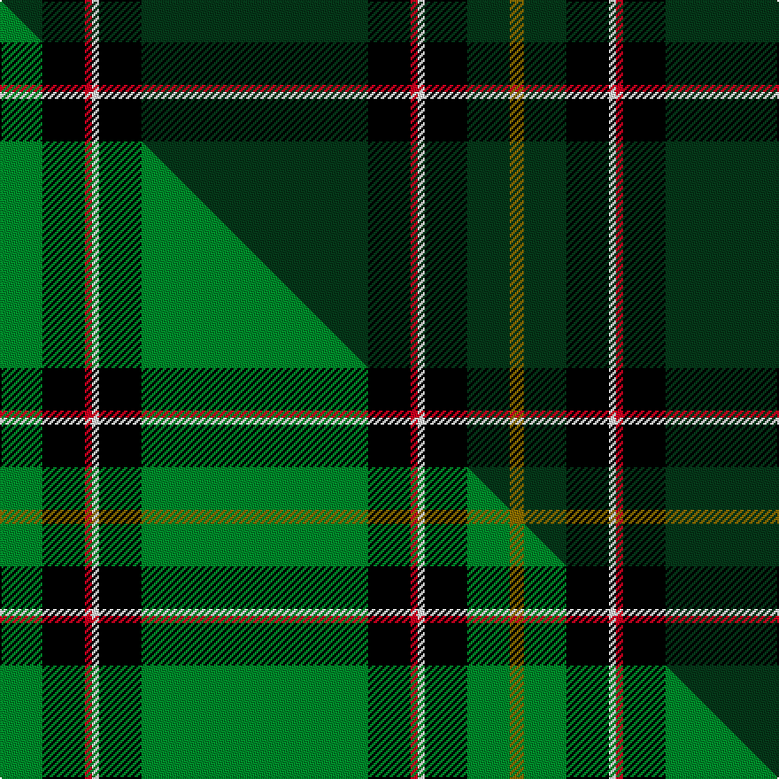

This is one **variant** — a specific cloth: this exact thread count and colourway, with its own
provenance below. It is one weaving of the [sett](/setts/dg6k6r1w1k6dg32k6r1w1k6dg6y2/) (the scale-free proportion — the
same cloth at any scale or shade), whose colour order is pattern [GGKWRKGKWRKG](/stripes/ggkwrkgkwrkg/).

Part of the [Schwarzen Keiler, Die](/tartans/schwarzen-keiler-die/) tartan — the named design grouping this sett with its other cloths.

Sourced from tartans-authority.  It is a [12 stripe tartan](/stripes/stripes12/).

Original link [https://www.tartanregister.gov.uk/tartanDetails.aspx?ref=10906](https://www.tartanregister.gov.uk/tartanDetails.aspx?ref=10906)

Dataset <small>— provenance for this record, inherited from the source manifest</small>

<dl class="dataset-prov">
<dt>source</dt><dd><a href="/sources/tartans-authority/">Scottish Tartans Authority</a></dd>
<dt>data captured from</dt><dd><a href="https://github.com/thetartan/tartan-database/blob/master/data/tartans-authority/data.csv">https://github.com/thetartan/tartan-database/blob/master/data/tartans-authority/data.csv</a></dd>
<dt>data date</dt><dd>2013 <small>(this record)</small></dd>
<dt>licence</dt><dd><a href="https://creativecommons.org/licenses/by-nc-nd/4.0/">CC BY-NC-ND 4.0</a></dd>
</dl>

Capture chain <small>— the hands this data passed through, oldest first; each capture carries its own licence</small>

<ol class="capture-chain">
<li><a href="https://www.tartansauthority.com/">Scottish Tartans Authority</a> <small>the heritage body's archive — its tartan-ferret record browser is retired (links repaired to the SRT, above)</small></li>
<li><a href="https://github.com/thetartan/tartan-database">thetartan/tartan-database</a> <small>2016-2017</small> · <a href="https://creativecommons.org/licenses/by-nc-nd/4.0/">CC BY-NC-ND 4.0</a> <small>Levko Kravets's frozen compilation — the capture we vendored, and where its CC licence text came from</small></li>
<li>this dictionary <small>captured 2026-06-10 · commit 5bf86c7566</small> <small>each re-capture is a git commit to data/sources</small></li>
</ol>

## Register references

External register numbers recorded for this tartan.

- Scottish Register of Tartans: [10906](https://www.tartanregister.gov.uk/tartanDetails?ref=10906)
- Scottish Tartans Authority (ITI): 10906

## Thread count
DG/24 K24 R4 W4 K24 DG128 K24 R4 W4 K24 DG24 Y/8

One full sett is **560 threads**.

## Palette
<table><thead><tr><th>Colour</th><th>Shade</th><th>OKLCh</th></tr></thead><tbody><tr><td>DG</td><td><code style="background-color:#053819;">#053819</code> <small style="color:#888">#053819</small></td><td><small style="color:#888">oklch(30.0% 0.075 151.3)</small></td></tr><tr><td>K</td><td><code style="background-color:#000000;">#000000</code> <small style="color:#888">#000000</small></td><td><small style="color:#888">oklch(0.0% 0.000 0.0)</small></td></tr><tr><td>R</td><td><code style="background-color:#D60020;">#D60020</code> <small style="color:#888">#D60020</small></td><td><small style="color:#888">oklch(55.2% 0.224 25.5)</small></td></tr><tr><td>W</td><td><code style="background-color:#F7F7F7;">#F7F7F7</code> <small style="color:#888">#F7F7F7</small></td><td><small style="color:#888">oklch(97.6% 0.000 89.9)</small></td></tr><tr><td>Y</td><td><code style="background-color:#8B6E00;">#8B6E00</code> <small style="color:#888">#8B6E00</small></td><td><small style="color:#888">oklch(55.1% 0.113 90.4)</small></td></tr></tbody></table>

# Sample pattern

## Compared to the master

This cloth is one sett of its design; the master sett (the exemplar the design is anchored on) is below for comparison.

Its **ΔTartan distance** from the master is **0.20** — the same measure the nearest-tartans table ranks by (0 is identical; a re-scale of the same cloth is near 0, a recolour or a different proportion further).

<figure class="master-compare" style="margin:0">

this sett
master sett ★

<figcaption style="color:#888;font-size:smaller">One weave of this sett against the <a href="/setts/g6k6r1w1k6g32k6r1w1k6g6y2/">master sett ★</a>, split on the diagonal: a shared proportion runs seamlessly across it with only the shades shifting; a different proportion breaks on it.</figcaption>
</figure>

## Nearest tartan variants

The nearest existing variants by ΔTartan distance, with this cloth at the top so the swatches line up against it.

ΔTartan

Threads

Variant

Sett

—

560

<a href="/variants/s12/dg6k6r1w1k6dg32k6r1w1k6dg6y2~x4/">Schwarzen Keiler, Die</a>

<a href="/ttd/edit/#slug=dr6k3do4k10do5o3k2do31w1do2w2~x2~do1400000-o2500000&amp;base=dg6k6r1w1k6dg32k6r1w1k6dg6y2~x4" title="compare in the TTD">2.54</a>

260

<a href="/variants/s11/dr6k3do4k10do5o3k2do31w1do2w2~x2~do1400000-o2500000/">Glen and Son, William (Corporate)</a>

<a href="/ttd/edit/#slug=k13w3dr3k34dg21k13dg8k5dg3k2dg1db1~x2&amp;base=dg6k6r1w1k6dg32k6r1w1k6dg6y2~x4" title="compare in the TTD">2.55</a>

400

<a href="/variants/s12/k13w3dr3k34dg21k13dg8k5dg3k2dg1db1~x2/">Alamudi (Corporate)</a>

<a href="/ttd/edit/#slug=k2dg4k6n2k31ly2k1ly2k16dg20ly1n2~x2~dg1804158-ly2706114&amp;base=dg6k6r1w1k6dg32k6r1w1k6dg6y2~x4" title="compare in the TTD">2.55</a>

348

<a href="/variants/s12/k2dg4k6n2k31ly2k1ly2k16dg20ly1n2~x2~dg1804158-ly2706114/">Entier</a>

<a href="/ttd/edit/#slug=dg67k2dg2k2dg2y8r8k8y2lb7~x2&amp;base=dg6k6r1w1k6dg32k6r1w1k6dg6y2~x4" title="compare in the TTD">2.75</a>

284

<a href="/variants/s10/dg67k2dg2k2dg2y8r8k8y2lb7~x2/">Moran (French) (Name)</a>

<a href="/ttd/edit/#slug=dg78k4dg4k4dg4k6db26k4w8k4db26k6dg48g3&amp;base=dg6k6r1w1k6dg32k6r1w1k6dg6y2~x4" title="compare in the TTD">2.79</a>

369

<a href="/variants/s14/dg78k4dg4k4dg4k6db26k4w8k4db26k6dg48g3/">Proctor</a>

<a href="/ttd/edit/#slug=dt8k2o2dt2k13dt2k2ly1dt14k26ly2~x2&amp;base=dg6k6r1w1k6dg32k6r1w1k6dg6y2~x4" title="compare in the TTD">2.83</a>

276

<a href="/variants/s11/dt8k2o2dt2k13dt2k2ly1dt14k26ly2~x2/">Pride of Scotland Hunting/Dark Fashion Tartan</a>

<a href="/ttd/edit/#slug=dg24o2dg3k6o1ly2o1k4~x4&amp;base=dg6k6r1w1k6dg32k6r1w1k6dg6y2~x4" title="compare in the TTD">2.88</a>

232

<a href="/variants/s8/dg24o2dg3k6o1ly2o1k4~x4/">Green Ridge</a>

<a href="/ttd/edit/#slug=dg42k2dg12w2r3k2r3w2k2dp12k4r3w4k3~x2&amp;base=dg6k6r1w1k6dg32k6r1w1k6dg6y2~x4" title="compare in the TTD">2.88</a>

294

<a href="/variants/s14/dg42k2dg12w2r3k2r3w2k2dp12k4r3w4k3~x2/">MacFarlane Hunting (MacGregor Hastie)</a>

<a href="/ttd/edit/#slug=dg42k10lr2k2r2k2dg10r6k2r3dg2~x2&amp;base=dg6k6r1w1k6dg32k6r1w1k6dg6y2~x4" title="compare in the TTD">2.93</a>

244

<a href="/variants/s11/dg42k10lr2k2r2k2dg10r6k2r3dg2~x2/">Dryfe</a>

<a href="/ttd/edit/#slug=dt8k2o2dt2k13dt2k2lr1dt14k26lr2~x2&amp;base=dg6k6r1w1k6dg32k6r1w1k6dg6y2~x4" title="compare in the TTD">2.96</a>

276

<a href="/variants/s11/dt8k2o2dt2k13dt2k2lr1dt14k26lr2~x2/">Pride of Scotland, Dark (Fashion)</a>

## Neighbour map

Every grey dot is one of 13621 variants placed by the first two principal components of the ΔTartan feature space (42% of its variance). Red is this tartan; blue dots are its nearest — click one to open its page.

<svg viewBox="0 0 640 380" role="img" style="max-width:100%;height:auto;border:1px solid #e0e0e0;border-radius:4px;display:block" xmlns="http://www.w3.org/2000/svg"><image href="/nn/cloud.v1.png" width="640" height="380"/><a href="/variants/s11/dr6k3do4k10do5o3k2do31w1do2w2~x2~do1400000-o2500000/"><circle cx="333.7" cy="83.8" r="4" fill="#3465a4"><title>Glen and Son, William (Corporate)</title></circle></a><a href="/variants/s12/k13w3dr3k34dg21k13dg8k5dg3k2dg1db1~x2/"><circle cx="354.2" cy="93.7" r="4" fill="#3465a4"><title>Alamudi (Corporate)</title></circle></a><a href="/variants/s12/k2dg4k6n2k31ly2k1ly2k16dg20ly1n2~x2~dg1804158-ly2706114/"><circle cx="345.6" cy="92.4" r="4" fill="#3465a4"><title>Entier</title></circle></a><a href="/variants/s10/dg67k2dg2k2dg2y8r8k8y2lb7~x2/"><circle cx="381.0" cy="66.8" r="4" fill="#3465a4"><title>Moran (French) (Name)</title></circle></a><a href="/variants/s14/dg78k4dg4k4dg4k6db26k4w8k4db26k6dg48g3/"><circle cx="341.0" cy="94.6" r="4" fill="#3465a4"><title>Proctor</title></circle></a><a href="/variants/s11/dt8k2o2dt2k13dt2k2ly1dt14k26ly2~x2/"><circle cx="339.7" cy="115.5" r="4" fill="#3465a4"><title>Pride of Scotland Hunting/Dark Fashion Tartan</title></circle></a><a href="/variants/s8/dg24o2dg3k6o1ly2o1k4~x4/"><circle cx="369.8" cy="121.7" r="4" fill="#3465a4"><title>Green Ridge</title></circle></a><a href="/variants/s14/dg42k2dg12w2r3k2r3w2k2dp12k4r3w4k3~x2/"><circle cx="267.9" cy="75.2" r="4" fill="#3465a4"><title>MacFarlane Hunting (MacGregor Hastie)</title></circle></a><a href="/variants/s11/dg42k10lr2k2r2k2dg10r6k2r3dg2~x2/"><circle cx="377.0" cy="102.2" r="4" fill="#3465a4"><title>Dryfe</title></circle></a><a href="/variants/s11/dt8k2o2dt2k13dt2k2lr1dt14k26lr2~x2/"><circle cx="341.1" cy="115.4" r="4" fill="#3465a4"><title>Pride of Scotland, Dark (Fashion)</title></circle></a><circle cx="339.2" cy="82.7" r="5" fill="#c00000"/><text x="320" y="376" text-anchor="middle" font-size="11" fill="#999">ground</text><text x="11" y="190" text-anchor="middle" font-size="11" fill="#999" transform="rotate(-90 11 190)">complexity</text></svg>

ID: /variants/s12/dg6k6r1w1k6dg32k6r1w1k6dg6y2~x4/
