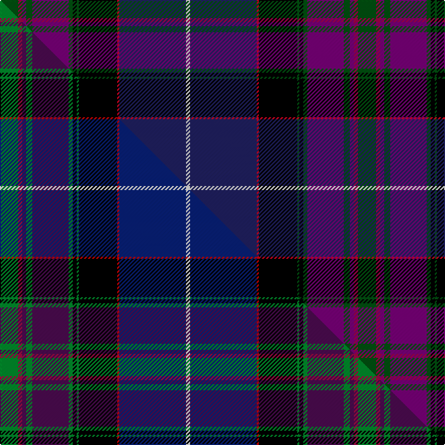

This page is one **sett** — a single exact thread-count. It belongs to the [tartan](/setts/dg9ri2dp2dg3dp18dg2k2dg1k19r1db33w2/)
(the same proportion at any scale), whose colour order is pattern [GRBGBGKGKRBW](/stripes/grbgbgkgkrbw/).

Part of the [Western Isles](/tartans/western-isles/) tartan — the named design grouping this sett with its other cloths.

Sourced from house-of-tartan.  It is a [12 stripe tartan](/stripes/stripes12/).

Original link http://www.house-of-tartan.scotland.net/house/TartanViewjs.asp?colr=Def&tnam=7463

## Provenance

Earliest known date: 1997 Kenneth Dalgliesh designed the Pride of Scotland (see 2469) along with Scott Millson of McCalls of Aberdeen. McCalls decided later to patent the design to head up a new range of fashionable wedding tartans. Dalgliesh found that he was unable to weave the original pattern even though it was his own design and so he produced this pattern with an additional red line.

## Thread count
DG/18 Ri4 DP4 DG6 DP36 DG4 K4 DG2 K38 R2 DB66 W/4

One full sett is **354 threads**.

## Palette
<table><thead><tr><th>Colour</th><th>Shade</th><th>OKLCh</th></tr></thead><tbody><tr><td>DB</td><td><code style="background-color:#202060;">#202060</code> <small style="color:#888">#202060</small></td><td><small style="color:#888">oklch(28.9% 0.111 276.9)</small></td></tr><tr><td>DB</td><td><code style="background-color:#2C2C80;">#2C2C80</code> <small style="color:#888">#2C2C80</small></td><td><small style="color:#888">oklch(35.0% 0.138 276.6)</small></td></tr><tr><td>DG</td><td><code style="background-color:#003820;">#003820</code> <small style="color:#888">#003820</small></td><td><small style="color:#888">oklch(30.0% 0.070 158.3)</small></td></tr><tr><td>DG</td><td><code style="background-color:#005010;">#005010</code> <small style="color:#888">#005010</small></td><td><small style="color:#888">oklch(37.5% 0.118 144.9)</small></td></tr><tr><td>K</td><td><code style="background-color:#000000;">#000000</code> <small style="color:#888">#000000</small></td><td><small style="color:#888">oklch(0.0% 0.000 0.0)</small></td></tr><tr><td>W</td><td><code style="background-color:#E0E0E0;">#E0E0E0</code> <small style="color:#888">#E0E0E0</small></td><td><small style="color:#888">oklch(90.7% 0.000 89.9)</small></td></tr><tr><td>M</td><td><code style="background-color:#CA047B;">#CA047B</code> <small style="color:#888">#CA047B</small></td><td><small style="color:#888">oklch(55.0% 0.225 353.8)</small></td></tr><tr><td>DP</td><td><code style="background-color:#780078;">#780078</code> <small style="color:#888">#780078</small></td><td><small style="color:#888">oklch(40.2% 0.185 328.4)</small></td></tr><tr><td>R</td><td><code style="background-color:#A00048;">#A00048</code> <small style="color:#888">#A00048</small></td><td><small style="color:#888">oklch(45.4% 0.182 5.3)</small></td></tr><tr><td>R</td><td><code style="background-color:#D60020;">#D60020</code> <small style="color:#888">#D60020</small></td><td><small style="color:#888">oklch(55.2% 0.224 25.5)</small></td></tr><tr><td>W</td><td><code style="background-color:#FCFCFC;">#FCFCFC</code> <small style="color:#888">#FCFCFC</small></td><td><small style="color:#888">oklch(99.1% 0.000 89.9)</small></td></tr></tbody></table>

# Sample pattern

## Compared to the master

This cloth is one sett of its design; the master sett (the exemplar the design is anchored on) is below for comparison.

Its **ΔTartan distance** from the master is **0.59** — the same measure the nearest-tartans table ranks by (0 is identical; a re-scale of the same cloth is near 0, a recolour or a different proportion further).

<figure class="master-compare" style="margin:0">

this sett
master sett ★

<figcaption style="color:#888;font-size:smaller">One weave of this sett against the <a href="/setts/g9r2dp2g3dp18g2k2g1k19ri1db33w2/">master sett ★</a>, split on the diagonal: a shared proportion runs seamlessly across it with only the shades shifting; a different proportion breaks on it.</figcaption>
</figure>

## Nearest tartan variants

The nearest existing variants by ΔTartan distance, with this cloth at the top so the swatches line up against it.

ΔTartan

Threads

Variant

Sett

—

354

<a href="/variants/s12/dg9ri2dp2dg3dp18dg2k2dg1k19r1db33w2~x2~dg1505139-ri1807008-dp1607327-db1204274-w3600000/">Western Isles Fashion Tartan</a>

0.00

—

<a href="/variants/s12/g9r2dp2g3dp18g2k2g1k19ri1db33w2~x2~r1807008-ri2109032-db1204274-w3600000/">Western Isles</a>

<a href="/ttd/edit/#slug=g9r2dp2g3dp18g2k2g1k19ri1db33w2~x2~r1807008-ri2109032&amp;base=dg9ri2dp2dg3dp18dg2k2dg1k19r1db33w2~x2~dg1505139-ri1807008-dp1607327-db1204274-w3600000" title="compare in the TTD">0.00</a>

354

<a href="/variants/s12/g9r2dp2g3dp18g2k2g1k19ri1db33w2~x2~r1807008-ri2109032/">Western Isles (Fashion)</a>

<a href="/ttd/edit/#slug=dg8dpi2dp2dg3dp16dg2k2dg1k16db30w2~x2~dpi1607327-dp1503322&amp;base=dg9ri2dp2dg3dp18dg2k2dg1k19r1db33w2~x2~dg1505139-ri1807008-dp1607327-db1204274-w3600000" title="compare in the TTD">0.77</a>

316

<a href="/variants/s11/dg8dpi2dp2dg3dp16dg2k2dg1k16db30w2~x2~dpi1607327-dp1503322/">Pride of Scotland General Tartan</a>

<a href="/ttd/edit/#slug=g6dpi2dp2g2dp15g3k2g1k15db43w2~x2~dpi1607327-dp1105325&amp;base=dg9ri2dp2dg3dp18dg2k2dg1k19r1db33w2~x2~dg1505139-ri1807008-dp1607327-db1204274-w3600000" title="compare in the TTD">1.11</a>

356

<a href="/variants/s11/g6dpi2dp2g2dp15g3k2g1k15db43w2~x2~dpi1607327-dp1105325/">Scottish Pride (Fashion)</a>

<a href="/ttd/edit/#slug=dg10y2dp2dg2dp13dg2dp2dg1k13db24w2~x2&amp;base=dg9ri2dp2dg3dp18dg2k2dg1k19r1db33w2~x2~dg1505139-ri1807008-dp1607327-db1204274-w3600000" title="compare in the TTD">1.99</a>

268

<a href="/variants/s11/dg10y2dp2dg2dp13dg2dp2dg1k13db24w2~x2/">Lang of Sherbrooke (Personal)</a>

<a href="/ttd/edit/#slug=g9r2m2g3m18g2k2g1k19db33w2~x2&amp;base=dg9ri2dp2dg3dp18dg2k2dg1k19r1db33w2~x2~dg1505139-ri1807008-dp1607327-db1204274-w3600000" title="compare in the TTD">2.60</a>

350

<a href="/variants/s11/g9r2m2g3m18g2k2g1k19db33w2~x2/">Pride of Scotland</a>

## Neighbour map

Every grey dot is one of 13620 variants placed by the first two principal components of the ΔTartan feature space (42% of its variance). Red is this tartan; blue dots are its nearest — click one to open its page.

<svg viewBox="0 0 640 380" role="img" style="max-width:100%;height:auto;border:1px solid #e0e0e0;border-radius:4px;display:block" xmlns="http://www.w3.org/2000/svg"><image href="/nn/cloud.v1.png" width="640" height="380"/><a href="/variants/s12/g9r2dp2g3dp18g2k2g1k19ri1db33w2~x2~r1807008-ri2109032-db1204274-w3600000/"><circle cx="158.3" cy="60.8" r="4" fill="#3465a4"><title>Western Isles</title></circle></a><a href="/variants/s12/g9r2dp2g3dp18g2k2g1k19ri1db33w2~x2~r1807008-ri2109032/"><circle cx="150.5" cy="59.3" r="4" fill="#3465a4"><title>Western Isles (Fashion)</title></circle></a><a href="/variants/s11/dg8dpi2dp2dg3dp16dg2k2dg1k16db30w2~x2~dpi1607327-dp1503322/"><circle cx="200.0" cy="97.3" r="4" fill="#3465a4"><title>Pride of Scotland General Tartan</title></circle></a><a href="/variants/s11/g6dpi2dp2g2dp15g3k2g1k15db43w2~x2~dpi1607327-dp1105325/"><circle cx="247.5" cy="59.6" r="4" fill="#3465a4"><title>Scottish Pride (Fashion)</title></circle></a><a href="/variants/s11/dg10y2dp2dg2dp13dg2dp2dg1k13db24w2~x2/"><circle cx="178.5" cy="113.1" r="4" fill="#3465a4"><title>Lang of Sherbrooke (Personal)</title></circle></a><a href="/variants/s11/g9r2m2g3m18g2k2g1k19db33w2~x2/"><circle cx="151.3" cy="71.8" r="4" fill="#3465a4"><title>Pride of Scotland</title></circle></a><circle cx="170.8" cy="62.7" r="5" fill="#c00000"/><text x="320" y="376" text-anchor="middle" font-size="11" fill="#999">ground</text><text x="11" y="190" text-anchor="middle" font-size="11" fill="#999" transform="rotate(-90 11 190)">complexity</text></svg>

ID: /variants/s12/dg9ri2dp2dg3dp18dg2k2dg1k19r1db33w2~x2~dg1505139-ri1807008-dp1607327-db1204274-w3600000/
