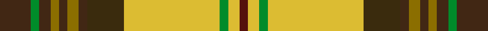

This is one **variant** — a specific cloth: this exact thread count and colourway, with its own
provenance below. It is one weaving of the [sett](/setts/do11g3do4y3do3y4do3dy13ly34g3ly4dr3/) (the scale-free proportion — the
same cloth at any scale or shade), whose colour order is pattern [BGBGBGBGYGYB](/stripes/bgbgbgbgygyb/).

Part of the [Harmony 1](/tartans/h/ha/harmony-1-2/) tartan — the named design grouping this sett with its other cloths.

Sourced from house-of-tartan.  It is a [12 stripe tartan](/stripes/stripes12/).

Original link [http://www.house-of-tartan.scotland.net/house/TartanViewjs.asp?colr=Def&tnam=1658](http://www.house-of-tartan.scotland.net/house/TartanViewjs.asp?colr=Def&tnam=1658)

## Provenance

Earliest known date: pre 2003 LB may be Turquoise

2 attestations — the source records this cloth was collapsed from (oldest owns this page)

<ul>
<li>pre 2003 — Harmony 1 Trade Tartan (house-of-tartan, <a href="http://www.house-of-tartan.scotland.net/house/TartanViewjs.asp?colr=Def&tnam=1658">record</a>) </li>
<li>undated — Harmony 1 (register-of-tartans, <a href="https://www.tartanregister.gov.uk/tartanDetails.aspx?ref=1602">record</a>)  <em>D.C.Dalgliesg , a weaving firm in Selkirk, a trade sett.</em></li>
</ul>

Dataset <small>— provenance for this record, inherited from the source manifest</small>

<dl class="dataset-prov">
<dt>source</dt><dd><a href="/sources/house-of-tartan/">House of Tartan</a></dd>
<dt>data captured from</dt><dd><a href="https://github.com/thetartan/tartan-database/blob/master/data/house-of-tartan/data.csv">https://github.com/thetartan/tartan-database/blob/master/data/house-of-tartan/data.csv</a></dd>
<dt>data date</dt><dd>pre 2003 <small>(this record)</small></dd>
<dt>licence</dt><dd><a href="https://creativecommons.org/licenses/by-nc-nd/4.0/">CC BY-NC-ND 4.0</a></dd>
</dl>

Capture chain <small>— the hands this data passed through, oldest first; each capture carries its own licence</small>

<ol class="capture-chain">
<li><a href="http://www.house-of-tartan.scotland.net/">House of Tartan</a> <small>the weaver/retailer's database — the site is now offline; the URL is kept as the ultimate source's identity</small></li>
<li><a href="https://github.com/thetartan/tartan-database">thetartan/tartan-database</a> <small>2016-2017</small> · <a href="https://creativecommons.org/licenses/by-nc-nd/4.0/">CC BY-NC-ND 4.0</a> <small>Levko Kravets's frozen compilation — the capture we vendored, and where its CC licence text came from</small></li>
<li>this dictionary <small>captured 2026-06-10 · commit 5bf86c7566</small> <small>each re-capture is a git commit to data/sources</small></li>
</ol>

## Register references

External register numbers recorded for this tartan.

- Scottish Register of Tartans: [1602](https://www.tartanregister.gov.uk/tartanDetails.aspx?ref=1602)
- Scottish Tartans World Register: 1658

## Thread count
DO/22 G6 DO8 Y6 DO6 Y8 DO6 DY26 LY68 G6 LY8 DR/6

One full sett is **324 threads**.

## Palette
<table><thead><tr><th>Colour</th><th>Shade</th><th>OKLCh</th></tr></thead><tbody><tr><td>DO</td><td><code style="background-color:#412714;">#412714</code> <small style="color:#888">#412714</small></td><td><small style="color:#888">oklch(30.1% 0.050 55.7)</small></td></tr><tr><td>DR</td><td><code style="background-color:#55120C;">#55120C</code> <small style="color:#888">#55120C</small></td><td><small style="color:#888">oklch(30.0% 0.099 29.3)</small></td></tr><tr><td>G</td><td><code style="background-color:#008B2A;">#008B2A</code> <small style="color:#888">#008B2A</small></td><td><small style="color:#888">oklch(55.4% 0.170 145.9)</small></td></tr><tr><td>LY</td><td><code style="background-color:#DCBC32;">#DCBC32</code> <small style="color:#888">#DCBC32</small></td><td><small style="color:#888">oklch(80.0% 0.150 95.2)</small></td></tr><tr><td>DY</td><td><code style="background-color:#3A2B0D;">#3A2B0D</code> <small style="color:#888">#3A2B0D</small></td><td><small style="color:#888">oklch(30.0% 0.049 82.0)</small></td></tr><tr><td>Y</td><td><code style="background-color:#8B6E00;">#8B6E00</code> <small style="color:#888">#8B6E00</small></td><td><small style="color:#888">oklch(55.1% 0.113 90.4)</small></td></tr></tbody></table>

# Sample pattern

## Nearest tartan variants

The nearest existing variants by ΔTartan distance, with this cloth at the top so the swatches line up against it.

ΔTartan

Threads

Variant

Sett

—

324

<a href="/variants/s12/do11g3do4y3do3y4do3dy13ly34g3ly4dr3~x2/">Harmony 1 Trade Tartan</a>

<a href="/ttd/edit/#slug=dr3ly21dr14w3db11g36do3db3do4ly3~x2&amp;base=do11g3do4y3do3y4do3dy13ly34g3ly4dr3~x2" title="compare in the TTD">2.94</a>

392

<a href="/variants/s10/dr3ly21dr14w3db11g36do3db3do4ly3~x2/">State Seal of Florida (Fashion)</a>

<a href="/ttd/edit/#slug=dy4dg3dy30y12dg5lg4dg3lg14lgi2lg2lgi10ly3~x2~y2204115-lgi3205128&amp;base=do11g3do4y3do3y4do3dy13ly34g3ly4dr3~x2" title="compare in the TTD">2.97</a>

354

<a href="/variants/s12/dy4dg3dy30y12dg5lg4dg3lg14lgi2lg2lgi10ly3~x2~y2204115-lgi3205128/">Shrek (Fashion)</a>

<a href="/ttd/edit/#slug=dy4dg3dy30y12dg5lg4dg3lg14lgi2lg2lgi10ly3~x2~dg1804158-y2204115-lgi3205128&amp;base=do11g3do4y3do3y4do3dy13ly34g3ly4dr3~x2" title="compare in the TTD">3.09</a>

354

<a href="/variants/s12/dy4dg3dy30y12dg5lg4dg3lg14lgi2lg2lgi10ly3~x2~dg1804158-y2204115-lgi3205128/">Shrek</a>

<a href="/ttd/edit/#slug=dy2n2dg19n6dg2n6lo14dr4w2~x2&amp;base=do11g3do4y3do3y4do3dy13ly34g3ly4dr3~x2" title="compare in the TTD">3.26</a>

220

<a href="/variants/s9/dy2n2dg19n6dg2n6lo14dr4w2~x2/">Royal Pharmaceutical Society (Corp)</a>

<a href="/ttd/edit/#slug=dy3n2dg19n6dg2n6ly14dr4w2~x2&amp;base=do11g3do4y3do3y4do3dy13ly34g3ly4dr3~x2" title="compare in the TTD">3.41</a>

222

<a href="/variants/s9/dy3n2dg19n6dg2n6ly14dr4w2~x2/">Royal Pharmaceutical Society</a>

<a href="/ttd/edit/#slug=dg1dy7dg7n2dy1ly15w1~x4&amp;base=do11g3do4y3do3y4do3dy13ly34g3ly4dr3~x2" title="compare in the TTD">3.51</a>

264

<a href="/variants/s7/dg1dy7dg7n2dy1ly15w1~x4/">Regalia</a>

<a href="/ttd/edit/#slug=g6y5w1g2w1g5w1g2w1r15db2w1~x2&amp;base=do11g3do4y3do3y4do3dy13ly34g3ly4dr3~x2" title="compare in the TTD">3.77</a>

154

<a href="/variants/s12/g6y5w1g2w1g5w1g2w1r15db2w1~x2/">Dunblane District Tartan</a>

## Neighbour map

Every grey dot is one of 13656 variants placed by the first two principal components of the ΔTartan feature space (42% of its variance). Red is this tartan; blue dots are its nearest — click one to open its page. The map is a flat projection of a many-dimensional space — [how to read it](/posts/neighbourhood-maps/).

<svg viewBox="0 0 640 380" role="img" style="max-width:100%;height:auto;border:1px solid #e0e0e0;border-radius:4px;display:block" xmlns="http://www.w3.org/2000/svg"><image href="/nn/cloud.v1.png" width="640" height="380"/><a href="/variants/s10/dr3ly21dr14w3db11g36do3db3do4ly3~x2/"><circle cx="165.1" cy="164.4" r="4" fill="#3465a4"><title>State Seal of Florida (Fashion)</title></circle></a><a href="/variants/s12/dy4dg3dy30y12dg5lg4dg3lg14lgi2lg2lgi10ly3~x2~y2204115-lgi3205128/"><circle cx="170.4" cy="150.8" r="4" fill="#3465a4"><title>Shrek (Fashion)</title></circle></a><a href="/variants/s12/dy4dg3dy30y12dg5lg4dg3lg14lgi2lg2lgi10ly3~x2~dg1804158-y2204115-lgi3205128/"><circle cx="176.3" cy="153.4" r="4" fill="#3465a4"><title>Shrek</title></circle></a><a href="/variants/s9/dy2n2dg19n6dg2n6lo14dr4w2~x2/"><circle cx="178.7" cy="185.1" r="4" fill="#3465a4"><title>Royal Pharmaceutical Society (Corp)</title></circle></a><a href="/variants/s9/dy3n2dg19n6dg2n6ly14dr4w2~x2/"><circle cx="169.2" cy="189.0" r="4" fill="#3465a4"><title>Royal Pharmaceutical Society</title></circle></a><a href="/variants/s7/dg1dy7dg7n2dy1ly15w1~x4/"><circle cx="234.4" cy="176.7" r="4" fill="#3465a4"><title>Regalia</title></circle></a><a href="/variants/s12/g6y5w1g2w1g5w1g2w1r15db2w1~x2/"><circle cx="204.9" cy="144.3" r="4" fill="#3465a4"><title>Dunblane District Tartan</title></circle></a><circle cx="207.7" cy="145.3" r="5" fill="#c00000"/><text x="320" y="376" text-anchor="middle" font-size="11" fill="#999">ground</text><text x="11" y="190" text-anchor="middle" font-size="11" fill="#999" transform="rotate(-90 11 190)">complexity</text></svg>

ID: /variants/s12/do11g3do4y3do3y4do3dy13ly34g3ly4dr3~x2/
