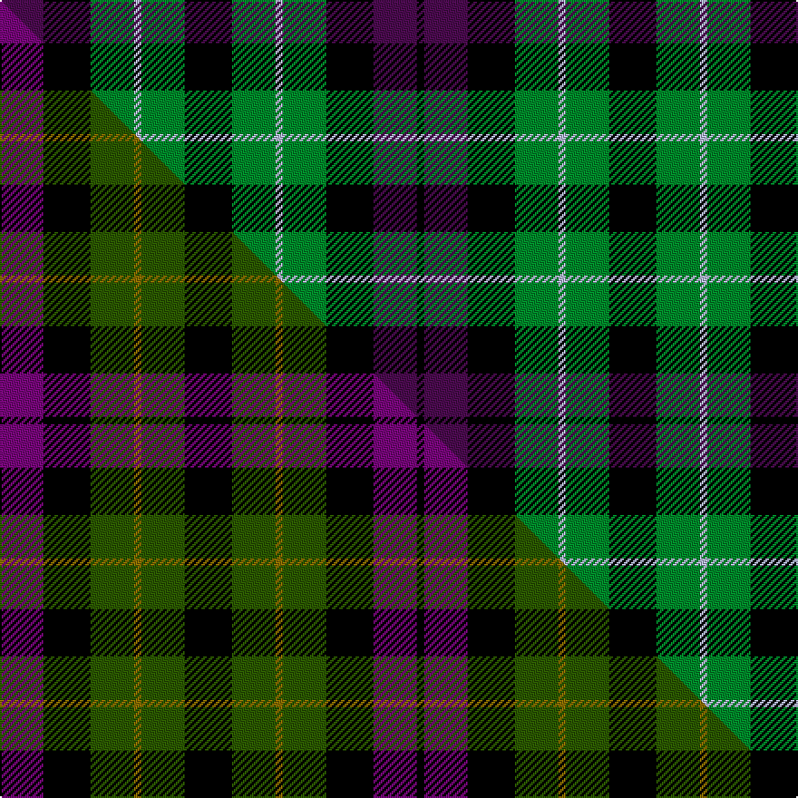

This page is one **sett** — a single exact thread-count. It belongs to the [tartan](/setts/dp12k13g12lb2g12k13g12lb2g12k13dp12k2/)
(the same proportion at any scale), whose colour order is pattern [BKGWGKGWGKBK](/stripes/bkgwgkgwgkbk/).

Part of the [Wilson's No.064](/tartans/wilson-s-no-064/) tartan — the named design grouping this sett with its other cloths.

Sourced from register-of-tartans.  It is a [12 stripe tartan](/stripes/stripes12/).

Original link https://www.tartanregister.gov.uk/tartanDetails.aspx?ref=4664

## Register references

External register numbers recorded for this tartan.

- Scottish Register of Tartans: [4664](https://www.tartanregister.gov.uk/tartanDetails.aspx?ref=4664)
- Scottish Tartans Authority (ITI): 1043
- Scottish Tartans World Register: 1043

## Thread count
DP/24 K26 G24 LB4 G24 K26 G24 LB4 G24 K26 DP24 K/4

One full sett is **440 threads**.

## Palette
<table><thead><tr><th>Colour</th><th>Shade</th><th>OKLCh</th></tr></thead><tbody><tr><td>DG</td><td><code style="background-color:#053819;">#053819</code> <small style="color:#888">#053819</small></td><td><small style="color:#888">oklch(30.0% 0.075 151.3)</small></td></tr><tr><td>DP</td><td><code style="background-color:#4B0B4F;">#4B0B4F</code> <small style="color:#888">#4B0B4F</small></td><td><small style="color:#888">oklch(30.1% 0.125 325.4)</small></td></tr><tr><td>G</td><td><code style="background-color:#008B2A;">#008B2A</code> <small style="color:#888">#008B2A</small></td><td><small style="color:#888">oklch(55.4% 0.170 145.9)</small></td></tr><tr><td>K</td><td><code style="background-color:#000000;">#000000</code> <small style="color:#888">#000000</small></td><td><small style="color:#888">oklch(0.0% 0.000 0.0)</small></td></tr><tr><td>LB</td><td><code style="background-color:#B5BBDE;">#B5BBDE</code> <small style="color:#888">#B5BBDE</small></td><td><small style="color:#888">oklch(79.9% 0.050 277.6)</small></td></tr></tbody></table>

# Sample pattern

## Compared to the master

This cloth is one sett of its design; the master sett (the exemplar the design is anchored on) is below for comparison.

Its **ΔTartan distance** from the master is **0.66** — the same measure the nearest-tartans table ranks by (0 is identical; a re-scale of the same cloth is near 0, a recolour or a different proportion further).

<figure class="master-compare" style="margin:0">

this sett
master sett ★

<figcaption style="color:#888;font-size:smaller">One weave of this sett against the <a href="/setts/dp12k13dg12y2dg12k13dg12y2dg12k13dp12k2/">master sett ★</a>, split on the diagonal: a shared proportion runs seamlessly across it with only the shades shifting; a different proportion breaks on it.</figcaption>
</figure>

## Nearest tartan variants

The nearest existing variants by ΔTartan distance, with this cloth at the top so the swatches line up against it.

ΔTartan

Threads

Variant

Sett

—

440

<a href="/variants/s12/dp12k13g12lb2g12k13g12lb2g12k13dp12k2~x2/">Wilson's No.064 #2</a>

<a href="/ttd/edit/#slug=dp12k13dg12y2dg12k13dg12y2dg12k13dp12k2~x2~dp1607327-dg1605139&amp;base=dp12k13g12lb2g12k13g12lb2g12k13dp12k2~x2" title="compare in the TTD">0.66</a>

440

<a href="/variants/s12/dp12k13dg12y2dg12k13dg12y2dg12k13dp12k2~x2~dp1607327-dg1605139/">Wilson's No.064</a>

<a href="/ttd/edit/#slug=dp6k6dg6w1dg6k6dg6w1dg6k6dp6g1~x4~dp1607327-dg1806142-w3600000-g1903114&amp;base=dp12k13g12lb2g12k13g12lb2g12k13dp12k2~x2" title="compare in the TTD">1.70</a>

428

<a href="/variants/s12/dp6k6dg6w1dg6k6dg6w1dg6k6dp6g1~x4~dp1607327-dg1806142-w3600000-g1903114/">Wilson's No.233</a>

<a href="/ttd/edit/#slug=k4g4w1g4k4db4k1db4k4g4w1~x2&amp;base=dp12k13g12lb2g12k13g12lb2g12k13dp12k2~x2" title="compare in the TTD">2.25</a>

130

<a href="/variants/s11/k4g4w1g4k4db4k1db4k4g4w1~x2/">Graham of Montrose #3</a>

<a href="/ttd/edit/#slug=lb8k8g8k1g8k8g8k1g8k8lb8w2~x2~w4000000&amp;base=dp12k13g12lb2g12k13g12lb2g12k13dp12k2~x2" title="compare in the TTD">2.29</a>

284

<a href="/variants/s12/lb8k8g8k1g8k8g8k1g8k8lb8w2~x2~w4000000/">Norwich No.031</a>

<a href="/ttd/edit/#slug=db8g2k2g2db7r2k6r1k6r2g8k6g7~x2&amp;base=dp12k13g12lb2g12k13g12lb2g12k13dp12k2~x2" title="compare in the TTD">2.39</a>

206

<a href="/variants/s13/db8g2k2g2db7r2k6r1k6r2g8k6g7~x2/">Stewart of Achnacone Clan Tartan</a>

<a href="/ttd/edit/#slug=db9k9g9w2g9k9g9w2g9k9db9k3~x2~db1406275-w4000000&amp;base=dp12k13g12lb2g12k13g12lb2g12k13dp12k2~x2" title="compare in the TTD">2.41</a>

328

<a href="/variants/s12/db9k9g9w2g9k9g9w2g9k9db9k3~x2~db1406275-w4000000/">Graham of Montrose #2</a>

<a href="/ttd/edit/#slug=k11g12k2g12k12dp12w3~x2&amp;base=dp12k13g12lb2g12k13g12lb2g12k13dp12k2~x2" title="compare in the TTD">2.44</a>

228

<a href="/variants/s7/k11g12k2g12k12dp12w3~x2/">Wilson's No 97</a>

<a href="/ttd/edit/#slug=db8k2db12k13g13w2k4w2g13k13db4~x2&amp;base=dp12k13g12lb2g12k13g12lb2g12k13dp12k2~x2" title="compare in the TTD">2.46</a>

320

<a href="/variants/s11/db8k2db12k13g13w2k4w2g13k13db4~x2/">Melville Family Tartan</a>

<a href="/ttd/edit/#slug=r4k6lb1g7k2g7lb1k6r4g2~x4&amp;base=dp12k13g12lb2g12k13g12lb2g12k13dp12k2~x2" title="compare in the TTD">2.49</a>

296

<a href="/variants/s10/r4k6lb1g7k2g7lb1k6r4g2~x4/">Walker James</a>

<a href="/ttd/edit/#slug=dp9k11lb2g9k3g9lb2k11dp9k3~x2~dp1607327&amp;base=dp12k13g12lb2g12k13g12lb2g12k13dp12k2~x2" title="compare in the TTD">2.52</a>

248

<a href="/variants/s10/dp9k11lb2g9k3g9lb2k11dp9k3~x2~dp1607327/">Scott, Sir Walter</a>

## Neighbour map

Every grey dot is one of 13620 variants placed by the first two principal components of the ΔTartan feature space (42% of its variance). Red is this tartan; blue dots are its nearest — click one to open its page.

<svg viewBox="0 0 640 380" role="img" style="max-width:100%;height:auto;border:1px solid #e0e0e0;border-radius:4px;display:block" xmlns="http://www.w3.org/2000/svg"><image href="/nn/cloud.v1.png" width="640" height="380"/><a href="/variants/s12/dp12k13dg12y2dg12k13dg12y2dg12k13dp12k2~x2~dp1607327-dg1605139/"><circle cx="142.7" cy="227.2" r="4" fill="#3465a4"><title>Wilson's No.064</title></circle></a><a href="/variants/s12/dp6k6dg6w1dg6k6dg6w1dg6k6dp6g1~x4~dp1607327-dg1806142-w3600000-g1903114/"><circle cx="108.2" cy="215.1" r="4" fill="#3465a4"><title>Wilson's No.233</title></circle></a><a href="/variants/s11/k4g4w1g4k4db4k1db4k4g4w1~x2/"><circle cx="74.6" cy="251.8" r="4" fill="#3465a4"><title>Graham of Montrose #3</title></circle></a><a href="/variants/s12/lb8k8g8k1g8k8g8k1g8k8lb8w2~x2~w4000000/"><circle cx="111.7" cy="214.2" r="4" fill="#3465a4"><title>Norwich No.031</title></circle></a><a href="/variants/s13/db8g2k2g2db7r2k6r1k6r2g8k6g7~x2/"><circle cx="95.9" cy="198.2" r="4" fill="#3465a4"><title>Stewart of Achnacone Clan Tartan</title></circle></a><a href="/variants/s12/db9k9g9w2g9k9g9w2g9k9db9k3~x2~db1406275-w4000000/"><circle cx="91.1" cy="247.8" r="4" fill="#3465a4"><title>Graham of Montrose #2</title></circle></a><a href="/variants/s7/k11g12k2g12k12dp12w3~x2/"><circle cx="113.9" cy="244.6" r="4" fill="#3465a4"><title>Wilson's No 97</title></circle></a><a href="/variants/s11/db8k2db12k13g13w2k4w2g13k13db4~x2/"><circle cx="112.7" cy="209.6" r="4" fill="#3465a4"><title>Melville Family Tartan</title></circle></a><a href="/variants/s10/r4k6lb1g7k2g7lb1k6r4g2~x4/"><circle cx="119.3" cy="207.9" r="4" fill="#3465a4"><title>Walker James</title></circle></a><a href="/variants/s10/dp9k11lb2g9k3g9lb2k11dp9k3~x2~dp1607327/"><circle cx="117.8" cy="223.5" r="4" fill="#3465a4"><title>Scott, Sir Walter</title></circle></a><circle cx="119.1" cy="224.6" r="5" fill="#c00000"/><text x="320" y="376" text-anchor="middle" font-size="11" fill="#999">ground</text><text x="11" y="190" text-anchor="middle" font-size="11" fill="#999" transform="rotate(-90 11 190)">complexity</text></svg>

ID: /variants/s12/dp12k13g12lb2g12k13g12lb2g12k13dp12k2~x2/
