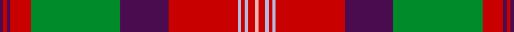

This page is one **sett** — a single exact thread-count. It belongs to the [tartan](/setts/dp1r1dp1r6g26dp14r20lb1r1lb1r2lr1/)
(the same proportion at any scale), whose colour order is pattern [BRBRGBRWRWRY](/stripes/brbrgbrwrwry/).

Part of the [Scobie](/tartans/scobie/) tartan — the named design grouping this sett with its other cloths.

Sourced from tartans-authority.  It is a [12 stripe tartan](/stripes/stripes12/).

Original link http://www.tartansauthority.com/tartan-ferret/display/10247/

## Register references

External register numbers recorded for this tartan.

- Scottish Register of Tartans: [10247](https://www.tartanregister.gov.uk/tartanDetails?ref=10247)
- Scottish Tartans Authority (ITI): 10247

## Thread count
DP/2 R2 DP2 R12 G52 DP28 R40 LB2 R2 LB2 R4 LR/2

One full sett is **296 threads**.

## Palette
<table><thead><tr><th>Colour</th><th>Shade</th><th>OKLCh</th></tr></thead><tbody><tr><td>B</td><td><code style="background-color:#B5BBDE;">#B5BBDE</code> <small style="color:#888">#B5BBDE</small></td><td><small style="color:#888">oklch(79.9% 0.050 277.6)</small></td></tr><tr><td>G</td><td><code style="background-color:#008B2A;">#008B2A</code> <small style="color:#888">#008B2A</small></td><td><small style="color:#888">oklch(55.4% 0.170 145.9)</small></td></tr><tr><td>LR</td><td><code style="background-color:#F0B4B4;">#F0B4B4</code> <small style="color:#888">#F0B4B4</small></td><td><small style="color:#888">oklch(82.5% 0.070 18.7)</small></td></tr><tr><td>P</td><td><code style="background-color:#4B0B4F;">#4B0B4F</code> <small style="color:#888">#4B0B4F</small></td><td><small style="color:#888">oklch(30.1% 0.125 325.4)</small></td></tr><tr><td>R</td><td><code style="background-color:#C80000;">#C80000</code> <small style="color:#888">#C80000</small></td><td><small style="color:#888">oklch(52.3% 0.215 29.2)</small></td></tr></tbody></table>

# Sample pattern

## Compared to the master

This cloth is one sett of its design; the master sett (the exemplar the design is anchored on) is below for comparison.

Its **ΔTartan distance** from the master is **1.70** — the same measure the nearest-tartans table ranks by (0 is identical; a re-scale of the same cloth is near 0, a recolour or a different proportion further).

<figure style="margin:0"><figcaption style="color:#888;font-size:smaller">this sett</figcaption></figure>
<figure style="margin:0"><figcaption style="color:#888;font-size:smaller"><a href="/setts/p1dr1p1dr6dg26mi14dr20lb1dr1lb1dr2m1/">master sett →</a></figcaption></figure>

ID: /variants/s12/dp1r1dp1r6g26dp14r20lb1r1lb1r2lr1~x2~r2109032-lr3303019/
