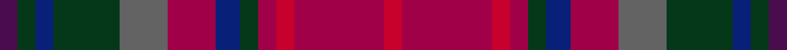

This page is one **sett** — a single exact thread-count. It belongs to the [tartan](/setts/dp3dg3db3dg11n8r8db4dg3r3ri3r15ri3/)
(the same proportion at any scale), whose colour order is pattern [BGBGBRBGRRRR](/stripes/bgbgbrbgrrrr/).

Sourced from tartans-authority.  It is a [12 stripe tartan](/stripes/stripes12/).

Original link http://www.tartansauthority.com/tartan-ferret/display/5826/

## Register references

External register numbers recorded for this tartan.

- Scottish Tartans Authority (ITI): 5826

## Thread count
DP/6 DG6 DB6 DG22 N16 R16 DB8 DG6 R6 Ri6 R30 Ri/6

One full sett is **256 threads**.

## Palette
<table><thead><tr><th>Colour</th><th>Shade</th><th>OKLCh</th></tr></thead><tbody><tr><td>DB</td><td><code style="background-color:#082077;">#082077</code> <small style="color:#888">#082077</small></td><td><small style="color:#888">oklch(30.0% 0.149 265.1)</small></td></tr><tr><td>DG</td><td><code style="background-color:#053819;">#053819</code> <small style="color:#888">#053819</small></td><td><small style="color:#888">oklch(30.0% 0.075 151.3)</small></td></tr><tr><td>N</td><td><code style="background-color:#636363;">#636363</code> <small style="color:#888">#636363</small></td><td><small style="color:#888">oklch(50.0% 0.000 89.9)</small></td></tr><tr><td>DP</td><td><code style="background-color:#4B0B4F;">#4B0B4F</code> <small style="color:#888">#4B0B4F</small></td><td><small style="color:#888">oklch(30.1% 0.125 325.4)</small></td></tr><tr><td>R</td><td><code style="background-color:#A00048;">#A00048</code> <small style="color:#888">#A00048</small></td><td><small style="color:#888">oklch(45.4% 0.182 5.3)</small></td></tr><tr><td>R</td><td><code style="background-color:#C8002C;">#C8002C</code> <small style="color:#888">#C8002C</small></td><td><small style="color:#888">oklch(52.6% 0.212 22.0)</small></td></tr></tbody></table>

# Sample pattern

ID: /variants/s12/dp3dg3db3dg11n8r8db4dg3r3ri3r15ri3~x2~r1807008-ri2108022/
