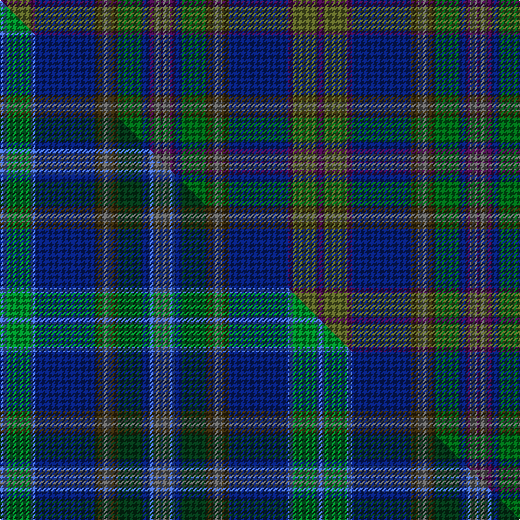

This is one **variant** — a specific cloth: this exact thread count and colourway, with its own
provenance below. It is one weaving of the [sett](/setts/dp3g10dp2db25dy3n4dy3dg10db3dp2n3dp1/) (the scale-free proportion — the
same cloth at any scale or shade), whose colour order is pattern [BBBBGGBGBBGB](/stripes/bbbbggbgbbgb/).

Part of the [Bowhunter](/tartans/bowhunter/) tartan — the named design grouping this sett with its other cloths.

Sourced from tartans-authority.  It is a [12 stripe tartan](/stripes/stripes12/).

Original link [https://www.tartanregister.gov.uk/tartanDetails.aspx?ref=10267](https://www.tartanregister.gov.uk/tartanDetails.aspx?ref=10267)

Dataset <small>— provenance for this record, inherited from the source manifest</small>

<dl class="dataset-prov">
<dt>source</dt><dd><a href="/sources/tartans-authority/">Scottish Tartans Authority</a></dd>
<dt>data captured from</dt><dd><a href="https://github.com/thetartan/tartan-database/blob/master/data/tartans-authority/data.csv">https://github.com/thetartan/tartan-database/blob/master/data/tartans-authority/data.csv</a></dd>
<dt>data date</dt><dd>25th July 2010 <small>(this record)</small></dd>
<dt>licence</dt><dd><a href="https://creativecommons.org/licenses/by-nc-nd/4.0/">CC BY-NC-ND 4.0</a></dd>
</dl>

Capture chain <small>— the hands this data passed through, oldest first; each capture carries its own licence</small>

<ol class="capture-chain">
<li><a href="https://www.tartansauthority.com/">Scottish Tartans Authority</a> <small>the heritage body's archive — its tartan-ferret record browser is retired (links repaired to the SRT, above)</small></li>
<li><a href="https://github.com/thetartan/tartan-database">thetartan/tartan-database</a> <small>2016-2017</small> · <a href="https://creativecommons.org/licenses/by-nc-nd/4.0/">CC BY-NC-ND 4.0</a> <small>Levko Kravets's frozen compilation — the capture we vendored, and where its CC licence text came from</small></li>
<li>this dictionary <small>captured 2026-06-10 · commit 5bf86c7566</small> <small>each re-capture is a git commit to data/sources</small></li>
</ol>

## Register references

External register numbers recorded for this tartan.

- Scottish Register of Tartans: [10267](https://www.tartanregister.gov.uk/tartanDetails?ref=10267)
- Scottish Tartans Authority (ITI): 10267

## Thread count
DP/6 G20 DP4 DB50 DY6 N8 DY6 DG20 DB6 DP4 N6 DP/2

One full sett is **268 threads**.

## Palette
<table><thead><tr><th>Colour</th><th>Shade</th><th>OKLCh</th></tr></thead><tbody><tr><td>DB</td><td><code style="background-color:#082077;">#082077</code> <small style="color:#888">#082077</small></td><td><small style="color:#888">oklch(30.0% 0.149 265.1)</small></td></tr><tr><td>DG</td><td><code style="background-color:#006818;">#006818</code> <small style="color:#888">#006818</small></td><td><small style="color:#888">oklch(45.0% 0.142 145.0)</small></td></tr><tr><td>G</td><td><code style="background-color:#5C6428;">#5C6428</code> <small style="color:#888">#5C6428</small></td><td><small style="color:#888">oklch(48.3% 0.084 116.0)</small></td></tr><tr><td>N</td><td><code style="background-color:#636363;">#636363</code> <small style="color:#888">#636363</small></td><td><small style="color:#888">oklch(50.0% 0.000 89.9)</small></td></tr><tr><td>DP</td><td><code style="background-color:#4B0B4F;">#4B0B4F</code> <small style="color:#888">#4B0B4F</small></td><td><small style="color:#888">oklch(30.1% 0.125 325.4)</small></td></tr><tr><td>DY</td><td><code style="background-color:#3A2B0D;">#3A2B0D</code> <small style="color:#888">#3A2B0D</small></td><td><small style="color:#888">oklch(30.0% 0.049 82.0)</small></td></tr></tbody></table>

# Sample pattern

## Compared to the master

This cloth is one sett of its design; the master sett (the exemplar the design is anchored on) is below for comparison.

Its **ΔTartan distance** from the master is **1.20** — the same measure the nearest-tartans table ranks by (0 is identical; a re-scale of the same cloth is near 0, a recolour or a different proportion further).

<figure class="master-compare" style="margin:0">

this sett
master sett ★

<figcaption style="color:#888;font-size:smaller">One weave of this sett against the <a href="/setts/b3g10b2db25dy3n4dy3dg10db3b2n3b1/">master sett ★</a>, split on the diagonal: a shared proportion runs seamlessly across it with only the shades shifting; a different proportion breaks on it.</figcaption>
</figure>

## Nearest tartan variants

The nearest existing variants by ΔTartan distance, with this cloth at the top so the swatches line up against it.

ΔTartan

Threads

Variant

Sett

—

268

<a href="/variants/s12/dp3g10dp2db25dy3n4dy3dg10db3dp2n3dp1~x2~g1903114-dg1806142/">Bowhunter (Fashion)</a>

<a href="/ttd/edit/#slug=b3g10b2db25dy3n4dy3dg10db3b2n3b1~x2&amp;base=dp3g10dp2db25dy3n4dy3dg10db3dp2n3dp1~x2~g1903114-dg1806142" title="compare in the TTD">1.20</a>

268

<a href="/variants/s12/b3g10b2db25dy3n4dy3dg10db3b2n3b1~x2/">Bowhunter</a>

<a href="/ttd/edit/#slug=b1db5dp6dg2dp1dg12dr1dg2dp1dr5ly1~x4&amp;base=dp3g10dp2db25dy3n4dy3dg10db3dp2n3dp1~x2~g1903114-dg1806142" title="compare in the TTD">3.31</a>

288

<a href="/variants/s11/b1db5dp6dg2dp1dg12dr1dg2dp1dr5ly1~x4/">Telfer, Jamie (Name)</a>

<a href="/ttd/edit/#slug=dy20dp2dy2dp2dy3dp8dg9gi8g8dg1lr2~x2~gi2203152-g1903114&amp;base=dp3g10dp2db25dy3n4dy3dg10db3dp2n3dp1~x2~g1903114-dg1806142" title="compare in the TTD">3.49</a>

216

<a href="/variants/s11/dy20dp2dy2dp2dy3dp8dg9gi8g8dg1lr2~x2~gi2203152-g1903114/">Isle of Skye District Tartan</a>

<a href="/ttd/edit/#slug=db20n2w1n5dg8y1dg2r1dg8n16~x4&amp;base=dp3g10dp2db25dy3n4dy3dg10db3dp2n3dp1~x2~g1903114-dg1806142" title="compare in the TTD">3.62</a>

368

<a href="/variants/s10/db20n2w1n5dg8y1dg2r1dg8n16~x4/">Connecticut</a>

<a href="/ttd/edit/#slug=dt47dg14dp5do2dr3dg7~x2~dt1204274-dg1605139-dp1105325&amp;base=dp3g10dp2db25dy3n4dy3dg10db3dp2n3dp1~x2~g1903114-dg1806142" title="compare in the TTD">3.64</a>

204

<a href="/variants/s6/db47dg14dp5do2dr3dg7~x2~db1204274-dg1605139-dp1105325/">Round Table of Britain and Ire Corporate Tartan</a>

<a href="/ttd/edit/#slug=db4t4db1dg24db10r1db2dr5t3r2~x2&amp;base=dp3g10dp2db25dy3n4dy3dg10db3dp2n3dp1~x2~g1903114-dg1806142" title="compare in the TTD">3.70</a>

212

<a href="/variants/s10/db4t4db1dg24db10r1db2dr5t3r2~x2/">Rikaco Classic (Fashion)</a>

<a href="/ttd/edit/#slug=g7dy2g5dg37db6dr16db5b2~x2&amp;base=dp3g10dp2db25dy3n4dy3dg10db3dp2n3dp1~x2~g1903114-dg1806142" title="compare in the TTD">3.75</a>

302

<a href="/variants/s8/g7dy2g5dg37db6dr16db5b2~x2/">Telfer Green</a>

<a href="/ttd/edit/#slug=dy31y6n3db31dy8dg60y7t7~x2&amp;base=dp3g10dp2db25dy3n4dy3dg10db3dp2n3dp1~x2~g1903114-dg1806142" title="compare in the TTD">3.92</a>

536

<a href="/variants/s8/dy31y6n3db31dy8dg60y7t7~x2/">Little-Dowse Wedding</a>

## Neighbour map

Every grey dot is one of 13621 variants placed by the first two principal components of the ΔTartan feature space (42% of its variance). Red is this tartan; blue dots are its nearest — click one to open its page.

<svg viewBox="0 0 640 380" role="img" style="max-width:100%;height:auto;border:1px solid #e0e0e0;border-radius:4px;display:block" xmlns="http://www.w3.org/2000/svg"><image href="/nn/cloud.v1.png" width="640" height="380"/><a href="/variants/s12/b3g10b2db25dy3n4dy3dg10db3b2n3b1~x2/"><circle cx="275.2" cy="146.4" r="4" fill="#3465a4"><title>Bowhunter</title></circle></a><a href="/variants/s11/b1db5dp6dg2dp1dg12dr1dg2dp1dr5ly1~x4/"><circle cx="316.0" cy="198.3" r="4" fill="#3465a4"><title>Telfer, Jamie (Name)</title></circle></a><a href="/variants/s11/dy20dp2dy2dp2dy3dp8dg9gi8g8dg1lr2~x2~gi2203152-g1903114/"><circle cx="290.9" cy="183.8" r="4" fill="#3465a4"><title>Isle of Skye District Tartan</title></circle></a><a href="/variants/s10/db20n2w1n5dg8y1dg2r1dg8n16~x4/"><circle cx="267.3" cy="159.4" r="4" fill="#3465a4"><title>Connecticut</title></circle></a><a href="/variants/s6/db47dg14dp5do2dr3dg7~x2~db1204274-dg1605139-dp1105325/"><circle cx="415.9" cy="176.7" r="4" fill="#3465a4"><title>Round Table of Britain and Ire Corporate Tartan</title></circle></a><a href="/variants/s10/db4t4db1dg24db10r1db2dr5t3r2~x2/"><circle cx="319.2" cy="153.7" r="4" fill="#3465a4"><title>Rikaco Classic (Fashion)</title></circle></a><a href="/variants/s8/g7dy2g5dg37db6dr16db5b2~x2/"><circle cx="338.6" cy="181.7" r="4" fill="#3465a4"><title>Telfer Green</title></circle></a><a href="/variants/s8/dy31y6n3db31dy8dg60y7t7~x2/"><circle cx="343.1" cy="203.2" r="4" fill="#3465a4"><title>Little-Dowse Wedding</title></circle></a><circle cx="307.4" cy="155.2" r="5" fill="#c00000"/><text x="320" y="376" text-anchor="middle" font-size="11" fill="#999">ground</text><text x="11" y="190" text-anchor="middle" font-size="11" fill="#999" transform="rotate(-90 11 190)">complexity</text></svg>

ID: /variants/s12/dp3g10dp2db25dy3n4dy3dg10db3dp2n3dp1~x2~g1903114-dg1806142/
