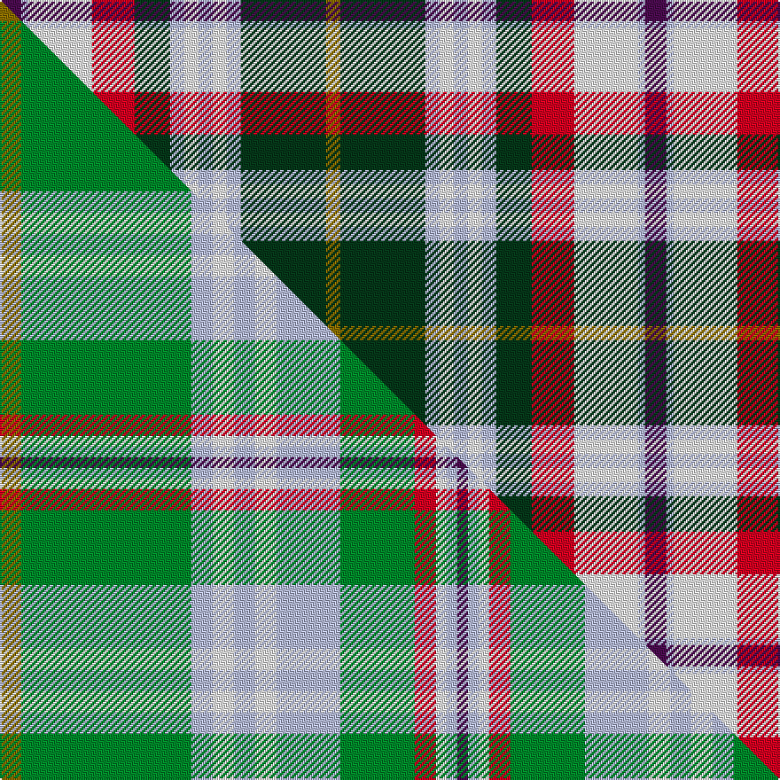

This is one **variant** — a specific cloth: this exact thread count and colourway, with its own
provenance below. It is one weaving of the [sett](/tartans/f/fr/fredericton/) (the scale-free proportion — the
same cloth at any scale or shade), whose colour order is pattern [BWWRGWWWWWGG](/stripes/bwwrgwwwwwgg/).

Part of the [Fredericton](/tartans/f/fr/fredericton/) tartan — the named design grouping this sett with its other cloths.

Sourced from register-of-tartans.  It is a [12 stripe tartan](/stripes/stripes12/).

Original link [https://www.tartanregister.gov.uk/tartanDetails.aspx?ref=1275](https://www.tartanregister.gov.uk/tartanDetails.aspx?ref=1275)

Dataset <small>— provenance for this record, inherited from the source manifest</small>

<dl class="dataset-prov">
<dt>source</dt><dd><a href="/sources/register-of-tartans/">Scottish Register of Tartans</a></dd>
<dt>data captured from</dt><dd><a href="https://github.com/thetartan/tartan-database/blob/master/data/register-of-tartans/data.csv">https://github.com/thetartan/tartan-database/blob/master/data/register-of-tartans/data.csv</a></dd>
<dt>data date</dt><dd>1961 <small>(this record)</small></dd>
<dt>licence</dt><dd><a href="https://www.tartanregister.gov.uk/copyright">Crown copyright</a></dd>
</dl>

Capture chain <small>— the hands this data passed through, oldest first; each capture carries its own licence</small>

<ol class="capture-chain">
<li><a href="https://www.tartanregister.gov.uk/">Scottish Register of Tartans</a> · <a href="https://www.tartanregister.gov.uk/copyright">Crown copyright</a> <small>the living register — still published by National Records of Scotland</small></li>
<li><a href="https://github.com/thetartan/tartan-database">thetartan/tartan-database</a> <small>2016-2017</small> · <a href="https://creativecommons.org/licenses/by-nc-nd/4.0/">CC BY-NC-ND 4.0</a> <small>Levko Kravets's frozen compilation — the capture we vendored, and where its CC licence text came from</small></li>
<li>this dictionary <small>captured 2026-06-10 · commit 5bf86c7566</small> <small>each re-capture is a git commit to data/sources</small></li>
</ol>

## Register references

External register numbers recorded for this tartan.

- Scottish Register of Tartans: [1275](https://www.tartanregister.gov.uk/tartanDetails.aspx?ref=1275)
- Scottish Tartans Authority (ITI): 96
- Scottish Tartans World Register: 96

## Thread count
DP/12 LB4 W36 R24 DG20 LB8 W8 LB8 W8 LB8 DG48 Y/8

One full sett is **364 threads**.

## Palette
<table><thead><tr><th>Colour</th><th>Shade</th><th>OKLCh</th></tr></thead><tbody><tr><td>LB</td><td><code style="background-color:#B5BBDE;">#B5BBDE</code> <small style="color:#888">#B5BBDE</small></td><td><small style="color:#888">oklch(79.9% 0.050 277.6)</small></td></tr><tr><td>DG</td><td><code style="background-color:#053819;">#053819</code> <small style="color:#888">#053819</small></td><td><small style="color:#888">oklch(30.0% 0.075 151.3)</small></td></tr><tr><td>W</td><td><code style="background-color:#F7F7F7;">#F7F7F7</code> <small style="color:#888">#F7F7F7</small></td><td><small style="color:#888">oklch(97.6% 0.000 89.9)</small></td></tr><tr><td>DP</td><td><code style="background-color:#4B0B4F;">#4B0B4F</code> <small style="color:#888">#4B0B4F</small></td><td><small style="color:#888">oklch(30.1% 0.125 325.4)</small></td></tr><tr><td>R</td><td><code style="background-color:#D60020;">#D60020</code> <small style="color:#888">#D60020</small></td><td><small style="color:#888">oklch(55.2% 0.224 25.5)</small></td></tr><tr><td>Y</td><td><code style="background-color:#8B6E00;">#8B6E00</code> <small style="color:#888">#8B6E00</small></td><td><small style="color:#888">oklch(55.1% 0.113 90.4)</small></td></tr></tbody></table>

# Sample pattern

## Compared to the master

This cloth is one sett of its design; the master sett (the exemplar the design is anchored on) is below for comparison.

Its **ΔTartan distance** from the master is **0.75** — the same measure the nearest-tartans table ranks by (0 is identical; a re-scale of the same cloth is near 0, a recolour or a different proportion further).

<figure class="master-compare" style="margin:0">

this sett
master sett ★

<figcaption style="color:#888;font-size:smaller">One weave of this sett against the <a href="/setts/y2g16lb2w2lb2w2lb6g7r2w1lb1dp1/">master sett ★</a>, split on the diagonal: a shared proportion runs seamlessly across it with only the shades shifting; a different proportion breaks on it.</figcaption>
</figure>

## Nearest tartan variants

The nearest existing variants by ΔTartan distance, with this cloth at the top so the swatches line up against it.

ΔTartan

Threads

Variant

Sett

—

364

<a href="/variants/s12/dp3lb1w9r6dg5lb2w2lb2w2lb2dg12y2~x4/">Fredericton #1</a>

<a href="/ttd/edit/#slug=dp3lb1w9r6g5lb2w2lb2w2lb2g12y2~x2&amp;base=dp3lb1w9r6dg5lb2w2lb2w2lb2dg12y2~x4" title="compare in the TTD">0.15</a>

182

<a href="/variants/s12/dp3lb1w9r6g5lb2w2lb2w2lb2g12y2~x2/">Fredericton District Tartan</a>

<a href="/ttd/edit/#slug=dp6lb2w24r15g12lb4w4lb4w4lb4g34y4&amp;base=dp3lb1w9r6dg5lb2w2lb2w2lb2dg12y2~x4" title="compare in the TTD">0.40</a>

224

<a href="/variants/s12/dp6lb2w24r15g12lb4w4lb4w4lb4g34y4/">Fredericton (District)</a>

<a href="/ttd/edit/#slug=r2o3do9oi2do5oi4w1o1w1o1w12k2w2o2~x2~o2102055-oi2104058&amp;base=dp3lb1w9r6dg5lb2w2lb2w2lb2dg12y2~x4" title="compare in the TTD">2.18</a>

180

<a href="/variants/s14/r2o3do9oi2do5oi4w1o1w1o1w12k2w2o2~x2~o2102055-oi2104058/">Harrods</a>

<a href="/ttd/edit/#slug=db3y2b12db14r2db4dy6y4w24r2w2db3~x2~db1003265-b2105244&amp;base=dp3lb1w9r6dg5lb2w2lb2w2lb2dg12y2~x4" title="compare in the TTD">2.20</a>

300

<a href="/variants/s12/db3y2t12db14r2db4dy6y4w24r2w2db3~x2~db1003265-t2105244/">Lashbrooke of Barrowfield (Personal)</a>

<a href="/ttd/edit/#slug=dy2w2k2w12dy1w1dy1w1ly4do5ly2do9dy3r2~x2&amp;base=dp3lb1w9r6dg5lb2w2lb2w2lb2dg12y2~x4" title="compare in the TTD">2.24</a>

180

<a href="/variants/s14/dy2w2k2w12dy1w1dy1w1ly4do5ly2do9dy3r2~x2/">Harrods (Corporate)</a>

<a href="/ttd/edit/#slug=lb24dp3lb3dp3lb3dp10o12dpi12g12o2n3~x2~o2104072-dpi1105325&amp;base=dp3lb1w9r6dg5lb2w2lb2w2lb2dg12y2~x4" title="compare in the TTD">2.48</a>

294

<a href="/variants/s11/lb24dp3lb3dp3lb3dp10o12dpi12g12o2n3~x2~o2104072-dpi1105325/">Isle of Skye (District)</a>

<a href="/ttd/edit/#slug=dr1n6ly2w1k8w1ly2w9k1w4dy1~x4&amp;base=dp3lb1w9r6dg5lb2w2lb2w2lb2dg12y2~x4" title="compare in the TTD">2.48</a>

280

<a href="/variants/s11/dr1n6ly2w1k8w1ly2w9k1w4dy1~x4/">Kintyre (Fashion)</a>

<a href="/ttd/edit/#slug=dr1o6ly2w1k8w1ly2w9k1w4dy1~x4~o2500000&amp;base=dp3lb1w9r6dg5lb2w2lb2w2lb2dg12y2~x4" title="compare in the TTD">2.49</a>

280

<a href="/variants/s11/dr1o6ly2w1k8w1ly2w9k1w4dy1~x4~o2500000/">Kintyre</a>

<a href="/ttd/edit/#slug=w11db4w4db2w4n4w11o26n4w3n4w2db14dg10w16dg6~x2&amp;base=dp3lb1w9r6dg5lb2w2lb2w2lb2dg12y2~x4" title="compare in the TTD">2.65</a>

466

<a href="/variants/s16/w11db4w4db2w4n4w11o26n4w3n4w2db14dg10w16dg6~x2/">Stuart-Houghton Dress (Personal)</a>

<a href="/ttd/edit/#slug=r26lb7dp8y3r3w3g20dp10w2~x2&amp;base=dp3lb1w9r6dg5lb2w2lb2w2lb2dg12y2~x4" title="compare in the TTD">2.76</a>

272

<a href="/variants/s9/r26lb7dp8y3r3w3g20dp10w2~x2/">Wilson's No.227</a>

## Neighbour map

Every grey dot is one of 13657 variants placed by the first two principal components of the ΔTartan feature space (42% of its variance). Red is this tartan; blue dots are its nearest — click one to open its page. The map is a flat projection of a many-dimensional space — [how to read it](/posts/neighbourhood-maps/).

<svg viewBox="0 0 640 380" role="img" style="max-width:100%;height:auto;border:1px solid #e0e0e0;border-radius:4px;display:block" xmlns="http://www.w3.org/2000/svg"><image href="/nn/cloud.v1.png" width="640" height="380"/><a href="/variants/s12/dp3lb1w9r6g5lb2w2lb2w2lb2g12y2~x2/"><circle cx="125.9" cy="159.0" r="4" fill="#3465a4"><title>Fredericton District Tartan</title></circle></a><a href="/variants/s12/dp6lb2w24r15g12lb4w4lb4w4lb4g34y4/"><circle cx="166.0" cy="132.6" r="4" fill="#3465a4"><title>Fredericton (District)</title></circle></a><a href="/variants/s14/r2o3do9oi2do5oi4w1o1w1o1w12k2w2o2~x2~o2102055-oi2104058/"><circle cx="97.6" cy="121.9" r="4" fill="#3465a4"><title>Harrods</title></circle></a><a href="/variants/s12/db3y2t12db14r2db4dy6y4w24r2w2db3~x2~db1003265-t2105244/"><circle cx="111.3" cy="134.8" r="4" fill="#3465a4"><title>Lashbrooke of Barrowfield (Personal)</title></circle></a><a href="/variants/s14/dy2w2k2w12dy1w1dy1w1ly4do5ly2do9dy3r2~x2/"><circle cx="90.6" cy="121.0" r="4" fill="#3465a4"><title>Harrods (Corporate)</title></circle></a><a href="/variants/s11/lb24dp3lb3dp3lb3dp10o12dpi12g12o2n3~x2~o2104072-dpi1105325/"><circle cx="127.6" cy="158.9" r="4" fill="#3465a4"><title>Isle of Skye (District)</title></circle></a><a href="/variants/s11/dr1n6ly2w1k8w1ly2w9k1w4dy1~x4/"><circle cx="106.2" cy="142.4" r="4" fill="#3465a4"><title>Kintyre (Fashion)</title></circle></a><a href="/variants/s11/dr1o6ly2w1k8w1ly2w9k1w4dy1~x4~o2500000/"><circle cx="106.4" cy="142.7" r="4" fill="#3465a4"><title>Kintyre</title></circle></a><a href="/variants/s16/w11db4w4db2w4n4w11o26n4w3n4w2db14dg10w16dg6~x2/"><circle cx="143.8" cy="150.3" r="4" fill="#3465a4"><title>Stuart-Houghton Dress (Personal)</title></circle></a><a href="/variants/s9/r26lb7dp8y3r3w3g20dp10w2~x2/"><circle cx="108.0" cy="139.2" r="4" fill="#3465a4"><title>Wilson's No.227</title></circle></a><circle cx="106.5" cy="148.4" r="5" fill="#c00000"/><text x="320" y="376" text-anchor="middle" font-size="11" fill="#999">ground</text><text x="11" y="190" text-anchor="middle" font-size="11" fill="#999" transform="rotate(-90 11 190)">complexity</text></svg>

ID: /variants/s12/dp3lb1w9r6dg5lb2w2lb2w2lb2dg12y2~x4/
