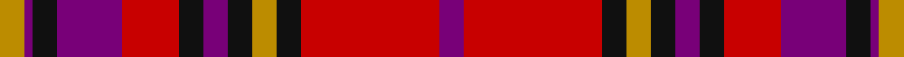

This page is one **sett** — a single exact thread-count. It belongs to the [tartan](/setts/dp3r17k3lo3k3dp3k3r7dp8k3dp1lo3/)
(the same proportion at any scale), whose colour order is pattern [BRKYKBKRBKBY](/stripes/brkykbkrbkby/).

Sourced from register-of-tartans.  It is a [12 stripe tartan](/stripes/stripes12/).

Original link https://www.tartanregister.gov.uk/tartanDetails.aspx?ref=5260

## Register references

External register numbers recorded for this tartan.

- Scottish Register of Tartans: [5260](https://www.tartanregister.gov.uk/tartanDetails.aspx?ref=5260)
- Scottish Tartans Authority (ITI): 3663

## Thread count
DY/12 Pa4 K12 Pa32 R28 K12 Pa12 K12 DY12 K12 R68 Pa/12

One full sett is **432 threads**.

## Palette

Palette: <strong>Tartan Register</strong>
<table><thead><tr><th>Colour</th><th>Threads</th><th>Shade</th><th>Base</th><th>OKLCh</th></tr></thead><tbody><tr><td>DY/</td><td style="text-align:right;font-variant-numeric:tabular-nums">12</td><td><code style="background-color:#BC8C00;">#BC8C00</code> <small style="color:#888">#BC8C00</small></td><td>Y <code style="background-color:#F2BF00;">#F2BF00</code></td><td><small style="color:#888">oklch(66.8% 0.137 84.1)</small></td></tr><tr><td>Pa</td><td style="text-align:right;font-variant-numeric:tabular-nums">4</td><td><code style="background-color:#780078;">#780078</code> <small style="color:#888">#780078</small></td><td>B <code style="background-color:#2A418A;">#2A418A</code></td><td><small style="color:#888">oklch(40.2% 0.185 328.4)</small></td></tr><tr><td>K</td><td style="text-align:right;font-variant-numeric:tabular-nums">12</td><td><code style="background-color:#101010;">#101010</code> <small style="color:#888">#101010</small></td><td>K <code style="background-color:#000000;">#000000</code></td><td><small style="color:#888">oklch(17.3% 0.000 89.9)</small></td></tr><tr><td>Pa</td><td style="text-align:right;font-variant-numeric:tabular-nums">32</td><td><code style="background-color:#780078;">#780078</code> <small style="color:#888">#780078</small></td><td>B <code style="background-color:#2A418A;">#2A418A</code></td><td><small style="color:#888">oklch(40.2% 0.185 328.4)</small></td></tr><tr><td>R</td><td style="text-align:right;font-variant-numeric:tabular-nums">28</td><td><code style="background-color:#C80000;">#C80000</code> <small style="color:#888">#C80000</small></td><td>R <code style="background-color:#CC0000;">#CC0000</code></td><td><small style="color:#888">oklch(52.3% 0.215 29.2)</small></td></tr><tr><td>K</td><td style="text-align:right;font-variant-numeric:tabular-nums">12</td><td><code style="background-color:#101010;">#101010</code> <small style="color:#888">#101010</small></td><td>K <code style="background-color:#000000;">#000000</code></td><td><small style="color:#888">oklch(17.3% 0.000 89.9)</small></td></tr><tr><td>Pa</td><td style="text-align:right;font-variant-numeric:tabular-nums">12</td><td><code style="background-color:#780078;">#780078</code> <small style="color:#888">#780078</small></td><td>B <code style="background-color:#2A418A;">#2A418A</code></td><td><small style="color:#888">oklch(40.2% 0.185 328.4)</small></td></tr><tr><td>K</td><td style="text-align:right;font-variant-numeric:tabular-nums">12</td><td><code style="background-color:#101010;">#101010</code> <small style="color:#888">#101010</small></td><td>K <code style="background-color:#000000;">#000000</code></td><td><small style="color:#888">oklch(17.3% 0.000 89.9)</small></td></tr><tr><td>DY</td><td style="text-align:right;font-variant-numeric:tabular-nums">12</td><td><code style="background-color:#BC8C00;">#BC8C00</code> <small style="color:#888">#BC8C00</small></td><td>Y <code style="background-color:#F2BF00;">#F2BF00</code></td><td><small style="color:#888">oklch(66.8% 0.137 84.1)</small></td></tr><tr><td>K</td><td style="text-align:right;font-variant-numeric:tabular-nums">12</td><td><code style="background-color:#101010;">#101010</code> <small style="color:#888">#101010</small></td><td>K <code style="background-color:#000000;">#000000</code></td><td><small style="color:#888">oklch(17.3% 0.000 89.9)</small></td></tr><tr><td>R</td><td style="text-align:right;font-variant-numeric:tabular-nums">68</td><td><code style="background-color:#C80000;">#C80000</code> <small style="color:#888">#C80000</small></td><td>R <code style="background-color:#CC0000;">#CC0000</code></td><td><small style="color:#888">oklch(52.3% 0.215 29.2)</small></td></tr><tr><td>Pa/</td><td style="text-align:right;font-variant-numeric:tabular-nums">12</td><td><code style="background-color:#780078;">#780078</code> <small style="color:#888">#780078</small></td><td>B <code style="background-color:#2A418A;">#2A418A</code></td><td><small style="color:#888">oklch(40.2% 0.185 328.4)</small></td></tr></tbody></table>

## Nearest tartans

The nearest existing variants by ΔTartan distance, with this tartan at the top so the swatches line up against it.

ΔTartan

Tartan

Sett

—

<a href="/ttd/edit/#slug=dp3r17k3lo3k3dp3k3r7dp8k3dp1lo3~x4">Bates-Dayton</a> <a class="nn-out" href="/variants/s12/dp3r17k3lo3k3dp3k3r7dp8k3dp1lo3~x4/" title="open its dictionary page">↗</a>

1.20

<a href="/ttd/edit/#slug=r2dp3ri2r15dp2dg20dp20r15dp3ri2r2~x2&amp;base=dp3r17k3lo3k3dp3k3r7dp8k3dp1lo3~x4">Drumlithie - 1790 (Fashion)</a> <a class="nn-out" href="/variants/s11/r2dp3ri2r15dp2dg20dp20r15dp3ri2r2~x2/" title="open its dictionary page">↗</a>

1.25

<a href="/ttd/edit/#slug=r2p3ri2r15p3g19p20r15p3ri2r2~x2&amp;base=dp3r17k3lo3k3dp3k3r7dp8k3dp1lo3~x4">Drumlithie, Rock and Wheel</a> <a class="nn-out" href="/variants/s11/r2p3ri2r15p3g19p20r15p3ri2r2~x2/" title="open its dictionary page">↗</a>

1.27

<a href="/ttd/edit/#slug=r7k3r4k5r25k7ly2db22k3db4~x2&amp;base=dp3r17k3lo3k3dp3k3r7dp8k3dp1lo3~x4">St. George's (Edinburgh) (School)</a> <a class="nn-out" href="/variants/s10/r7k3r4k5r25k7ly2db22k3db4~x2/" title="open its dictionary page">↗</a>

1.31

<a href="/ttd/edit/#slug=r2dp3ri2r15dp3g19dp20r15dp3ri2r2~x2&amp;base=dp3r17k3lo3k3dp3k3r7dp8k3dp1lo3~x4">Drumlithie Rock and Wheel Tartan</a> <a class="nn-out" href="/variants/s11/r2dp3ri2r15dp3g19dp20r15dp3ri2r2~x2/" title="open its dictionary page">↗</a>

1.32

<a href="/ttd/edit/#slug=r2dp3ri2r15dp2g20dp20r15dp3ri2r2~x2&amp;base=dp3r17k3lo3k3dp3k3r7dp8k3dp1lo3~x4">Drumlithie</a> <a class="nn-out" href="/variants/s11/r2dp3ri2r15dp2g20dp20r15dp3ri2r2~x2/" title="open its dictionary page">↗</a>

1.34

<a href="/ttd/edit/#slug=dp28r26w2dp5w2r26g28r5w2r5~x2&amp;base=dp3r17k3lo3k3dp3k3r7dp8k3dp1lo3~x4">Glenfinnan</a> <a class="nn-out" href="/variants/s10/dp28r26w2dp5w2r26g28r5w2r5~x2/" title="open its dictionary page">↗</a>

1.35

<a href="/ttd/edit/#slug=dp4dg8db6dp8r6dg2r2dg2r24dg1r3~x2&amp;base=dp3r17k3lo3k3dp3k3r7dp8k3dp1lo3~x4">MacDougall</a> <a class="nn-out" href="/variants/s11/dp4dg8db6dp8r6dg2r2dg2r24dg1r3~x2/" title="open its dictionary page">↗</a>

1.38

<a href="/ttd/edit/#slug=db28r26w2db5w2r26dg28r5w2r5~x2&amp;base=dp3r17k3lo3k3dp3k3r7dp8k3dp1lo3~x4">Glenaladale Plaid</a> <a class="nn-out" href="/variants/s10/db28r26w2db5w2r26dg28r5w2r5~x2/" title="open its dictionary page">↗</a>

1.41

<a href="/ttd/edit/#slug=dp4dg8db6dp8r6dg2r2dg2r24dg1r3&amp;base=dp3r17k3lo3k3dp3k3r7dp8k3dp1lo3~x4">MacDougall VS</a> <a class="nn-out" href="/variants/s11/dp4dg8db6dp8r6dg2r2dg2r24dg1r3/" title="open its dictionary page">↗</a>

1.43

<a href="/ttd/edit/#slug=dg12r11dp12ri3r32dp8dg8dp8~x2&amp;base=dp3r17k3lo3k3dp3k3r7dp8k3dp1lo3~x4">Fiddes</a> <a class="nn-out" href="/variants/s8/dg12r11dp12ri3r32dp8dg8dp8~x2/" title="open its dictionary page">↗</a>

## Neighbour map

Every grey dot is one of 14360 variants placed by the first two principal components of the ΔTartan feature space (44% of its variance). Red is this tartan; blue dots are its nearest — click one to open its page.

<svg viewBox="0 0 640 380" role="img" style="max-width:100%;height:auto;border:1px solid #e0e0e0;border-radius:4px;display:block" xmlns="http://www.w3.org/2000/svg"><image href="/nn/cloud.v1.png" width="640" height="380"/><a href="/variants/s11/r2dp3ri2r15dp2dg20dp20r15dp3ri2r2~x2/"><circle cx="242.1" cy="173.7" r="4" fill="#3465a4"><title>Drumlithie - 1790 (Fashion)</title></circle></a><a href="/variants/s11/r2p3ri2r15p3g19p20r15p3ri2r2~x2/"><circle cx="244.2" cy="174.4" r="4" fill="#3465a4"><title>Drumlithie, Rock and Wheel</title></circle></a><a href="/variants/s10/r7k3r4k5r25k7ly2db22k3db4~x2/"><circle cx="251.0" cy="162.7" r="4" fill="#3465a4"><title>St. George's (Edinburgh) (School)</title></circle></a><a href="/variants/s11/r2dp3ri2r15dp3g19dp20r15dp3ri2r2~x2/"><circle cx="250.4" cy="176.9" r="4" fill="#3465a4"><title>Drumlithie Rock and Wheel Tartan</title></circle></a><a href="/variants/s11/r2dp3ri2r15dp2g20dp20r15dp3ri2r2~x2/"><circle cx="250.1" cy="174.6" r="4" fill="#3465a4"><title>Drumlithie</title></circle></a><a href="/variants/s10/dp28r26w2dp5w2r26g28r5w2r5~x2/"><circle cx="262.9" cy="151.9" r="4" fill="#3465a4"><title>Glenfinnan</title></circle></a><a href="/variants/s11/dp4dg8db6dp8r6dg2r2dg2r24dg1r3~x2/"><circle cx="327.5" cy="129.1" r="4" fill="#3465a4"><title>MacDougall</title></circle></a><a href="/variants/s10/db28r26w2db5w2r26dg28r5w2r5~x2/"><circle cx="263.8" cy="158.7" r="4" fill="#3465a4"><title>Glenaladale Plaid</title></circle></a><a href="/variants/s11/dp4dg8db6dp8r6dg2r2dg2r24dg1r3/"><circle cx="325.6" cy="132.6" r="4" fill="#3465a4"><title>MacDougall VS</title></circle></a><a href="/variants/s8/dg12r11dp12ri3r32dp8dg8dp8~x2/"><circle cx="247.4" cy="198.5" r="4" fill="#3465a4"><title>Fiddes</title></circle></a><circle cx="242.5" cy="146.3" r="5" fill="#c00000"/></svg>

ID: /variants/s12/dp3r17k3lo3k3dp3k3r7dp8k3dp1lo3~x4/
