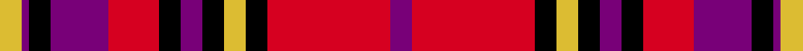

This is one **variant** — a specific cloth: this exact thread count and colourway, with its own
provenance below. It is one weaving of the [sett](/setts/dp3r17k3ly3k3dp3k3r7dp8k3dp1ly3/) (the scale-free proportion — the
same cloth at any scale or shade), whose colour order is pattern [BRKYKBKRBKBY](/stripes/brkykbkrbkby/).

Part of the [Bates-Dayton](/tartans/b/ba/bates-dayton/) tartan — the named design grouping this sett with its other cloths.

Sourced from register-of-tartans.  It is a [12 stripe tartan](/stripes/stripes12/).

Original link [https://www.tartanregister.gov.uk/tartanDetails.aspx?ref=5260](https://www.tartanregister.gov.uk/tartanDetails.aspx?ref=5260)

Dataset <small>— provenance for this record, inherited from the source manifest</small>

<dl class="dataset-prov">
<dt>source</dt><dd><a href="/sources/register-of-tartans/">Scottish Register of Tartans</a></dd>
<dt>data captured from</dt><dd><a href="https://github.com/thetartan/tartan-database/blob/master/data/register-of-tartans/data.csv">https://github.com/thetartan/tartan-database/blob/master/data/register-of-tartans/data.csv</a></dd>
<dt>data date</dt><dd>2017-01-06 <small>(dataset default)</small></dd>
<dt>licence</dt><dd><a href="https://www.tartanregister.gov.uk/copyright">Crown copyright</a></dd>
</dl>

Capture chain <small>— the hands this data passed through, oldest first; each capture carries its own licence</small>

<ol class="capture-chain">
<li><a href="https://www.tartanregister.gov.uk/">Scottish Register of Tartans</a> · <a href="https://www.tartanregister.gov.uk/copyright">Crown copyright</a> <small>the living register — still published by National Records of Scotland</small></li>
<li><a href="https://github.com/thetartan/tartan-database">thetartan/tartan-database</a> <small>2016-2017</small> · <a href="https://creativecommons.org/licenses/by-nc-nd/4.0/">CC BY-NC-ND 4.0</a> <small>Levko Kravets's frozen compilation — the capture we vendored, and where its CC licence text came from</small></li>
<li>this dictionary <small>captured 2026-06-10 · commit 5bf86c7566</small> <small>each re-capture is a git commit to data/sources</small></li>
</ol>

## Register references

External register numbers recorded for this tartan.

- Scottish Register of Tartans: [5260](https://www.tartanregister.gov.uk/tartanDetails.aspx?ref=5260)
- Scottish Tartans Authority (ITI): 3663

## Thread count
LY/12 DP4 K12 DP32 R28 K12 DP12 K12 LY12 K12 R68 DP/12

One full sett is **432 threads**.

## Palette
<table><thead><tr><th>Colour</th><th>Shade</th><th>OKLCh</th></tr></thead><tbody><tr><td>DR</td><td><code style="background-color:#55120C;">#55120C</code> <small style="color:#888">#55120C</small></td><td><small style="color:#888">oklch(30.0% 0.099 29.3)</small></td></tr><tr><td>LY</td><td><code style="background-color:#DCBC32;">#DCBC32</code> <small style="color:#888">#DCBC32</small></td><td><small style="color:#888">oklch(80.0% 0.150 95.2)</small></td></tr><tr><td>K</td><td><code style="background-color:#000000;">#000000</code> <small style="color:#888">#000000</small></td><td><small style="color:#888">oklch(0.0% 0.000 0.0)</small></td></tr><tr><td>DP</td><td><code style="background-color:#6C0070;">#6C0070</code> <small style="color:#888">#6C0070</small></td><td><small style="color:#888">oklch(37.6% 0.174 326.5)</small></td></tr><tr><td>DP</td><td><code style="background-color:#780078;">#780078</code> <small style="color:#888">#780078</small></td><td><small style="color:#888">oklch(40.2% 0.185 328.4)</small></td></tr><tr><td>R</td><td><code style="background-color:#D60020;">#D60020</code> <small style="color:#888">#D60020</small></td><td><small style="color:#888">oklch(55.2% 0.224 25.5)</small></td></tr></tbody></table>

# Sample pattern

## Nearest tartan variants

The nearest existing variants by ΔTartan distance, with this cloth at the top so the swatches line up against it.

ΔTartan

Threads

Variant

Sett

—

432

<a href="/variants/s12/dp3r17k3ly3k3dp3k3r7dp8k3dp1ly3~x4~dp1607327/">Bates-Dayton</a>

<a href="/ttd/edit/#slug=w8k9y9r21y6k6w4k6y6r49k22w4&amp;base=dp3r17k3ly3k3dp3k3r7dp8k3dp1ly3~x4~dp1607327" title="compare in the TTD">2.64</a>

288

<a href="/variants/s12/w8k9y9r21y6k6w4k6y6r49k22w4/">Normandy (Fashion)</a>

<a href="/ttd/edit/#slug=k4o8m30k8o6k8o12w3~x2&amp;base=dp3r17k3ly3k3dp3k3r7dp8k3dp1ly3~x4~dp1607327" title="compare in the TTD">2.73</a>

302

<a href="/variants/s8/k4o8m30k8o6k8o12w3~x2/">Believe - Corinna</a>

<a href="/ttd/edit/#slug=w4k6r3k15r3k6r27db9w2~x2&amp;base=dp3r17k3ly3k3dp3k3r7dp8k3dp1ly3~x4~dp1607327" title="compare in the TTD">2.79</a>

288

<a href="/variants/s9/w4k6r3k15r3k6r27db9w2~x2/">Memery (Reston, USA)</a>

<a href="/ttd/edit/#slug=w2k35db30k3r30k2r4k2r30k3w2&amp;base=dp3r17k3ly3k3dp3k3r7dp8k3dp1ly3~x4~dp1607327" title="compare in the TTD">2.82</a>

282

<a href="/variants/s11/w2k35db30k3r30k2r4k2r30k3w2/">Gwyn Welsh Name Tartan</a>

<a href="/ttd/edit/#slug=k2db2r26dg25k13db13r26db2k2~x2~r2609032&amp;base=dp3r17k3ly3k3dp3k3r7dp8k3dp1ly3~x4~dp1607327" title="compare in the TTD">2.90</a>

436

<a href="/variants/s9/k2db2r26dg25k13db13r26db2k2~x2~r2609032/">MacNaughton (Logan) #2</a>

<a href="/ttd/edit/#slug=k2db2r26dg25k13db13r26db2k2~x2&amp;base=dp3r17k3ly3k3dp3k3r7dp8k3dp1ly3~x4~dp1607327" title="compare in the TTD">2.93</a>

436

<a href="/variants/s9/k2db2r26dg25k13db13r26db2k2~x2/">MacNaughton (Clan)</a>

<a href="/ttd/edit/#slug=y4r2k9r25k3r2k3r4db15w3~x2&amp;base=dp3r17k3ly3k3dp3k3r7dp8k3dp1ly3~x4~dp1607327" title="compare in the TTD">3.01</a>

266

<a href="/variants/s10/y4r2k9r25k3r2k3r4db15w3~x2/">Royal &amp; Ancient/Golfing Stewart</a>

<a href="/ttd/edit/#slug=db6k3r2k3r31k6dy2k6dy13k2dy2~x2&amp;base=dp3r17k3ly3k3dp3k3r7dp8k3dp1ly3~x4~dp1607327" title="compare in the TTD">3.01</a>

288

<a href="/variants/s11/db6k3r2k3r31k6dy2k6dy13k2dy2~x2/">Rourke-Frew (Ontario)</a>

<a href="/ttd/edit/#slug=k2r13k8n2r1k1r21n1r1k2db8k13db2~x2&amp;base=dp3r17k3ly3k3dp3k3r7dp8k3dp1ly3~x4~dp1607327" title="compare in the TTD">3.02</a>

292

<a href="/variants/s13/k2r13k8n2r1k1r21n1r1k2db8k13db2~x2/">Alyssa's Theme</a>

<a href="/ttd/edit/#slug=r7k3r4k5r25k7y2db22k3db4~x2&amp;base=dp3r17k3ly3k3dp3k3r7dp8k3dp1ly3~x4~dp1607327" title="compare in the TTD">3.02</a>

306

<a href="/variants/s10/r7k3r4k5r25k7y2db22k3db4~x2/">St. George's (Edinburgh) (School)</a>

## Neighbour map

Every grey dot is one of 13621 variants placed by the first two principal components of the ΔTartan feature space (42% of its variance). Red is this tartan; blue dots are its nearest — click one to open its page.

<svg viewBox="0 0 640 380" role="img" style="max-width:100%;height:auto;border:1px solid #e0e0e0;border-radius:4px;display:block" xmlns="http://www.w3.org/2000/svg"><image href="/nn/cloud.v1.png" width="640" height="380"/><a href="/variants/s12/w8k9y9r21y6k6w4k6y6r49k22w4/"><circle cx="191.3" cy="129.3" r="4" fill="#3465a4"><title>Normandy (Fashion)</title></circle></a><a href="/variants/s8/k4o8m30k8o6k8o12w3~x2/"><circle cx="165.2" cy="171.3" r="4" fill="#3465a4"><title>Believe - Corinna</title></circle></a><a href="/variants/s9/w4k6r3k15r3k6r27db9w2~x2/"><circle cx="190.4" cy="142.8" r="4" fill="#3465a4"><title>Memery (Reston, USA)</title></circle></a><a href="/variants/s11/w2k35db30k3r30k2r4k2r30k3w2/"><circle cx="212.9" cy="116.2" r="4" fill="#3465a4"><title>Gwyn Welsh Name Tartan</title></circle></a><a href="/variants/s9/k2db2r26dg25k13db13r26db2k2~x2~r2609032/"><circle cx="193.0" cy="154.0" r="4" fill="#3465a4"><title>MacNaughton (Logan) #2</title></circle></a><a href="/variants/s9/k2db2r26dg25k13db13r26db2k2~x2/"><circle cx="208.5" cy="158.3" r="4" fill="#3465a4"><title>MacNaughton (Clan)</title></circle></a><a href="/variants/s10/y4r2k9r25k3r2k3r4db15w3~x2/"><circle cx="186.8" cy="122.4" r="4" fill="#3465a4"><title>Royal &amp; Ancient/Golfing Stewart</title></circle></a><a href="/variants/s11/db6k3r2k3r31k6dy2k6dy13k2dy2~x2/"><circle cx="216.1" cy="117.4" r="4" fill="#3465a4"><title>Rourke-Frew (Ontario)</title></circle></a><a href="/variants/s13/k2r13k8n2r1k1r21n1r1k2db8k13db2~x2/"><circle cx="237.5" cy="102.4" r="4" fill="#3465a4"><title>Alyssa's Theme</title></circle></a><a href="/variants/s10/r7k3r4k5r25k7y2db22k3db4~x2/"><circle cx="206.0" cy="144.5" r="4" fill="#3465a4"><title>St. George's (Edinburgh) (School)</title></circle></a><circle cx="188.0" cy="130.4" r="5" fill="#c00000"/><text x="320" y="376" text-anchor="middle" font-size="11" fill="#999">ground</text><text x="11" y="190" text-anchor="middle" font-size="11" fill="#999" transform="rotate(-90 11 190)">complexity</text></svg>

ID: /variants/s12/dp3r17k3ly3k3dp3k3r7dp8k3dp1ly3~x4~dp1607327/
