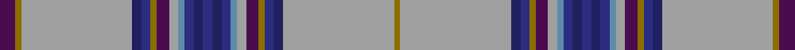

This page is one **sett** — a single exact thread-count. It belongs to the [tartan](/setts/dp5y2lr36db3dbi3y2dp4lr3t2dbi3db3dbi3/)
(the same proportion at any scale), whose colour order is pattern [BGYBBGBYBBBBBBBYBGBBYG](/stripes/bgybbgbybbbbbbbybgbbyg/).

Sourced from register-of-tartans.  It is a [22 stripe tartan](/stripes/stripes22/).

Original link https://www.tartanregister.gov.uk/tartanDetails.aspx?ref=3717

2 attestations — the source records this cloth was collapsed from (oldest owns this page)

<ul>
<li>01/03/2006 — Scottish Foundation VA Highlands (register-of-tartans, <a href="https://www.tartanregister.gov.uk/tartanDetails.aspx?ref=3717">record</a>)  <em>Based on the MacCallum, it was designed by four members of the Scottish Foundation of the Virginia Highlands (SFVH) - Jean Oxley (also the weaver), Elberta Raisbeck, Anne Sampson and SFVH President Charlene Dixon Hutcheson. The SFVH is an educational and cultural organisation based in Roanoke, Virginia and the tartan celebrates the area's Scottish ancestors and reflects the strength of character found in the Blue Ridge Mountains which has helped to preserve cultural aspects of the original Scottish and Scots-Irish settlers. The tartan is primarily for the use of members of the Scottish Foundation of the Virginia Highlands but the copyright holders do not wish to restrict its use if someone else finds it pleasing.</em></li>
<li>2006 March — Scottish Foundation VA Highlands (Co (tartans-authority, <a href="http://www.tartansauthority.com/tartan-ferret/display/6891/">record</a>)  <em>Based on the MacCallum, it was designed by four members of the Scottish Foundation of the Virginia Highlands (SFVH) - Jean Oxley (also the weaver), Elberta Raisbeck, Anne Sampson and SFVH President Charlene Dixon Hutcheson. The SFVH is an educational and cultural organisation based in Roanoke, Virginia and the tartan celebrates the area's Scottish ancestors and reflects the strength of character found in the Blue Ridge Mountains which has helped to preserve cultural aspects of the original Scottish and Scots-Irish settlers. The tartan is primarily for the use of members of the Scottish Foundation of the Virginia Highlands but the copyright holders do not wish to restrict its use if someone else finds it pleasing.</em></li>
</ul>

## Register references

External register numbers recorded for this tartan.

- Scottish Register of Tartans: [3717](https://www.tartanregister.gov.uk/tartanDetails.aspx?ref=3717)
- Scottish Tartans Authority (ITI): 6891

## Thread count
DP/10 Y4 LR72 DB6 DBi6 Y4 DP8 LR6 T4 DBi6 DB6 DBi6 DB6 DBi6 T4 LR6 DP8 Y4 DBi6 DB6 LR72 Y/4

One full sett is **506 threads**.

## Palette
<table><thead><tr><th>Colour</th><th>Shade</th><th>OKLCh</th></tr></thead><tbody><tr><td>B</td><td><code style="background-color:#5C8CA8;">#5C8CA8</code> <small style="color:#888">#5C8CA8</small></td><td><small style="color:#888">oklch(61.7% 0.067 235.0)</small></td></tr><tr><td>DB</td><td><code style="background-color:#202060;">#202060</code> <small style="color:#888">#202060</small></td><td><small style="color:#888">oklch(28.9% 0.111 276.9)</small></td></tr><tr><td>DBa</td><td><code style="background-color:#2C2C80;">#2C2C80</code> <small style="color:#888">#2C2C80</small></td><td><small style="color:#888">oklch(35.0% 0.138 276.6)</small></td></tr><tr><td>N</td><td><code style="background-color:#A0A0A0;">#A0A0A0</code> <small style="color:#888">#A0A0A0</small></td><td><small style="color:#888">oklch(70.6% 0.000 89.9)</small></td></tr><tr><td>Na</td><td><code style="background-color:#636363;">#636363</code> <small style="color:#888">#636363</small></td><td><small style="color:#888">oklch(50.0% 0.000 89.9)</small></td></tr><tr><td>O</td><td><code style="background-color:#D60020;">#D60020</code> <small style="color:#888">#D60020</small></td><td><small style="color:#888">oklch(55.2% 0.224 25.5)</small></td></tr><tr><td>Oa</td><td><code style="background-color:#FF9C34;">#FF9C34</code> <small style="color:#888">#FF9C34</small></td><td><small style="color:#888">oklch(77.9% 0.161 61.8)</small></td></tr><tr><td>P</td><td><code style="background-color:#4B0B4F;">#4B0B4F</code> <small style="color:#888">#4B0B4F</small></td><td><small style="color:#888">oklch(30.1% 0.125 325.4)</small></td></tr><tr><td>Y</td><td><code style="background-color:#8B6E00;">#8B6E00</code> <small style="color:#888">#8B6E00</small></td><td><small style="color:#888">oklch(55.1% 0.113 90.4)</small></td></tr></tbody></table>

# Sample pattern

ID: /variants/s12/dp5y2lr36db3dbi3y2dp4lr3t2dbi3db3dbi3~x2~lr2800000-db1204274-dbi1406275-t2503227/
