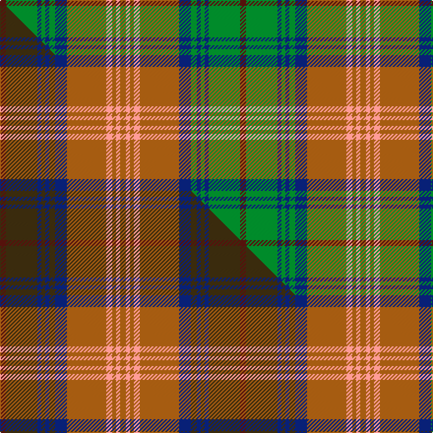

This is one **variant** — a specific cloth: this exact thread count and colourway, with its own
provenance below. It is one weaving of the [sett](/tartans/c/ca/callum-3/) (the scale-free proportion — the
same cloth at any scale or shade), whose colour order is pattern [BGBGBGBRYRYR](/stripes/bgbgbgbryryr/).

Part of the [Callum](/tartans/c/ca/callum-3/) tartan — the named design grouping this sett with its other cloths.

Sourced from tartans-authority.  It is a [12 stripe tartan](/stripes/stripes12/).

Original link <code>http://www.tartansauthority.com/tartan-ferret/display/1319/</code> — retired · [Internet Archive copy](https://web.archive.org/web/*/http://www.tartansauthority.com/tartan-ferret/display/1319/*)

Dataset <small>— provenance for this record, inherited from the source manifest</small>

<dl class="dataset-prov">
<dt>source</dt><dd><a href="/sources/tartans-authority/">Scottish Tartans Authority</a></dd>
<dt>data captured from</dt><dd><a href="https://github.com/thetartan/tartan-database/blob/master/data/tartans-authority/data.csv">https://github.com/thetartan/tartan-database/blob/master/data/tartans-authority/data.csv</a></dd>
<dt>data date</dt><dd>1980 <small>(this record)</small></dd>
<dt>licence</dt><dd><a href="https://creativecommons.org/licenses/by-nc-nd/4.0/">CC BY-NC-ND 4.0</a></dd>
</dl>

Capture chain <small>— the hands this data passed through, oldest first; each capture carries its own licence</small>

<ol class="capture-chain">
<li><a href="https://www.tartansauthority.com/">Scottish Tartans Authority</a> <small>the heritage body’s archive — its tartan-ferret record browser is retired; dead record links are shown unlinked, with an Internet Archive copy (ITI numbers are not SRT references)</small></li>
<li><a href="https://github.com/thetartan/tartan-database">thetartan/tartan-database</a> <small>2016-2017</small> · <a href="https://creativecommons.org/licenses/by-nc-nd/4.0/">CC BY-NC-ND 4.0</a> <small>Levko Kravets's frozen compilation — the capture we vendored, and where its CC licence text came from</small></li>
<li>this dictionary <small>captured 2026-06-10 · commit 5bf86c7566</small> <small>each re-capture is a git commit to data/sources</small></li>
</ol>

## Register references

External register numbers recorded for this tartan.

- Scottish Tartans Authority (ITI): 1319

## Thread count
DR/6 G32 DB4 G4 DB4 G6 DB12 O40 LR6 O4 LR4 O/6

One full sett is **244 threads**.

## Palette
<table><thead><tr><th>Colour</th><th>Shade</th><th>OKLCh</th></tr></thead><tbody><tr><td>G</td><td><code style="background-color:#008B2A;">#008B2A</code> <small style="color:#888">#008B2A</small></td><td><small style="color:#888">oklch(55.4% 0.170 145.9)</small></td></tr><tr><td>DB</td><td><code style="background-color:#082077;">#082077</code> <small style="color:#888">#082077</small></td><td><small style="color:#888">oklch(30.0% 0.149 265.1)</small></td></tr><tr><td>DR</td><td><code style="background-color:#55120C;">#55120C</code> <small style="color:#888">#55120C</small></td><td><small style="color:#888">oklch(30.0% 0.099 29.3)</small></td></tr><tr><td>O</td><td><code style="background-color:#A65C11;">#A65C11</code> <small style="color:#888">#A65C11</small></td><td><small style="color:#888">oklch(55.0% 0.125 58.3)</small></td></tr><tr><td>LR</td><td><code style="background-color:#FF9C97;">#FF9C97</code> <small style="color:#888">#FF9C97</small></td><td><small style="color:#888">oklch(79.3% 0.119 23.2)</small></td></tr></tbody></table>

# Sample pattern

## Compared to the master

This cloth is one sett of its design; the master sett (the exemplar the design is anchored on) is below for comparison.

Its **ΔTartan distance** from the master is **2.74** — the same measure the nearest-tartans table ranks by (0 is identical; a re-scale of the same cloth is near 0, a recolour or a different proportion further).

<figure class="master-compare" style="margin:0">

this sett
master sett ★

<figcaption style="color:#888;font-size:smaller">One weave of this sett against the <a href="/setts/dr3dy16db2dy2db2dy3db6o20lr3o2lr2o3/">master sett ★</a>, split on the diagonal: a shared proportion runs seamlessly across it with only the shades shifting; a different proportion breaks on it.</figcaption>
</figure>

## Nearest tartan variants

The nearest existing variants by ΔTartan distance, with this cloth at the top so the swatches line up against it.

ΔTartan

Threads

Variant

Sett

—

244

<a href="/variants/s12/dr3g16db2g2db2g3db6o20lr3o2lr2o3~x2/">Callum, Blue (Fashion)</a>

<a href="/ttd/edit/#slug=dr4g20db2g2db2g3db6o26w3o2w2o4~x2&amp;base=dr3g16db2g2db2g3db6o20lr3o2lr2o3~x2" title="compare in the TTD">0.86</a>

288

<a href="/variants/s12/dr4g20db2g2db2g3db6o26w3o2w2o4~x2/">Dorcas (Fashion)</a>

<a href="/ttd/edit/#slug=r6db3y3o32db24g32y3g3y3g3y6&amp;base=dr3g16db2g2db2g3db6o20lr3o2lr2o3~x2" title="compare in the TTD">2.04</a>

224

<a href="/variants/s11/r6db3y3o32db24g32y3g3y3g3y6/">Bonnie Brae Corporate Tartan</a>

<a href="/ttd/edit/#slug=dr5r2y24lb2y2lb2y6lb8dr6lb8ly4~x2&amp;base=dr3g16db2g2db2g3db6o20lr3o2lr2o3~x2" title="compare in the TTD">2.59</a>

258

<a href="/variants/s11/dr5r2y24lb2y2lb2y6lb8dr6lb8ly4~x2/">Tasmanian</a>

<a href="/ttd/edit/#slug=g16dy1g2dy1g2dy12r12dy1y2dy1r12dy12g12dy1w2~x2&amp;base=dr3g16db2g2db2g3db6o20lr3o2lr2o3~x2" title="compare in the TTD">2.70</a>

320

<a href="/variants/s15/g16dy1g2dy1g2dy12r12dy1y2dy1r12dy12g12dy1w2~x2/">Prince Edward Island District Tartan</a>

<a href="/ttd/edit/#slug=g4r1db2r1g10dy5r3dy10y1~x4&amp;base=dr3g16db2g2db2g3db6o20lr3o2lr2o3~x2" title="compare in the TTD">2.71</a>

276

<a href="/variants/s9/g4r1db2r1g10dy5r3dy10y1~x4/">Moncton, City of</a>

<a href="/ttd/edit/#slug=dr3dy16db2dy2db2dy3db6o20lr3o2lr2o3~x2&amp;base=dr3g16db2g2db2g3db6o20lr3o2lr2o3~x2" title="compare in the TTD">2.74</a>

244

<a href="/variants/s12/dr3dy16db2dy2db2dy3db6o20lr3o2lr2o3~x2/">Callum, Brown (Fashion)</a>

<a href="/ttd/edit/#slug=do6y4do3db2do5db2do3db2g15r3db2~x2&amp;base=dr3g16db2g2db2g3db6o20lr3o2lr2o3~x2" title="compare in the TTD">2.74</a>

172

<a href="/variants/s11/do6y4do3db2do5db2do3db2g15r3db2~x2/">Limerick</a>

<a href="/ttd/edit/#slug=g25r2w2db2w2r13dy28db2r3~x2&amp;base=dr3g16db2g2db2g3db6o20lr3o2lr2o3~x2" title="compare in the TTD">2.78</a>

260

<a href="/variants/s9/g25r2w2db2w2r13dy28db2r3~x2/">Brousseau (Personal)</a>

<a href="/ttd/edit/#slug=r2dg3dy18r2dy2r21g6dg2g2dg24lo2~x2~dy1502083-lo2706076&amp;base=dr3g16db2g2db2g3db6o20lr3o2lr2o3~x2" title="compare in the TTD">2.79</a>

328

<a href="/variants/s11/r2dg3dy18r2dy2r21g6dg2g2dg24lo2~x2~dy1502083-lo2706076/">Methven</a>

<a href="/ttd/edit/#slug=g22r3db10t2db10r21g22r3y2db2~x2&amp;base=dr3g16db2g2db2g3db6o20lr3o2lr2o3~x2" title="compare in the TTD">2.85</a>

340

<a href="/variants/s10/g22r3db10t2db10r21g22r3y2db2~x2/">Glasgow Cathedral 2000</a>

## Neighbour map

Every grey dot is one of 13657 variants placed by the first two principal components of the ΔTartan feature space (42% of its variance). Red is this tartan; blue dots are its nearest — click one to open its page. The map is a flat projection of a many-dimensional space — [how to read it](/posts/neighbourhood-maps/).

<svg viewBox="0 0 640 380" role="img" style="max-width:100%;height:auto;border:1px solid #e0e0e0;border-radius:4px;display:block" xmlns="http://www.w3.org/2000/svg"><image href="/nn/cloud.v1.png" width="640" height="380"/><a href="/variants/s12/dr4g20db2g2db2g3db6o26w3o2w2o4~x2/"><circle cx="244.3" cy="149.6" r="4" fill="#3465a4"><title>Dorcas (Fashion)</title></circle></a><a href="/variants/s11/r6db3y3o32db24g32y3g3y3g3y6/"><circle cx="205.1" cy="177.8" r="4" fill="#3465a4"><title>Bonnie Brae Corporate Tartan</title></circle></a><a href="/variants/s11/dr5r2y24lb2y2lb2y6lb8dr6lb8ly4~x2/"><circle cx="254.7" cy="168.3" r="4" fill="#3465a4"><title>Tasmanian</title></circle></a><a href="/variants/s15/g16dy1g2dy1g2dy12r12dy1y2dy1r12dy12g12dy1w2~x2/"><circle cx="210.2" cy="147.1" r="4" fill="#3465a4"><title>Prince Edward Island District Tartan</title></circle></a><a href="/variants/s9/g4r1db2r1g10dy5r3dy10y1~x4/"><circle cx="235.2" cy="200.0" r="4" fill="#3465a4"><title>Moncton, City of</title></circle></a><a href="/variants/s12/dr3dy16db2dy2db2dy3db6o20lr3o2lr2o3~x2/"><circle cx="235.1" cy="166.4" r="4" fill="#3465a4"><title>Callum, Brown (Fashion)</title></circle></a><a href="/variants/s11/do6y4do3db2do5db2do3db2g15r3db2~x2/"><circle cx="193.3" cy="204.2" r="4" fill="#3465a4"><title>Limerick</title></circle></a><a href="/variants/s9/g25r2w2db2w2r13dy28db2r3~x2/"><circle cx="202.8" cy="152.4" r="4" fill="#3465a4"><title>Brousseau (Personal)</title></circle></a><a href="/variants/s11/r2dg3dy18r2dy2r21g6dg2g2dg24lo2~x2~dy1502083-lo2706076/"><circle cx="232.7" cy="167.5" r="4" fill="#3465a4"><title>Methven</title></circle></a><a href="/variants/s10/g22r3db10t2db10r21g22r3y2db2~x2/"><circle cx="228.1" cy="178.9" r="4" fill="#3465a4"><title>Glasgow Cathedral 2000</title></circle></a><circle cx="228.9" cy="170.9" r="5" fill="#c00000"/><text x="320" y="376" text-anchor="middle" font-size="11" fill="#999">ground</text><text x="11" y="190" text-anchor="middle" font-size="11" fill="#999" transform="rotate(-90 11 190)">complexity</text></svg>

ID: /variants/s12/dr3g16db2g2db2g3db6o20lr3o2lr2o3~x2/
