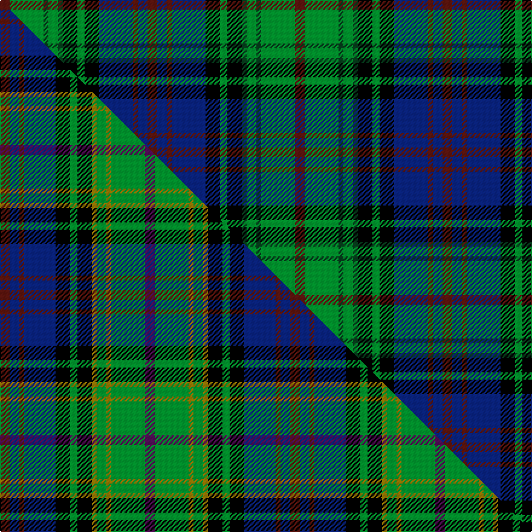

This is one **variant** — a specific cloth: this exact thread count and colourway, with its own
provenance below. It is one weaving of the [sett](/tartans/k/ki/kinloch-anderson-hunting/) (the scale-free proportion — the
same cloth at any scale or shade), whose colour order is pattern [BBBBKGKGGGGB](/stripes/bbbbkgkggggb/).

Part of the [Kinloch Anderson Hunting](/tartans/k/ki/kinloch-anderson-hunting/) tartan — the named design grouping this sett with its other cloths.

Sourced from weddslist.  It is a [12 stripe tartan](/stripes/stripes12/).

Original link [http://www.weddslist.com/cgi-bin/tartans/pg.pl?source=sts](http://www.weddslist.com/cgi-bin/tartans/pg.pl?source=sts)

Dataset <small>— provenance for this record, inherited from the source manifest</small>

<dl class="dataset-prov">
<dt>source</dt><dd><a href="/sources/weddslist/">Weddslist</a></dd>
<dt>data captured from</dt><dd><a href="https://github.com/thetartan/tartan-database/blob/master/data/weddslist/data.csv">https://github.com/thetartan/tartan-database/blob/master/data/weddslist/data.csv</a></dd>
<dt>data date</dt><dd>2016-11-17 <small>(dataset default)</small></dd>
<dt>licence</dt><dd><a href="https://creativecommons.org/licenses/by-nc-nd/4.0/">CC BY-NC-ND 4.0</a></dd>
</dl>

Capture chain <small>— the hands this data passed through, oldest first; each capture carries its own licence</small>

<ol class="capture-chain">
<li><a href="https://www.weddslist.com/tartans/">Weddslist</a> <small>the living privately compiled reference</small></li>
<li><a href="https://github.com/thetartan/tartan-database">thetartan/tartan-database</a> <small>2016-2017</small> · <a href="https://creativecommons.org/licenses/by-nc-nd/4.0/">CC BY-NC-ND 4.0</a> <small>Levko Kravets's frozen compilation — the capture we vendored, and where its CC licence text came from</small></li>
<li>this dictionary <small>captured 2026-06-10 · commit 5bf86c7566</small> <small>each re-capture is a git commit to data/sources</small></li>
</ol>

## Thread count
DR/8 G28 DG4 G8 DG4 K12 G6 K12 DB28 DR4 DB8 DR/8

One full sett is **244 threads**.

## Palette
<table><thead><tr><th>Colour</th><th>Shade</th><th>OKLCh</th></tr></thead><tbody><tr><td>DB</td><td><code style="background-color:#082077;">#082077</code> <small style="color:#888">#082077</small></td><td><small style="color:#888">oklch(30.0% 0.149 265.1)</small></td></tr><tr><td>DR</td><td><code style="background-color:#55120C;">#55120C</code> <small style="color:#888">#55120C</small></td><td><small style="color:#888">oklch(30.0% 0.099 29.3)</small></td></tr><tr><td>G</td><td><code style="background-color:#008B2A;">#008B2A</code> <small style="color:#888">#008B2A</small></td><td><small style="color:#888">oklch(55.4% 0.170 145.9)</small></td></tr><tr><td>K</td><td><code style="background-color:#000000;">#000000</code> <small style="color:#888">#000000</small></td><td><small style="color:#888">oklch(0.0% 0.000 0.0)</small></td></tr><tr><td>DG</td><td><code style="background-color:#053819;">#053819</code> <small style="color:#888">#053819</small></td><td><small style="color:#888">oklch(30.0% 0.075 151.3)</small></td></tr></tbody></table>

# Sample pattern

## Compared to the master

This cloth is one sett of its design; the master sett (the exemplar the design is anchored on) is below for comparison.

Its **ΔTartan distance** from the master is **1.87** — the same measure the nearest-tartans table ranks by (0 is identical; a re-scale of the same cloth is near 0, a recolour or a different proportion further).

<figure class="master-compare" style="margin:0">

this sett
master sett ★

<figcaption style="color:#888;font-size:smaller">One weave of this sett against the <a href="/setts/dr4db4dr2db13k6g3k6y2g4y2g14dp4/">master sett ★</a>, split on the diagonal: a shared proportion runs seamlessly across it with only the shades shifting; a different proportion breaks on it.</figcaption>
</figure>

## Nearest tartan variants

The nearest existing variants by ΔTartan distance, with this cloth at the top so the swatches line up against it.

ΔTartan

Threads

Variant

Sett

—

244

<a href="/variants/s12/dr4g14dg2g4dg2k6g3k6db14dr2db4dr4~x2/">Kinloch Anderson, hunting</a>

<a href="/ttd/edit/#slug=dr4g14o2g4o2k6g3k6db12dr2db4dr4~x2&amp;base=dr4g14dg2g4dg2k6g3k6db14dr2db4dr4~x2" title="compare in the TTD">1.00</a>

236

<a href="/variants/s12/dr4g14o2g4o2k6g3k6db12dr2db4dr4~x2/">Kinloch Anderson #2 (Corporate)</a>

<a href="/ttd/edit/#slug=dg12db3dg3db3dg3k15t20dbi3t20k15dg12db3dg3~x2~db2911276-dbi3409246&amp;base=dr4g14dg2g4dg2k6g3k6db14dr2db4dr4~x2" title="compare in the TTD">1.34</a>

430

<a href="/variants/s13/dg12db3dg3db3dg3k15t20dbi3t20k15dg12db3dg3~x2~db2911276-dbi3409246/">Lemania (District)</a>

<a href="/ttd/edit/#slug=db10dp2db3r4db14r2k14g14r4g3dp2g10~x2&amp;base=dr4g14dg2g4dg2k6g3k6db14dr2db4dr4~x2" title="compare in the TTD">1.48</a>

288

<a href="/variants/s12/db10dp2db3r4db14r2k14g14r4g3dp2g10~x2/">MacDonald of Dunyveg Family Tartan</a>

<a href="/ttd/edit/#slug=db6dy2db18k6dy3k6g14r3g10r2~x2&amp;base=dr4g14dg2g4dg2k6g3k6db14dr2db4dr4~x2" title="compare in the TTD">1.57</a>

264

<a href="/variants/s10/db6dy2db18k6dy3k6g14r3g10r2~x2/">MacMillan Hunting Clan Tartan</a>

<a href="/ttd/edit/#slug=dr1db6k6g1t2g9t2g1k6db6dr1db1~x8&amp;base=dr4g14dg2g4dg2k6g3k6db14dr2db4dr4~x2" title="compare in the TTD">1.65</a>

656

<a href="/variants/s12/dr1db6k6g1t2g9t2g1k6db6dr1db1~x8/">MacTaggart (Johnstons)</a>

<a href="/ttd/edit/#slug=db12r2db4r5db16r2k16dy2g16r5g4r2g12~x2&amp;base=dr4g14dg2g4dg2k6g3k6db14dr2db4dr4~x2" title="compare in the TTD">1.76</a>

344

<a href="/variants/s13/db12r2db4r5db16r2k16dy2g16r5g4r2g12~x2/">Macallan</a>

<a href="/ttd/edit/#slug=dg10lo2dg3r4dg13k13r2t13r4t3r2t10~x2~t5211240&amp;base=dr4g14dg2g4dg2k6g3k6db14dr2db4dr4~x2" title="compare in the TTD">1.79</a>

276

<a href="/variants/s12/dg10lo2dg3r4dg13k13r2t13r4t3r2t10~x2~t5211240/">Bowie (Lochcarron)</a>

<a href="/ttd/edit/#slug=dg10lo2dg3r4dg13k13r2t13r4t3r2t10~x2&amp;base=dr4g14dg2g4dg2k6g3k6db14dr2db4dr4~x2" title="compare in the TTD">1.80</a>

276

<a href="/variants/s12/dg10lo2dg3r4dg13k13r2t13r4t3r2t10~x2/">Bowie (Name)</a>

<a href="/ttd/edit/#slug=g12r2g2r2k12db12y2db12k2g11r2g2~x2&amp;base=dr4g14dg2g4dg2k6g3k6db14dr2db4dr4~x2" title="compare in the TTD">1.81</a>

264

<a href="/variants/s12/g12r2g2r2k12db12y2db12k2g11r2g2~x2/">Akins of Candler (Personal)</a>

<a href="/ttd/edit/#slug=dr4db4dr2db13k6g3k6y2g4y2g14dp4~x2&amp;base=dr4g14dg2g4dg2k6g3k6db14dr2db4dr4~x2" title="compare in the TTD">1.87</a>

240

<a href="/variants/s12/dr4db4dr2db13k6g3k6y2g4y2g14dp4~x2/">Kinloch Anderson Hunting</a>

## Neighbour map

Every grey dot is one of 13662 variants placed by the first two principal components of the ΔTartan feature space (42% of its variance). Red is this tartan; blue dots are its nearest — click one to open its page. The map is a flat projection of a many-dimensional space — [how to read it](/posts/neighbourhood-maps/).

<svg viewBox="0 0 640 380" role="img" style="max-width:100%;height:auto;border:1px solid #e0e0e0;border-radius:4px;display:block" xmlns="http://www.w3.org/2000/svg"><image href="/nn/cloud.v1.png" width="640" height="380"/><a href="/variants/s12/dr4g14o2g4o2k6g3k6db12dr2db4dr4~x2/"><circle cx="87.6" cy="184.6" r="4" fill="#3465a4"><title>Kinloch Anderson #2 (Corporate)</title></circle></a><a href="/variants/s13/dg12db3dg3db3dg3k15t20dbi3t20k15dg12db3dg3~x2~db2911276-dbi3409246/"><circle cx="113.7" cy="184.5" r="4" fill="#3465a4"><title>Lemania (District)</title></circle></a><a href="/variants/s12/db10dp2db3r4db14r2k14g14r4g3dp2g10~x2/"><circle cx="89.3" cy="180.9" r="4" fill="#3465a4"><title>MacDonald of Dunyveg Family Tartan</title></circle></a><a href="/variants/s10/db6dy2db18k6dy3k6g14r3g10r2~x2/"><circle cx="115.1" cy="181.1" r="4" fill="#3465a4"><title>MacMillan Hunting Clan Tartan</title></circle></a><a href="/variants/s12/dr1db6k6g1t2g9t2g1k6db6dr1db1~x8/"><circle cx="97.0" cy="170.4" r="4" fill="#3465a4"><title>MacTaggart (Johnstons)</title></circle></a><a href="/variants/s13/db12r2db4r5db16r2k16dy2g16r5g4r2g12~x2/"><circle cx="93.0" cy="169.1" r="4" fill="#3465a4"><title>Macallan</title></circle></a><a href="/variants/s12/dg10lo2dg3r4dg13k13r2t13r4t3r2t10~x2~t5211240/"><circle cx="97.2" cy="188.4" r="4" fill="#3465a4"><title>Bowie (Lochcarron)</title></circle></a><a href="/variants/s12/dg10lo2dg3r4dg13k13r2t13r4t3r2t10~x2/"><circle cx="90.8" cy="187.5" r="4" fill="#3465a4"><title>Bowie (Name)</title></circle></a><a href="/variants/s12/g12r2g2r2k12db12y2db12k2g11r2g2~x2/"><circle cx="107.2" cy="179.0" r="4" fill="#3465a4"><title>Akins of Candler (Personal)</title></circle></a><a href="/variants/s12/dr4db4dr2db13k6g3k6y2g4y2g14dp4~x2/"><circle cx="70.8" cy="172.0" r="4" fill="#3465a4"><title>Kinloch Anderson Hunting</title></circle></a><circle cx="96.3" cy="185.5" r="5" fill="#c00000"/><text x="320" y="376" text-anchor="middle" font-size="11" fill="#999">ground</text><text x="11" y="190" text-anchor="middle" font-size="11" fill="#999" transform="rotate(-90 11 190)">complexity</text></svg>

ID: /variants/s12/dr4g14dg2g4dg2k6g3k6db14dr2db4dr4~x2/
