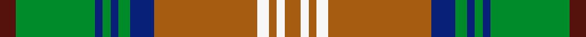

This page is one **sett** — a single exact thread-count. It belongs to the [tartan](/setts/dr4g20db2g2db2g3db6o26w3o2w2o4/)
(the same proportion at any scale), whose colour order is pattern [BGBGBGBRWRWR](/stripes/bgbgbgbrwrwr/).

Sourced from tartans-authority.  It is a [12 stripe tartan](/stripes/stripes12/).

Original link http://www.tartansauthority.com/tartan-ferret/display/3180/

2 attestations — the source records this cloth was collapsed from (oldest owns this page)

<ul>
<li>1990 — Dorcas (Fashion) (tartans-authority, <a href="http://www.tartansauthority.com/tartan-ferret/display/3180/">record</a>)  <em>Sample in STA Johnston Collection. Fraser & Kirkbright say (Sept 2002) it was made for Aljean. See #1315 for original Scotch House 'Dorcas' Sindex notes differ: "Scotch House fashion check. c.1980." Weft slog OGT:TWT Warp slog ONK:TWT Aljean - women's clothes retailer in Vancouver Canada traded under Aljean name from 1950-2012.</em></li>
<li>undated — Dorcas (WCWM) (register-of-tartans, <a href="https://www.tartanregister.gov.uk/tartanDetails.aspx?ref=4884">record</a>)  <em>Sample in Scottish Tartans Authority's Johnston Collection. Fraser & Kirkbright say (September 2002) it was made for Aljean. See #1315 (original Scottish Tartans Authority reference) for original Scotch House 'Dorcas' Sindex notes differ: 'Scotch House fashion check. c.1980.' Weft slog OGT:TWT Warp slog ONK:TWT</em></li>
</ul>

## Register references

External register numbers recorded for this tartan.

- Scottish Register of Tartans: [4884](https://www.tartanregister.gov.uk/tartanDetails.aspx?ref=4884)
- Scottish Tartans Authority (ITI): 3180

## Thread count
DR/8 G40 DB4 G4 DB4 G6 DB12 O52 W6 O4 W4 O/8

One full sett is **288 threads**.

## Palette
<table><thead><tr><th>Colour</th><th>Shade</th><th>OKLCh</th></tr></thead><tbody><tr><td>DB</td><td><code style="background-color:#082077;">#082077</code> <small style="color:#888">#082077</small></td><td><small style="color:#888">oklch(30.0% 0.149 265.1)</small></td></tr><tr><td>DR</td><td><code style="background-color:#55120C;">#55120C</code> <small style="color:#888">#55120C</small></td><td><small style="color:#888">oklch(30.0% 0.099 29.3)</small></td></tr><tr><td>G</td><td><code style="background-color:#008B2A;">#008B2A</code> <small style="color:#888">#008B2A</small></td><td><small style="color:#888">oklch(55.4% 0.170 145.9)</small></td></tr><tr><td>W</td><td><code style="background-color:#F7F7F7;">#F7F7F7</code> <small style="color:#888">#F7F7F7</small></td><td><small style="color:#888">oklch(97.6% 0.000 89.9)</small></td></tr><tr><td>O</td><td><code style="background-color:#A65C11;">#A65C11</code> <small style="color:#888">#A65C11</small></td><td><small style="color:#888">oklch(55.0% 0.125 58.3)</small></td></tr></tbody></table>

# Sample pattern

## Nearest variants

The nearest existing variants by ΔTartan distance, with this cloth at the top so the swatches line up against it.

ΔTartan

Threads

Variant

Sett

—

288

<a href="/variants/s12/dr4g20db2g2db2g3db6o26w3o2w2o4~x2/">Dorcas (Fashion)</a>

<a href="/ttd/edit/#slug=dr3g16db2g2db2g3db6o20lr3o2lr2o3~x2&amp;base=dr4g20db2g2db2g3db6o26w3o2w2o4~x2" title="compare in the TTD">0.86</a>

244

<a href="/variants/s12/dr3g16db2g2db2g3db6o20lr3o2lr2o3~x2/">Callum, Blue (Fashion)</a>

## Neighbour map

Every grey dot is one of 13620 variants placed by the first two principal components of the ΔTartan feature space (42% of its variance). Red is this tartan; blue dots are its nearest — click one to open its page.

<svg viewBox="0 0 640 380" role="img" style="max-width:100%;height:auto;border:1px solid #e0e0e0;border-radius:4px;display:block" xmlns="http://www.w3.org/2000/svg"><image href="/nn/cloud.v1.png" width="640" height="380"/><a href="/variants/s12/dr3g16db2g2db2g3db6o20lr3o2lr2o3~x2/"><circle cx="228.8" cy="171.0" r="4" fill="#3465a4"><title>Callum, Blue (Fashion)</title></circle></a><circle cx="244.2" cy="149.7" r="5" fill="#c00000"/><text x="320" y="376" text-anchor="middle" font-size="11" fill="#999">ground</text><text x="11" y="190" text-anchor="middle" font-size="11" fill="#999" transform="rotate(-90 11 190)">complexity</text></svg>

ID: /variants/s12/dr4g20db2g2db2g3db6o26w3o2w2o4~x2/
