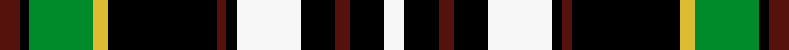

This page is one **sett** — a single exact thread-count. It belongs to the [tartan](/setts/dr4k2g13ly3k22dr2k2w13k7dr3k7w4/)
(the same proportion at any scale), whose colour order is pattern [BKGYKBKWKBKW](/stripes/bkgykbkwkbkw/).

Sourced from tartans-authority.  It is a [12 stripe tartan](/stripes/stripes12/).

Original link http://www.tartansauthority.com/tartan-ferret/display/7457/

## Register references

External register numbers recorded for this tartan.

- Scottish Tartans Authority (ITI): 7457

## Thread count
DR/8 K4 G26 LY6 K44 DR4 K4 W26 K14 DR6 K14 W/8

One full sett is **312 threads**.

## Palette
<table><thead><tr><th>Colour</th><th>Shade</th><th>OKLCh</th></tr></thead><tbody><tr><td>DR</td><td><code style="background-color:#55120C;">#55120C</code> <small style="color:#888">#55120C</small></td><td><small style="color:#888">oklch(30.0% 0.099 29.3)</small></td></tr><tr><td>LY</td><td><code style="background-color:#DCBC32;">#DCBC32</code> <small style="color:#888">#DCBC32</small></td><td><small style="color:#888">oklch(80.0% 0.150 95.2)</small></td></tr><tr><td>K</td><td><code style="background-color:#000000;">#000000</code> <small style="color:#888">#000000</small></td><td><small style="color:#888">oklch(0.0% 0.000 0.0)</small></td></tr><tr><td>W</td><td><code style="background-color:#F7F7F7;">#F7F7F7</code> <small style="color:#888">#F7F7F7</small></td><td><small style="color:#888">oklch(97.6% 0.000 89.9)</small></td></tr><tr><td>G</td><td><code style="background-color:#008B2A;">#008B2A</code> <small style="color:#888">#008B2A</small></td><td><small style="color:#888">oklch(55.4% 0.170 145.9)</small></td></tr></tbody></table>

# Sample pattern

## Nearest variants

The nearest existing variants by ΔTartan distance, with this cloth at the top so the swatches line up against it.

ΔTartan

Threads

Variant

Sett

—

312

<a href="/variants/s12/dr4k2g13ly3k22dr2k2w13k7dr3k7w4~x2/">Tyrone County Crest (Fashion)</a>

<a href="/ttd/edit/#slug=dr4k2g13dy3k22dr2k2w13k7dr3k7w4~x2&amp;base=dr4k2g13ly3k22dr2k2w13k7dr3k7w4~x2" title="compare in the TTD">0.00</a>

312

<a href="/variants/s12/dr4k2g13dy3k22dr2k2w13k7dr3k7w4~x2/">Tyrone County, Crest Range</a>

## Neighbour map

Every grey dot is one of 13620 variants placed by the first two principal components of the ΔTartan feature space (42% of its variance). Red is this tartan; blue dots are its nearest — click one to open its page.

<svg viewBox="0 0 640 380" role="img" style="max-width:100%;height:auto;border:1px solid #e0e0e0;border-radius:4px;display:block" xmlns="http://www.w3.org/2000/svg"><image href="/nn/cloud.v1.png" width="640" height="380"/><a href="/variants/s12/dr4k2g13dy3k22dr2k2w13k7dr3k7w4~x2/"><circle cx="151.2" cy="137.2" r="4" fill="#3465a4"><title>Tyrone County, Crest Range</title></circle></a><circle cx="151.2" cy="137.8" r="5" fill="#c00000"/><text x="320" y="376" text-anchor="middle" font-size="11" fill="#999">ground</text><text x="11" y="190" text-anchor="middle" font-size="11" fill="#999" transform="rotate(-90 11 190)">complexity</text></svg>

ID: /variants/s12/dr4k2g13ly3k22dr2k2w13k7dr3k7w4~x2/
