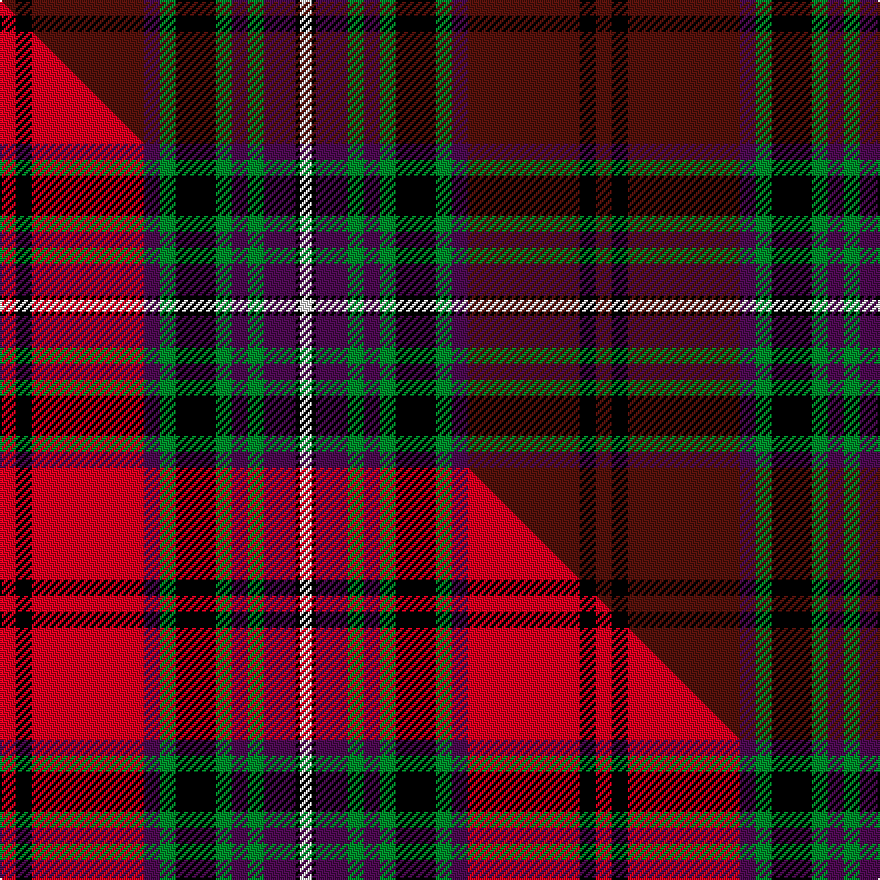

This is one **variant** — a specific cloth: this exact thread count and colourway, with its own
provenance below. It is one weaving of the [sett](/tartans/k/ke/kelly-of-sleat/) (the scale-free proportion — the
same cloth at any scale or shade), whose colour order is pattern [BKBBGKGBGBKW](/stripes/bkbbgkgbgbkw/).

Part of the [Kelly of Sleat](/tartans/k/ke/kelly-of-sleat/) tartan — the named design grouping this sett with its other cloths.

Sourced from tartans-authority.  It is a [12 stripe tartan](/stripes/stripes12/).

Original link <code>http://www.tartansauthority.com/tartan-ferret/display/3072/</code> — retired · [Internet Archive copy](https://web.archive.org/web/*/http://www.tartansauthority.com/tartan-ferret/display/3072/*)

Dataset <small>— provenance for this record, inherited from the source manifest</small>

<dl class="dataset-prov">
<dt>source</dt><dd><a href="/sources/tartans-authority/">Scottish Tartans Authority</a></dd>
<dt>data captured from</dt><dd><a href="https://github.com/thetartan/tartan-database/blob/master/data/tartans-authority/data.csv">https://github.com/thetartan/tartan-database/blob/master/data/tartans-authority/data.csv</a></dd>
<dt>data date</dt><dd>1995 <small>(this record)</small></dd>
<dt>licence</dt><dd><a href="https://creativecommons.org/licenses/by-nc-nd/4.0/">CC BY-NC-ND 4.0</a></dd>
</dl>

Capture chain <small>— the hands this data passed through, oldest first; each capture carries its own licence</small>

<ol class="capture-chain">
<li><a href="https://www.tartansauthority.com/">Scottish Tartans Authority</a> <small>the heritage body’s archive — its tartan-ferret record browser is retired; dead record links are shown unlinked, with an Internet Archive copy (ITI numbers are not SRT references)</small></li>
<li><a href="https://github.com/thetartan/tartan-database">thetartan/tartan-database</a> <small>2016-2017</small> · <a href="https://creativecommons.org/licenses/by-nc-nd/4.0/">CC BY-NC-ND 4.0</a> <small>Levko Kravets's frozen compilation — the capture we vendored, and where its CC licence text came from</small></li>
<li>this dictionary <small>captured 2026-06-10 · commit 5bf86c7566</small> <small>each re-capture is a git commit to data/sources</small></li>
</ol>

## Register references

External register numbers recorded for this tartan.

- Scottish Tartans Authority (ITI): 3072

## Thread count
DR/8 K8 DR56 DP8 G8 K20 G8 DP8 G8 DP16 K2 W/6

One full sett is **298 threads**.

## Palette
<table><thead><tr><th>Colour</th><th>Shade</th><th>OKLCh</th></tr></thead><tbody><tr><td>DR</td><td><code style="background-color:#55120C;">#55120C</code> <small style="color:#888">#55120C</small></td><td><small style="color:#888">oklch(30.0% 0.099 29.3)</small></td></tr><tr><td>G</td><td><code style="background-color:#008B2A;">#008B2A</code> <small style="color:#888">#008B2A</small></td><td><small style="color:#888">oklch(55.4% 0.170 145.9)</small></td></tr><tr><td>K</td><td><code style="background-color:#000000;">#000000</code> <small style="color:#888">#000000</small></td><td><small style="color:#888">oklch(0.0% 0.000 0.0)</small></td></tr><tr><td>W</td><td><code style="background-color:#F7F7F7;">#F7F7F7</code> <small style="color:#888">#F7F7F7</small></td><td><small style="color:#888">oklch(97.6% 0.000 89.9)</small></td></tr><tr><td>DP</td><td><code style="background-color:#4B0B4F;">#4B0B4F</code> <small style="color:#888">#4B0B4F</small></td><td><small style="color:#888">oklch(30.1% 0.125 325.4)</small></td></tr></tbody></table>

# Sample pattern

## Compared to the master

This cloth is one sett of its design; the master sett (the exemplar the design is anchored on) is below for comparison.

Its **ΔTartan distance** from the master is **0.17** — the same measure the nearest-tartans table ranks by (0 is identical; a re-scale of the same cloth is near 0, a recolour or a different proportion further).

<figure class="master-compare" style="margin:0">

this sett
master sett ★

<figcaption style="color:#888;font-size:smaller">One weave of this sett against the <a href="/setts/r4k4r28dp4g4k10g4dp4g4dp8k1w3/">master sett ★</a>, split on the diagonal: a shared proportion runs seamlessly across it with only the shades shifting; a different proportion breaks on it.</figcaption>
</figure>

## Nearest tartan variants

The nearest existing variants by ΔTartan distance, with this cloth at the top so the swatches line up against it.

ΔTartan

Threads

Variant

Sett

—

298

<a href="/variants/s12/dr4k4dr28dp4g4k10g4dp4g4dp8k1w3~x2/">Kelly of Sleat (Name)</a>

<a href="/ttd/edit/#slug=r4k4r28dp4g4k10g4dp4g4dp8k1w3~x2&amp;base=dr4k4dr28dp4g4k10g4dp4g4dp8k1w3~x2" title="compare in the TTD">0.17</a>

298

<a href="/variants/s12/r4k4r28dp4g4k10g4dp4g4dp8k1w3~x2/">Kelly of Sleat Red</a>

<a href="/ttd/edit/#slug=dr4k2dr24y2k12db3k2db2k2db12w1db1w3~x2&amp;base=dr4k4dr28dp4g4k10g4dp4g4dp8k1w3~x2" title="compare in the TTD">2.05</a>

266

<a href="/variants/s13/dr4k2dr24y2k12db3k2db2k2db12w1db1w3~x2/">Baron of Greencastle Dress #2 (Personal)</a>

<a href="/ttd/edit/#slug=dr11w4dr8dy1dr1dy28ly2dy28k2dy2k23dr3ly6dr3k5~x2&amp;base=dr4k4dr28dp4g4k10g4dp4g4dp8k1w3~x2" title="compare in the TTD">2.08</a>

476

<a href="/variants/s15/dr11w4dr8dy1dr1dy28ly2dy28k2dy2k23dr3ly6dr3k5~x2/">Scottish Register of Tartans Corporate Tartan</a>

<a href="/ttd/edit/#slug=dr12g6k4g2k4g1k12dr24r4g3w3k10~x2&amp;base=dr4k4dr28dp4g4k10g4dp4g4dp8k1w3~x2" title="compare in the TTD">2.29</a>

296

<a href="/variants/s12/dr12g6k4g2k4g1k12dr24r4g3w3k10~x2/">Fullerton, Terence (Personal)</a>

<a href="/ttd/edit/#slug=dg1r24dg8k8dg8r1k4db16w1~x2&amp;base=dr4k4dr28dp4g4k10g4dp4g4dp8k1w3~x2" title="compare in the TTD">2.35</a>

280

<a href="/variants/s9/dg1r24dg8k8dg8r1k4db16w1~x2/">Manson</a>

<a href="/ttd/edit/#slug=dr4db12k18db4y22lb1y2lb2y3lb2~x4&amp;base=dr4k4dr28dp4g4k10g4dp4g4dp8k1w3~x2" title="compare in the TTD">2.50</a>

536

<a href="/variants/s10/dr4db12k18db4y22lb1y2lb2y3lb2~x4/">Windsor</a>

<a href="/ttd/edit/#slug=dr48k10db12k2dr3k2db12k10n10k2ly3~x2&amp;base=dr4k4dr28dp4g4k10g4dp4g4dp8k1w3~x2" title="compare in the TTD">2.50</a>

354

<a href="/variants/s11/dr48k10db12k2dr3k2db12k10n10k2ly3~x2/">Brooks Brothers (Corporate)</a>

<a href="/ttd/edit/#slug=k3r2db30r1k18o30r2o3~x2&amp;base=dr4k4dr28dp4g4k10g4dp4g4dp8k1w3~x2" title="compare in the TTD">2.52</a>

344

<a href="/variants/s8/k3r2db30r1k18o30r2o3~x2/">Bannockbane Navy Fashion Tartan</a>

<a href="/ttd/edit/#slug=o4dyi4o4dyi12k31dy16r1dy6ly1r1~x2~o2307033-dyi1603076-dy1503076-r2607041&amp;base=dr4k4dr28dp4g4k10g4dp4g4dp8k1w3~x2" title="compare in the TTD">2.54</a>

310

<a href="/variants/s10/r4dyi4r4dyi12k31dy16ri1dy6ly1ri1~x2~r2307033-dyi1603076-dy1503076-ri2607041/">Unnamed C20th - National Archives`</a>

<a href="/ttd/edit/#slug=dr10w1do1w2n10dr8do2k17do2dr7n19k3y1k1~x2&amp;base=dr4k4dr28dp4g4k10g4dp4g4dp8k1w3~x2" title="compare in the TTD">2.60</a>

314

<a href="/variants/s14/dr10w1do1w2n10dr8do2k17do2dr7n19k3y1k1~x2/">Scottish Wildcat</a>

## Neighbour map

Every grey dot is one of 13656 variants placed by the first two principal components of the ΔTartan feature space (42% of its variance). Red is this tartan; blue dots are its nearest — click one to open its page. The map is a flat projection of a many-dimensional space — [how to read it](/posts/neighbourhood-maps/).

<svg viewBox="0 0 640 380" role="img" style="max-width:100%;height:auto;border:1px solid #e0e0e0;border-radius:4px;display:block" xmlns="http://www.w3.org/2000/svg"><image href="/nn/cloud.v1.png" width="640" height="380"/><a href="/variants/s12/r4k4r28dp4g4k10g4dp4g4dp8k1w3~x2/"><circle cx="179.0" cy="87.4" r="4" fill="#3465a4"><title>Kelly of Sleat Red</title></circle></a><a href="/variants/s13/dr4k2dr24y2k12db3k2db2k2db12w1db1w3~x2/"><circle cx="202.8" cy="93.5" r="4" fill="#3465a4"><title>Baron of Greencastle Dress #2 (Personal)</title></circle></a><a href="/variants/s15/dr11w4dr8dy1dr1dy28ly2dy28k2dy2k23dr3ly6dr3k5~x2/"><circle cx="233.4" cy="90.2" r="4" fill="#3465a4"><title>Scottish Register of Tartans Corporate Tartan</title></circle></a><a href="/variants/s12/dr12g6k4g2k4g1k12dr24r4g3w3k10~x2/"><circle cx="191.8" cy="113.2" r="4" fill="#3465a4"><title>Fullerton, Terence (Personal)</title></circle></a><a href="/variants/s9/dg1r24dg8k8dg8r1k4db16w1~x2/"><circle cx="161.8" cy="120.9" r="4" fill="#3465a4"><title>Manson</title></circle></a><a href="/variants/s10/dr4db12k18db4y22lb1y2lb2y3lb2~x4/"><circle cx="171.3" cy="118.6" r="4" fill="#3465a4"><title>Windsor</title></circle></a><a href="/variants/s11/dr48k10db12k2dr3k2db12k10n10k2ly3~x2/"><circle cx="258.9" cy="109.5" r="4" fill="#3465a4"><title>Brooks Brothers (Corporate)</title></circle></a><a href="/variants/s8/k3r2db30r1k18o30r2o3~x2/"><circle cx="196.0" cy="107.4" r="4" fill="#3465a4"><title>Bannockbane Navy Fashion Tartan</title></circle></a><a href="/variants/s10/r4dyi4r4dyi12k31dy16ri1dy6ly1ri1~x2~r2307033-dyi1603076-dy1503076-ri2607041/"><circle cx="189.8" cy="86.4" r="4" fill="#3465a4"><title>Unnamed C20th - National Archives`</title></circle></a><a href="/variants/s14/dr10w1do1w2n10dr8do2k17do2dr7n19k3y1k1~x2/"><circle cx="145.6" cy="103.4" r="4" fill="#3465a4"><title>Scottish Wildcat</title></circle></a><circle cx="202.9" cy="102.0" r="5" fill="#c00000"/><text x="320" y="376" text-anchor="middle" font-size="11" fill="#999">ground</text><text x="11" y="190" text-anchor="middle" font-size="11" fill="#999" transform="rotate(-90 11 190)">complexity</text></svg>

ID: /variants/s12/dr4k4dr28dp4g4k10g4dp4g4dp8k1w3~x2/
