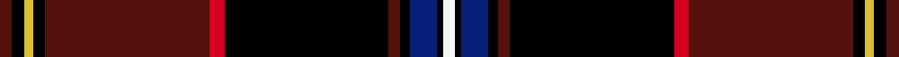

This is one **variant** — a specific cloth: this exact thread count and colourway, with its own
provenance below. It is one weaving of the [sett](/setts/dr4k4ly3k4dr54r5k54dr4k3db9k2w4/) (the scale-free proportion — the
same cloth at any scale or shade), whose colour order is pattern [BKYKBRKBKBKW](/stripes/bkykbrkbkbkw/).

Sourced from register-of-tartans.  It is a [12 stripe tartan](/stripes/stripes12/).

Original link [https://www.tartanregister.gov.uk/tartanDetails.aspx?ref=1334](https://www.tartanregister.gov.uk/tartanDetails.aspx?ref=1334)

## Provenance

Earliest known date: December 2006 Designed by William C. (Rocky) Roeger III of usakilts.com to honor German Americans and their contributions to American History. It is a private fashion tartan designed for ANYONE to wear, regardless of clan affiliation or nationality. The colors chosen in this tartan represent the flags of both countries, America and Germany. Woven sample.

3 attestations — the source records this cloth was collapsed from (oldest owns this page)

<ul>
<li>01/12/2006 — German American (register-of-tartans, <a href="https://www.tartanregister.gov.uk/tartanDetails.aspx?ref=1334">record</a>)  <em>Designed by William C (Rocky) Roeger III of USA Kilts to honour German Americans and their contributions to American History. It is a private fashion tartan designed for anyone to wear, regardless of clan affiliation or nationality. The colours chosen in this tartan represent the flags of both countries, America and Germany.</em></li>
<li>December 2006 — German American (Fashion) (tartans-authority, <a href="https://www.tartanregister.gov.uk/tartanDetails.aspx?ref=7017">record</a>)  <em>Designed by William C. (Rocky) Roeger III of usakilts.com to honor German Americans and their contributions to American History. It is a private fashion tartan designed for ANYONE to wear, regardless of clan affiliation or nationality. The colors chosen in this tartan represent the flags of both countries, America and Germany. Woven sample.</em></li>
<li>December 2006 — German American (Fashion) American Fashion Tartan (house-of-tartan, <a href="http://www.house-of-tartan.scotland.net/house/TartanViewjs.asp?colr=Def&tnam=7017">record</a>) </li>
</ul>

Dataset <small>— provenance for this record, inherited from the source manifest</small>

<dl class="dataset-prov">
<dt>source</dt><dd><a href="/sources/register-of-tartans/">Scottish Register of Tartans</a></dd>
<dt>data captured from</dt><dd><a href="https://github.com/thetartan/tartan-database/blob/master/data/register-of-tartans/data.csv">https://github.com/thetartan/tartan-database/blob/master/data/register-of-tartans/data.csv</a></dd>
<dt>data date</dt><dd>01/12/2006 <small>(this record)</small></dd>
<dt>licence</dt><dd><a href="https://www.tartanregister.gov.uk/copyright">Crown copyright</a></dd>
</dl>

Capture chain <small>— the hands this data passed through, oldest first; each capture carries its own licence</small>

<ol class="capture-chain">
<li><a href="https://www.tartanregister.gov.uk/">Scottish Register of Tartans</a> · <a href="https://www.tartanregister.gov.uk/copyright">Crown copyright</a> <small>the living register — still published by National Records of Scotland</small></li>
<li><a href="https://github.com/thetartan/tartan-database">thetartan/tartan-database</a> <small>2016-2017</small> · <a href="https://creativecommons.org/licenses/by-nc-nd/4.0/">CC BY-NC-ND 4.0</a> <small>Levko Kravets's frozen compilation — the capture we vendored, and where its CC licence text came from</small></li>
<li>this dictionary <small>captured 2026-06-10 · commit 5bf86c7566</small> <small>each re-capture is a git commit to data/sources</small></li>
</ol>

## Register references

External register numbers recorded for this tartan.

- Scottish Register of Tartans: [1334](https://www.tartanregister.gov.uk/tartanDetails.aspx?ref=1334)
- Scottish Tartans Authority (ITI): 7017

## Thread count
DR/4 K4 LY3 K4 DR54 R5 K54 DR4 K3 DB9 K2 W/4

One full sett is **292 threads**.

## Palette
<table><thead><tr><th>Colour</th><th>Shade</th><th>OKLCh</th></tr></thead><tbody><tr><td>DB</td><td><code style="background-color:#082077;">#082077</code> <small style="color:#888">#082077</small></td><td><small style="color:#888">oklch(30.0% 0.149 265.1)</small></td></tr><tr><td>DR</td><td><code style="background-color:#55120C;">#55120C</code> <small style="color:#888">#55120C</small></td><td><small style="color:#888">oklch(30.0% 0.099 29.3)</small></td></tr><tr><td>LY</td><td><code style="background-color:#DCBC32;">#DCBC32</code> <small style="color:#888">#DCBC32</small></td><td><small style="color:#888">oklch(80.0% 0.150 95.2)</small></td></tr><tr><td>K</td><td><code style="background-color:#000000;">#000000</code> <small style="color:#888">#000000</small></td><td><small style="color:#888">oklch(0.0% 0.000 0.0)</small></td></tr><tr><td>W</td><td><code style="background-color:#F7F7F7;">#F7F7F7</code> <small style="color:#888">#F7F7F7</small></td><td><small style="color:#888">oklch(97.6% 0.000 89.9)</small></td></tr><tr><td>R</td><td><code style="background-color:#D60020;">#D60020</code> <small style="color:#888">#D60020</small></td><td><small style="color:#888">oklch(55.2% 0.224 25.5)</small></td></tr></tbody></table>

# Sample pattern

## Nearest tartan variants

The nearest existing variants by ΔTartan distance, with this cloth at the top so the swatches line up against it.

ΔTartan

Threads

Variant

Sett

—

292

<a href="/variants/s12/dr4k4ly3k4dr54r5k54dr4k3db9k2w4/">German American</a>

<a href="/ttd/edit/#slug=dy90n8k10n3k4g4k3r16k14lo6k28&amp;base=dr4k4ly3k4dr54r5k54dr4k3db9k2w4" title="compare in the TTD">1.98</a>

254

<a href="/variants/s11/dy90n8k10n3k4g4k3r16k14lo6k28/">Father’s Pride, The</a>

<a href="/ttd/edit/#slug=do4o3do4o2do4db8do30k4db4k36do4r2k4w2&amp;base=dr4k4ly3k4dr54r5k54dr4k3db9k2w4" title="compare in the TTD">2.43</a>

216

<a href="/variants/s14/do4o3do4o2do4db8do30k4db4k36do4r2k4w2/">Capercaillie (Corporate)</a>

<a href="/ttd/edit/#slug=do4o3do4o2do4db8do30k4db4k36do4r2k4w2~r2109032&amp;base=dr4k4ly3k4dr54r5k54dr4k3db9k2w4" title="compare in the TTD">2.45</a>

216

<a href="/variants/s14/do4o3do4o2do4db8do30k4db4k36do4r2k4w2~r2109032/">Capercaillie</a>

<a href="/ttd/edit/#slug=r2k34w2k2n27g1n2k3n2y1n2r2~x2&amp;base=dr4k4ly3k4dr54r5k54dr4k3db9k2w4" title="compare in the TTD">2.63</a>

312

<a href="/variants/s12/r2k34w2k2n27g1n2k3n2y1n2r2~x2/">Hudson's Bay (Corporate)</a>

<a href="/ttd/edit/#slug=dr4k4dr65k8dr6k35ly2k2g7k35r3k2r4&amp;base=dr4k4ly3k4dr54r5k54dr4k3db9k2w4" title="compare in the TTD">2.70</a>

346

<a href="/variants/s13/dr4k4dr65k8dr6k35ly2k2g7k35r3k2r4/">Firefighters' Memorial</a>

<a href="/ttd/edit/#slug=r4w1dr36db4k1db3k10w1db4w1k8w1~x2&amp;base=dr4k4ly3k4dr54r5k54dr4k3db9k2w4" title="compare in the TTD">2.72</a>

286

<a href="/variants/s12/r4w1dr36db4k1db3k10w1db4w1k8w1~x2/">YMCA</a>

<a href="/ttd/edit/#slug=k35do11n3w1ly3y1dy5k5n2w2do22~x2&amp;base=dr4k4ly3k4dr54r5k54dr4k3db9k2w4" title="compare in the TTD">2.79</a>

246

<a href="/variants/s11/k35do11n3w1ly3y1dy5k5n2w2do22~x2/">International Bear Pride</a>

<a href="/ttd/edit/#slug=k2y2k24y2k2y2dy30lr3g2r2~x2&amp;base=dr4k4ly3k4dr54r5k54dr4k3db9k2w4" title="compare in the TTD">2.80</a>

276

<a href="/variants/s10/k2y2k24y2k2y2dy30lr3g2r2~x2/">Spotsylvania County, Sherrif's Office of</a>

<a href="/ttd/edit/#slug=y6k2r8k4dr64dg14k63r4k4r8k2y6&amp;base=dr4k4ly3k4dr54r5k54dr4k3db9k2w4" title="compare in the TTD">2.82</a>

358

<a href="/variants/s12/y6k2r8k4dr64dg14k63r4k4r8k2y6/">Integrated Landscape Management (ILM)</a>

<a href="/ttd/edit/#slug=r21k3y1k5db1k3db8k29y4k2y1k7y3~x2&amp;base=dr4k4ly3k4dr54r5k54dr4k3db9k2w4" title="compare in the TTD">2.85</a>

304

<a href="/variants/s13/r21k3y1k5db1k3db8k29y4k2y1k7y3~x2/">(5) Ruxton</a>

## Neighbour map

Every grey dot is one of 13621 variants placed by the first two principal components of the ΔTartan feature space (42% of its variance). Red is this tartan; blue dots are its nearest — click one to open its page.

<svg viewBox="0 0 640 380" role="img" style="max-width:100%;height:auto;border:1px solid #e0e0e0;border-radius:4px;display:block" xmlns="http://www.w3.org/2000/svg"><image href="/nn/cloud.v1.png" width="640" height="380"/><a href="/variants/s11/dy90n8k10n3k4g4k3r16k14lo6k28/"><circle cx="252.9" cy="63.9" r="4" fill="#3465a4"><title>Father’s Pride, The</title></circle></a><a href="/variants/s14/do4o3do4o2do4db8do30k4db4k36do4r2k4w2/"><circle cx="214.6" cy="85.3" r="4" fill="#3465a4"><title>Capercaillie (Corporate)</title></circle></a><a href="/variants/s14/do4o3do4o2do4db8do30k4db4k36do4r2k4w2~r2109032/"><circle cx="215.3" cy="85.5" r="4" fill="#3465a4"><title>Capercaillie</title></circle></a><a href="/variants/s12/r2k34w2k2n27g1n2k3n2y1n2r2~x2/"><circle cx="254.6" cy="39.5" r="4" fill="#3465a4"><title>Hudson's Bay (Corporate)</title></circle></a><a href="/variants/s13/dr4k4dr65k8dr6k35ly2k2g7k35r3k2r4/"><circle cx="300.0" cy="71.2" r="4" fill="#3465a4"><title>Firefighters' Memorial</title></circle></a><a href="/variants/s12/r4w1dr36db4k1db3k10w1db4w1k8w1~x2/"><circle cx="270.6" cy="61.4" r="4" fill="#3465a4"><title>YMCA</title></circle></a><a href="/variants/s11/k35do11n3w1ly3y1dy5k5n2w2do22~x2/"><circle cx="211.7" cy="54.7" r="4" fill="#3465a4"><title>International Bear Pride</title></circle></a><a href="/variants/s10/k2y2k24y2k2y2dy30lr3g2r2~x2/"><circle cx="207.4" cy="94.7" r="4" fill="#3465a4"><title>Spotsylvania County, Sherrif's Office of</title></circle></a><a href="/variants/s12/y6k2r8k4dr64dg14k63r4k4r8k2y6/"><circle cx="235.7" cy="72.7" r="4" fill="#3465a4"><title>Integrated Landscape Management (ILM)</title></circle></a><a href="/variants/s13/r21k3y1k5db1k3db8k29y4k2y1k7y3~x2/"><circle cx="241.0" cy="62.5" r="4" fill="#3465a4"><title>(5) Ruxton</title></circle></a><circle cx="244.1" cy="58.4" r="5" fill="#c00000"/><text x="320" y="376" text-anchor="middle" font-size="11" fill="#999">ground</text><text x="11" y="190" text-anchor="middle" font-size="11" fill="#999" transform="rotate(-90 11 190)">complexity</text></svg>

ID: /variants/s12/dr4k4ly3k4dr54r5k54dr4k3db9k2w4/
