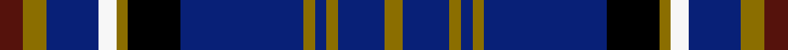
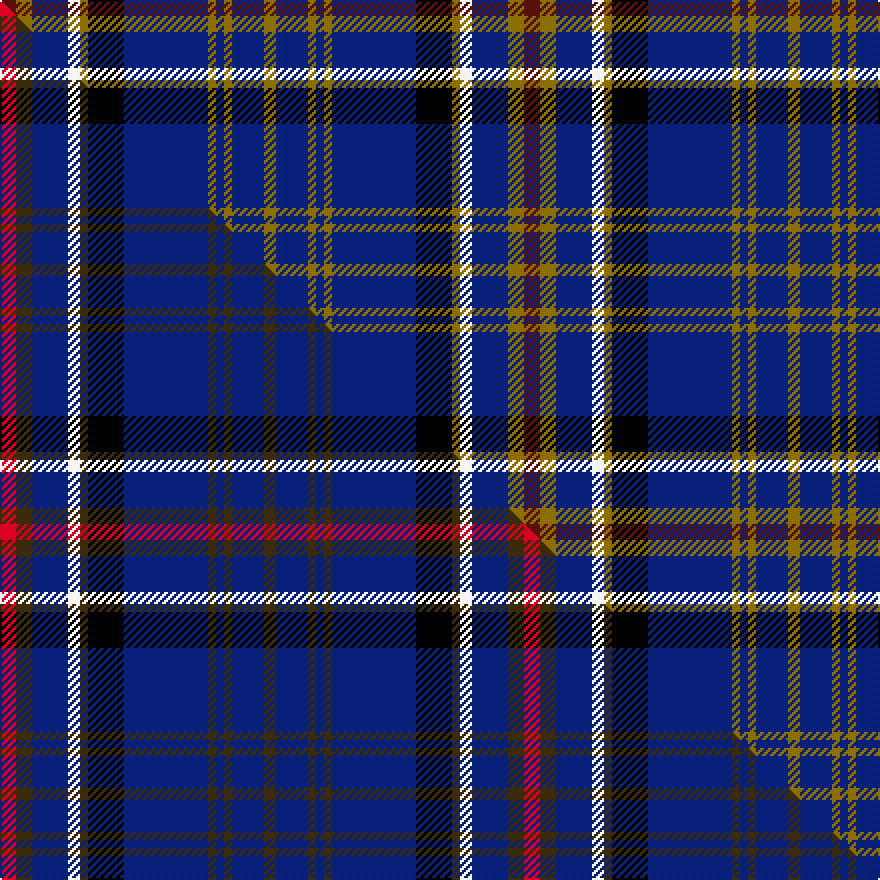

This is one **variant** — a specific cloth: this exact thread count and colourway, with its own
provenance below. It is one weaving of the [sett](/setts/dr4y4db9w3y2k9db21y2db2y2db8y3/) (the scale-free proportion — the
same cloth at any scale or shade), whose colour order is pattern [BGBWGKBGBGBG](/stripes/bgbwgkbgbgbg/).

Part of the [Ruxton Dress](/tartans/r/ru/ruxton-dress/) tartan — the named design grouping this sett with its other cloths.

Sourced from weddslist.  It is a [12 stripe tartan](/stripes/stripes12/).

Original link [http://www.weddslist.com/cgi-bin/tartans/pg.pl?source=sts](http://www.weddslist.com/cgi-bin/tartans/pg.pl?source=sts)

Dataset <small>— provenance for this record, inherited from the source manifest</small>

<dl class="dataset-prov">
<dt>source</dt><dd><a href="/sources/weddslist/">Weddslist</a></dd>
<dt>data captured from</dt><dd><a href="https://github.com/thetartan/tartan-database/blob/master/data/weddslist/data.csv">https://github.com/thetartan/tartan-database/blob/master/data/weddslist/data.csv</a></dd>
<dt>data date</dt><dd>2016-11-17 <small>(dataset default)</small></dd>
<dt>licence</dt><dd><a href="https://creativecommons.org/licenses/by-nc-nd/4.0/">CC BY-NC-ND 4.0</a></dd>
</dl>

Capture chain <small>— the hands this data passed through, oldest first; each capture carries its own licence</small>

<ol class="capture-chain">
<li><a href="https://www.weddslist.com/tartans/">Weddslist</a> <small>the living privately compiled reference</small></li>
<li><a href="https://github.com/thetartan/tartan-database">thetartan/tartan-database</a> <small>2016-2017</small> · <a href="https://creativecommons.org/licenses/by-nc-nd/4.0/">CC BY-NC-ND 4.0</a> <small>Levko Kravets's frozen compilation — the capture we vendored, and where its CC licence text came from</small></li>
<li>this dictionary <small>captured 2026-06-10 · commit 5bf86c7566</small> <small>each re-capture is a git commit to data/sources</small></li>
</ol>

## Thread count
DR/8 Y8 DB18 W6 Y4 K18 DB42 Y4 DB4 Y4 DB16 Y/6

One full sett is **262 threads**.

## Palette
<table><thead><tr><th>Colour</th><th>Shade</th><th>OKLCh</th></tr></thead><tbody><tr><td>DB</td><td><code style="background-color:#082077;">#082077</code> <small style="color:#888">#082077</small></td><td><small style="color:#888">oklch(30.0% 0.149 265.1)</small></td></tr><tr><td>DR</td><td><code style="background-color:#55120C;">#55120C</code> <small style="color:#888">#55120C</small></td><td><small style="color:#888">oklch(30.0% 0.099 29.3)</small></td></tr><tr><td>K</td><td><code style="background-color:#000000;">#000000</code> <small style="color:#888">#000000</small></td><td><small style="color:#888">oklch(0.0% 0.000 0.0)</small></td></tr><tr><td>W</td><td><code style="background-color:#F7F7F7;">#F7F7F7</code> <small style="color:#888">#F7F7F7</small></td><td><small style="color:#888">oklch(97.6% 0.000 89.9)</small></td></tr><tr><td>Y</td><td><code style="background-color:#8B6E00;">#8B6E00</code> <small style="color:#888">#8B6E00</small></td><td><small style="color:#888">oklch(55.1% 0.113 90.4)</small></td></tr></tbody></table>

# Sample pattern

## Compared to the master

This cloth is one sett of its design; the master sett (the exemplar the design is anchored on) is below for comparison.

Its **ΔTartan distance** from the master is **0.12** — the same measure the nearest-tartans table ranks by (0 is identical; a re-scale of the same cloth is near 0, a recolour or a different proportion further).

<figure class="master-compare" style="margin:0">

this sett
master sett ★

<figcaption style="color:#888;font-size:smaller">One weave of this sett against the <a href="/setts/r4dy4db9w3dy2k9db21dy2db2dy2db8dy3/">master sett ★</a>, split on the diagonal: a shared proportion runs seamlessly across it with only the shades shifting; a different proportion breaks on it.</figcaption>
</figure>

## Nearest tartan variants

The nearest existing variants by ΔTartan distance, with this cloth at the top so the swatches line up against it.

ΔTartan

Threads

Variant

Sett

—

262

<a href="/variants/s12/dr4y4db9w3y2k9db21y2db2y2db8y3~x2/">Ruxton, dress</a>

<a href="/ttd/edit/#slug=r4dy4db9w3dy2k9db21dy2db2dy2db8dy3~x2&amp;base=dr4y4db9w3y2k9db21y2db2y2db8y3~x2" title="compare in the TTD">0.12</a>

262

<a href="/variants/s12/r4dy4db9w3dy2k9db21dy2db2dy2db8dy3~x2/">Ruxton Dress</a>

<a href="/ttd/edit/#slug=y2db10k2r5k2db19k2db19g17k2y2~x2&amp;base=dr4y4db9w3y2k9db21y2db2y2db8y3~x2" title="compare in the TTD">1.52</a>

320

<a href="/variants/s11/y2db10k2r5k2db19k2db19g17k2y2~x2/">Montreat</a>

<a href="/ttd/edit/#slug=db8w2k8g12r2db3r2db24r2~x2&amp;base=dr4y4db9w3y2k9db21y2db2y2db8y3~x2" title="compare in the TTD">1.74</a>

232

<a href="/variants/s9/db8w2k8g12r2db3r2db24r2~x2/">Burt #2 (Name)</a>

<a href="/ttd/edit/#slug=db10k1g2k2lb3k2g2k1db10w1~x8&amp;base=dr4y4db9w3y2k9db21y2db2y2db8y3~x2" title="compare in the TTD">1.75</a>

456

<a href="/variants/s10/db10k1g2k2lb3k2g2k1db10w1~x8/">Isle of Harris</a>

<a href="/ttd/edit/#slug=dg4w1b4dr4k2b12k2b12k2dr4k4b4~x2&amp;base=dr4y4db9w3y2k9db21y2db2y2db8y3~x2" title="compare in the TTD">1.78</a>

204

<a href="/variants/s12/dg4w1b4dr4k2b12k2b12k2dr4k4b4~x2/">Otago Peninsula</a>

<a href="/ttd/edit/#slug=k5lb2b10lb2k5db15k2db15k5db10lb1y2~x2~b2105244-db1406275&amp;base=dr4y4db9w3y2k9db21y2db2y2db8y3~x2" title="compare in the TTD">2.04</a>

282

<a href="/variants/s12/k5lb2t10lb2k5db15k2db15k5db10lb1y2~x2~t2105244-db1406275/">Goodwin, Robert Richard (Personal)</a>

<a href="/ttd/edit/#slug=db20g3dy3db3r7g6db3k12db3k3db24w3~x2&amp;base=dr4y4db9w3y2k9db21y2db2y2db8y3~x2" title="compare in the TTD">2.06</a>

314

<a href="/variants/s12/db20g3dy3db3r7g6db3k12db3k3db24w3~x2/">Bhoyrub Clan/Family Tartan</a>

<a href="/ttd/edit/#slug=k7db2k6db18r3db18k4b2db2b2w2b4k4~x2&amp;base=dr4y4db9w3y2k9db21y2db2y2db8y3~x2" title="compare in the TTD">2.17</a>

274

<a href="/variants/s13/k7db2k6db18r3db18k4b2db2b2w2b4k4~x2/">Pride of Norway (Fashion)</a>

<a href="/ttd/edit/#slug=r3db21r3db3k13db13lb3db3w2~x2&amp;base=dr4y4db9w3y2k9db21y2db2y2db8y3~x2" title="compare in the TTD">2.27</a>

246

<a href="/variants/s9/r3db21r3db3k13db13lb3db3w2~x2/">Fitzgerald Blue Irish Family Tartan</a>

<a href="/ttd/edit/#slug=y2db3r2db19k7db6k22db6k7db19r2db3w2~x2&amp;base=dr4y4db9w3y2k9db21y2db2y2db8y3~x2" title="compare in the TTD">2.29</a>

392

<a href="/variants/s13/y2db3r2db19k7db6k22db6k7db19r2db3w2~x2/">MacIver of Strome (Personal)</a>

## Neighbour map

Every grey dot is one of 13621 variants placed by the first two principal components of the ΔTartan feature space (42% of its variance). Red is this tartan; blue dots are its nearest — click one to open its page.

<svg viewBox="0 0 640 380" role="img" style="max-width:100%;height:auto;border:1px solid #e0e0e0;border-radius:4px;display:block" xmlns="http://www.w3.org/2000/svg"><image href="/nn/cloud.v1.png" width="640" height="380"/><a href="/variants/s12/r4dy4db9w3dy2k9db21dy2db2dy2db8dy3~x2/"><circle cx="264.2" cy="150.3" r="4" fill="#3465a4"><title>Ruxton Dress</title></circle></a><a href="/variants/s11/y2db10k2r5k2db19k2db19g17k2y2~x2/"><circle cx="256.9" cy="152.6" r="4" fill="#3465a4"><title>Montreat</title></circle></a><a href="/variants/s9/db8w2k8g12r2db3r2db24r2~x2/"><circle cx="239.4" cy="145.5" r="4" fill="#3465a4"><title>Burt #2 (Name)</title></circle></a><a href="/variants/s10/db10k1g2k2lb3k2g2k1db10w1~x8/"><circle cx="244.0" cy="146.3" r="4" fill="#3465a4"><title>Isle of Harris</title></circle></a><a href="/variants/s12/dg4w1b4dr4k2b12k2b12k2dr4k4b4~x2/"><circle cx="239.8" cy="154.5" r="4" fill="#3465a4"><title>Otago Peninsula</title></circle></a><a href="/variants/s12/k5lb2t10lb2k5db15k2db15k5db10lb1y2~x2~t2105244-db1406275/"><circle cx="237.5" cy="146.9" r="4" fill="#3465a4"><title>Goodwin, Robert Richard (Personal)</title></circle></a><a href="/variants/s12/db20g3dy3db3r7g6db3k12db3k3db24w3~x2/"><circle cx="226.1" cy="141.1" r="4" fill="#3465a4"><title>Bhoyrub Clan/Family Tartan</title></circle></a><a href="/variants/s13/k7db2k6db18r3db18k4b2db2b2w2b4k4~x2/"><circle cx="224.7" cy="141.2" r="4" fill="#3465a4"><title>Pride of Norway (Fashion)</title></circle></a><a href="/variants/s9/r3db21r3db3k13db13lb3db3w2~x2/"><circle cx="280.6" cy="154.4" r="4" fill="#3465a4"><title>Fitzgerald Blue Irish Family Tartan</title></circle></a><a href="/variants/s13/y2db3r2db19k7db6k22db6k7db19r2db3w2~x2/"><circle cx="269.4" cy="144.2" r="4" fill="#3465a4"><title>MacIver of Strome (Personal)</title></circle></a><circle cx="250.3" cy="146.7" r="5" fill="#c00000"/><text x="320" y="376" text-anchor="middle" font-size="11" fill="#999">ground</text><text x="11" y="190" text-anchor="middle" font-size="11" fill="#999" transform="rotate(-90 11 190)">complexity</text></svg>

ID: /variants/s12/dr4y4db9w3y2k9db21y2db2y2db8y3~x2/
