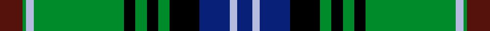

This page is one **sett** — a single exact thread-count. It belongs to the [tartan](/setts/dr6g1lb2g24k3g3k3g3k8db8lb2db4/)
(the same proportion at any scale), whose colour order is pattern [BGWGKGKGKBWB](/stripes/bgwgkgkgkbwb/).

Sourced from register-of-tartans.  It is a [12 stripe tartan](/stripes/stripes12/).

Original link [https://www.tartanregister.gov.uk/tartanDetails.aspx?ref=1953](https://www.tartanregister.gov.uk/tartanDetails.aspx?ref=1953)

Dataset <small>— provenance for this record, inherited from the source manifest</small>

<dl class="dataset-prov">
<dt>source</dt><dd><a href="/sources/register-of-tartans/">Scottish Register of Tartans</a></dd>
<dt>data captured from</dt><dd><a href="https://github.com/thetartan/tartan-database/blob/master/data/register-of-tartans/data.csv">https://github.com/thetartan/tartan-database/blob/master/data/register-of-tartans/data.csv</a></dd>
<dt>data date</dt><dd>2002 <small>(this record)</small></dd>
<dt>licence</dt><dd><a href="https://www.tartanregister.gov.uk/copyright">Crown copyright</a></dd>
</dl>

Capture chain <small>— the hands this data passed through, oldest first; each capture carries its own licence</small>

<ol class="capture-chain">
<li><a href="https://www.tartanregister.gov.uk/">Scottish Register of Tartans</a> · <a href="https://www.tartanregister.gov.uk/copyright">Crown copyright</a> <small>the living register — still published by National Records of Scotland</small></li>
<li><a href="https://github.com/thetartan/tartan-database">thetartan/tartan-database</a> <small>2016-2017</small> · <a href="https://creativecommons.org/licenses/by-nc-nd/4.0/">CC BY-NC-ND 4.0</a> <small>Levko Kravets's frozen compilation — the capture we vendored, and where its CC licence text came from</small></li>
<li>this dictionary <small>captured 2026-06-10 · commit 5bf86c7566</small> <small>each re-capture is a git commit to data/sources</small></li>
</ol>

## Register references

External register numbers recorded for this tartan.

- Scottish Register of Tartans: [1953](https://www.tartanregister.gov.uk/tartanDetails.aspx?ref=1953)
- Scottish Tartans Authority (ITI): 4113

## Thread count
DR/12 G2 LB4 G48 K6 G6 K6 G6 K16 DB16 LB4 DB/8

One full sett is **248 threads**.

## Palette
<table><thead><tr><th>Colour</th><th>Shade</th><th>OKLCh</th></tr></thead><tbody><tr><td>DB</td><td><code style="background-color:#082077;">#082077</code> <small style="color:#888">#082077</small></td><td><small style="color:#888">oklch(30.0% 0.149 265.1)</small></td></tr><tr><td>DR</td><td><code style="background-color:#55120C;">#55120C</code> <small style="color:#888">#55120C</small></td><td><small style="color:#888">oklch(30.0% 0.099 29.3)</small></td></tr><tr><td>G</td><td><code style="background-color:#008B2A;">#008B2A</code> <small style="color:#888">#008B2A</small></td><td><small style="color:#888">oklch(55.4% 0.170 145.9)</small></td></tr><tr><td>K</td><td><code style="background-color:#000000;">#000000</code> <small style="color:#888">#000000</small></td><td><small style="color:#888">oklch(0.0% 0.000 0.0)</small></td></tr><tr><td>LB</td><td><code style="background-color:#B5BBDE;">#B5BBDE</code> <small style="color:#888">#B5BBDE</small></td><td><small style="color:#888">oklch(79.9% 0.050 277.6)</small></td></tr></tbody></table>

# Sample pattern

## Nearest tartan variants

The nearest existing variants by ΔTartan distance, with this cloth at the top so the swatches line up against it.

ΔTartan

Threads

Variant

Sett

—

248

<a href="/variants/s12/dr6g1lb2g24k3g3k3g3k8db8lb2db4~x2/">Kerby/Kirby</a>

<a href="/ttd/edit/#slug=g6w2g24k12db3k2db2k2db12r1db1r3~x2&amp;base=dr6g1lb2g24k3g3k3g3k8db8lb2db4~x2" title="compare in the TTD">1.76</a>

262

<a href="/variants/s12/g6w2g24k12db3k2db2k2db12r1db1r3~x2/">Sutherland (Clan)</a>

<a href="/ttd/edit/#slug=g6w2g24k12db3k2db2k2db12r1db1r3&amp;base=dr6g1lb2g24k3g3k3g3k8db8lb2db4~x2" title="compare in the TTD">1.76</a>

131

<a href="/variants/s12/g6w2g24k12db3k2db2k2db12r1db1r3/">Sutherland</a>

<a href="/ttd/edit/#slug=k4g34y1k18g3db18r3g3r3~x2&amp;base=dr6g1lb2g24k3g3k3g3k8db8lb2db4~x2" title="compare in the TTD">1.82</a>

334

<a href="/variants/s9/k4g34y1k18g3db18r3g3r3~x2/">John.W.Mackay, Restricted</a>

<a href="/ttd/edit/#slug=g16k1lb2k1g3k5db12k1y1k3~x4&amp;base=dr6g1lb2g24k3g3k3g3k8db8lb2db4~x2" title="compare in the TTD">1.90</a>

284

<a href="/variants/s10/g16k1lb2k1g3k5db12k1y1k3~x4/">Hope-Vere (Lochcarron)</a>

<a href="/ttd/edit/#slug=k4g35lo1k18g3db18dr3g3dr3~x2&amp;base=dr6g1lb2g24k3g3k3g3k8db8lb2db4~x2" title="compare in the TTD">1.92</a>

338

<a href="/variants/s9/k4g35lo1k18g3db18dr3g3dr3~x2/">Mackay, John W. (Personal)</a>

<a href="/ttd/edit/#slug=k20r3db10g3db5g25k1g1w3g1k1g25db5g3db10r1db2~x2&amp;base=dr6g1lb2g24k3g3k3g3k8db8lb2db4~x2" title="compare in the TTD">1.94</a>

432

<a href="/variants/s17/k20r3db10g3db5g25k1g1w3g1k1g25db5g3db10r1db2~x2/">Blairlogie, or Blair Athol</a>

<a href="/ttd/edit/#slug=g45w2r3k15r3db15r3db15~x2&amp;base=dr6g1lb2g24k3g3k3g3k8db8lb2db4~x2" title="compare in the TTD">1.99</a>

284

<a href="/variants/s8/g45w2r3k15r3db15r3db15~x2/">MacNeil 3</a>

<a href="/ttd/edit/#slug=db2w1db12k1db2k1db4k12g24k1g2r1~x2&amp;base=dr6g1lb2g24k3g3k3g3k8db8lb2db4~x2" title="compare in the TTD">2.00</a>

246

<a href="/variants/s12/db2w1db12k1db2k1db4k12g24k1g2r1~x2/">Urquhart</a>

<a href="/ttd/edit/#slug=r3db16k16g4k2g2k2g34r4g3r2g3~x2&amp;base=dr6g1lb2g24k3g3k3g3k8db8lb2db4~x2" title="compare in the TTD">2.00</a>

352

<a href="/variants/s12/r3db16k16g4k2g2k2g34r4g3r2g3~x2/">Park</a>

<a href="/ttd/edit/#slug=k20y3db10g3db5g25k1g1w3g1k1g25db5g3db10y1db2~x4&amp;base=dr6g1lb2g24k3g3k3g3k8db8lb2db4~x2" title="compare in the TTD">2.00</a>

864

<a href="/variants/s17/k20y3db10g3db5g25k1g1w3g1k1g25db5g3db10y1db2~x4/">Blairgowrie</a>

## Neighbour map

Every grey dot is one of 13621 variants placed by the first two principal components of the ΔTartan feature space (42% of its variance). Red is this tartan; blue dots are its nearest — click one to open its page.

<svg viewBox="0 0 640 380" role="img" style="max-width:100%;height:auto;border:1px solid #e0e0e0;border-radius:4px;display:block" xmlns="http://www.w3.org/2000/svg"><image href="/nn/cloud.v1.png" width="640" height="380"/><a href="/variants/s12/g6w2g24k12db3k2db2k2db12r1db1r3~x2/"><circle cx="187.9" cy="102.8" r="4" fill="#3465a4"><title>Sutherland (Clan)</title></circle></a><a href="/variants/s12/g6w2g24k12db3k2db2k2db12r1db1r3/"><circle cx="187.9" cy="102.8" r="4" fill="#3465a4"><title>Sutherland</title></circle></a><a href="/variants/s9/k4g34y1k18g3db18r3g3r3~x2/"><circle cx="216.5" cy="100.4" r="4" fill="#3465a4"><title>John.W.Mackay, Restricted</title></circle></a><a href="/variants/s10/g16k1lb2k1g3k5db12k1y1k3~x4/"><circle cx="178.1" cy="126.9" r="4" fill="#3465a4"><title>Hope-Vere (Lochcarron)</title></circle></a><a href="/variants/s9/k4g35lo1k18g3db18dr3g3dr3~x2/"><circle cx="227.8" cy="102.7" r="4" fill="#3465a4"><title>Mackay, John W. (Personal)</title></circle></a><a href="/variants/s17/k20r3db10g3db5g25k1g1w3g1k1g25db5g3db10r1db2~x2/"><circle cx="211.5" cy="84.9" r="4" fill="#3465a4"><title>Blairlogie, or Blair Athol</title></circle></a><a href="/variants/s8/g45w2r3k15r3db15r3db15~x2/"><circle cx="203.3" cy="124.1" r="4" fill="#3465a4"><title>MacNeil 3</title></circle></a><a href="/variants/s12/db2w1db12k1db2k1db4k12g24k1g2r1~x2/"><circle cx="200.3" cy="93.2" r="4" fill="#3465a4"><title>Urquhart</title></circle></a><a href="/variants/s12/r3db16k16g4k2g2k2g34r4g3r2g3~x2/"><circle cx="235.1" cy="120.4" r="4" fill="#3465a4"><title>Park</title></circle></a><a href="/variants/s17/k20y3db10g3db5g25k1g1w3g1k1g25db5g3db10y1db2~x4/"><circle cx="216.2" cy="88.5" r="4" fill="#3465a4"><title>Blairgowrie</title></circle></a><circle cx="193.8" cy="106.7" r="5" fill="#c00000"/><text x="320" y="376" text-anchor="middle" font-size="11" fill="#999">ground</text><text x="11" y="190" text-anchor="middle" font-size="11" fill="#999" transform="rotate(-90 11 190)">complexity</text></svg>

ID: /variants/s12/dr6g1lb2g24k3g3k3g3k8db8lb2db4~x2/
