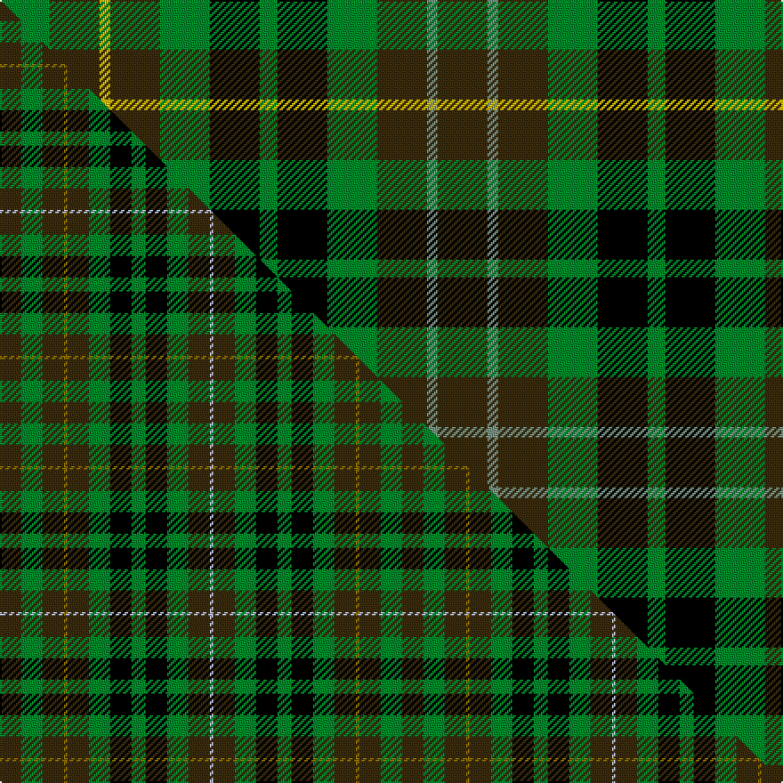

This is one **variant** — a specific cloth: this exact thread count and colourway, with its own
provenance below. It is one weaving of the [sett](/setts/dy14y3dy14g14k14g5k14g14dy14ly3dy14g14/) (the scale-free proportion — the
same cloth at any scale or shade), whose colour order is pattern [GGGGKGKGGYGG](/stripes/ggggkgkggygg/).

Part of the [Buchanan Hunting](/tartans/b/bu/buchanan-hunting/) tartan — the named design grouping this sett with its other cloths.

Sourced from register-of-tartans.  It is a [12 stripe tartan](/stripes/stripes12/).

Original link [https://www.tartanregister.gov.uk/tartanDetails.aspx?ref=426](https://www.tartanregister.gov.uk/tartanDetails.aspx?ref=426)

Dataset <small>— provenance for this record, inherited from the source manifest</small>

<dl class="dataset-prov">
<dt>source</dt><dd><a href="/sources/register-of-tartans/">Scottish Register of Tartans</a></dd>
<dt>data captured from</dt><dd><a href="https://github.com/thetartan/tartan-database/blob/master/data/register-of-tartans/data.csv">https://github.com/thetartan/tartan-database/blob/master/data/register-of-tartans/data.csv</a></dd>
<dt>data date</dt><dd>2002 <small>(this record)</small></dd>
<dt>licence</dt><dd><a href="https://www.tartanregister.gov.uk/copyright">Crown copyright</a></dd>
</dl>

Capture chain <small>— the hands this data passed through, oldest first; each capture carries its own licence</small>

<ol class="capture-chain">
<li><a href="https://www.tartanregister.gov.uk/">Scottish Register of Tartans</a> · <a href="https://www.tartanregister.gov.uk/copyright">Crown copyright</a> <small>the living register — still published by National Records of Scotland</small></li>
<li><a href="https://github.com/thetartan/tartan-database">thetartan/tartan-database</a> <small>2016-2017</small> · <a href="https://creativecommons.org/licenses/by-nc-nd/4.0/">CC BY-NC-ND 4.0</a> <small>Levko Kravets's frozen compilation — the capture we vendored, and where its CC licence text came from</small></li>
<li>this dictionary <small>captured 2026-06-10 · commit 5bf86c7566</small> <small>each re-capture is a git commit to data/sources</small></li>
</ol>

## Register references

External register numbers recorded for this tartan.

- Scottish Register of Tartans: [426](https://www.tartanregister.gov.uk/tartanDetails.aspx?ref=426)
- Scottish Tartans Authority (ITI): 4059

## Thread count
G/28 DY28 LY6 DY28 G28 K28 G10 K28 G28 DY28 Y6 DY/28

One full sett is **492 threads**.

## Palette
<table><thead><tr><th>Colour</th><th>Shade</th><th>OKLCh</th></tr></thead><tbody><tr><td>LB</td><td><code style="background-color:#B5BBDE;">#B5BBDE</code> <small style="color:#888">#B5BBDE</small></td><td><small style="color:#888">oklch(79.9% 0.050 277.6)</small></td></tr><tr><td>G</td><td><code style="background-color:#008B2A;">#008B2A</code> <small style="color:#888">#008B2A</small></td><td><small style="color:#888">oklch(55.4% 0.170 145.9)</small></td></tr><tr><td>K</td><td><code style="background-color:#000000;">#000000</code> <small style="color:#888">#000000</small></td><td><small style="color:#888">oklch(0.0% 0.000 0.0)</small></td></tr><tr><td>Y</td><td><code style="background-color:#789484;">#789484</code> <small style="color:#888">#789484</small></td><td><small style="color:#888">oklch(64.0% 0.040 160.0)</small></td></tr><tr><td>DY</td><td><code style="background-color:#3A2B0D;">#3A2B0D</code> <small style="color:#888">#3A2B0D</small></td><td><small style="color:#888">oklch(30.0% 0.049 82.0)</small></td></tr><tr><td>LY</td><td><code style="background-color:#E8C000;">#E8C000</code> <small style="color:#888">#E8C000</small></td><td><small style="color:#888">oklch(81.9% 0.168 93.7)</small></td></tr></tbody></table>

# Sample pattern

## Compared to the master

This cloth is one sett of its design; the master sett (the exemplar the design is anchored on) is below for comparison.

Its **ΔTartan distance** from the master is **0.65** — the same measure the nearest-tartans table ranks by (0 is identical; a re-scale of the same cloth is near 0, a recolour or a different proportion further).

<figure class="master-compare" style="margin:0">

this sett
master sett ★

<figcaption style="color:#888;font-size:smaller">One weave of this sett against the <a href="/setts/dy6g6dy6y1dy6g6k6g4k6g6dy6lb1/">master sett ★</a>, split on the diagonal: a shared proportion runs seamlessly across it with only the shades shifting; a different proportion breaks on it.</figcaption>
</figure>

## Nearest tartan variants

The nearest existing variants by ΔTartan distance, with this cloth at the top so the swatches line up against it.

ΔTartan

Threads

Variant

Sett

—

492

<a href="/variants/s12/dy14y3dy14g14k14g5k14g14dy14ly3dy14g14~x2~y2602166-ly3307090/">Buchanan Hunting #2</a>

<a href="/ttd/edit/#slug=dy6g6dy6y1dy6g6k6g4k6g6dy6lb1~x4&amp;base=dy14y3dy14g14k14g5k14g14dy14ly3dy14g14~x2~y2602166-ly3307090" title="compare in the TTD">0.65</a>

452

<a href="/variants/s12/dy6g6dy6y1dy6g6k6g4k6g6dy6lb1~x4/">Buchanan Hunting (Scott Adie)</a>

<a href="/ttd/edit/#slug=dy6g6dy6y1dy6g6k6g4k6g6dy6lb1~x2&amp;base=dy14y3dy14g14k14g5k14g14dy14ly3dy14g14~x2~y2602166-ly3307090" title="compare in the TTD">0.65</a>

226

<a href="/variants/s12/dy6g6dy6y1dy6g6k6g4k6g6dy6lb1~x2/">Buchanan Hunting Clan Tartan</a>

<a href="/ttd/edit/#slug=dy3g3dy3lo1dy3g3k3g3k3g3dy3lb2~x8&amp;base=dy14y3dy14g14k14g5k14g14dy14ly3dy14g14~x2~y2602166-ly3307090" title="compare in the TTD">1.09</a>

488

<a href="/variants/s12/dy3g3dy3lo1dy3g3k3g3k3g3dy3lb2~x8/">Buchanan Hunting (Scott Adie) #2</a>

<a href="/ttd/edit/#slug=dp6k6dg6w1dg6k6dg6w1dg6k6dp6g1~x4~dp1607327-dg1806142-w3600000-g1903114&amp;base=dy14y3dy14g14k14g5k14g14dy14ly3dy14g14~x2~y2602166-ly3307090" title="compare in the TTD">2.75</a>

428

<a href="/variants/s12/dp6k6dg6w1dg6k6dg6w1dg6k6dp6g1~x4~dp1607327-dg1806142-w3600000-g1903114/">Wilson's No.233</a>

<a href="/ttd/edit/#slug=k21g21r4g21k21g21y4g21k21db21k3db21~x2&amp;base=dy14y3dy14g14k14g5k14g14dy14ly3dy14g14~x2~y2602166-ly3307090" title="compare in the TTD">2.78</a>

716

<a href="/variants/s12/k21g21r4g21k21g21y4g21k21db21k3db21~x2/">Rollo</a>

<a href="/ttd/edit/#slug=db9g3db9k4g10r4g10k6g2k7g2k7g2k6g10y4g10k8~x2&amp;base=dy14y3dy14g14k14g5k14g14dy14ly3dy14g14~x2~y2602166-ly3307090" title="compare in the TTD">2.83</a>

418

<a href="/variants/s18/db9g3db9k4g10r4g10k6g2k7g2k7g2k6g10y4g10k8~x2/">Stuart/Stewart Hunting Plaid</a>

<a href="/ttd/edit/#slug=k15g15y3g15k15g15r3g15k15db15k2db15~x2&amp;base=dy14y3dy14g14k14g5k14g14dy14ly3dy14g14~x2~y2602166-ly3307090" title="compare in the TTD">2.87</a>

512

<a href="/variants/s12/k15g15y3g15k15g15r3g15k15db15k2db15~x2/">Rollo Family Tartan</a>

<a href="/ttd/edit/#slug=r2db4k4g4w1g4k4g4w1~x4&amp;base=dy14y3dy14g14k14g5k14g14dy14ly3dy14g14~x2~y2602166-ly3307090" title="compare in the TTD">2.90</a>

212

<a href="/variants/s9/r2db4k4g4w1g4k4g4w1~x4/">Arrol</a>

<a href="/ttd/edit/#slug=db5k3r4g9w2g9k9g9w2g9k9y7k3~x2&amp;base=dy14y3dy14g14k14g5k14g14dy14ly3dy14g14~x2~y2602166-ly3307090" title="compare in the TTD">2.96</a>

304

<a href="/variants/s13/db5k3r4g9w2g9k9g9w2g9k9y7k3~x2/">Graham-Maila (Personal)</a>

<a href="/ttd/edit/#slug=k2t1g6t2g2k4g5ly1g5k4db4k2db2~x4&amp;base=dy14y3dy14g14k14g5k14g14dy14ly3dy14g14~x2~y2602166-ly3307090" title="compare in the TTD">2.97</a>

304

<a href="/variants/s13/k2t1g6t2g2k4g5ly1g5k4db4k2db2~x4/">Gordon Dress (US Fashion)</a>

## Neighbour map

Every grey dot is one of 13621 variants placed by the first two principal components of the ΔTartan feature space (42% of its variance). Red is this tartan; blue dots are its nearest — click one to open its page. The map is a flat projection of a many-dimensional space — [how to read it](/posts/neighbourhood-maps/).

<svg viewBox="0 0 640 380" role="img" style="max-width:100%;height:auto;border:1px solid #e0e0e0;border-radius:4px;display:block" xmlns="http://www.w3.org/2000/svg"><image href="/nn/cloud.v1.png" width="640" height="380"/><a href="/variants/s12/dy6g6dy6y1dy6g6k6g4k6g6dy6lb1~x4/"><circle cx="109.7" cy="235.5" r="4" fill="#3465a4"><title>Buchanan Hunting (Scott Adie)</title></circle></a><a href="/variants/s12/dy6g6dy6y1dy6g6k6g4k6g6dy6lb1~x2/"><circle cx="109.7" cy="235.5" r="4" fill="#3465a4"><title>Buchanan Hunting Clan Tartan</title></circle></a><a href="/variants/s12/dy3g3dy3lo1dy3g3k3g3k3g3dy3lb2~x8/"><circle cx="32.7" cy="285.5" r="4" fill="#3465a4"><title>Buchanan Hunting (Scott Adie) #2</title></circle></a><a href="/variants/s12/dp6k6dg6w1dg6k6dg6w1dg6k6dp6g1~x4~dp1607327-dg1806142-w3600000-g1903114/"><circle cx="108.3" cy="215.6" r="4" fill="#3465a4"><title>Wilson's No.233</title></circle></a><a href="/variants/s12/k21g21r4g21k21g21y4g21k21db21k3db21~x2/"><circle cx="104.9" cy="211.8" r="4" fill="#3465a4"><title>Rollo</title></circle></a><a href="/variants/s18/db9g3db9k4g10r4g10k6g2k7g2k7g2k6g10y4g10k8~x2/"><circle cx="88.1" cy="204.5" r="4" fill="#3465a4"><title>Stuart/Stewart Hunting Plaid</title></circle></a><a href="/variants/s12/k15g15y3g15k15g15r3g15k15db15k2db15~x2/"><circle cx="106.3" cy="209.5" r="4" fill="#3465a4"><title>Rollo Family Tartan</title></circle></a><a href="/variants/s9/r2db4k4g4w1g4k4g4w1~x4/"><circle cx="71.9" cy="245.8" r="4" fill="#3465a4"><title>Arrol</title></circle></a><a href="/variants/s13/db5k3r4g9w2g9k9g9w2g9k9y7k3~x2/"><circle cx="65.2" cy="203.4" r="4" fill="#3465a4"><title>Graham-Maila (Personal)</title></circle></a><a href="/variants/s13/k2t1g6t2g2k4g5ly1g5k4db4k2db2~x4/"><circle cx="109.1" cy="206.7" r="4" fill="#3465a4"><title>Gordon Dress (US Fashion)</title></circle></a><circle cx="102.1" cy="240.4" r="5" fill="#c00000"/><text x="320" y="376" text-anchor="middle" font-size="11" fill="#999">ground</text><text x="11" y="190" text-anchor="middle" font-size="11" fill="#999" transform="rotate(-90 11 190)">complexity</text></svg>

ID: /variants/s12/dy14y3dy14g14k14g5k14g14dy14ly3dy14g14~x2~y2602166-ly3307090/
