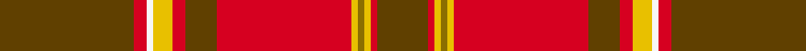

This page is one **sett** — a single exact thread-count. It belongs to the [tartan](/setts/dy21r2w1ly3r2dy5r21ly1y1ly1r1dy8/)
(the same proportion at any scale), whose colour order is pattern [GRWYRGRYGYRG](/stripes/grwyrgrygyrg/).

Sourced from house-of-tartan.  It is a [12 stripe tartan](/stripes/stripes12/).

Original link http://www.house-of-tartan.scotland.net/house/TartanViewjs.asp?colr=Def&tnam=2293

## Provenance

Earliest known date: 1989 A copyright design created for the Glendronach Company.

## Thread count
DY/42 R4 W2 LY6 R4 DY10 R42 LY2 Y2 LY2 R2 DY/16

One full sett is **210 threads**.

## Palette
<table><thead><tr><th>Colour</th><th>Shade</th><th>OKLCh</th></tr></thead><tbody><tr><td>LN</td><td><code style="background-color:#F7F7F7;">#F7F7F7</code> <small style="color:#888">#F7F7F7</small></td><td><small style="color:#888">oklch(97.6% 0.000 89.9)</small></td></tr><tr><td>R</td><td><code style="background-color:#D60020;">#D60020</code> <small style="color:#888">#D60020</small></td><td><small style="color:#888">oklch(55.2% 0.224 25.5)</small></td></tr><tr><td>T</td><td><code style="background-color:#604000;">#604000</code> <small style="color:#888">#604000</small></td><td><small style="color:#888">oklch(39.8% 0.083 76.8)</small></td></tr><tr><td>Y</td><td><code style="background-color:#E8C000;">#E8C000</code> <small style="color:#888">#E8C000</small></td><td><small style="color:#888">oklch(81.9% 0.168 93.7)</small></td></tr><tr><td>Ya</td><td><code style="background-color:#8B6E00;">#8B6E00</code> <small style="color:#888">#8B6E00</small></td><td><small style="color:#888">oklch(55.1% 0.113 90.4)</small></td></tr></tbody></table>

# Sample pattern

ID: /variants/s12/dy21r2w1ly3r2dy5r21ly1y1ly1r1dy8~x2~dy1603076-ly3307090/
