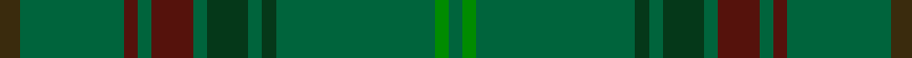

This is one **variant** — a specific cloth: this exact thread count and colourway, with its own
provenance below. It is one weaving of the [sett](/tartans/i/in/insead/) (the scale-free proportion — the
same cloth at any scale or shade), whose colour order is pattern [GGBGBGGGGGGG](/stripes/ggbgbggggggg/).

Part of the [INSEAD](/tartans/i/in/insead/) tartan — the named design grouping this sett with its other cloths.

Sourced from register-of-tartans.  It is a [12 stripe tartan](/stripes/stripes12/).

Original link [https://www.tartanregister.gov.uk/tartanDetails.aspx?ref=11527](https://www.tartanregister.gov.uk/tartanDetails.aspx?ref=11527)

Dataset <small>— provenance for this record, inherited from the source manifest</small>

<dl class="dataset-prov">
<dt>source</dt><dd><a href="/sources/register-of-tartans/">Scottish Register of Tartans</a></dd>
<dt>data captured from</dt><dd><a href="https://github.com/thetartan/tartan-database/blob/master/data/register-of-tartans/data.csv">https://github.com/thetartan/tartan-database/blob/master/data/register-of-tartans/data.csv</a></dd>
<dt>data date</dt><dd>07/03/2016 <small>(this record)</small></dd>
<dt>licence</dt><dd><a href="https://www.tartanregister.gov.uk/copyright">Crown copyright</a></dd>
</dl>

Capture chain <small>— the hands this data passed through, oldest first; each capture carries its own licence</small>

<ol class="capture-chain">
<li><a href="https://www.tartanregister.gov.uk/">Scottish Register of Tartans</a> · <a href="https://www.tartanregister.gov.uk/copyright">Crown copyright</a> <small>the living register — still published by National Records of Scotland</small></li>
<li><a href="https://github.com/thetartan/tartan-database">thetartan/tartan-database</a> <small>2016-2017</small> · <a href="https://creativecommons.org/licenses/by-nc-nd/4.0/">CC BY-NC-ND 4.0</a> <small>Levko Kravets's frozen compilation — the capture we vendored, and where its CC licence text came from</small></li>
<li>this dictionary <small>captured 2026-06-10 · commit 5bf86c7566</small> <small>each re-capture is a git commit to data/sources</small></li>
</ol>

## Register references

External register numbers recorded for this tartan.

- Scottish Register of Tartans: [11527](https://www.tartanregister.gov.uk/tartanDetails.aspx?ref=11527)

## Thread count
DY/6 DGi30 DR4 DGi4 DR12 DGi4 DG12 DGi4 DG4 DGi46 G4 DGi/4

One full sett is **258 threads**.

## Palette
<table><thead><tr><th>Colour</th><th>Shade</th><th>OKLCh</th></tr></thead><tbody><tr><td>DG</td><td><code style="background-color:#053819;">#053819</code> <small style="color:#888">#053819</small></td><td><small style="color:#888">oklch(30.0% 0.075 151.3)</small></td></tr><tr><td>DR</td><td><code style="background-color:#55120C;">#55120C</code> <small style="color:#888">#55120C</small></td><td><small style="color:#888">oklch(30.0% 0.099 29.3)</small></td></tr><tr><td>DY</td><td><code style="background-color:#3A2B0D;">#3A2B0D</code> <small style="color:#888">#3A2B0D</small></td><td><small style="color:#888">oklch(30.0% 0.049 82.0)</small></td></tr><tr><td>DG</td><td><code style="background-color:#00643C;">#00643C</code> <small style="color:#888">#00643C</small></td><td><small style="color:#888">oklch(44.3% 0.104 157.7)</small></td></tr><tr><td>G</td><td><code style="background-color:#008B00;">#008B00</code> <small style="color:#888">#008B00</small></td><td><small style="color:#888">oklch(55.2% 0.188 142.5)</small></td></tr></tbody></table>

# Sample pattern

## Nearest tartan variants

The nearest existing variants by ΔTartan distance, with this cloth at the top so the swatches line up against it.

ΔTartan

Threads

Variant

Sett

—

258

<a href="/variants/s12/dy3dgi15dr2dgi2dr6dgi2dg6dgi2dg2dgi23g2dgi2~x2~dgi4410159-g5519141/">INSEAD</a>

<a href="/ttd/edit/#slug=dgi3lo1dgi3r1dgi14dg2dgi3dg1dgi3g1dgi2g1dgi2g2~x4~dgi4514144-g5408159&amp;base=dy3dgi15dr2dgi2dr6dgi2dg6dgi2dg2dgi23g2dgi2~x2~dgi4410159-g5519141" title="compare in the TTD">2.76</a>

292

<a href="/variants/s14/dgi3lo1dgi3r1dgi14dg2dgi3dg1dgi3g1dgi2g1dgi2g2~x4~dgi4514144-g5408159/">New South Wales</a>

## Neighbour map

Every grey dot is one of 13662 variants placed by the first two principal components of the ΔTartan feature space (42% of its variance). Red is this tartan; blue dots are its nearest — click one to open its page. The map is a flat projection of a many-dimensional space — [how to read it](/posts/neighbourhood-maps/).

<svg viewBox="0 0 640 380" role="img" style="max-width:100%;height:auto;border:1px solid #e0e0e0;border-radius:4px;display:block" xmlns="http://www.w3.org/2000/svg"><image href="/nn/cloud.v1.png" width="640" height="380"/><a href="/variants/s14/dgi3lo1dgi3r1dgi14dg2dgi3dg1dgi3g1dgi2g1dgi2g2~x4~dgi4514144-g5408159/"><circle cx="583.3" cy="191.2" r="4" fill="#3465a4"><title>New South Wales</title></circle></a><circle cx="560.5" cy="224.8" r="5" fill="#c00000"/><text x="320" y="376" text-anchor="middle" font-size="11" fill="#999">ground</text><text x="11" y="190" text-anchor="middle" font-size="11" fill="#999" transform="rotate(-90 11 190)">complexity</text></svg>

ID: /variants/s12/dy3dgi15dr2dgi2dr6dgi2dg6dgi2dg2dgi23g2dgi2~x2~dgi4410159-g5519141/
