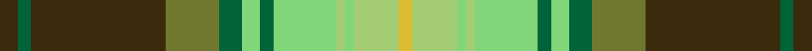

This page is one **sett** — a single exact thread-count. It belongs to the [tartan](/setts/dy4dg3dy30y12dg5lg4dg3lg14lgi2lg2lgi10ly3/)
(the same proportion at any scale), whose colour order is pattern [GGGGGYGYYYYY](/stripes/gggggygyyyyy/).

Sourced from register-of-tartans.  It is a [12 stripe tartan](/stripes/stripes12/).

Original link https://www.tartanregister.gov.uk/tartanDetails.aspx?ref=3783

## Register references

External register numbers recorded for this tartan.

- Scottish Register of Tartans: [3783](https://www.tartanregister.gov.uk/tartanDetails.aspx?ref=3783)
- Scottish Tartans Authority (ITI): 7259

## Thread count
DY/8 DG6 DY60 Y24 DG10 LG8 DG6 LG28 LGi4 LG4 LGi20 LY/6

One full sett is **354 threads**.

## Palette
<table><thead><tr><th>Colour</th><th>Shade</th><th>OKLCh</th></tr></thead><tbody><tr><td>Y</td><td><code style="background-color:#8B6E00;">#8B6E00</code> <small style="color:#888">#8B6E00</small></td><td><small style="color:#888">oklch(55.1% 0.113 90.4)</small></td></tr><tr><td>DG</td><td><code style="background-color:#006438;">#006438</code> <small style="color:#888">#006438</small></td><td><small style="color:#888">oklch(44.2% 0.108 155.6)</small></td></tr><tr><td>G</td><td><code style="background-color:#087020;">#087020</code> <small style="color:#888">#087020</small></td><td><small style="color:#888">oklch(47.5% 0.144 145.4)</small></td></tr><tr><td>Y</td><td><code style="background-color:#707830;">#707830</code> <small style="color:#888">#707830</small></td><td><small style="color:#888">oklch(55.0% 0.096 114.9)</small></td></tr><tr><td>DG</td><td><code style="background-color:#283C24;">#283C24</code> <small style="color:#888">#283C24</small></td><td><small style="color:#888">oklch(33.2% 0.048 140.3)</small></td></tr><tr><td>LG</td><td><code style="background-color:#A4CC74;">#A4CC74</code> <small style="color:#888">#A4CC74</small></td><td><small style="color:#888">oklch(79.6% 0.123 128.9)</small></td></tr><tr><td>LG</td><td><code style="background-color:#82D67A;">#82D67A</code> <small style="color:#888">#82D67A</small></td><td><small style="color:#888">oklch(80.1% 0.150 142.2)</small></td></tr><tr><td>DY</td><td><code style="background-color:#3A2B0D;">#3A2B0D</code> <small style="color:#888">#3A2B0D</small></td><td><small style="color:#888">oklch(30.0% 0.049 82.0)</small></td></tr><tr><td>LY</td><td><code style="background-color:#DCBC32;">#DCBC32</code> <small style="color:#888">#DCBC32</small></td><td><small style="color:#888">oklch(80.0% 0.150 95.2)</small></td></tr></tbody></table>

# Sample pattern

## Nearest tartan variants

The nearest existing variants by ΔTartan distance, with this cloth at the top so the swatches line up against it.

ΔTartan

Threads

Variant

Sett

—

354

<a href="/variants/s12/dy4dg3dy30y12dg5lg4dg3lg14lgi2lg2lgi10ly3~x2~dg1804158-y2204115-lgi3205128/">Shrek</a>

<a href="/ttd/edit/#slug=dy4dg3dy30y12dg5lg4dg3lg14lgi2lg2lgi10ly3~x2~y2204115-lgi3205128&amp;base=dy4dg3dy30y12dg5lg4dg3lg14lgi2lg2lgi10ly3~x2~dg1804158-y2204115-lgi3205128" title="compare in the TTD">0.00</a>

354

<a href="/variants/s12/dy4dg3dy30y12dg5lg4dg3lg14lgi2lg2lgi10ly3~x2~y2204115-lgi3205128/">Shrek (Fashion)</a>

## Neighbour map

Every grey dot is one of 13620 variants placed by the first two principal components of the ΔTartan feature space (42% of its variance). Red is this tartan; blue dots are its nearest — click one to open its page.

<svg viewBox="0 0 640 380" role="img" style="max-width:100%;height:auto;border:1px solid #e0e0e0;border-radius:4px;display:block" xmlns="http://www.w3.org/2000/svg"><image href="/nn/cloud.v1.png" width="640" height="380"/><a href="/variants/s12/dy4dg3dy30y12dg5lg4dg3lg14lgi2lg2lgi10ly3~x2~y2204115-lgi3205128/"><circle cx="170.3" cy="150.8" r="4" fill="#3465a4"><title>Shrek (Fashion)</title></circle></a><circle cx="176.2" cy="153.4" r="5" fill="#c00000"/><text x="320" y="376" text-anchor="middle" font-size="11" fill="#999">ground</text><text x="11" y="190" text-anchor="middle" font-size="11" fill="#999" transform="rotate(-90 11 190)">complexity</text></svg>

ID: /variants/s12/dy4dg3dy30y12dg5lg4dg3lg14lgi2lg2lgi10ly3~x2~dg1804158-y2204115-lgi3205128/
