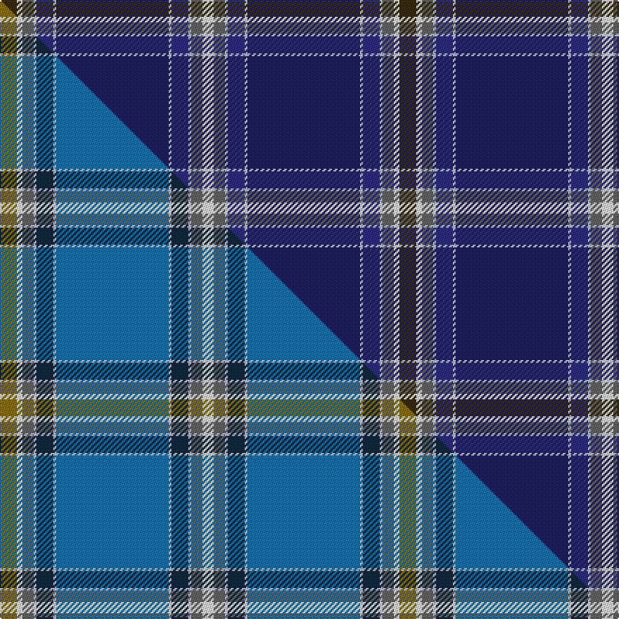

This is one **variant** — a specific cloth: this exact thread count and colourway, with its own
provenance below. It is one weaving of the [sett](/setts/dy6w2n4lb1dbi6lb1db40lb1dbi6lb1n4w4/) (the scale-free proportion — the
same cloth at any scale or shade), whose colour order is pattern [GWBWBWBWBWBW](/stripes/gwbwbwbwbwbw/).

Part of the [Moskyok-Collins](/tartans/moskyok-collins/) tartan — the named design grouping this sett with its other cloths.

Sourced from tartans-authority.  It is a [12 stripe tartan](/stripes/stripes12/).

Original link [https://www.tartanregister.gov.uk/tartanDetails.aspx?ref=10992](https://www.tartanregister.gov.uk/tartanDetails.aspx?ref=10992)

Dataset <small>— provenance for this record, inherited from the source manifest</small>

<dl class="dataset-prov">
<dt>source</dt><dd><a href="/sources/tartans-authority/">Scottish Tartans Authority</a></dd>
<dt>data captured from</dt><dd><a href="https://github.com/thetartan/tartan-database/blob/master/data/tartans-authority/data.csv">https://github.com/thetartan/tartan-database/blob/master/data/tartans-authority/data.csv</a></dd>
<dt>data date</dt><dd>2014 <small>(this record)</small></dd>
<dt>licence</dt><dd><a href="https://creativecommons.org/licenses/by-nc-nd/4.0/">CC BY-NC-ND 4.0</a></dd>
</dl>

Capture chain <small>— the hands this data passed through, oldest first; each capture carries its own licence</small>

<ol class="capture-chain">
<li><a href="https://www.tartansauthority.com/">Scottish Tartans Authority</a> <small>the heritage body's archive — its tartan-ferret record browser is retired (links repaired to the SRT, above)</small></li>
<li><a href="https://github.com/thetartan/tartan-database">thetartan/tartan-database</a> <small>2016-2017</small> · <a href="https://creativecommons.org/licenses/by-nc-nd/4.0/">CC BY-NC-ND 4.0</a> <small>Levko Kravets's frozen compilation — the capture we vendored, and where its CC licence text came from</small></li>
<li>this dictionary <small>captured 2026-06-10 · commit 5bf86c7566</small> <small>each re-capture is a git commit to data/sources</small></li>
</ol>

## Register references

External register numbers recorded for this tartan.

- Scottish Register of Tartans: [10992](https://www.tartanregister.gov.uk/tartanDetails?ref=10992)
- Scottish Tartans Authority (ITI): 10992

## Thread count
DY/12 W4 N8 LB2 DBi12 LB2 DB80 LB2 DBi12 LB2 N8 W/8

One full sett is **284 threads**.

## Palette
<table><thead><tr><th>Colour</th><th>Shade</th><th>OKLCh</th></tr></thead><tbody><tr><td>DB</td><td><code style="background-color:#2C2C80;">#2C2C80</code> <small style="color:#888">#2C2C80</small></td><td><small style="color:#888">oklch(35.0% 0.138 276.6)</small></td></tr><tr><td>DB</td><td><code style="background-color:#202060;">#202060</code> <small style="color:#888">#202060</small></td><td><small style="color:#888">oklch(28.9% 0.111 276.9)</small></td></tr><tr><td>N</td><td><code style="background-color:#636363;">#636363</code> <small style="color:#888">#636363</small></td><td><small style="color:#888">oklch(50.0% 0.000 89.9)</small></td></tr><tr><td>LB</td><td><code style="background-color:#B5BBDE;">#B5BBDE</code> <small style="color:#888">#B5BBDE</small></td><td><small style="color:#888">oklch(79.9% 0.050 277.6)</small></td></tr><tr><td>W</td><td><code style="background-color:#F7F7F7;">#F7F7F7</code> <small style="color:#888">#F7F7F7</small></td><td><small style="color:#888">oklch(97.6% 0.000 89.9)</small></td></tr><tr><td>DY</td><td><code style="background-color:#3A2B0D;">#3A2B0D</code> <small style="color:#888">#3A2B0D</small></td><td><small style="color:#888">oklch(30.0% 0.049 82.0)</small></td></tr></tbody></table>

# Sample pattern

## Compared to the master

This cloth is one sett of its design; the master sett (the exemplar the design is anchored on) is below for comparison.

Its **ΔTartan distance** from the master is **3.14** — the same measure the nearest-tartans table ranks by (0 is identical; a re-scale of the same cloth is near 0, a recolour or a different proportion further).

<figure class="master-compare" style="margin:0">

this sett
master sett ★

<figcaption style="color:#888;font-size:smaller">One weave of this sett against the <a href="/setts/y6w2n4lb1dt6lb1t40lb1dt6lb1n4w4/">master sett ★</a>, split on the diagonal: a shared proportion runs seamlessly across it with only the shades shifting; a different proportion breaks on it.</figcaption>
</figure>

## Nearest tartan variants

The nearest existing variants by ΔTartan distance, with this cloth at the top so the swatches line up against it.

ΔTartan

Threads

Variant

Sett

—

284

<a href="/variants/s12/dy6w2n4lb1dbi6lb1db40lb1dbi6lb1n4w4~x2~dbi1406275-db1204274/">Moskyok-Collins (Portland) (Personal</a>

<a href="/ttd/edit/#slug=dt47y1db27lr4g5y1lr8b1db1~x2~dt1000000-lr3201060&amp;base=dy6w2n4lb1dbi6lb1db40lb1dbi6lb1n4w4~x2~dbi1406275-db1204274" title="compare in the TTD">2.95</a>

284

<a href="/variants/s9/dt47y1db27lr4g5y1lr8b1db1~x2~dt1000000-lr3201060/">Brighton Mac Dermotte</a>

<a href="/ttd/edit/#slug=y6w2n4lb1dt6lb1b40lb1dt6lb1n4w4~x2~dt1102249-b2105244&amp;base=dy6w2n4lb1dbi6lb1db40lb1dbi6lb1n4w4~x2~dbi1406275-db1204274" title="compare in the TTD">3.21</a>

284

<a href="/variants/s12/y6w2n4lb1dt6lb1t40lb1dt6lb1n4w4~x2~dt1102249-t2105244/">Moskyok-Collins (Personal)</a>

<a href="/ttd/edit/#slug=db54ly9db16ly2dp3w3dp3dr27db13ly3g5w2~x2&amp;base=dy6w2n4lb1dbi6lb1db40lb1dbi6lb1n4w4~x2~dbi1406275-db1204274" title="compare in the TTD">3.22</a>

448

<a href="/variants/s12/db54ly9db16ly2dp3w3dp3dr27db13ly3g5w2~x2/">Queen's University Ont. (Corporate)</a>

<a href="/ttd/edit/#slug=db60t5db4dr6db4t5dy22g5t23db1ly4~x2&amp;base=dy6w2n4lb1dbi6lb1db40lb1dbi6lb1n4w4~x2~dbi1406275-db1204274" title="compare in the TTD">3.23</a>

428

<a href="/variants/s11/db60t5db4dr6db4t5dy22g5t23db1ly4~x2/">State Seal of New York (Fashion)</a>

<a href="/ttd/edit/#slug=dt54db14y3db3w3db3g9dy7db2dy9w2~x2~dt1204274-db1406275&amp;base=dy6w2n4lb1dbi6lb1db40lb1dbi6lb1n4w4~x2~dbi1406275-db1204274" title="compare in the TTD">3.27</a>

324

<a href="/variants/s11/db54dbi14y3dbi3w3dbi3g9dy7dbi2dy9w2~x2~db1204274-dbi1406275/">Holyrood Corporate Tartan</a>

<a href="/ttd/edit/#slug=dp5g1db30lb2db4lb3db3lb4db2lb5db2t9db1w2~x2~db1003265-t2607245&amp;base=dy6w2n4lb1dbi6lb1db40lb1dbi6lb1n4w4~x2~dbi1406275-db1204274" title="compare in the TTD">3.30</a>

278

<a href="/variants/s14/dp5g1db30lb2db4lb3db3lb4db2lb5db2t9db1w2~x2~db1003265-t2607245/">Crombie, Harry (Personal)</a>

<a href="/ttd/edit/#slug=w5dt38y3db11y1db11y3dt4w5lo1~x2~dt1700000-y2400000&amp;base=dy6w2n4lb1dbi6lb1db40lb1dbi6lb1n4w4~x2~dbi1406275-db1204274" title="compare in the TTD">3.57</a>

316

<a href="/variants/s10/w5n38y3db11y1db11y3n4w5lo1~x2~n1700000-y2400000/">Ballarat</a>

<a href="/ttd/edit/#slug=db26dbi3db1dp2db1dbi3db3dbi12g14db2w2~x2~db1004274-dbi1406275&amp;base=dy6w2n4lb1dbi6lb1db40lb1dbi6lb1n4w4~x2~dbi1406275-db1204274" title="compare in the TTD">3.77</a>

220

<a href="/variants/s11/db26dbi3db1dp2db1dbi3db3dbi12g14db2w2~x2~db1004274-dbi1406275/">Royal Highland Yacht Club (Corporate</a>

<a href="/ttd/edit/#slug=db54dy9db16dy2dp3w3dp3dr27db13dy3g5w2~x2&amp;base=dy6w2n4lb1dbi6lb1db40lb1dbi6lb1n4w4~x2~dbi1406275-db1204274" title="compare in the TTD">3.92</a>

448

<a href="/variants/s12/db54dy9db16dy2dp3w3dp3dr27db13dy3g5w2~x2/">Queens University Kingston Ontario</a>

<a href="/ttd/edit/#slug=db68lb4dr10y2dr3w3dr3g11db8dr3db3w3~x2&amp;base=dy6w2n4lb1dbi6lb1db40lb1dbi6lb1n4w4~x2~dbi1406275-db1204274" title="compare in the TTD">3.98</a>

342

<a href="/variants/s12/db68lb4dr10y2dr3w3dr3g11db8dr3db3w3~x2/">Shaughnessy (Fashion)</a>

## Neighbour map

Every grey dot is one of 13621 variants placed by the first two principal components of the ΔTartan feature space (42% of its variance). Red is this tartan; blue dots are its nearest — click one to open its page.

<svg viewBox="0 0 640 380" role="img" style="max-width:100%;height:auto;border:1px solid #e0e0e0;border-radius:4px;display:block" xmlns="http://www.w3.org/2000/svg"><image href="/nn/cloud.v1.png" width="640" height="380"/><a href="/variants/s9/dt47y1db27lr4g5y1lr8b1db1~x2~dt1000000-lr3201060/"><circle cx="334.1" cy="95.4" r="4" fill="#3465a4"><title>Brighton Mac Dermotte</title></circle></a><a href="/variants/s12/y6w2n4lb1dt6lb1t40lb1dt6lb1n4w4~x2~dt1102249-t2105244/"><circle cx="356.6" cy="96.5" r="4" fill="#3465a4"><title>Moskyok-Collins (Personal)</title></circle></a><a href="/variants/s12/db54ly9db16ly2dp3w3dp3dr27db13ly3g5w2~x2/"><circle cx="339.8" cy="107.7" r="4" fill="#3465a4"><title>Queen's University Ont. (Corporate)</title></circle></a><a href="/variants/s11/db60t5db4dr6db4t5dy22g5t23db1ly4~x2/"><circle cx="347.1" cy="102.5" r="4" fill="#3465a4"><title>State Seal of New York (Fashion)</title></circle></a><a href="/variants/s11/db54dbi14y3dbi3w3dbi3g9dy7dbi2dy9w2~x2~db1204274-dbi1406275/"><circle cx="336.7" cy="118.8" r="4" fill="#3465a4"><title>Holyrood Corporate Tartan</title></circle></a><a href="/variants/s14/dp5g1db30lb2db4lb3db3lb4db2lb5db2t9db1w2~x2~db1003265-t2607245/"><circle cx="316.4" cy="86.9" r="4" fill="#3465a4"><title>Crombie, Harry (Personal)</title></circle></a><a href="/variants/s10/w5n38y3db11y1db11y3n4w5lo1~x2~n1700000-y2400000/"><circle cx="336.4" cy="119.1" r="4" fill="#3465a4"><title>Ballarat</title></circle></a><a href="/variants/s11/db26dbi3db1dp2db1dbi3db3dbi12g14db2w2~x2~db1004274-dbi1406275/"><circle cx="335.3" cy="147.0" r="4" fill="#3465a4"><title>Royal Highland Yacht Club (Corporate</title></circle></a><a href="/variants/s12/db54dy9db16dy2dp3w3dp3dr27db13dy3g5w2~x2/"><circle cx="388.9" cy="122.2" r="4" fill="#3465a4"><title>Queens University Kingston Ontario</title></circle></a><a href="/variants/s12/db68lb4dr10y2dr3w3dr3g11db8dr3db3w3~x2/"><circle cx="407.2" cy="76.0" r="4" fill="#3465a4"><title>Shaughnessy (Fashion)</title></circle></a><circle cx="341.8" cy="85.8" r="5" fill="#c00000"/><text x="320" y="376" text-anchor="middle" font-size="11" fill="#999">ground</text><text x="11" y="190" text-anchor="middle" font-size="11" fill="#999" transform="rotate(-90 11 190)">complexity</text></svg>

ID: /variants/s12/dy6w2n4lb1dbi6lb1db40lb1dbi6lb1n4w4~x2~dbi1406275-db1204274/
