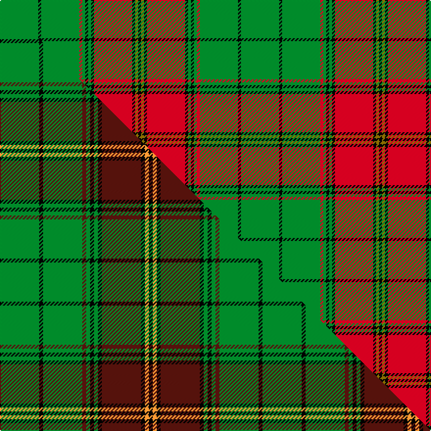

This is one **variant** — a specific cloth: this exact thread count and colourway, with its own
provenance below. It is one weaving of the [sett](/setts/g13k1g13r1g1k1g1k1r13k1y1k1/) (the scale-free proportion — the
same cloth at any scale or shade), whose colour order is pattern [GKGRGKGKRKGK](/stripes/gkgrgkgkrkgk/).

Part of the [Ulster](/tartans/u/ul/ulster-3/) tartan — the named design grouping this sett with its other cloths.

Sourced from house-of-tartan.  It is a [12 stripe tartan](/stripes/stripes12/).

Original link [http://www.house-of-tartan.scotland.net/house/TartanViewjs.asp?colr=Def&tnam=792](http://www.house-of-tartan.scotland.net/house/TartanViewjs.asp?colr=Def&tnam=792)

## Provenance

Earliest known date: pre 1999 Originally listed as MacNeil, this sett was identified by Ken Dalgliesh, weaver in Selkirk, in 1999.

2 attestations — the source records this cloth was collapsed from (oldest owns this page)

<ul>
<li>pre 1999 — Ulster Red Irish District Tartan (house-of-tartan, <a href="http://www.house-of-tartan.scotland.net/house/TartanViewjs.asp?colr=Def&tnam=792">record</a>) </li>
<li>undated — Ulster (weddslist, <a href="http://www.weddslist.com/cgi-bin/tartans/pg.pl?source=sts">record</a>) </li>
</ul>

Dataset <small>— provenance for this record, inherited from the source manifest</small>

<dl class="dataset-prov">
<dt>source</dt><dd><a href="/sources/house-of-tartan/">House of Tartan</a></dd>
<dt>data captured from</dt><dd><a href="https://github.com/thetartan/tartan-database/blob/master/data/house-of-tartan/data.csv">https://github.com/thetartan/tartan-database/blob/master/data/house-of-tartan/data.csv</a></dd>
<dt>data date</dt><dd>pre 1999 <small>(this record)</small></dd>
<dt>licence</dt><dd><a href="https://creativecommons.org/licenses/by-nc-nd/4.0/">CC BY-NC-ND 4.0</a></dd>
</dl>

Capture chain <small>— the hands this data passed through, oldest first; each capture carries its own licence</small>

<ol class="capture-chain">
<li><a href="http://www.house-of-tartan.scotland.net/">House of Tartan</a> <small>the weaver/retailer's database — the site is now offline; the URL is kept as the ultimate source's identity</small></li>
<li><a href="https://github.com/thetartan/tartan-database">thetartan/tartan-database</a> <small>2016-2017</small> · <a href="https://creativecommons.org/licenses/by-nc-nd/4.0/">CC BY-NC-ND 4.0</a> <small>Levko Kravets's frozen compilation — the capture we vendored, and where its CC licence text came from</small></li>
<li>this dictionary <small>captured 2026-06-10 · commit 5bf86c7566</small> <small>each re-capture is a git commit to data/sources</small></li>
</ol>

## Thread count
G/39 K3 G39 R3 G3 K3 G3 K3 R39 K3 Y3 K/3

One full sett is **246 threads**.

## Palette
<table><thead><tr><th>Colour</th><th>Shade</th><th>OKLCh</th></tr></thead><tbody><tr><td>G</td><td><code style="background-color:#008B2A;">#008B2A</code> <small style="color:#888">#008B2A</small></td><td><small style="color:#888">oklch(55.4% 0.170 145.9)</small></td></tr><tr><td>K</td><td><code style="background-color:#000000;">#000000</code> <small style="color:#888">#000000</small></td><td><small style="color:#888">oklch(0.0% 0.000 0.0)</small></td></tr><tr><td>R</td><td><code style="background-color:#D60020;">#D60020</code> <small style="color:#888">#D60020</small></td><td><small style="color:#888">oklch(55.2% 0.224 25.5)</small></td></tr><tr><td>Y</td><td><code style="background-color:#8B6E00;">#8B6E00</code> <small style="color:#888">#8B6E00</small></td><td><small style="color:#888">oklch(55.1% 0.113 90.4)</small></td></tr></tbody></table>

# Sample pattern

## Compared to the master

This cloth is one sett of its design; the master sett (the exemplar the design is anchored on) is below for comparison.

Its **ΔTartan distance** from the master is **0.61** — the same measure the nearest-tartans table ranks by (0 is identical; a re-scale of the same cloth is near 0, a recolour or a different proportion further).

<figure class="master-compare" style="margin:0">

this sett
master sett ★

<figcaption style="color:#888;font-size:smaller">One weave of this sett against the <a href="/setts/g10k1g10dr1g1k1g1k1dr10k1lo1k1/">master sett ★</a>, split on the diagonal: a shared proportion runs seamlessly across it with only the shades shifting; a different proportion breaks on it.</figcaption>
</figure>

## Nearest tartan variants

The nearest existing variants by ΔTartan distance, with this cloth at the top so the swatches line up against it.

ΔTartan

Threads

Variant

Sett

—

246

<a href="/variants/s12/g13k1g13r1g1k1g1k1r13k1y1k1~x3/">Ulster Red Irish District Tartan</a>

<a href="/ttd/edit/#slug=g10k1g10dr1g1k1g1k1dr10k1lo1k1~x4&amp;base=g13k1g13r1g1k1g1k1r13k1y1k1~x3" title="compare in the TTD">0.61</a>

268

<a href="/variants/s12/g10k1g10dr1g1k1g1k1dr10k1lo1k1~x4/">Ulster Red (District)</a>

<a href="/ttd/edit/#slug=g2k1g14r2g2k10g2r4k1w2~x4&amp;base=g13k1g13r1g1k1g1k1r13k1y1k1~x3" title="compare in the TTD">1.78</a>

304

<a href="/variants/s10/g2k1g14r2g2k10g2r4k1w2~x4/">MacCarthy (Fashion?)</a>

<a href="/ttd/edit/#slug=g3k1g1r12g1r1g1k4g1lb2g15k1g1k1g3~x4&amp;base=g13k1g13r1g1k1g1k1r13k1y1k1~x3" title="compare in the TTD">1.86</a>

360

<a href="/variants/s15/g3k1g1r12g1r1g1k4g1lb2g15k1g1k1g3~x4/">Hickey (Name)</a>

<a href="/ttd/edit/#slug=g3dr16g4k6g28dr2g3~x2&amp;base=g13k1g13r1g1k1g1k1r13k1y1k1~x3" title="compare in the TTD">2.09</a>

236

<a href="/variants/s7/g3dr16g4k6g28dr2g3~x2/">Maxwell Htg (Clan)</a>

<a href="/ttd/edit/#slug=y28k2y28k2y2k2ly29k2r2k2~x2&amp;base=g13k1g13r1g1k1g1k1r13k1y1k1~x3" title="compare in the TTD">2.13</a>

336

<a href="/variants/s10/y28k2y28k2y2k2ly29k2r2k2~x2/">Ulster Irish District Tartan</a>

<a href="/ttd/edit/#slug=db5r19k2g8r3g18k2g9k2~x2&amp;base=g13k1g13r1g1k1g1k1r13k1y1k1~x3" title="compare in the TTD">2.62</a>

258

<a href="/variants/s9/db5r19k2g8r3g18k2g9k2~x2/">Hubbard (2016)</a>

<a href="/ttd/edit/#slug=k3g3y2g30k2g3r12g6lp6k3g3~x2&amp;base=g13k1g13r1g1k1g1k1r13k1y1k1~x3" title="compare in the TTD">2.64</a>

280

<a href="/variants/s11/k3g3y2g30k2g3r12g6lp6k3g3~x2/">McAlifyfe (Personal)</a>

<a href="/ttd/edit/#slug=y28k2y28k2y2k2dy29k2r2k2~x2&amp;base=g13k1g13r1g1k1g1k1r13k1y1k1~x3" title="compare in the TTD">2.78</a>

336

<a href="/variants/s10/y28k2y28k2y2k2dy29k2r2k2~x2/">Ulster (Peat) (District</a>

<a href="/ttd/edit/#slug=db2r1g10r1k6g12r2g1r1g3w2~x4&amp;base=g13k1g13r1g1k1g1k1r13k1y1k1~x3" title="compare in the TTD">2.78</a>

312

<a href="/variants/s11/db2r1g10r1k6g12r2g1r1g3w2~x4/">Ronald, Clan (Clan)</a>

<a href="/ttd/edit/#slug=y30r2y2k5y3dy2y3dy22y3k2y3~x2&amp;base=g13k1g13r1g1k1g1k1r13k1y1k1~x3" title="compare in the TTD">2.95</a>

242

<a href="/variants/s11/y30r2y2k5y3dy2y3dy22y3k2y3~x2/">Dunbarton Trade Tartan</a>

## Neighbour map

Every grey dot is one of 13621 variants placed by the first two principal components of the ΔTartan feature space (42% of its variance). Red is this tartan; blue dots are its nearest — click one to open its page.

<svg viewBox="0 0 640 380" role="img" style="max-width:100%;height:auto;border:1px solid #e0e0e0;border-radius:4px;display:block" xmlns="http://www.w3.org/2000/svg"><image href="/nn/cloud.v1.png" width="640" height="380"/><a href="/variants/s12/g10k1g10dr1g1k1g1k1dr10k1lo1k1~x4/"><circle cx="275.5" cy="145.9" r="4" fill="#3465a4"><title>Ulster Red (District)</title></circle></a><a href="/variants/s10/g2k1g14r2g2k10g2r4k1w2~x4/"><circle cx="214.7" cy="139.9" r="4" fill="#3465a4"><title>MacCarthy (Fashion?)</title></circle></a><a href="/variants/s15/g3k1g1r12g1r1g1k4g1lb2g15k1g1k1g3~x4/"><circle cx="261.7" cy="110.2" r="4" fill="#3465a4"><title>Hickey (Name)</title></circle></a><a href="/variants/s7/g3dr16g4k6g28dr2g3~x2/"><circle cx="349.8" cy="184.0" r="4" fill="#3465a4"><title>Maxwell Htg (Clan)</title></circle></a><a href="/variants/s10/y28k2y28k2y2k2ly29k2r2k2~x2/"><circle cx="311.4" cy="133.3" r="4" fill="#3465a4"><title>Ulster Irish District Tartan</title></circle></a><a href="/variants/s9/db5r19k2g8r3g18k2g9k2~x2/"><circle cx="233.5" cy="180.4" r="4" fill="#3465a4"><title>Hubbard (2016)</title></circle></a><a href="/variants/s11/k3g3y2g30k2g3r12g6lp6k3g3~x2/"><circle cx="287.8" cy="119.0" r="4" fill="#3465a4"><title>McAlifyfe (Personal)</title></circle></a><a href="/variants/s10/y28k2y28k2y2k2dy29k2r2k2~x2/"><circle cx="340.6" cy="140.6" r="4" fill="#3465a4"><title>Ulster (Peat) (District</title></circle></a><a href="/variants/s11/db2r1g10r1k6g12r2g1r1g3w2~x4/"><circle cx="266.8" cy="135.7" r="4" fill="#3465a4"><title>Ronald, Clan (Clan)</title></circle></a><a href="/variants/s11/y30r2y2k5y3dy2y3dy22y3k2y3~x2/"><circle cx="345.0" cy="135.0" r="4" fill="#3465a4"><title>Dunbarton Trade Tartan</title></circle></a><circle cx="299.6" cy="125.6" r="5" fill="#c00000"/><text x="320" y="376" text-anchor="middle" font-size="11" fill="#999">ground</text><text x="11" y="190" text-anchor="middle" font-size="11" fill="#999" transform="rotate(-90 11 190)">complexity</text></svg>

ID: /variants/s12/g13k1g13r1g1k1g1k1r13k1y1k1~x3/
