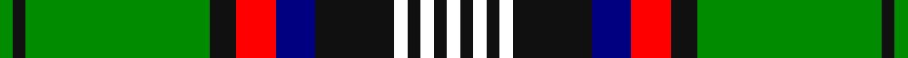

This page is one **sett** — a single exact thread-count. It belongs to the [tartan](/setts/g1k1g14k2r3db3k6w1k1w1k1w1/)
(the same proportion at any scale), whose colour order is pattern [GKGKRBKWKWKW](/stripes/gkgkrbkwkwkw/).

Sourced from house-of-tartan.  It is a [12 stripe tartan](/stripes/stripes12/).

Original link http://www.house-of-tartan.scotland.net/house/TartanViewjs.asp?colr=Def&tnam=10700

## Provenance

Earliest known date: 18 September 2012 After years of wearing the Murray of Atholl tartan, the registrant has chosen to register a tartan in his own name. He belongs to a family that has intermarried with the Murrays for many years and bears the additional surname of Murray. The underlying design of this personal tartan is based on details derived from the Blair Atholl tartan with due and proper differences to distinguish it. The colours used were specifically chosen to represent the colours found in the Murray of Atholl sett. The addition of three white stripes alludes to the three silver stars of the Murrays. The black and white also reflect the principal heraldic colours in the registrant's coat of arms granted to him by Garter King of Arms (England) and Norroy and Ulster King of Arms. The tartan, for the registrant, his immediate family, and their descendants to wear, maintains the strong link with the Murray Clan.

## Thread count
G/4 K4 G56 K8 R12 DB12 K24 W4 K4 W4 K4 W/4

One full sett is **272 threads**.

## Palette
<table><thead><tr><th>Colour</th><th>Shade</th><th>OKLCh</th></tr></thead><tbody><tr><td>DB</td><td><code style="background-color:#082077;">#082077</code> <small style="color:#888">#082077</small></td><td><small style="color:#888">oklch(30.0% 0.149 265.1)</small></td></tr><tr><td>G</td><td><code style="background-color:#008B2A;">#008B2A</code> <small style="color:#888">#008B2A</small></td><td><small style="color:#888">oklch(55.4% 0.170 145.9)</small></td></tr><tr><td>K</td><td><code style="background-color:#000000;">#000000</code> <small style="color:#888">#000000</small></td><td><small style="color:#888">oklch(0.0% 0.000 0.0)</small></td></tr><tr><td>R</td><td><code style="background-color:#D60020;">#D60020</code> <small style="color:#888">#D60020</small></td><td><small style="color:#888">oklch(55.2% 0.224 25.5)</small></td></tr><tr><td>W</td><td><code style="background-color:#F7F7F7;">#F7F7F7</code> <small style="color:#888">#F7F7F7</small></td><td><small style="color:#888">oklch(97.6% 0.000 89.9)</small></td></tr></tbody></table>

# Sample pattern

## Nearest variants

The nearest existing variants by ΔTartan distance, with this cloth at the top so the swatches line up against it.

ΔTartan

Threads

Variant

Sett

—

272

<a href="/variants/s12/g1k1g14k2r3db3k6w1k1w1k1w1~x4/">Murray-Hetherington (Personal) Name Tartan</a>

<a href="/ttd/edit/#slug=g1k1g14k2r3db3k6w1k1w1~x4&amp;base=g1k1g14k2r3db3k6w1k1w1k1w1~x4" title="compare in the TTD">1.44</a>

256

<a href="/variants/s10/g1k1g14k2r3db3k6w1k1w1~x4/">Murray-Hetherington (Personal)</a>

2.43

—

<a href="/variants/s11/lbi3k1g12k1g1k2g1k6lb12k1lo1~x4~lbi3203246-lb3200000/">MacCandlish Arisaid Green</a>

## Neighbour map

Every grey dot is one of 13620 variants placed by the first two principal components of the ΔTartan feature space (42% of its variance). Red is this tartan; blue dots are its nearest — click one to open its page.

<svg viewBox="0 0 640 380" role="img" style="max-width:100%;height:auto;border:1px solid #e0e0e0;border-radius:4px;display:block" xmlns="http://www.w3.org/2000/svg"><image href="/nn/cloud.v1.png" width="640" height="380"/><a href="/variants/s10/g1k1g14k2r3db3k6w1k1w1~x4/"><circle cx="175.5" cy="119.6" r="4" fill="#3465a4"><title>Murray-Hetherington (Personal)</title></circle></a><a href="/variants/s11/lbi3k1g12k1g1k2g1k6lb12k1lo1~x4~lbi3203246-lb3200000/"><circle cx="117.0" cy="129.7" r="4" fill="#3465a4"><title>MacCandlish Arisaid Green</title></circle></a><circle cx="159.6" cy="107.7" r="5" fill="#c00000"/><text x="320" y="376" text-anchor="middle" font-size="11" fill="#999">ground</text><text x="11" y="190" text-anchor="middle" font-size="11" fill="#999" transform="rotate(-90 11 190)">complexity</text></svg>

ID: /variants/s12/g1k1g14k2r3db3k6w1k1w1k1w1~x4/
