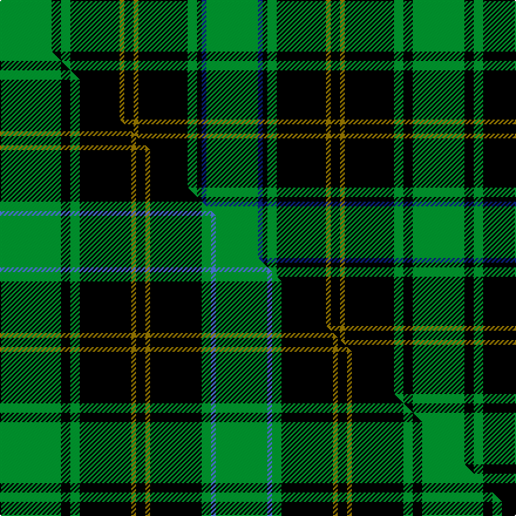

This is one **variant** — a specific cloth: this exact thread count and colourway, with its own
provenance below. It is one weaving of the [sett](/setts/g22k4g4k21y2k4y2k21g4k2db2g22/) (the scale-free proportion — the
same cloth at any scale or shade), whose colour order is pattern [GBKGKGKGKGKG](/stripes/gbkgkgkgkgkg/).

Part of the [Hopetoun](/tartans/hopetoun/) tartan — the named design grouping this sett with its other cloths.

Sourced from house-of-tartan.  It is a [12 stripe tartan](/stripes/stripes12/).

Original link [http://www.house-of-tartan.scotland.net/house/TartanViewjs.asp?colr=Def&tnam=722](http://www.house-of-tartan.scotland.net/house/TartanViewjs.asp?colr=Def&tnam=722)

## Provenance

Earliest known date: 1984 Based on Marquess of Linlithgow's family colours of gold and blue

2 attestations — the source records this cloth was collapsed from (oldest owns this page)

<ul>
<li>1984 — Hopetoun Corporate Tartan (house-of-tartan, <a href="http://www.house-of-tartan.scotland.net/house/TartanViewjs.asp?colr=Def&tnam=722">record</a>) </li>
<li>undated — Hopetoun (weddslist, <a href="http://www.weddslist.com/cgi-bin/tartans/pg.pl?source=sts">record</a>) </li>
</ul>

Dataset <small>— provenance for this record, inherited from the source manifest</small>

<dl class="dataset-prov">
<dt>source</dt><dd><a href="/sources/house-of-tartan/">House of Tartan</a></dd>
<dt>data captured from</dt><dd><a href="https://github.com/thetartan/tartan-database/blob/master/data/house-of-tartan/data.csv">https://github.com/thetartan/tartan-database/blob/master/data/house-of-tartan/data.csv</a></dd>
<dt>data date</dt><dd>1984 <small>(this record)</small></dd>
<dt>licence</dt><dd><a href="https://creativecommons.org/licenses/by-nc-nd/4.0/">CC BY-NC-ND 4.0</a></dd>
</dl>

Capture chain <small>— the hands this data passed through, oldest first; each capture carries its own licence</small>

<ol class="capture-chain">
<li><a href="http://www.house-of-tartan.scotland.net/">House of Tartan</a> <small>the weaver/retailer's database — the site is now offline; the URL is kept as the ultimate source's identity</small></li>
<li><a href="https://github.com/thetartan/tartan-database">thetartan/tartan-database</a> <small>2016-2017</small> · <a href="https://creativecommons.org/licenses/by-nc-nd/4.0/">CC BY-NC-ND 4.0</a> <small>Levko Kravets's frozen compilation — the capture we vendored, and where its CC licence text came from</small></li>
<li>this dictionary <small>captured 2026-06-10 · commit 5bf86c7566</small> <small>each re-capture is a git commit to data/sources</small></li>
</ol>

## Thread count
G/44 K8 G8 K42 Y4 K8 Y4 K42 G8 K4 DB4 G/44

One full sett is **352 threads**.

## Palette
<table><thead><tr><th>Colour</th><th>Shade</th><th>OKLCh</th></tr></thead><tbody><tr><td>DB</td><td><code style="background-color:#082077;">#082077</code> <small style="color:#888">#082077</small></td><td><small style="color:#888">oklch(30.0% 0.149 265.1)</small></td></tr><tr><td>G</td><td><code style="background-color:#008B2A;">#008B2A</code> <small style="color:#888">#008B2A</small></td><td><small style="color:#888">oklch(55.4% 0.170 145.9)</small></td></tr><tr><td>K</td><td><code style="background-color:#000000;">#000000</code> <small style="color:#888">#000000</small></td><td><small style="color:#888">oklch(0.0% 0.000 0.0)</small></td></tr><tr><td>Y</td><td><code style="background-color:#8B6E00;">#8B6E00</code> <small style="color:#888">#8B6E00</small></td><td><small style="color:#888">oklch(55.1% 0.113 90.4)</small></td></tr></tbody></table>

# Sample pattern

## Compared to the master

This cloth is one sett of its design; the master sett (the exemplar the design is anchored on) is below for comparison.

Its **ΔTartan distance** from the master is **1.11** — the same measure the nearest-tartans table ranks by (0 is identical; a re-scale of the same cloth is near 0, a recolour or a different proportion further).

<figure class="master-compare" style="margin:0">

this sett
master sett ★

<figcaption style="color:#888;font-size:smaller">One weave of this sett against the <a href="/setts/g13k2g2k11y1k2y1k11g2b1g11/">master sett ★</a>, split on the diagonal: a shared proportion runs seamlessly across it with only the shades shifting; a different proportion breaks on it.</figcaption>
</figure>

## Nearest tartan variants

The nearest existing variants by ΔTartan distance, with this cloth at the top so the swatches line up against it.

ΔTartan

Threads

Variant

Sett

—

352

<a href="/variants/s12/g22k4g4k21y2k4y2k21g4k2db2g22~x2/">Hopetoun Corporate Tartan</a>

<a href="/ttd/edit/#slug=g13k2g2k11y1k2y1k11g2b1g11~x4&amp;base=g22k4g4k21y2k4y2k21g4k2db2g22~x2" title="compare in the TTD">1.11</a>

360

<a href="/variants/s11/g13k2g2k11y1k2y1k11g2b1g11~x4/">Hopetoun</a>

<a href="/ttd/edit/#slug=k60g64dg5g8dg5g64k60y8k8y8&amp;base=g22k4g4k21y2k4y2k21g4k2db2g22~x2" title="compare in the TTD">1.17</a>

512

<a href="/variants/s10/k60g64dg5g8dg5g64k60y8k8y8/">Sin-Cos</a>

<a href="/ttd/edit/#slug=k1dr1g7k8w1k8dr1g2dr1g4dr1~x4&amp;base=g22k4g4k21y2k4y2k21g4k2db2g22~x2" title="compare in the TTD">2.03</a>

272

<a href="/variants/s11/k1dr1g7k8w1k8dr1g2dr1g4dr1~x4/">Episcopal Clergy (Corporate)</a>

<a href="/ttd/edit/#slug=k8g4r1k2g16dy1k8g2k2g4~x4&amp;base=g22k4g4k21y2k4y2k21g4k2db2g22~x2" title="compare in the TTD">2.20</a>

336

<a href="/variants/s10/k8g4r1k2g16dy1k8g2k2g4~x4/">Manitoba Cue Sports</a>

<a href="/ttd/edit/#slug=k8g4r1k2g16ly1k8g2k2g4~x4&amp;base=g22k4g4k21y2k4y2k21g4k2db2g22~x2" title="compare in the TTD">2.26</a>

336

<a href="/variants/s10/k8g4r1k2g16ly1k8g2k2g4~x4/">Manitoba Cue (Corporate)</a>

<a href="/ttd/edit/#slug=dg17lb2g2lb2k21lb2k3dg30k2lb2k4~x2~dg1806142-g2408144&amp;base=g22k4g4k21y2k4y2k21g4k2db2g22~x2" title="compare in the TTD">2.28</a>

306

<a href="/variants/s11/dg17lb2g2lb2k21lb2k3dg30k2lb2k4~x2~dg1806142-g2408144/">Fort William District Tartan</a>

<a href="/ttd/edit/#slug=dg17lb2g2lb2k21lb2k3dg30k2lb2k4~x2~dg1806142-g1903114&amp;base=g22k4g4k21y2k4y2k21g4k2db2g22~x2" title="compare in the TTD">2.29</a>

306

<a href="/variants/s11/dg17lb2g2lb2k21lb2k3dg30k2lb2k4~x2~dg1806142-g1903114/">Fort William (District?)</a>

<a href="/ttd/edit/#slug=g18k3g3k3g3k21dg2k21g21k4~x2&amp;base=g22k4g4k21y2k4y2k21g4k2db2g22~x2" title="compare in the TTD">2.39</a>

352

<a href="/variants/s10/g18k3g3k3g3k21dg2k21g21k4~x2/">Guildry of Stirling</a>

<a href="/ttd/edit/#slug=r4ki2g7ki15g3ki3g3ki7g28k7g6k2~ki0604259&amp;base=g22k4g4k21y2k4y2k21g4k2db2g22~x2" title="compare in the TTD">2.41</a>

168

<a href="/variants/s12/r4ki2g7ki15g3ki3g3ki7g28k7g6k2~ki0604259/">Walker, hunting</a>

<a href="/ttd/edit/#slug=k7r3k27g27y3g3y3g3~x2&amp;base=g22k4g4k21y2k4y2k21g4k2db2g22~x2" title="compare in the TTD">2.44</a>

284

<a href="/variants/s8/k7r3k27g27y3g3y3g3~x2/">Brunton (Personal)</a>

## Neighbour map

Every grey dot is one of 13621 variants placed by the first two principal components of the ΔTartan feature space (42% of its variance). Red is this tartan; blue dots are its nearest — click one to open its page.

<svg viewBox="0 0 640 380" role="img" style="max-width:100%;height:auto;border:1px solid #e0e0e0;border-radius:4px;display:block" xmlns="http://www.w3.org/2000/svg"><image href="/nn/cloud.v1.png" width="640" height="380"/><a href="/variants/s11/g13k2g2k11y1k2y1k11g2b1g11~x4/"><circle cx="236.0" cy="152.5" r="4" fill="#3465a4"><title>Hopetoun</title></circle></a><a href="/variants/s10/k60g64dg5g8dg5g64k60y8k8y8/"><circle cx="222.3" cy="157.8" r="4" fill="#3465a4"><title>Sin-Cos</title></circle></a><a href="/variants/s11/k1dr1g7k8w1k8dr1g2dr1g4dr1~x4/"><circle cx="198.8" cy="170.0" r="4" fill="#3465a4"><title>Episcopal Clergy (Corporate)</title></circle></a><a href="/variants/s10/k8g4r1k2g16dy1k8g2k2g4~x4/"><circle cx="263.3" cy="146.2" r="4" fill="#3465a4"><title>Manitoba Cue Sports</title></circle></a><a href="/variants/s10/k8g4r1k2g16ly1k8g2k2g4~x4/"><circle cx="261.0" cy="145.7" r="4" fill="#3465a4"><title>Manitoba Cue (Corporate)</title></circle></a><a href="/variants/s11/dg17lb2g2lb2k21lb2k3dg30k2lb2k4~x2~dg1806142-g2408144/"><circle cx="265.2" cy="129.5" r="4" fill="#3465a4"><title>Fort William District Tartan</title></circle></a><a href="/variants/s11/dg17lb2g2lb2k21lb2k3dg30k2lb2k4~x2~dg1806142-g1903114/"><circle cx="266.5" cy="129.6" r="4" fill="#3465a4"><title>Fort William (District?)</title></circle></a><a href="/variants/s10/g18k3g3k3g3k21dg2k21g21k4~x2/"><circle cx="265.9" cy="181.9" r="4" fill="#3465a4"><title>Guildry of Stirling</title></circle></a><a href="/variants/s12/r4ki2g7ki15g3ki3g3ki7g28k7g6k2~ki0604259/"><circle cx="244.5" cy="143.1" r="4" fill="#3465a4"><title>Walker, hunting</title></circle></a><a href="/variants/s8/k7r3k27g27y3g3y3g3~x2/"><circle cx="206.4" cy="165.3" r="4" fill="#3465a4"><title>Brunton (Personal)</title></circle></a><circle cx="224.8" cy="153.5" r="5" fill="#c00000"/><text x="320" y="376" text-anchor="middle" font-size="11" fill="#999">ground</text><text x="11" y="190" text-anchor="middle" font-size="11" fill="#999" transform="rotate(-90 11 190)">complexity</text></svg>

ID: /variants/s12/g22k4g4k21y2k4y2k21g4k2db2g22~x2/
