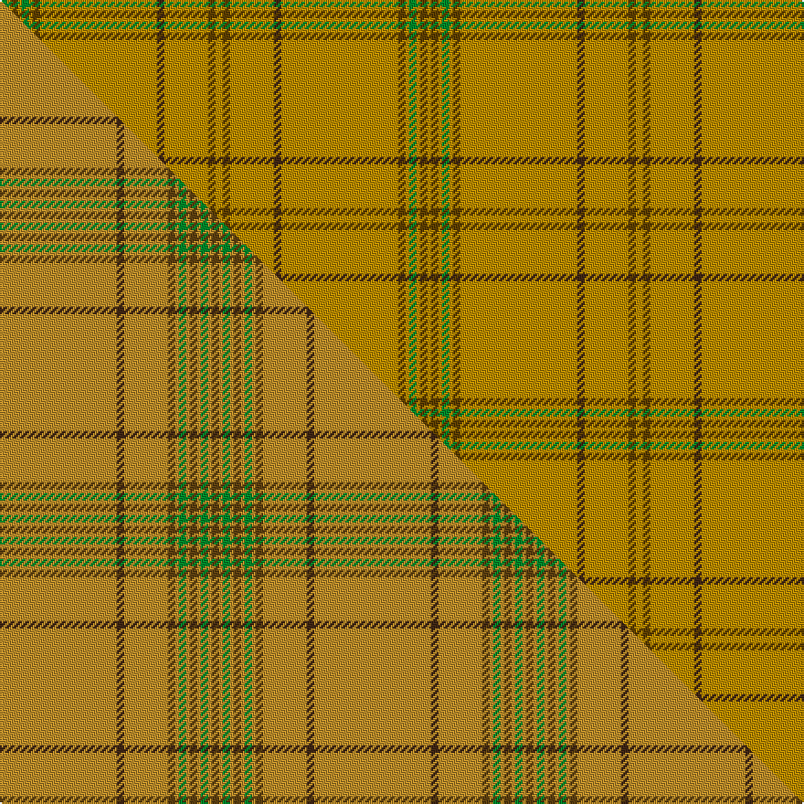

This page is one **sett** — a single exact thread-count. It belongs to the [tartan](/setts/g2ly1dy2ly1g2ly1dy2ly32do2ly12dy2ly2/)
(the same proportion at any scale), whose colour order is pattern [GYGYGYGYBYGYGYBYGYGYGY](/stripes/gygygygybygygybygygygy/).

Part of the [Houston](/tartans/houston/) tartan — the named design grouping this sett with its other cloths.

Sourced from register-of-tartans.  It is a [22 stripe tartan](/stripes/stripes22/).

Original link https://www.tartanregister.gov.uk/tartanDetails.aspx?ref=1773

## Register references

External register numbers recorded for this tartan.

- Scottish Register of Tartans: [1773](https://www.tartanregister.gov.uk/tartanDetails.aspx?ref=1773)
- Scottish Tartans Authority (ITI): 2290
- Scottish Tartans World Register: 2290

## Thread count
G/4 LY2 DY4 LY2 G4 LY2 DY4 LY64 DO4 LY24 DY4 LY4 DY4 LY24 DO4 LY64 DY4 LY2 G4 LY2 DY4 LY/2

One full sett is **466 threads**.

## Palette
<table><thead><tr><th>Colour</th><th>Shade</th><th>OKLCh</th></tr></thead><tbody><tr><td>DO</td><td><code style="background-color:#412714;">#412714</code> <small style="color:#888">#412714</small></td><td><small style="color:#888">oklch(30.1% 0.050 55.7)</small></td></tr><tr><td>LY</td><td><code style="background-color:#BC8C00;">#BC8C00</code> <small style="color:#888">#BC8C00</small></td><td><small style="color:#888">oklch(66.8% 0.137 84.1)</small></td></tr><tr><td>LY</td><td><code style="background-color:#BC8C00;">#BC8C00</code> <small style="color:#888">#BC8C00</small></td><td><small style="color:#888">oklch(66.8% 0.137 84.1)</small></td></tr><tr><td>G</td><td><code style="background-color:#008B2A;">#008B2A</code> <small style="color:#888">#008B2A</small></td><td><small style="color:#888">oklch(55.4% 0.170 145.9)</small></td></tr><tr><td>LY</td><td><code style="background-color:#A08858;">#A08858</code> <small style="color:#888">#A08858</small></td><td><small style="color:#888">oklch(63.7% 0.071 84.0)</small></td></tr><tr><td>DY</td><td><code style="background-color:#604000;">#604000</code> <small style="color:#888">#604000</small></td><td><small style="color:#888">oklch(39.8% 0.083 76.8)</small></td></tr><tr><td>DY</td><td><code style="background-color:#604000;">#604000</code> <small style="color:#888">#604000</small></td><td><small style="color:#888">oklch(39.8% 0.083 76.8)</small></td></tr></tbody></table>

# Sample pattern

## Compared to the master

This cloth is one sett of its design; the master sett (the exemplar the design is anchored on) is below for comparison.

Its **ΔTartan distance** from the master is **1.29** — the same measure the nearest-tartans table ranks by (0 is identical; a re-scale of the same cloth is near 0, a recolour or a different proportion further).

<figure class="master-compare" style="margin:0">

this sett
master sett ★

<figcaption style="color:#888;font-size:smaller">One weave of this sett against the <a href="/setts/ly32do2ly12dy2ly1g2ly1dy2ly1g2ly1dy2/">master sett ★</a>, split on the diagonal: a shared proportion runs seamlessly across it with only the shades shifting; a different proportion breaks on it.</figcaption>
</figure>

ID: /variants/s12/g2ly1dy2ly1g2ly1dy2ly32do2ly12dy2ly2~x2~ly2705081-dy1603076/
