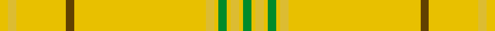

This page is one **sett** — a single exact thread-count. It belongs to the [tartan](/setts/g2lyi1ly2lyi1g2lyi1ly2lyi32dy2lyi12ly2lyi2/)
(the same proportion at any scale), whose colour order is pattern [GYYYGYYYGYYY](/stripes/gyyygyyygyyy/).

Sourced from house-of-tartan.  It is a [12 stripe tartan](/stripes/stripes12/).

Original link http://www.house-of-tartan.scotland.net/house/TartanViewjs.asp?colr=Def&tnam=2290

## Provenance

Earliest known date: 1994 Nothing

## Thread count
LYi/4 LY4 LYi24 DY4 LYi64 LY4 LYi2 G4 LYi2 LY4 LYi2 G/4

One full sett is **236 threads**.

## Palette
<table><thead><tr><th>Colour</th><th>Shade</th><th>OKLCh</th></tr></thead><tbody><tr><td>G</td><td><code style="background-color:#008B2A;">#008B2A</code> <small style="color:#888">#008B2A</small></td><td><small style="color:#888">oklch(55.4% 0.170 145.9)</small></td></tr><tr><td>LY</td><td><code style="background-color:#DCBC32;">#DCBC32</code> <small style="color:#888">#DCBC32</small></td><td><small style="color:#888">oklch(80.0% 0.150 95.2)</small></td></tr><tr><td>DY</td><td><code style="background-color:#604000;">#604000</code> <small style="color:#888">#604000</small></td><td><small style="color:#888">oklch(39.8% 0.083 76.8)</small></td></tr><tr><td>LY</td><td><code style="background-color:#E8C000;">#E8C000</code> <small style="color:#888">#E8C000</small></td><td><small style="color:#888">oklch(81.9% 0.168 93.7)</small></td></tr></tbody></table>

# Sample pattern

## Nearest tartan variants

The nearest existing variants by ΔTartan distance, with this cloth at the top so the swatches line up against it.

ΔTartan

Threads

Variant

Sett

—

236

<a href="/variants/s12/g2lyi1ly2lyi1g2lyi1ly2lyi32dy2lyi12ly2lyi2~x2~lyi3307090-dy1603076/">Houston Family Tartan</a>

<a href="/ttd/edit/#slug=ly32do2ly12dy2ly1g2ly1dy2ly1g2ly1dy2~x2&amp;base=g2lyi1ly2lyi1g2lyi1ly2lyi32dy2lyi12ly2lyi2~x2~lyi3307090-dy1603076" title="compare in the TTD">0.50</a>

172

<a href="/variants/s12/ly32do2ly12dy2ly1g2ly1dy2ly1g2ly1dy2~x2/">Houston (Personal)</a>

## Neighbour map

Every grey dot is one of 13620 variants placed by the first two principal components of the ΔTartan feature space (42% of its variance). Red is this tartan; blue dots are its nearest — click one to open its page.

<svg viewBox="0 0 640 380" role="img" style="max-width:100%;height:auto;border:1px solid #e0e0e0;border-radius:4px;display:block" xmlns="http://www.w3.org/2000/svg"><image href="/nn/cloud.v1.png" width="640" height="380"/><a href="/variants/s12/ly32do2ly12dy2ly1g2ly1dy2ly1g2ly1dy2~x2/"><circle cx="560.1" cy="110.8" r="4" fill="#3465a4"><title>Houston (Personal)</title></circle></a><circle cx="626.0" cy="165.1" r="5" fill="#c00000"/><text x="320" y="376" text-anchor="middle" font-size="11" fill="#999">ground</text><text x="11" y="190" text-anchor="middle" font-size="11" fill="#999" transform="rotate(-90 11 190)">complexity</text></svg>

ID: /variants/s12/g2lyi1ly2lyi1g2lyi1ly2lyi32dy2lyi12ly2lyi2~x2~lyi3307090-dy1603076/
