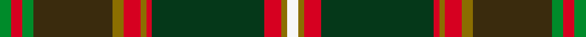
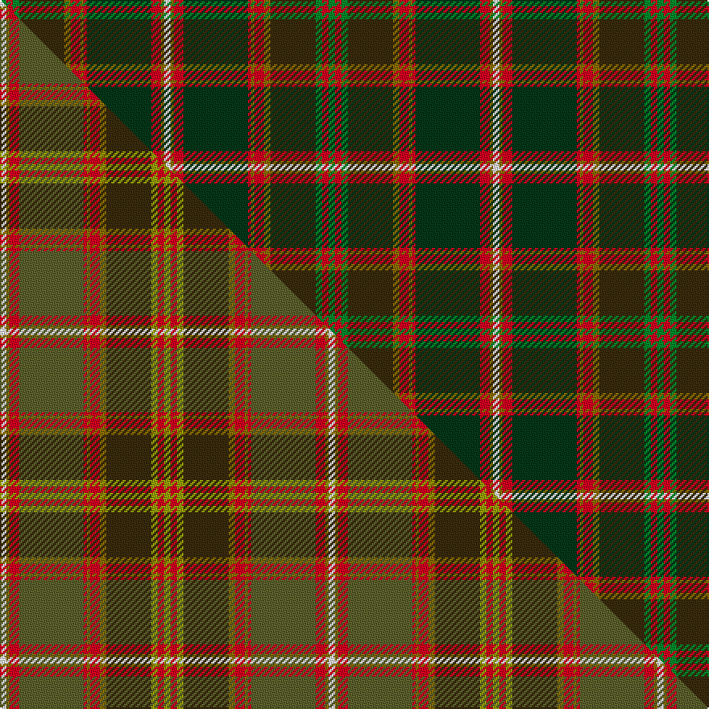

This is one **variant** — a specific cloth: this exact thread count and colourway, with its own
provenance below. It is one weaving of the [sett](/tartans/f/fl/flodden/) (the scale-free proportion — the
same cloth at any scale or shade), whose colour order is pattern [GRGGGRGRGRGW](/stripes/grgggrgrgrgw/).

Part of the [Flodden](/tartans/f/fl/flodden/) tartan — the named design grouping this sett with its other cloths.

Sourced from tartans-authority.  It is a [12 stripe tartan](/stripes/stripes12/).

Original link <code>http://www.tartansauthority.com/tartan-ferret/display/10873/</code> — retired · [Internet Archive copy](https://web.archive.org/web/*/http://www.tartansauthority.com/tartan-ferret/display/10873/*)

Dataset <small>— provenance for this record, inherited from the source manifest</small>

<dl class="dataset-prov">
<dt>source</dt><dd><a href="/sources/tartans-authority/">Scottish Tartans Authority</a></dd>
<dt>data captured from</dt><dd><a href="https://github.com/thetartan/tartan-database/blob/master/data/tartans-authority/data.csv">https://github.com/thetartan/tartan-database/blob/master/data/tartans-authority/data.csv</a></dd>
<dt>data date</dt><dd>2013 <small>(this record)</small></dd>
<dt>licence</dt><dd><a href="https://creativecommons.org/licenses/by-nc-nd/4.0/">CC BY-NC-ND 4.0</a></dd>
</dl>

Capture chain <small>— the hands this data passed through, oldest first; each capture carries its own licence</small>

<ol class="capture-chain">
<li><a href="https://www.tartansauthority.com/">Scottish Tartans Authority</a> <small>the heritage body’s archive — its tartan-ferret record browser is retired; dead record links are shown unlinked, with an Internet Archive copy (ITI numbers are not SRT references)</small></li>
<li><a href="https://github.com/thetartan/tartan-database">thetartan/tartan-database</a> <small>2016-2017</small> · <a href="https://creativecommons.org/licenses/by-nc-nd/4.0/">CC BY-NC-ND 4.0</a> <small>Levko Kravets's frozen compilation — the capture we vendored, and where its CC licence text came from</small></li>
<li>this dictionary <small>captured 2026-06-10 · commit 5bf86c7566</small> <small>each re-capture is a git commit to data/sources</small></li>
</ol>

## Register references

External register numbers recorded for this tartan.

- Scottish Register of Tartans: [10873](https://www.tartanregister.gov.uk/tartanDetails?ref=10873)
- Scottish Tartans Authority (ITI): 10873

## Thread count
G/4 R4 G4 DY28 Y4 R6 Y2 R2 DG40 R6 Y2 W/4

One full sett is **204 threads**.

## Palette
<table><thead><tr><th>Colour</th><th>Shade</th><th>OKLCh</th></tr></thead><tbody><tr><td>R</td><td><code style="background-color:#D60020;">#D60020</code> <small style="color:#888">#D60020</small></td><td><small style="color:#888">oklch(55.2% 0.224 25.5)</small></td></tr><tr><td>G</td><td><code style="background-color:#008B2A;">#008B2A</code> <small style="color:#888">#008B2A</small></td><td><small style="color:#888">oklch(55.4% 0.170 145.9)</small></td></tr><tr><td>DG</td><td><code style="background-color:#053819;">#053819</code> <small style="color:#888">#053819</small></td><td><small style="color:#888">oklch(30.0% 0.075 151.3)</small></td></tr><tr><td>W</td><td><code style="background-color:#F7F7F7;">#F7F7F7</code> <small style="color:#888">#F7F7F7</small></td><td><small style="color:#888">oklch(97.6% 0.000 89.9)</small></td></tr><tr><td>DY</td><td><code style="background-color:#3A2B0D;">#3A2B0D</code> <small style="color:#888">#3A2B0D</small></td><td><small style="color:#888">oklch(30.0% 0.049 82.0)</small></td></tr><tr><td>Y</td><td><code style="background-color:#8B6E00;">#8B6E00</code> <small style="color:#888">#8B6E00</small></td><td><small style="color:#888">oklch(55.1% 0.113 90.4)</small></td></tr></tbody></table>

# Sample pattern

[Sample sheet (PDF)](swatch.pdf) — the woven sample, thread count and palette on one printable A4, rendered on demand (the same sheet the TTD print page downloads).

## Compared to the master

This cloth is one sett of its design; the master sett (the exemplar the design is anchored on) is below for comparison.

Its **ΔTartan distance** from the master is **0.65** — the same measure the nearest-tartans table ranks by (0 is identical; a re-scale of the same cloth is near 0, a recolour or a different proportion further).

<figure class="master-compare" style="margin:0">

this sett
master sett ★

<figcaption style="color:#888;font-size:smaller">One weave of this sett against the <a href="/setts/w2y1r3g20r1y1r3y2dy14ly2r2ly2/">master sett ★</a>, split on the diagonal: a shared proportion runs seamlessly across it with only the shades shifting; a different proportion breaks on it.</figcaption>
</figure>

## Nearest tartan variants

The nearest existing variants by ΔTartan distance, with this cloth at the top so the swatches line up against it.

ΔTartan

Threads

Variant

Sett

—

204

<a href="/variants/s12/g2r2g2dy14y2r3y1r1dg20r3y1w2~x2/">Flodden</a>

<a href="/ttd/edit/#slug=w2y1r3g20r1y1r3y2dy14ly2r2ly2~x2~g4808117-ly6614111&amp;base=g2r2g2dy14y2r3y1r1dg20r3y1w2~x2" title="compare in the TTD">0.65</a>

204

<a href="/variants/s12/w2y1r3g20r1y1r3y2dy14ly2r2ly2~x2~g4808117-ly6614111/">Flodden</a>

<a href="/ttd/edit/#slug=dy28r3do2n2do2r3n8ly2do8ly5do3w2do2ly3do1~x2&amp;base=g2r2g2dy14y2r3y1r1dg20r3y1w2~x2" title="compare in the TTD">1.95</a>

238

<a href="/variants/s15/dy28r3do2n2do2r3n8ly2do8ly5do3w2do2ly3do1~x2/">Caithness District Tartan</a>

<a href="/ttd/edit/#slug=db1g2db1g3dg6db1g6db2lo5r13dy23lo1dy1lo1dy2lo1~x2~g4808117-dg4514144&amp;base=g2r2g2dy14y2r3y1r1dg20r3y1w2~x2" title="compare in the TTD">2.20</a>

272

<a href="/variants/s16/db1g2db1g3dg6db1g6db2lo5r13dy23lo1dy1lo1dy2lo1~x2~g4808117-dg4514144/">Langermann (Name)</a>

<a href="/ttd/edit/#slug=lb6dg2lb2dg5dr20o2dr2o25r2o2r4g10dr2~x2&amp;base=g2r2g2dy14y2r3y1r1dg20r3y1w2~x2" title="compare in the TTD">2.93</a>

320

<a href="/variants/s13/lb6dg2lb2dg5dr20o2dr2o25r2o2r4g10dr2~x2/">Strathtay</a>

<a href="/ttd/edit/#slug=w2g27y1dy7db5y5r17y6db1~x2&amp;base=g2r2g2dy14y2r3y1r1dg20r3y1w2~x2" title="compare in the TTD">2.95</a>

278

<a href="/variants/s9/w2g27y1dy7db5y5r17y6db1~x2/">Elystan Glodrydd (Welsh Tribe)</a>

<a href="/ttd/edit/#slug=o20dp2o2dp2o3dp8dg9g8r8dg1b2~x2~dp2110327-dg2709141&amp;base=g2r2g2dy14y2r3y1r1dg20r3y1w2~x2" title="compare in the TTD">2.96</a>

216

<a href="/variants/s11/o20dp2o2dp2o3dp8dg9g8r8dg1b2~x2~dp2110327-dg2709141/">Isle of Skye</a>

<a href="/ttd/edit/#slug=r2dg3dy18r2dy2r21g6dg2g2dg24lo2~x2~dy3706081-lo6814078&amp;base=g2r2g2dy14y2r3y1r1dg20r3y1w2~x2" title="compare in the TTD">3.20</a>

328

<a href="/variants/s11/r2dg3dy18r2dy2r21g6dg2g2dg24lo2~x2~dy3706081-lo6814078/">Methven</a>

<a href="/ttd/edit/#slug=o3n20r1n4r2n2r4n2r5g2dr20w3~x2~o62-n47&amp;base=g2r2g2dy14y2r3y1r1dg20r3y1w2~x2" title="compare in the TTD">3.23</a>

260

<a href="/variants/s12/o3n20r1n4r2n2r4n2r5g2dr20w3~x2~o62-n47/">Ryutokukan High School (Corporate)</a>

<a href="/ttd/edit/#slug=p1dr1p1dr6dg26mi14dr20lb1dr1lb1dr2m1~x2~p5830306-mi6214333&amp;base=g2r2g2dy14y2r3y1r1dg20r3y1w2~x2" title="compare in the TTD">3.24</a>

296

<a href="/variants/s12/p1dr1p1dr6dg26mi14dr20lb1dr1lb1dr2m1~x2~p5830306-mi6214333/">Scobie (Blackford)</a>

<a href="/ttd/edit/#slug=w1lb3db2dr18r2g16r2dr2r2lb3w1~x2&amp;base=g2r2g2dy14y2r3y1r1dg20r3y1w2~x2" title="compare in the TTD">3.25</a>

204

<a href="/variants/s11/w1lb3db2dr18r2g16r2dr2r2lb3w1~x2/">Moray of Abercairny</a>

## Neighbour map

Every grey dot is one of 13662 variants placed by the first two principal components of the ΔTartan feature space (42% of its variance). Red is this tartan; blue dots are its nearest — click one to open its page. The map is a flat projection of a many-dimensional space — [how to read it](/posts/neighbourhood-maps/).

<svg viewBox="0 0 640 380" role="img" style="max-width:100%;height:auto;border:1px solid #e0e0e0;border-radius:4px;display:block" xmlns="http://www.w3.org/2000/svg"><image href="/nn/cloud.v1.png" width="640" height="380"/><a href="/variants/s12/w2y1r3g20r1y1r3y2dy14ly2r2ly2~x2~g4808117-ly6614111/"><circle cx="244.1" cy="120.9" r="4" fill="#3465a4"><title>Flodden</title></circle></a><a href="/variants/s15/dy28r3do2n2do2r3n8ly2do8ly5do3w2do2ly3do1~x2/"><circle cx="219.8" cy="90.2" r="4" fill="#3465a4"><title>Caithness District Tartan</title></circle></a><a href="/variants/s16/db1g2db1g3dg6db1g6db2lo5r13dy23lo1dy1lo1dy2lo1~x2~g4808117-dg4514144/"><circle cx="211.6" cy="94.1" r="4" fill="#3465a4"><title>Langermann (Name)</title></circle></a><a href="/variants/s13/lb6dg2lb2dg5dr20o2dr2o25r2o2r4g10dr2~x2/"><circle cx="185.5" cy="136.3" r="4" fill="#3465a4"><title>Strathtay</title></circle></a><a href="/variants/s9/w2g27y1dy7db5y5r17y6db1~x2/"><circle cx="217.7" cy="131.6" r="4" fill="#3465a4"><title>Elystan Glodrydd (Welsh Tribe)</title></circle></a><a href="/variants/s11/o20dp2o2dp2o3dp8dg9g8r8dg1b2~x2~dp2110327-dg2709141/"><circle cx="199.8" cy="140.3" r="4" fill="#3465a4"><title>Isle of Skye</title></circle></a><a href="/variants/s11/r2dg3dy18r2dy2r21g6dg2g2dg24lo2~x2~dy3706081-lo6814078/"><circle cx="232.7" cy="167.6" r="4" fill="#3465a4"><title>Methven</title></circle></a><a href="/variants/s12/o3n20r1n4r2n2r4n2r5g2dr20w3~x2~o62-n47/"><circle cx="260.5" cy="125.4" r="4" fill="#3465a4"><title>Ryutokukan High School (Corporate)</title></circle></a><a href="/variants/s12/p1dr1p1dr6dg26mi14dr20lb1dr1lb1dr2m1~x2~p5830306-mi6214333/"><circle cx="271.3" cy="101.5" r="4" fill="#3465a4"><title>Scobie (Blackford)</title></circle></a><a href="/variants/s11/w1lb3db2dr18r2g16r2dr2r2lb3w1~x2/"><circle cx="189.6" cy="112.0" r="4" fill="#3465a4"><title>Moray of Abercairny</title></circle></a><circle cx="224.4" cy="115.8" r="5" fill="#c00000"/><text x="320" y="376" text-anchor="middle" font-size="11" fill="#999">ground</text><text x="11" y="190" text-anchor="middle" font-size="11" fill="#999" transform="rotate(-90 11 190)">complexity</text></svg>

ID: /variants/s12/g2r2g2dy14y2r3y1r1dg20r3y1w2~x2/
