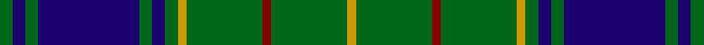

This page is one **sett** — a single exact thread-count. It belongs to the [tartan](/setts/g3db3g3db24g3db3g3lo2g18r2g18lo2/)
(the same proportion at any scale), whose colour order is pattern [GBGBGBGYGRGY](/stripes/gbgbgbgygrgy/).

Part of the [Greenways Marketing Intl](/tartans/greenways-marketing-intl/) tartan — the named design grouping this sett with its other cloths.

Sourced from register-of-tartans.  It is a [12 stripe tartan](/stripes/stripes12/).

Original link https://www.tartanregister.gov.uk/tartanDetails.aspx?ref=1532

## Register references

External register numbers recorded for this tartan.

- Scottish Register of Tartans: [1532](https://www.tartanregister.gov.uk/tartanDetails.aspx?ref=1532)
- Scottish Tartans Authority (ITI): 5116

## Thread count
G/6 DB6 G6 DB48 G6 DB6 G6 DY4 G36 DR4 G36 DY/4

One full sett is **326 threads**.

## Palette

Palette: <strong>Tartan Register</strong> <small style="color:#888">(3 of 4 colours)</small>
<table><thead><tr><th>Colour</th><th>Threads</th><th>Shade</th><th>Base</th><th>OKLCh</th></tr></thead><tbody><tr><td>G/</td><td style="text-align:right;font-variant-numeric:tabular-nums">6</td><td><code style="background-color:#006818;">#006818</code> <small style="color:#888">#006818</small></td><td>G <code style="background-color:#006100;">#006100</code></td><td><small style="color:#888">oklch(45.0% 0.142 145.0)</small></td></tr><tr><td>DB</td><td style="text-align:right;font-variant-numeric:tabular-nums">6</td><td><code style="background-color:#1C0070;">#1C0070</code> <small style="color:#888">#1C0070</small></td><td>B <code style="background-color:#2A418A;">#2A418A</code></td><td><small style="color:#888">oklch(26.3% 0.162 277.1)</small></td></tr><tr><td>G</td><td style="text-align:right;font-variant-numeric:tabular-nums">6</td><td><code style="background-color:#006818;">#006818</code> <small style="color:#888">#006818</small></td><td>G <code style="background-color:#006100;">#006100</code></td><td><small style="color:#888">oklch(45.0% 0.142 145.0)</small></td></tr><tr><td>DB</td><td style="text-align:right;font-variant-numeric:tabular-nums">48</td><td><code style="background-color:#1C0070;">#1C0070</code> <small style="color:#888">#1C0070</small></td><td>B <code style="background-color:#2A418A;">#2A418A</code></td><td><small style="color:#888">oklch(26.3% 0.162 277.1)</small></td></tr><tr><td>G</td><td style="text-align:right;font-variant-numeric:tabular-nums">6</td><td><code style="background-color:#006818;">#006818</code> <small style="color:#888">#006818</small></td><td>G <code style="background-color:#006100;">#006100</code></td><td><small style="color:#888">oklch(45.0% 0.142 145.0)</small></td></tr><tr><td>DB</td><td style="text-align:right;font-variant-numeric:tabular-nums">6</td><td><code style="background-color:#1C0070;">#1C0070</code> <small style="color:#888">#1C0070</small></td><td>B <code style="background-color:#2A418A;">#2A418A</code></td><td><small style="color:#888">oklch(26.3% 0.162 277.1)</small></td></tr><tr><td>G</td><td style="text-align:right;font-variant-numeric:tabular-nums">6</td><td><code style="background-color:#006818;">#006818</code> <small style="color:#888">#006818</small></td><td>G <code style="background-color:#006100;">#006100</code></td><td><small style="color:#888">oklch(45.0% 0.142 145.0)</small></td></tr><tr><td>DY</td><td style="text-align:right;font-variant-numeric:tabular-nums">4</td><td><code style="background-color:#D09800;">#D09800</code> <small style="color:#888">#D09800</small></td><td>Y <code style="background-color:#F2BF00;">#F2BF00</code></td><td><small style="color:#888">oklch(71.4% 0.147 82.1)</small></td></tr><tr><td>G</td><td style="text-align:right;font-variant-numeric:tabular-nums">36</td><td><code style="background-color:#006818;">#006818</code> <small style="color:#888">#006818</small></td><td>G <code style="background-color:#006100;">#006100</code></td><td><small style="color:#888">oklch(45.0% 0.142 145.0)</small></td></tr><tr><td>DR</td><td style="text-align:right;font-variant-numeric:tabular-nums">4</td><td><code style="background-color:#880000;">#880000</code> <small style="color:#888">#880000</small></td><td>R <code style="background-color:#CC0000;">#CC0000</code></td><td><small style="color:#888">oklch(39.4% 0.162 29.2)</small></td></tr><tr><td>G</td><td style="text-align:right;font-variant-numeric:tabular-nums">36</td><td><code style="background-color:#006818;">#006818</code> <small style="color:#888">#006818</small></td><td>G <code style="background-color:#006100;">#006100</code></td><td><small style="color:#888">oklch(45.0% 0.142 145.0)</small></td></tr><tr><td>DY/</td><td style="text-align:right;font-variant-numeric:tabular-nums">4</td><td><code style="background-color:#D09800;">#D09800</code> <small style="color:#888">#D09800</small></td><td>Y <code style="background-color:#F2BF00;">#F2BF00</code></td><td><small style="color:#888">oklch(71.4% 0.147 82.1)</small></td></tr></tbody></table>

## Nearest tartans

The nearest existing variants by ΔTartan distance, with this tartan at the top so the swatches line up against it.

ΔTartan

Tartan

Sett

—

<a href="/ttd/edit/#slug=g3db3g3db24g3db3g3lo2g18r2g18lo2~x2">Greenways Marketing Intl</a> <a class="nn-out" href="/variants/s12/g3db3g3db24g3db3g3lo2g18r2g18lo2~x2/" title="open its dictionary page">↗</a>

0.97

<a href="/ttd/edit/#slug=r2db12w1db1g1r1g7db1g12w1~x4&amp;base=g3db3g3db24g3db3g3lo2g18r2g18lo2~x2">Tennessee State (US State)</a> <a class="nn-out" href="/variants/s10/r2db12w1db1g1r1g7db1g12w1~x4/" title="open its dictionary page">↗</a>

0.98

<a href="/ttd/edit/#slug=db1k1db8ly1g12ly1db8k1db1~x2&amp;base=g3db3g3db24g3db3g3lo2g18r2g18lo2~x2">Rowan</a> <a class="nn-out" href="/variants/s9/db1k1db8ly1g12ly1db8k1db1~x2/" title="open its dictionary page">↗</a>

0.98

<a href="/ttd/edit/#slug=r4g4k2g31k10ly3g5k11g6k3~x2&amp;base=g3db3g3db24g3db3g3lo2g18r2g18lo2~x2">MacArthur-Fox Green</a> <a class="nn-out" href="/variants/s10/r4g4k2g31k10ly3g5k11g6k3~x2/" title="open its dictionary page">↗</a>

1.02

<a href="/ttd/edit/#slug=k17o2k3g2k3g2k24b8g4b4g3b8~x2&amp;base=g3db3g3db24g3db3g3lo2g18r2g18lo2~x2">Kells Irish Pubs (Corporate)</a> <a class="nn-out" href="/variants/s12/k17o2k3g2k3g2k24b8g4b4g3b8~x2/" title="open its dictionary page">↗</a>

1.08

<a href="/ttd/edit/#slug=dg10r1dg1r2dg8db10dg1ly1~x4&amp;base=g3db3g3db24g3db3g3lo2g18r2g18lo2~x2">Glen Esk</a> <a class="nn-out" href="/variants/s8/dg10r1dg1r2dg8db10dg1ly1~x4/" title="open its dictionary page">↗</a>

1.08

<a href="/ttd/edit/#slug=g10k1g10db1g1k1g1k1db10k1lo1r1~x4&amp;base=g3db3g3db24g3db3g3lo2g18r2g18lo2~x2">Old Dobbs County (District)</a> <a class="nn-out" href="/variants/s12/g10k1g10db1g1k1g1k1db10k1lo1r1~x4/" title="open its dictionary page">↗</a>

1.09

<a href="/ttd/edit/#slug=k8w3k8g4k4g32k4g32k4g4k8w3k8t4~x2&amp;base=g3db3g3db24g3db3g3lo2g18r2g18lo2~x2">Hartmann (Personal)</a> <a class="nn-out" href="/variants/s14/k8w3k8g4k4g32k4g32k4g4k8w3k8t4~x2/" title="open its dictionary page">↗</a>

1.13

<a href="/ttd/edit/#slug=k4gi13k4g8k44g8k4gi13k4w3~x2&amp;base=g3db3g3db24g3db3g3lo2g18r2g18lo2~x2">Childers</a> <a class="nn-out" href="/variants/s10/k4gi13k4g8k44g8k4gi13k4w3~x2/" title="open its dictionary page">↗</a>

1.16

<a href="/ttd/edit/#slug=k6g3k3g28db4g4db10g4db4g4db24g5w3~x2&amp;base=g3db3g3db24g3db3g3lo2g18r2g18lo2~x2">Marthas Vineyard (District)</a> <a class="nn-out" href="/variants/s13/k6g3k3g28db4g4db10g4db4g4db24g5w3~x2/" title="open its dictionary page">↗</a>

1.18

<a href="/ttd/edit/#slug=dg40r3dg4r3dg12db32ly4r3~x2&amp;base=g3db3g3db24g3db3g3lo2g18r2g18lo2~x2">U.S. Marine Corps (Military?)</a> <a class="nn-out" href="/variants/s8/dg40r3dg4r3dg12db32ly4r3~x2/" title="open its dictionary page">↗</a>

## Neighbour map

Every grey dot is one of 14360 variants placed by the first two principal components of the ΔTartan feature space (44% of its variance). Red is this tartan; blue dots are its nearest — click one to open its page.

<svg viewBox="0 0 640 380" role="img" style="max-width:100%;height:auto;border:1px solid #e0e0e0;border-radius:4px;display:block" xmlns="http://www.w3.org/2000/svg"><image href="/nn/cloud.v1.png" width="640" height="380"/><a href="/variants/s10/r2db12w1db1g1r1g7db1g12w1~x4/"><circle cx="300.8" cy="173.4" r="4" fill="#3465a4"><title>Tennessee State (US State)</title></circle></a><a href="/variants/s9/db1k1db8ly1g12ly1db8k1db1~x2/"><circle cx="296.9" cy="177.8" r="4" fill="#3465a4"><title>Rowan</title></circle></a><a href="/variants/s10/r4g4k2g31k10ly3g5k11g6k3~x2/"><circle cx="349.3" cy="176.5" r="4" fill="#3465a4"><title>MacArthur-Fox Green</title></circle></a><a href="/variants/s12/k17o2k3g2k3g2k24b8g4b4g3b8~x2/"><circle cx="324.7" cy="181.2" r="4" fill="#3465a4"><title>Kells Irish Pubs (Corporate)</title></circle></a><a href="/variants/s8/dg10r1dg1r2dg8db10dg1ly1~x4/"><circle cx="324.4" cy="208.7" r="4" fill="#3465a4"><title>Glen Esk</title></circle></a><a href="/variants/s12/g10k1g10db1g1k1g1k1db10k1lo1r1~x4/"><circle cx="303.6" cy="162.0" r="4" fill="#3465a4"><title>Old Dobbs County (District)</title></circle></a><a href="/variants/s14/k8w3k8g4k4g32k4g32k4g4k8w3k8t4~x2/"><circle cx="315.1" cy="171.3" r="4" fill="#3465a4"><title>Hartmann (Personal)</title></circle></a><a href="/variants/s10/k4gi13k4g8k44g8k4gi13k4w3~x2/"><circle cx="329.1" cy="171.7" r="4" fill="#3465a4"><title>Childers</title></circle></a><a href="/variants/s13/k6g3k3g28db4g4db10g4db4g4db24g5w3~x2/"><circle cx="271.0" cy="186.5" r="4" fill="#3465a4"><title>Marthas Vineyard (District)</title></circle></a><a href="/variants/s8/dg40r3dg4r3dg12db32ly4r3~x2/"><circle cx="342.1" cy="189.2" r="4" fill="#3465a4"><title>U.S. Marine Corps (Military?)</title></circle></a><circle cx="335.0" cy="175.1" r="5" fill="#c00000"/></svg>

ID: /variants/s12/g3db3g3db24g3db3g3lo2g18r2g18lo2~x2/
