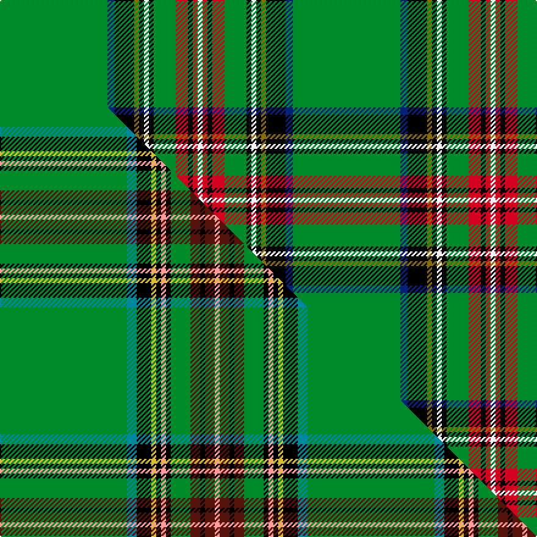

This is one **variant** — a specific cloth: this exact thread count and colourway, with its own
provenance below. It is one weaving of the [sett](/tartans/p/pr/princess-mary/) (the scale-free proportion — the
same cloth at any scale or shade), whose colour order is pattern [GBKGKWKGRKRW](/stripes/gbkgkwkgrkrw/).

Part of the [Princess Mary](/tartans/p/pr/princess-mary/) tartan — the named design grouping this sett with its other cloths.

Sourced from house-of-tartan.  It is a [12 stripe tartan](/stripes/stripes12/).

Original link [http://www.house-of-tartan.scotland.net/house/TartanViewjs.asp?colr=Def&tnam=735](http://www.house-of-tartan.scotland.net/house/TartanViewjs.asp?colr=Def&tnam=735)

## Provenance

Earliest known date: pre 1930 Colours reversed from MacGregor

3 attestations — the source records this cloth was collapsed from (oldest owns this page)

<ul>
<li>pre 1930 — Princess Mary Royal Family Tartan (house-of-tartan, <a href="http://www.house-of-tartan.scotland.net/house/TartanViewjs.asp?colr=Def&tnam=735">record</a>) </li>
<li>undated — Princess Mary (register-of-tartans, <a href="https://www.tartanregister.gov.uk/tartanDetails.aspx?ref=3408">record</a>)  <em>Mackinlay stripe from his hand coloured collection, now in the Scottish Tartans Society archive, Royal Tartan.</em></li>
<li>undated — Princess Mary (weddslist, <a href="http://www.weddslist.com/cgi-bin/tartans/pg.pl?source=sts">record</a>) </li>
</ul>

Dataset <small>— provenance for this record, inherited from the source manifest</small>

<dl class="dataset-prov">
<dt>source</dt><dd><a href="/sources/house-of-tartan/">House of Tartan</a></dd>
<dt>data captured from</dt><dd><a href="https://github.com/thetartan/tartan-database/blob/master/data/house-of-tartan/data.csv">https://github.com/thetartan/tartan-database/blob/master/data/house-of-tartan/data.csv</a></dd>
<dt>data date</dt><dd>pre 1930 <small>(this record)</small></dd>
<dt>licence</dt><dd><a href="https://creativecommons.org/licenses/by-nc-nd/4.0/">CC BY-NC-ND 4.0</a></dd>
</dl>

Capture chain <small>— the hands this data passed through, oldest first; each capture carries its own licence</small>

<ol class="capture-chain">
<li><a href="http://www.house-of-tartan.scotland.net/">House of Tartan</a> <small>the weaver/retailer's database — the site is now offline; the URL is kept as the ultimate source's identity</small></li>
<li><a href="https://github.com/thetartan/tartan-database">thetartan/tartan-database</a> <small>2016-2017</small> · <a href="https://creativecommons.org/licenses/by-nc-nd/4.0/">CC BY-NC-ND 4.0</a> <small>Levko Kravets's frozen compilation — the capture we vendored, and where its CC licence text came from</small></li>
<li>this dictionary <small>captured 2026-06-10 · commit 5bf86c7566</small> <small>each re-capture is a git commit to data/sources</small></li>
</ol>

## Register references

External register numbers recorded for this tartan.

- Scottish Register of Tartans: [3408](https://www.tartanregister.gov.uk/tartanDetails.aspx?ref=3408)
- Scottish Tartans World Register: 735

## Thread count
G/88 DB6 K16 Y4 K4 W4 K4 G18 R10 K4 R4 W/4

One full sett is **240 threads**.

## Palette
<table><thead><tr><th>Colour</th><th>Shade</th><th>OKLCh</th></tr></thead><tbody><tr><td>DB</td><td><code style="background-color:#082077;">#082077</code> <small style="color:#888">#082077</small></td><td><small style="color:#888">oklch(30.0% 0.149 265.1)</small></td></tr><tr><td>G</td><td><code style="background-color:#008B2A;">#008B2A</code> <small style="color:#888">#008B2A</small></td><td><small style="color:#888">oklch(55.4% 0.170 145.9)</small></td></tr><tr><td>K</td><td><code style="background-color:#000000;">#000000</code> <small style="color:#888">#000000</small></td><td><small style="color:#888">oklch(0.0% 0.000 0.0)</small></td></tr><tr><td>W</td><td><code style="background-color:#F7F7F7;">#F7F7F7</code> <small style="color:#888">#F7F7F7</small></td><td><small style="color:#888">oklch(97.6% 0.000 89.9)</small></td></tr><tr><td>R</td><td><code style="background-color:#D60020;">#D60020</code> <small style="color:#888">#D60020</small></td><td><small style="color:#888">oklch(55.2% 0.224 25.5)</small></td></tr><tr><td>Y</td><td><code style="background-color:#8B6E00;">#8B6E00</code> <small style="color:#888">#8B6E00</small></td><td><small style="color:#888">oklch(55.1% 0.113 90.4)</small></td></tr></tbody></table>

# Sample pattern

## Compared to the master

This cloth is one sett of its design; the master sett (the exemplar the design is anchored on) is below for comparison.

Its **ΔTartan distance** from the master is **0.90** — the same measure the nearest-tartans table ranks by (0 is identical; a re-scale of the same cloth is near 0, a recolour or a different proportion further).

<figure class="master-compare" style="margin:0">

this sett
master sett ★

<figcaption style="color:#888;font-size:smaller">One weave of this sett against the <a href="/setts/g26t2k3ly1k1lr1k1g4dr2k1dr2lr1/">master sett ★</a>, split on the diagonal: a shared proportion runs seamlessly across it with only the shades shifting; a different proportion breaks on it.</figcaption>
</figure>

## Nearest tartan variants

The nearest existing variants by ΔTartan distance, with this cloth at the top so the swatches line up against it.

ΔTartan

Threads

Variant

Sett

—

240

<a href="/variants/s12/g44db3k8y2k2w2k2g9r5k2r2w2~x2/">Princess Mary Royal Family Tartan</a>

<a href="/ttd/edit/#slug=g42t3k8y2k2w3k2g12r5k2r2w2~x2&amp;base=g44db3k8y2k2w2k2g9r5k2r2w2~x2" title="compare in the TTD">0.13</a>

252

<a href="/variants/s12/g42t3k8y2k2w3k2g12r5k2r2w2~x2/">King George VI (Green Stewart)</a>

<a href="/ttd/edit/#slug=g26t2k3ly1k1lr1k1g4dr2k1dr2lr1~x4&amp;base=g44db3k8y2k2w2k2g9r5k2r2w2~x2" title="compare in the TTD">0.90</a>

252

<a href="/variants/s12/g26t2k3ly1k1lr1k1g4dr2k1dr2lr1~x4/">Princess Mary #2</a>

<a href="/ttd/edit/#slug=dg40r5k2w2k2y3k2dg10r3k3~x2~dg4112135&amp;base=g44db3k8y2k2w2k2g9r5k2r2w2~x2" title="compare in the TTD">1.87</a>

202

<a href="/variants/s10/dg40r5k2w2k2y3k2dg10r3k3~x2~dg4112135/">Arnold Palmer Corporate Tartan</a>

<a href="/ttd/edit/#slug=g32lb2k7y1k1w1k2r7g5k1g3w1~x2&amp;base=g44db3k8y2k2w2k2g9r5k2r2w2~x2" title="compare in the TTD">1.96</a>

186

<a href="/variants/s12/g32lb2k7y1k1w1k2r7g5k1g3w1~x2/">Stuart/Stewart (Variant)</a>

<a href="/ttd/edit/#slug=db6g48k4y4k4w4g20r10k4r6w5&amp;base=g44db3k8y2k2w2k2g9r5k2r2w2~x2" title="compare in the TTD">2.11</a>

219

<a href="/variants/s11/db6g48k4y4k4w4g20r10k4r6w5/">Steel (Personal)</a>

<a href="/ttd/edit/#slug=g70db3k9w4k4dr4k3db12g9k4g4y4~x2&amp;base=g44db3k8y2k2w2k2g9r5k2r2w2~x2" title="compare in the TTD">2.19</a>

372

<a href="/variants/s12/g70db3k9w4k4dr4k3db12g9k4g4y4~x2/">Canmore Highland Games</a>

<a href="/ttd/edit/#slug=g70db3k9w4k4dp4k3db12g9k4g4y4~x2&amp;base=g44db3k8y2k2w2k2g9r5k2r2w2~x2" title="compare in the TTD">2.22</a>

372

<a href="/variants/s12/g70db3k9w4k4dp4k3db12g9k4g4y4~x2/">Canmore Highland Games (Corporate)</a>

<a href="/ttd/edit/#slug=g64k4db9dy2db4dy2db4g11r8db2r4w3~x2&amp;base=g44db3k8y2k2w2k2g9r5k2r2w2~x2" title="compare in the TTD">2.30</a>

334

<a href="/variants/s12/g64k4db9dy2db4dy2db4g11r8db2r4w3~x2/">Sillars (Name)</a>

<a href="/ttd/edit/#slug=g16k8g1k1lb1g1lb1lo1g1k1n1g4k1~x4&amp;base=g44db3k8y2k2w2k2g9r5k2r2w2~x2" title="compare in the TTD">2.58</a>

236

<a href="/variants/s13/g16k8g1k1lb1g1lb1lo1g1k1n1g4k1~x4/">Savoy</a>

<a href="/ttd/edit/#slug=g2w5dg1k7w1dg2k6dg6g9r1g30lo2g3w2~x2&amp;base=g44db3k8y2k2w2k2g9r5k2r2w2~x2" title="compare in the TTD">2.61</a>

300

<a href="/variants/s14/g2w5dg1k7w1dg2k6dg6g9r1g30lo2g3w2~x2/">Reilly fae the Mearns (Personal)</a>

## Neighbour map

Every grey dot is one of 13662 variants placed by the first two principal components of the ΔTartan feature space (42% of its variance). Red is this tartan; blue dots are its nearest — click one to open its page. The map is a flat projection of a many-dimensional space — [how to read it](/posts/neighbourhood-maps/).

<svg viewBox="0 0 640 380" role="img" style="max-width:100%;height:auto;border:1px solid #e0e0e0;border-radius:4px;display:block" xmlns="http://www.w3.org/2000/svg"><image href="/nn/cloud.v1.png" width="640" height="380"/><a href="/variants/s12/g42t3k8y2k2w3k2g12r5k2r2w2~x2/"><circle cx="199.1" cy="45.2" r="4" fill="#3465a4"><title>King George VI (Green Stewart)</title></circle></a><a href="/variants/s12/g26t2k3ly1k1lr1k1g4dr2k1dr2lr1~x4/"><circle cx="341.4" cy="56.4" r="4" fill="#3465a4"><title>Princess Mary #2</title></circle></a><a href="/variants/s10/dg40r5k2w2k2y3k2dg10r3k3~x2~dg4112135/"><circle cx="383.0" cy="92.9" r="4" fill="#3465a4"><title>Arnold Palmer Corporate Tartan</title></circle></a><a href="/variants/s12/g32lb2k7y1k1w1k2r7g5k1g3w1~x2/"><circle cx="305.6" cy="49.0" r="4" fill="#3465a4"><title>Stuart/Stewart (Variant)</title></circle></a><a href="/variants/s11/db6g48k4y4k4w4g20r10k4r6w5/"><circle cx="234.8" cy="109.2" r="4" fill="#3465a4"><title>Steel (Personal)</title></circle></a><a href="/variants/s12/g70db3k9w4k4dr4k3db12g9k4g4y4~x2/"><circle cx="307.6" cy="63.9" r="4" fill="#3465a4"><title>Canmore Highland Games</title></circle></a><a href="/variants/s12/g70db3k9w4k4dp4k3db12g9k4g4y4~x2/"><circle cx="307.2" cy="63.7" r="4" fill="#3465a4"><title>Canmore Highland Games (Corporate)</title></circle></a><a href="/variants/s12/g64k4db9dy2db4dy2db4g11r8db2r4w3~x2/"><circle cx="343.6" cy="57.3" r="4" fill="#3465a4"><title>Sillars (Name)</title></circle></a><a href="/variants/s13/g16k8g1k1lb1g1lb1lo1g1k1n1g4k1~x4/"><circle cx="281.8" cy="92.2" r="4" fill="#3465a4"><title>Savoy</title></circle></a><a href="/variants/s14/g2w5dg1k7w1dg2k6dg6g9r1g30lo2g3w2~x2/"><circle cx="243.2" cy="62.6" r="4" fill="#3465a4"><title>Reilly fae the Mearns (Personal)</title></circle></a><circle cx="296.6" cy="60.7" r="5" fill="#c00000"/><text x="320" y="376" text-anchor="middle" font-size="11" fill="#999">ground</text><text x="11" y="190" text-anchor="middle" font-size="11" fill="#999" transform="rotate(-90 11 190)">complexity</text></svg>

ID: /variants/s12/g44db3k8y2k2w2k2g9r5k2r2w2~x2/
