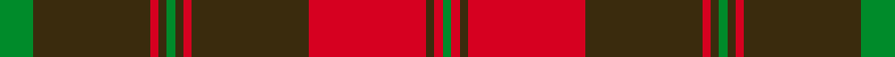

This page is one **sett** — a single exact thread-count. It belongs to the [tartan](/setts/g4dy14r1dy1g1dy1r1dy14r14dy1r1g1/)
(the same proportion at any scale), whose colour order is pattern [GGRGGGRGRGRG](/stripes/ggrgggrgrgrg/).

Part of the [Frame](/tartans/frame-2/) tartan — the named design grouping this sett with its other cloths.

Sourced from register-of-tartans.  It is a [12 stripe tartan](/stripes/stripes12/).

Original link https://www.tartanregister.gov.uk/tartanDetails.aspx?ref=10614

## Register references

External register numbers recorded for this tartan.

- Scottish Register of Tartans: [10614](https://www.tartanregister.gov.uk/tartanDetails.aspx?ref=10614)

## Thread count
G/16 DY56 R4 DY4 G4 DY4 R4 DY56 R56 DY4 R4 G/4

One full sett is **412 threads**.

## Palette
<table><thead><tr><th>Colour</th><th>Shade</th><th>OKLCh</th></tr></thead><tbody><tr><td>DR</td><td><code style="background-color:#3A2B0D;">#3A2B0D</code> <small style="color:#888">#3A2B0D</small></td><td><small style="color:#888">oklch(30.0% 0.049 82.0)</small></td></tr><tr><td>DRa</td><td><code style="background-color:#D60020;">#D60020</code> <small style="color:#888">#D60020</small></td><td><small style="color:#888">oklch(55.2% 0.224 25.5)</small></td></tr><tr><td>G</td><td><code style="background-color:#008B2A;">#008B2A</code> <small style="color:#888">#008B2A</small></td><td><small style="color:#888">oklch(55.4% 0.170 145.9)</small></td></tr></tbody></table>

# Sample pattern

## Nearest variants

The nearest existing variants by ΔTartan distance, with this cloth at the top so the swatches line up against it.

ΔTartan

Threads

Variant

Sett

—

412

<a href="/variants/s12/g4dy14r1dy1g1dy1r1dy14r14dy1r1g1~x4/">Frame (Ferniegair) (Personal)</a>

<a href="/ttd/edit/#slug=dg4dy14r1dy1dg1dy1r1dy14r14dy1r1dg1~x4&amp;base=g4dy14r1dy1g1dy1r1dy14r14dy1r1g1~x4" title="compare in the TTD">0.00</a>

412

<a href="/variants/s12/dg4dy14r1dy1dg1dy1r1dy14r14dy1r1dg1~x4/">Frame - Ferniegair (Personal)</a>

## Neighbour map

Every grey dot is one of 13620 variants placed by the first two principal components of the ΔTartan feature space (42% of its variance). Red is this tartan; blue dots are its nearest — click one to open its page.

<svg viewBox="0 0 640 380" role="img" style="max-width:100%;height:auto;border:1px solid #e0e0e0;border-radius:4px;display:block" xmlns="http://www.w3.org/2000/svg"><image href="/nn/cloud.v1.png" width="640" height="380"/><a href="/variants/s12/dg4dy14r1dy1dg1dy1r1dy14r14dy1r1dg1~x4/"><circle cx="417.0" cy="171.8" r="4" fill="#3465a4"><title>Frame - Ferniegair (Personal)</title></circle></a><circle cx="392.0" cy="163.8" r="5" fill="#c00000"/><text x="320" y="376" text-anchor="middle" font-size="11" fill="#999">ground</text><text x="11" y="190" text-anchor="middle" font-size="11" fill="#999" transform="rotate(-90 11 190)">complexity</text></svg>

ID: /variants/s12/g4dy14r1dy1g1dy1r1dy14r14dy1r1g1~x4/
