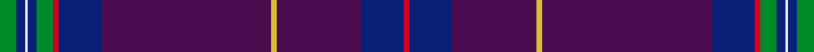

This is one **variant** — a specific cloth: this exact thread count and colourway, with its own
provenance below. It is one weaving of the [sett](/tartans/r/ro/roslin-roseline-da-vinci/) (the scale-free proportion — the
same cloth at any scale or shade), whose colour order is pattern [GBWBGRBBYBBR](/stripes/gbwbgrbbybbr/).

Part of the [Roslin Roseline Da Vinci](/tartans/r/ro/roslin-roseline-da-vinci/) tartan — the named design grouping this sett with its other cloths.

Sourced from register-of-tartans.  It is a [12 stripe tartan](/stripes/stripes12/).

Original link [https://www.tartanregister.gov.uk/tartanDetails.aspx?ref=5349](https://www.tartanregister.gov.uk/tartanDetails.aspx?ref=5349)

2 attestations — the source records this cloth was collapsed from (oldest owns this page)

<ul>
<li>01/01/2006 — Roslin Roseline Da Vinci (register-of-tartans, <a href="https://www.tartanregister.gov.uk/tartanDetails.aspx?ref=5349">record</a>)  <em>Assymetric. Designed to commemorate Dan Brown's hugely successful book The Da Vinci Code and to highlight the role of Rosslyn Chapel - just six miles south of Edinburgh. The tartan is based on the Sinclair tartan - it was Sir William St. Clair (third and last Prince of Orkney) who founded the Chapel in 1446. The design is unusual in that it is not symmetrical and uses the 'mystical' Divine Proportion or Golden Section to position the gold line on the blue. Also called the Golden Mean this ratio (1.61803) occurs naturally in nature and has been used by artists stretching from Ancient Greece to Da Vinci and through to modern times. The blue and white are from the Scottish flag - the Saltire - and the white further represents the human spirit and the white dove that nested in Rosslyn Chapel in the year that that The Da Vinci Code film was released. Purple pays homage to Scotland's famous heather and the red represents the legendary Rose Line - an energy line on which the Chapel is said to lie. Red is also the colour of Mary Magdalene's hair in Da Vinci's iconic painting, The Last Supper. Finally, the green takes us back to the Chapel and over 100 green men - stone gargoyles whose mouths spout ivy and vines and who were pagan, pre-Christian figures of fertility and power. All these design elements combine to provide a truly unique memento of Scotland's part in the blockbuster film</em></li>
<li>2006 January — Roslin Roseline Da Vinci (Corporate) (tartans-authority, <a href="https://web.archive.org/web/*/http://www.tartansauthority.com/tartan-ferret/display/6838/*">record</a>)  <em>Asymmetric. Designed to commemorate Dan Brown's hugely successful book The Da Vinci Code and to highlight the role of Rosslyn Chapel - just six miles south of Edinburgh. The tartan is based on the Sinclair tartan - it was Sir William St. Clair (third and last Prince of Orkney) who founded the Chapel in 1446. The design is unusual in that it is not symmetrical and uses the 'mystical' Divine Proportion or Golden Section to position the gold line on the Royal Purple. Also called the Golden Mean this ratio (1.61803) occurs naturally in nature and has been used by artists stretching from Ancient Greece to Da Vinci and through to modern times. The blue and white are from the Scottish flag - the Saltire - and the white further represents the human spirit and the white dove that nested in Rosslyn Chapel in the year that The Da Vinci Code film was released. The purple also pays homage to Scotland's famous heather and the red represents the legendary Rose Line - an energy line on which the Chapel is said to lie. Red is also the colour of Mary Magdalene's hair in Da Vinci's iconic painting, The Last Supper. Finally, the green takes us back to the Chapel and over 100 green men - stone gargoyles whose mouths spout ivy and vines and who were pagan, pre-Christian figures of fertility and power. All these design elements combine to provide a truly unique memento of Scotland's part in the blockbuster film</em></li>
</ul>

Dataset <small>— provenance for this record, inherited from the source manifest</small>

<dl class="dataset-prov">
<dt>source</dt><dd><a href="/sources/register-of-tartans/">Scottish Register of Tartans</a></dd>
<dt>data captured from</dt><dd><a href="https://github.com/thetartan/tartan-database/blob/master/data/register-of-tartans/data.csv">https://github.com/thetartan/tartan-database/blob/master/data/register-of-tartans/data.csv</a></dd>
<dt>data date</dt><dd>2006 <small>(this record)</small></dd>
<dt>licence</dt><dd><a href="https://www.tartanregister.gov.uk/copyright">Crown copyright</a></dd>
</dl>

Capture chain <small>— the hands this data passed through, oldest first; each capture carries its own licence</small>

<ol class="capture-chain">
<li><a href="https://www.tartanregister.gov.uk/">Scottish Register of Tartans</a> · <a href="https://www.tartanregister.gov.uk/copyright">Crown copyright</a> <small>the living register — still published by National Records of Scotland</small></li>
<li><a href="https://github.com/thetartan/tartan-database">thetartan/tartan-database</a> <small>2016-2017</small> · <a href="https://creativecommons.org/licenses/by-nc-nd/4.0/">CC BY-NC-ND 4.0</a> <small>Levko Kravets's frozen compilation — the capture we vendored, and where its CC licence text came from</small></li>
<li>this dictionary <small>captured 2026-06-10 · commit 5bf86c7566</small> <small>each re-capture is a git commit to data/sources</small></li>
</ol>

## Register references

External register numbers recorded for this tartan.

- Scottish Register of Tartans: [5349](https://www.tartanregister.gov.uk/tartanDetails.aspx?ref=5349)
- Scottish Tartans Authority (ITI): 6838

## Thread count
G/12 DB6 W2 DB6 G12 R4 DB30 DP120 LY4 DP60 DB30 R/4

One full sett is **564 threads**.

## Palette
<table><thead><tr><th>Colour</th><th>Shade</th><th>OKLCh</th></tr></thead><tbody><tr><td>DB</td><td><code style="background-color:#082077;">#082077</code> <small style="color:#888">#082077</small></td><td><small style="color:#888">oklch(30.0% 0.149 265.1)</small></td></tr><tr><td>DP</td><td><code style="background-color:#4B0B4F;">#4B0B4F</code> <small style="color:#888">#4B0B4F</small></td><td><small style="color:#888">oklch(30.1% 0.125 325.4)</small></td></tr><tr><td>LY</td><td><code style="background-color:#DCBC32;">#DCBC32</code> <small style="color:#888">#DCBC32</small></td><td><small style="color:#888">oklch(80.0% 0.150 95.2)</small></td></tr><tr><td>G</td><td><code style="background-color:#008B2A;">#008B2A</code> <small style="color:#888">#008B2A</small></td><td><small style="color:#888">oklch(55.4% 0.170 145.9)</small></td></tr><tr><td>R</td><td><code style="background-color:#D60020;">#D60020</code> <small style="color:#888">#D60020</small></td><td><small style="color:#888">oklch(55.2% 0.224 25.5)</small></td></tr><tr><td>W</td><td><code style="background-color:#F7F7F7;">#F7F7F7</code> <small style="color:#888">#F7F7F7</small></td><td><small style="color:#888">oklch(97.6% 0.000 89.9)</small></td></tr></tbody></table>

# Sample pattern

## Nearest tartan variants

The nearest existing variants by ΔTartan distance, with this cloth at the top so the swatches line up against it.

ΔTartan

Threads

Variant

Sett

—

564

<a href="/variants/s12/g6db3w1db3g6r2db15dp60ly2dp30db15r2~x2/">Roslin Roseline Da Vinci</a>

<a href="/ttd/edit/#slug=dp38k4dp2o6db11o3db2g2dp11k1w2~x2&amp;base=g6db3w1db3g6r2db15dp60ly2dp30db15r2~x2" title="compare in the TTD">3.38</a>

248

<a href="/variants/s11/dp38k4dp2o6db11o3db2g2dp11k1w2~x2/">Highland Thistle</a>

<a href="/ttd/edit/#slug=dt50dp3k3dt11dp8dt2r6dt2db8dt2w4~x2~dt1204274-db1406275&amp;base=g6db3w1db3g6r2db15dp60ly2dp30db15r2~x2" title="compare in the TTD">3.56</a>

288

<a href="/variants/s11/db50dp3k3db11dp8db2r6db2dbi8db2w4~x2~db1204274-dbi1406275/">Scottish American</a>

<a href="/ttd/edit/#slug=n28r1n4dp12n2db4y2db4n2dp12n4r1n48r3w3db3~x2&amp;base=g6db3w1db3g6r2db15dp60ly2dp30db15r2~x2" title="compare in the TTD">3.59</a>

470

<a href="/variants/s16/n28r1n4dp12n2db4y2db4n2dp12n4r1n48r3w3db3~x2/">Wallenberg, Nicolas Dress (Personal)</a>

<a href="/ttd/edit/#slug=db5g9r3db18dr80y3dr40db18r3g9db5w2~x2&amp;base=g6db3w1db3g6r2db15dp60ly2dp30db15r2~x2" title="compare in the TTD">3.60</a>

766

<a href="/variants/s12/db5g9r3db18dr80y3dr40db18r3g9db5w2~x2/">Roseline</a>

<a href="/ttd/edit/#slug=n60g2db4r1db4g2n3w1dp20w1n5db2~x2&amp;base=g6db3w1db3g6r2db15dp60ly2dp30db15r2~x2" title="compare in the TTD">3.77</a>

296

<a href="/variants/s12/n60g2db4r1db4g2n3w1dp20w1n5db2~x2/">Scottish Parliament Official (Corp)</a>

## Neighbour map

Every grey dot is one of 13656 variants placed by the first two principal components of the ΔTartan feature space (42% of its variance). Red is this tartan; blue dots are its nearest — click one to open its page. The map is a flat projection of a many-dimensional space — [how to read it](/posts/neighbourhood-maps/).

<svg viewBox="0 0 640 380" role="img" style="max-width:100%;height:auto;border:1px solid #e0e0e0;border-radius:4px;display:block" xmlns="http://www.w3.org/2000/svg"><image href="/nn/cloud.v1.png" width="640" height="380"/><a href="/variants/s11/dp38k4dp2o6db11o3db2g2dp11k1w2~x2/"><circle cx="373.6" cy="69.1" r="4" fill="#3465a4"><title>Highland Thistle</title></circle></a><a href="/variants/s11/db50dp3k3db11dp8db2r6db2dbi8db2w4~x2~db1204274-dbi1406275/"><circle cx="414.2" cy="88.8" r="4" fill="#3465a4"><title>Scottish American</title></circle></a><a href="/variants/s16/n28r1n4dp12n2db4y2db4n2dp12n4r1n48r3w3db3~x2/"><circle cx="466.2" cy="74.1" r="4" fill="#3465a4"><title>Wallenberg, Nicolas Dress (Personal)</title></circle></a><a href="/variants/s12/db5g9r3db18dr80y3dr40db18r3g9db5w2~x2/"><circle cx="409.4" cy="85.1" r="4" fill="#3465a4"><title>Roseline</title></circle></a><a href="/variants/s12/n60g2db4r1db4g2n3w1dp20w1n5db2~x2/"><circle cx="480.3" cy="70.1" r="4" fill="#3465a4"><title>Scottish Parliament Official (Corp)</title></circle></a><circle cx="439.6" cy="81.3" r="5" fill="#c00000"/><text x="320" y="376" text-anchor="middle" font-size="11" fill="#999">ground</text><text x="11" y="190" text-anchor="middle" font-size="11" fill="#999" transform="rotate(-90 11 190)">complexity</text></svg>

ID: /variants/s12/g6db3w1db3g6r2db15dp60ly2dp30db15r2~x2/
