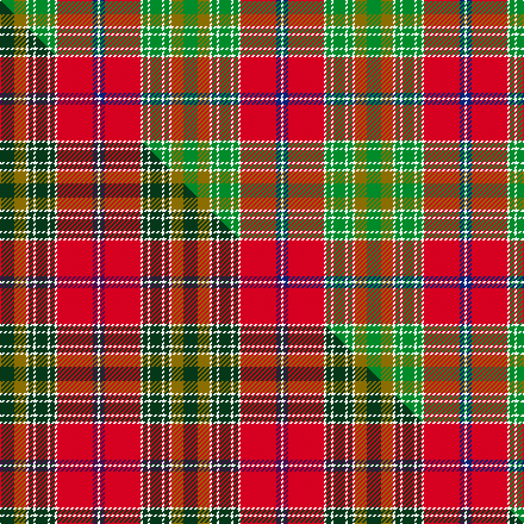

This is one **variant** — a specific cloth: this exact thread count and colourway, with its own
provenance below. It is one weaving of the [sett](/tartans/d/du/dunblane/) (the scale-free proportion — the
same cloth at any scale or shade), whose colour order is pattern [GGWGWGWGWRBW](/stripes/ggwgwgwgwrbw/).

Part of the [Dunblane](/tartans/d/du/dunblane/) tartan — the named design grouping this sett with its other cloths.

Sourced from house-of-tartan.  It is a [12 stripe tartan](/stripes/stripes12/).

Original link [http://www.house-of-tartan.scotland.net/house/TartanViewjs.asp?colr=Def&tnam=1022](http://www.house-of-tartan.scotland.net/house/TartanViewjs.asp?colr=Def&tnam=1022)

## Provenance

Earliest known date: 1729 Peregrine, 2nd Viscount Dunblane in a portrait hanging in Hornby Castle, Yorkshire.

2 attestations — the source records this cloth was collapsed from (oldest owns this page)

<ul>
<li>1729 — Dunblane District Tartan (house-of-tartan, <a href="http://www.house-of-tartan.scotland.net/house/TartanViewjs.asp?colr=Def&tnam=1022">record</a>) </li>
<li>undated — Dunblane (weddslist, <a href="http://www.weddslist.com/cgi-bin/tartans/pg.pl?source=sts">record</a>) </li>
</ul>

Dataset <small>— provenance for this record, inherited from the source manifest</small>

<dl class="dataset-prov">
<dt>source</dt><dd><a href="/sources/house-of-tartan/">House of Tartan</a></dd>
<dt>data captured from</dt><dd><a href="https://github.com/thetartan/tartan-database/blob/master/data/house-of-tartan/data.csv">https://github.com/thetartan/tartan-database/blob/master/data/house-of-tartan/data.csv</a></dd>
<dt>data date</dt><dd>1729 <small>(this record)</small></dd>
<dt>licence</dt><dd><a href="https://creativecommons.org/licenses/by-nc-nd/4.0/">CC BY-NC-ND 4.0</a></dd>
</dl>

Capture chain <small>— the hands this data passed through, oldest first; each capture carries its own licence</small>

<ol class="capture-chain">
<li><a href="http://www.house-of-tartan.scotland.net/">House of Tartan</a> <small>the weaver/retailer's database — the site is now offline; the URL is kept as the ultimate source's identity</small></li>
<li><a href="https://github.com/thetartan/tartan-database">thetartan/tartan-database</a> <small>2016-2017</small> · <a href="https://creativecommons.org/licenses/by-nc-nd/4.0/">CC BY-NC-ND 4.0</a> <small>Levko Kravets's frozen compilation — the capture we vendored, and where its CC licence text came from</small></li>
<li>this dictionary <small>captured 2026-06-10 · commit 5bf86c7566</small> <small>each re-capture is a git commit to data/sources</small></li>
</ol>

## Thread count
G/12 Y10 W2 G4 W2 G10 W2 G4 W2 R30 DB4 W/2

One full sett is **154 threads**.

## Palette
<table><thead><tr><th>Colour</th><th>Shade</th><th>OKLCh</th></tr></thead><tbody><tr><td>DB</td><td><code style="background-color:#082077;">#082077</code> <small style="color:#888">#082077</small></td><td><small style="color:#888">oklch(30.0% 0.149 265.1)</small></td></tr><tr><td>G</td><td><code style="background-color:#008B2A;">#008B2A</code> <small style="color:#888">#008B2A</small></td><td><small style="color:#888">oklch(55.4% 0.170 145.9)</small></td></tr><tr><td>W</td><td><code style="background-color:#F7F7F7;">#F7F7F7</code> <small style="color:#888">#F7F7F7</small></td><td><small style="color:#888">oklch(97.6% 0.000 89.9)</small></td></tr><tr><td>R</td><td><code style="background-color:#D60020;">#D60020</code> <small style="color:#888">#D60020</small></td><td><small style="color:#888">oklch(55.2% 0.224 25.5)</small></td></tr><tr><td>Y</td><td><code style="background-color:#8B6E00;">#8B6E00</code> <small style="color:#888">#8B6E00</small></td><td><small style="color:#888">oklch(55.1% 0.113 90.4)</small></td></tr></tbody></table>

# Sample pattern

## Compared to the master

This cloth is one sett of its design; the master sett (the exemplar the design is anchored on) is below for comparison.

Its **ΔTartan distance** from the master is **0.41** — the same measure the nearest-tartans table ranks by (0 is identical; a re-scale of the same cloth is near 0, a recolour or a different proportion further).

<figure class="master-compare" style="margin:0">

this sett
master sett ★

<figcaption style="color:#888;font-size:smaller">One weave of this sett against the <a href="/setts/dg6y5w1dg2w1dg5w1dg2w1r15dp2w1/">master sett ★</a>, split on the diagonal: a shared proportion runs seamlessly across it with only the shades shifting; a different proportion breaks on it.</figcaption>
</figure>

## Nearest tartan variants

The nearest existing variants by ΔTartan distance, with this cloth at the top so the swatches line up against it.

ΔTartan

Threads

Variant

Sett

—

154

<a href="/variants/s12/g6y5w1g2w1g5w1g2w1r15db2w1~x2/">Dunblane District Tartan</a>

<a href="/ttd/edit/#slug=dg6y5w1dg2w1dg5w1dg2w1r15dp2w1~x2&amp;base=g6y5w1g2w1g5w1g2w1r15db2w1~x2" title="compare in the TTD">0.41</a>

154

<a href="/variants/s12/dg6y5w1dg2w1dg5w1dg2w1r15dp2w1~x2/">Dunblane</a>

<a href="/ttd/edit/#slug=dg6y5w1dg2w1dg5w1dg2w1r15dp2w1~x4&amp;base=g6y5w1g2w1g5w1g2w1r15db2w1~x2" title="compare in the TTD">0.41</a>

308

<a href="/variants/s12/dg6y5w1dg2w1dg5w1dg2w1r15dp2w1~x4/">Dunblane (District)</a>

<a href="/ttd/edit/#slug=w1db4o8r4w1r4w1r4g16db2w1~x2&amp;base=g6y5w1g2w1g5w1g2w1r15db2w1~x2" title="compare in the TTD">1.74</a>

180

<a href="/variants/s11/w1db4o8r4w1r4w1r4g16db2w1~x2/">Stuart / Stewart, Riding Cloak</a>

<a href="/ttd/edit/#slug=o35w4o3y7o3w4o7do15n4w36n5~x2&amp;base=g6y5w1g2w1g5w1g2w1r15db2w1~x2" title="compare in the TTD">2.28</a>

412

<a href="/variants/s11/o35w4o3y7o3w4o7do15n4w36n5~x2/">MacKellar, dress</a>

<a href="/ttd/edit/#slug=g28lo18db4lo18ri3r2ri3r2ri3r2ri3~x2~ri2109032-r2109013&amp;base=g6y5w1g2w1g5w1g2w1r15db2w1~x2" title="compare in the TTD">2.29</a>

282

<a href="/variants/s11/g28lo18db4lo18ri3r2ri3r2ri3r2ri3~x2~ri2109032-r2109013/">Commonwealth Games - 2014</a>

<a href="/ttd/edit/#slug=ly25r2w2db2w2r13dy28db2r3~x2&amp;base=g6y5w1g2w1g5w1g2w1r15db2w1~x2" title="compare in the TTD">2.32</a>

260

<a href="/variants/s9/ly25r2w2db2w2r13dy28db2r3~x2/">Brousseau (Personal)</a>

<a href="/ttd/edit/#slug=w1db4dy8r4w1r4w1r4g16db2w1~x2&amp;base=g6y5w1g2w1g5w1g2w1r15db2w1~x2" title="compare in the TTD">2.36</a>

180

<a href="/variants/s11/w1db4dy8r4w1r4w1r4g16db2w1~x2/">Stuart/Stewart Riding Cloak</a>

<a href="/ttd/edit/#slug=r6w2r25dy2w9lg2lgi4lg2w9lg2lgi15dy2lgi2dy4~x2~lg2809145-lgi3204144&amp;base=g6y5w1g2w1g5w1g2w1r15db2w1~x2" title="compare in the TTD">2.55</a>

324

<a href="/variants/s14/r6w2r25dy2w9lg2lgi4lg2w9lg2lgi15dy2lgi2dy4~x2~lg2809145-lgi3204144/">Sakura (Japanese Four Seasons)</a>

<a href="/ttd/edit/#slug=g25r2w2db2w2r13dy28db2r3~x2&amp;base=g6y5w1g2w1g5w1g2w1r15db2w1~x2" title="compare in the TTD">2.55</a>

260

<a href="/variants/s9/g25r2w2db2w2r13dy28db2r3~x2/">Brousseau (Personal)</a>

<a href="/ttd/edit/#slug=r3y1dp1r20dr2dp9dr2g20dp1y1g3~x2&amp;base=g6y5w1g2w1g5w1g2w1r15db2w1~x2" title="compare in the TTD">2.57</a>

240

<a href="/variants/s11/r3y1dp1r20dr2dp9dr2g20dp1y1g3~x2/">Scotland (Personal)</a>

## Neighbour map

Every grey dot is one of 13656 variants placed by the first two principal components of the ΔTartan feature space (42% of its variance). Red is this tartan; blue dots are its nearest — click one to open its page. The map is a flat projection of a many-dimensional space — [how to read it](/posts/neighbourhood-maps/).

<svg viewBox="0 0 640 380" role="img" style="max-width:100%;height:auto;border:1px solid #e0e0e0;border-radius:4px;display:block" xmlns="http://www.w3.org/2000/svg"><image href="/nn/cloud.v1.png" width="640" height="380"/><a href="/variants/s12/dg6y5w1dg2w1dg5w1dg2w1r15dp2w1~x2/"><circle cx="191.9" cy="135.1" r="4" fill="#3465a4"><title>Dunblane</title></circle></a><a href="/variants/s12/dg6y5w1dg2w1dg5w1dg2w1r15dp2w1~x4/"><circle cx="191.9" cy="135.1" r="4" fill="#3465a4"><title>Dunblane (District)</title></circle></a><a href="/variants/s11/w1db4o8r4w1r4w1r4g16db2w1~x2/"><circle cx="177.8" cy="147.1" r="4" fill="#3465a4"><title>Stuart / Stewart, Riding Cloak</title></circle></a><a href="/variants/s11/o35w4o3y7o3w4o7do15n4w36n5~x2/"><circle cx="191.5" cy="148.8" r="4" fill="#3465a4"><title>MacKellar, dress</title></circle></a><a href="/variants/s11/g28lo18db4lo18ri3r2ri3r2ri3r2ri3~x2~ri2109032-r2109013/"><circle cx="236.7" cy="147.4" r="4" fill="#3465a4"><title>Commonwealth Games - 2014</title></circle></a><a href="/variants/s9/ly25r2w2db2w2r13dy28db2r3~x2/"><circle cx="184.2" cy="142.0" r="4" fill="#3465a4"><title>Brousseau (Personal)</title></circle></a><a href="/variants/s11/w1db4dy8r4w1r4w1r4g16db2w1~x2/"><circle cx="167.8" cy="145.4" r="4" fill="#3465a4"><title>Stuart/Stewart Riding Cloak</title></circle></a><a href="/variants/s14/r6w2r25dy2w9lg2lgi4lg2w9lg2lgi15dy2lgi2dy4~x2~lg2809145-lgi3204144/"><circle cx="163.7" cy="139.7" r="4" fill="#3465a4"><title>Sakura (Japanese Four Seasons)</title></circle></a><a href="/variants/s9/g25r2w2db2w2r13dy28db2r3~x2/"><circle cx="202.8" cy="152.4" r="4" fill="#3465a4"><title>Brousseau (Personal)</title></circle></a><a href="/variants/s11/r3y1dp1r20dr2dp9dr2g20dp1y1g3~x2/"><circle cx="244.0" cy="128.2" r="4" fill="#3465a4"><title>Scotland (Personal)</title></circle></a><circle cx="204.9" cy="144.3" r="5" fill="#c00000"/><text x="320" y="376" text-anchor="middle" font-size="11" fill="#999">ground</text><text x="11" y="190" text-anchor="middle" font-size="11" fill="#999" transform="rotate(-90 11 190)">complexity</text></svg>

ID: /variants/s12/g6y5w1g2w1g5w1g2w1r15db2w1~x2/
