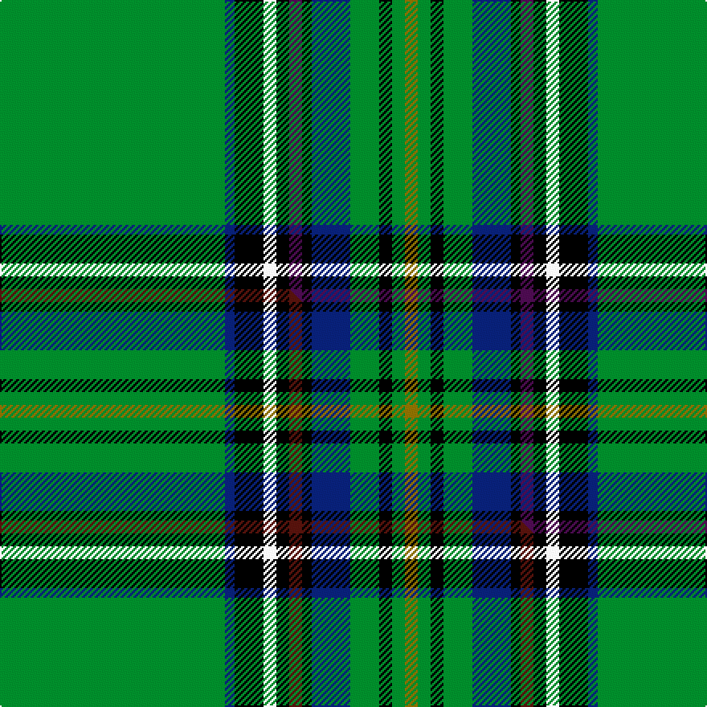

This page is one **sett** — a single exact thread-count. It belongs to the [tartan](/setts/g70db3k9w4k4dp4k3db12g9k4g4y4/)
(the same proportion at any scale), whose colour order is pattern [GBKWKBKBGKGG](/stripes/gbkwkbkbgkgg/).

Part of the [Canmore Highland Games](/tartans/canmore-highland-games/) tartan — the named design grouping this sett with its other cloths.

Sourced from tartans-authority.  It is a [12 stripe tartan](/stripes/stripes12/).

Original link [https://www.tartanregister.gov.uk/tartanDetails.aspx?ref=10008](https://www.tartanregister.gov.uk/tartanDetails.aspx?ref=10008)

## Provenance

Earliest known date: May 2000 This tartan represents Canmore's Scottish roots, namely King Malcolm Ceann Mor and the Scots who worked the Canadian Pacific Railway and settled in this area.

2 attestations — the source records this cloth was collapsed from (oldest owns this page)

<ul>
<li>May 2000 — Canmore Highland Games (Corporate) (tartans-authority, <a href="https://www.tartanregister.gov.uk/tartanDetails.aspx?ref=10008">record</a>)  <em>This tartan represents Canmore's Scottish roots, namely King Malcolm Ceann Mor and the Scots who worked the Canadian Pacific Railway and settled in this area. Each colour represents an aspect of life in Canmore: green is for the evergreen forests, blue and yellow are for the sunny Alberta skies, black represents the coal mines, white for the winter's snow-capped peaks, and fuschia represents the mountain heathers and wildflowers. The colours were chosen to be both regional and historical. The Canmore Highland Games tartan has been adopted as the Town's official Scottish colours. The Canmore Highland Games began in 1991, and is held annually on the Sunday of the Labour Day weekend. Tartan available through the Three Sisters Scottish Festival Society who organise the Canmore Highland Games.</em></li>
<li>undated — Canmore Highland Games Corporate Tartan (house-of-tartan, <a href="http://www.house-of-tartan.scotland.net/house/TartanViewjs.asp?colr=Def&tnam=10008">record</a>) </li>
</ul>

Dataset <small>— provenance for this record, inherited from the source manifest</small>

<dl class="dataset-prov">
<dt>source</dt><dd><a href="/sources/tartans-authority/">Scottish Tartans Authority</a></dd>
<dt>data captured from</dt><dd><a href="https://github.com/thetartan/tartan-database/blob/master/data/tartans-authority/data.csv">https://github.com/thetartan/tartan-database/blob/master/data/tartans-authority/data.csv</a></dd>
<dt>data date</dt><dd>May 2000 <small>(this record)</small></dd>
<dt>licence</dt><dd><a href="https://creativecommons.org/licenses/by-nc-nd/4.0/">CC BY-NC-ND 4.0</a></dd>
</dl>

Capture chain <small>— the hands this data passed through, oldest first; each capture carries its own licence</small>

<ol class="capture-chain">
<li><a href="https://www.tartansauthority.com/">Scottish Tartans Authority</a> <small>the heritage body's archive — its tartan-ferret record browser is retired (links repaired to the SRT, above)</small></li>
<li><a href="https://github.com/thetartan/tartan-database">thetartan/tartan-database</a> <small>2016-2017</small> · <a href="https://creativecommons.org/licenses/by-nc-nd/4.0/">CC BY-NC-ND 4.0</a> <small>Levko Kravets's frozen compilation — the capture we vendored, and where its CC licence text came from</small></li>
<li>this dictionary <small>captured 2026-06-10 · commit 5bf86c7566</small> <small>each re-capture is a git commit to data/sources</small></li>
</ol>

## Register references

External register numbers recorded for this tartan.

- Scottish Tartans Authority (ITI): 10008

## Thread count
G/140 DB6 K18 W8 K8 DP8 K6 DB24 G18 K8 G8 Y/8

One full sett is **372 threads**.

## Palette
<table><thead><tr><th>Colour</th><th>Shade</th><th>OKLCh</th></tr></thead><tbody><tr><td>DB</td><td><code style="background-color:#082077;">#082077</code> <small style="color:#888">#082077</small></td><td><small style="color:#888">oklch(30.0% 0.149 265.1)</small></td></tr><tr><td>G</td><td><code style="background-color:#008B2A;">#008B2A</code> <small style="color:#888">#008B2A</small></td><td><small style="color:#888">oklch(55.4% 0.170 145.9)</small></td></tr><tr><td>K</td><td><code style="background-color:#000000;">#000000</code> <small style="color:#888">#000000</small></td><td><small style="color:#888">oklch(0.0% 0.000 0.0)</small></td></tr><tr><td>W</td><td><code style="background-color:#F7F7F7;">#F7F7F7</code> <small style="color:#888">#F7F7F7</small></td><td><small style="color:#888">oklch(97.6% 0.000 89.9)</small></td></tr><tr><td>DP</td><td><code style="background-color:#4B0B4F;">#4B0B4F</code> <small style="color:#888">#4B0B4F</small></td><td><small style="color:#888">oklch(30.1% 0.125 325.4)</small></td></tr><tr><td>Y</td><td><code style="background-color:#8B6E00;">#8B6E00</code> <small style="color:#888">#8B6E00</small></td><td><small style="color:#888">oklch(55.1% 0.113 90.4)</small></td></tr></tbody></table>

# Sample pattern

## Compared to the master

This cloth is one sett of its design; the master sett (the exemplar the design is anchored on) is below for comparison.

Its **ΔTartan distance** from the master is **0.30** — the same measure the nearest-tartans table ranks by (0 is identical; a re-scale of the same cloth is near 0, a recolour or a different proportion further).

<figure class="master-compare" style="margin:0">

this sett
master sett ★

<figcaption style="color:#888;font-size:smaller">One weave of this sett against the <a href="/setts/g70db3k9w4k4dr4k3db12g9k4g4y4/">master sett ★</a>, split on the diagonal: a shared proportion runs seamlessly across it with only the shades shifting; a different proportion breaks on it.</figcaption>
</figure>

## Nearest tartan variants

The nearest existing variants by ΔTartan distance, with this cloth at the top so the swatches line up against it.

ΔTartan

Threads

Variant

Sett

—

372

<a href="/variants/s12/g70db3k9w4k4dp4k3db12g9k4g4y4~x2/">Canmore Highland Games (Corporate)</a>

<a href="/ttd/edit/#slug=g70db3k9w4k4dr4k3db12g9k4g4y4~x2&amp;base=g70db3k9w4k4dp4k3db12g9k4g4y4~x2" title="compare in the TTD">0.30</a>

372

<a href="/variants/s12/g70db3k9w4k4dr4k3db12g9k4g4y4~x2/">Canmore Highland Games</a>

<a href="/ttd/edit/#slug=g32lb2k7y1k1w1k2r7g5k1g3w1~x2&amp;base=g70db3k9w4k4dp4k3db12g9k4g4y4~x2" title="compare in the TTD">1.66</a>

186

<a href="/variants/s12/g32lb2k7y1k1w1k2r7g5k1g3w1~x2/">Stuart/Stewart (Variant)</a>

<a href="/ttd/edit/#slug=g64k4db9dy2db4dy2db4g11r8db2r4w3~x2&amp;base=g70db3k9w4k4dp4k3db12g9k4g4y4~x2" title="compare in the TTD">1.97</a>

334

<a href="/variants/s12/g64k4db9dy2db4dy2db4g11r8db2r4w3~x2/">Sillars (Name)</a>

<a href="/ttd/edit/#slug=g44db3k8y2k2w2k2g9r5k2r2w2~x2&amp;base=g70db3k9w4k4dp4k3db12g9k4g4y4~x2" title="compare in the TTD">2.22</a>

240

<a href="/variants/s12/g44db3k8y2k2w2k2g9r5k2r2w2~x2/">Princess Mary</a>

<a href="/ttd/edit/#slug=g26t2k3ly1k1lr1k1g4dr2k1dr2lr1~x4&amp;base=g70db3k9w4k4dp4k3db12g9k4g4y4~x2" title="compare in the TTD">2.39</a>

252

<a href="/variants/s12/g26t2k3ly1k1lr1k1g4dr2k1dr2lr1~x4/">Princess Mary #2</a>

<a href="/ttd/edit/#slug=g9lo1g2r3g28k16lb1g8lb1db8r1~x2&amp;base=g70db3k9w4k4dp4k3db12g9k4g4y4~x2" title="compare in the TTD">2.62</a>

292

<a href="/variants/s11/g9lo1g2r3g28k16lb1g8lb1db8r1~x2/">New York Caledonian Club Day</a>

<a href="/ttd/edit/#slug=k2g2y1g3r1g2r1g12db4k3db3k3db3k3db4g24ri2~x2~r1707016-ri2108022&amp;base=g70db3k9w4k4dp4k3db12g9k4g4y4~x2" title="compare in the TTD">2.65</a>

284

<a href="/variants/s17/k2g2y1g3r1g2r1g12db4k3db3k3db3k3db4g24ri2~x2~r1707016-ri2108022/">Kennedy</a>

<a href="/ttd/edit/#slug=k2g2y1g3dr1g2dr1g12db4k3db3k3db3k3db4g24r2~x2~r1908029&amp;base=g70db3k9w4k4dp4k3db12g9k4g4y4~x2" title="compare in the TTD">2.65</a>

284

<a href="/variants/s17/k2g2y1g3dr1g2dr1g12db4k3db3k3db3k3db4g24r2~x2~r1908029/">Kennedy</a>

<a href="/ttd/edit/#slug=k2g2y1g3r1g2r1g12db4k3db3k3db3k3db4g24ri2~x2~r1707016-ri2008022&amp;base=g70db3k9w4k4dp4k3db12g9k4g4y4~x2" title="compare in the TTD">2.65</a>

284

<a href="/variants/s17/k2g2y1g3r1g2r1g12db4k3db3k3db3k3db4g24ri2~x2~r1707016-ri2008022/">Kennedy</a>

<a href="/ttd/edit/#slug=g16k8g1k1lb1g1lb1lo1g1k1n1g4k1~x4&amp;base=g70db3k9w4k4dp4k3db12g9k4g4y4~x2" title="compare in the TTD">2.66</a>

236

<a href="/variants/s13/g16k8g1k1lb1g1lb1lo1g1k1n1g4k1~x4/">Savoy</a>

## Neighbour map

Every grey dot is one of 13621 variants placed by the first two principal components of the ΔTartan feature space (42% of its variance). Red is this tartan; blue dots are its nearest — click one to open its page.

<svg viewBox="0 0 640 380" role="img" style="max-width:100%;height:auto;border:1px solid #e0e0e0;border-radius:4px;display:block" xmlns="http://www.w3.org/2000/svg"><image href="/nn/cloud.v1.png" width="640" height="380"/><a href="/variants/s12/g70db3k9w4k4dr4k3db12g9k4g4y4~x2/"><circle cx="307.6" cy="64.0" r="4" fill="#3465a4"><title>Canmore Highland Games</title></circle></a><a href="/variants/s12/g32lb2k7y1k1w1k2r7g5k1g3w1~x2/"><circle cx="305.5" cy="49.3" r="4" fill="#3465a4"><title>Stuart/Stewart (Variant)</title></circle></a><a href="/variants/s12/g64k4db9dy2db4dy2db4g11r8db2r4w3~x2/"><circle cx="343.5" cy="57.3" r="4" fill="#3465a4"><title>Sillars (Name)</title></circle></a><a href="/variants/s12/g44db3k8y2k2w2k2g9r5k2r2w2~x2/"><circle cx="296.5" cy="61.0" r="4" fill="#3465a4"><title>Princess Mary</title></circle></a><a href="/variants/s12/g26t2k3ly1k1lr1k1g4dr2k1dr2lr1~x4/"><circle cx="341.2" cy="56.6" r="4" fill="#3465a4"><title>Princess Mary #2</title></circle></a><a href="/variants/s11/g9lo1g2r3g28k16lb1g8lb1db8r1~x2/"><circle cx="267.9" cy="84.8" r="4" fill="#3465a4"><title>New York Caledonian Club Day</title></circle></a><a href="/variants/s17/k2g2y1g3r1g2r1g12db4k3db3k3db3k3db4g24ri2~x2~r1707016-ri2108022/"><circle cx="259.8" cy="67.2" r="4" fill="#3465a4"><title>Kennedy</title></circle></a><a href="/variants/s17/k2g2y1g3dr1g2dr1g12db4k3db3k3db3k3db4g24r2~x2~r1908029/"><circle cx="260.9" cy="67.8" r="4" fill="#3465a4"><title>Kennedy</title></circle></a><a href="/variants/s17/k2g2y1g3r1g2r1g12db4k3db3k3db3k3db4g24ri2~x2~r1707016-ri2008022/"><circle cx="260.1" cy="67.3" r="4" fill="#3465a4"><title>Kennedy</title></circle></a><a href="/variants/s13/g16k8g1k1lb1g1lb1lo1g1k1n1g4k1~x4/"><circle cx="281.8" cy="92.6" r="4" fill="#3465a4"><title>Savoy</title></circle></a><circle cx="307.1" cy="63.8" r="5" fill="#c00000"/><text x="320" y="376" text-anchor="middle" font-size="11" fill="#999">ground</text><text x="11" y="190" text-anchor="middle" font-size="11" fill="#999" transform="rotate(-90 11 190)">complexity</text></svg>

ID: /variants/s12/g70db3k9w4k4dp4k3db12g9k4g4y4~x2/
