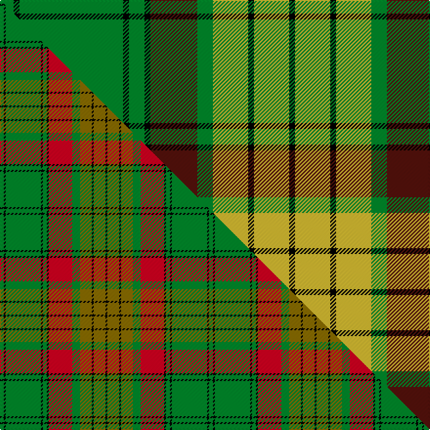

This is one **variant** — a specific cloth: this exact thread count and colourway, with its own
provenance below. It is one weaving of the [sett](/tartans/m/ma/macmillan-6/) (the scale-free proportion — the
same cloth at any scale or shade), whose colour order is pattern [GKGKGKBGYKYK](/stripes/gkgkgkbgykyk/).

Part of the [MacMillan](/tartans/m/ma/macmillan-6/) tartan — the named design grouping this sett with its other cloths.

Sourced from tartans-authority.  It is a [12 stripe tartan](/stripes/stripes12/).

Original link <code>http://www.tartansauthority.com/tartan-ferret/display/2025/</code> — retired · [Internet Archive copy](https://web.archive.org/web/*/http://www.tartansauthority.com/tartan-ferret/display/2025/*)

Dataset <small>— provenance for this record, inherited from the source manifest</small>

<dl class="dataset-prov">
<dt>source</dt><dd><a href="/sources/tartans-authority/">Scottish Tartans Authority</a></dd>
<dt>data captured from</dt><dd><a href="https://github.com/thetartan/tartan-database/blob/master/data/tartans-authority/data.csv">https://github.com/thetartan/tartan-database/blob/master/data/tartans-authority/data.csv</a></dd>
<dt>data date</dt><dd>1847 <small>(this record)</small></dd>
<dt>licence</dt><dd><a href="https://creativecommons.org/licenses/by-nc-nd/4.0/">CC BY-NC-ND 4.0</a></dd>
</dl>

Capture chain <small>— the hands this data passed through, oldest first; each capture carries its own licence</small>

<ol class="capture-chain">
<li><a href="https://www.tartansauthority.com/">Scottish Tartans Authority</a> <small>the heritage body’s archive — its tartan-ferret record browser is retired; dead record links are shown unlinked, with an Internet Archive copy (ITI numbers are not SRT references)</small></li>
<li><a href="https://github.com/thetartan/tartan-database">thetartan/tartan-database</a> <small>2016-2017</small> · <a href="https://creativecommons.org/licenses/by-nc-nd/4.0/">CC BY-NC-ND 4.0</a> <small>Levko Kravets's frozen compilation — the capture we vendored, and where its CC licence text came from</small></li>
<li>this dictionary <small>captured 2026-06-10 · commit 5bf86c7566</small> <small>each re-capture is a git commit to data/sources</small></li>
</ol>

## Register references

External register numbers recorded for this tartan.

- Scottish Tartans Authority (ITI): 2025

## Thread count
G/14 K6 G106 K6 G16 K6 DR48 G16 LY36 K6 LY36 K/6

One full sett is **584 threads**.

## Palette
<table><thead><tr><th>Colour</th><th>Shade</th><th>OKLCh</th></tr></thead><tbody><tr><td>DR</td><td><code style="background-color:#55120C;">#55120C</code> <small style="color:#888">#55120C</small></td><td><small style="color:#888">oklch(30.0% 0.099 29.3)</small></td></tr><tr><td>LY</td><td><code style="background-color:#DCBC32;">#DCBC32</code> <small style="color:#888">#DCBC32</small></td><td><small style="color:#888">oklch(80.0% 0.150 95.2)</small></td></tr><tr><td>G</td><td><code style="background-color:#008B2A;">#008B2A</code> <small style="color:#888">#008B2A</small></td><td><small style="color:#888">oklch(55.4% 0.170 145.9)</small></td></tr><tr><td>K</td><td><code style="background-color:#000000;">#000000</code> <small style="color:#888">#000000</small></td><td><small style="color:#888">oklch(0.0% 0.000 0.0)</small></td></tr></tbody></table>

# Sample pattern

## Compared to the master

This cloth is one sett of its design; the master sett (the exemplar the design is anchored on) is below for comparison.

Its **ΔTartan distance** from the master is **0.39** — the same measure the nearest-tartans table ranks by (0 is identical; a re-scale of the same cloth is near 0, a recolour or a different proportion further).

<figure class="master-compare" style="margin:0">

this sett
master sett ★

<figcaption style="color:#888;font-size:smaller">One weave of this sett against the <a href="/setts/g2k1g18k1g2k1r12g4y6k1y6k1/">master sett ★</a>, split on the diagonal: a shared proportion runs seamlessly across it with only the shades shifting; a different proportion breaks on it.</figcaption>
</figure>

## Nearest tartan variants

The nearest existing variants by ΔTartan distance, with this cloth at the top so the swatches line up against it.

ΔTartan

Threads

Variant

Sett

—

584

<a href="/variants/s12/g7k3g53k3g8k3dr24g8ly18k3ly18k3~x2/">MacMillan - 1847 (Clan)</a>

<a href="/ttd/edit/#slug=g2k1g18k1g2k1r12g4y6k1y6k1~x2&amp;base=g7k3g53k3g8k3dr24g8ly18k3ly18k3~x2" title="compare in the TTD">0.39</a>

214

<a href="/variants/s12/g2k1g18k1g2k1r12g4y6k1y6k1~x2/">MacMillan Old Clan Tartan</a>

<a href="/ttd/edit/#slug=g2k1g18k1g2k1r12g4y6k1y6k1&amp;base=g7k3g53k3g8k3dr24g8ly18k3ly18k3~x2" title="compare in the TTD">0.39</a>

107

<a href="/variants/s12/g2k1g18k1g2k1r12g4y6k1y6k1/">MacMillan Ancient</a>

<a href="/ttd/edit/#slug=ly10k2g3k2g40k2g3dr25g6ly10k1~x2&amp;base=g7k3g53k3g8k3dr24g8ly18k3ly18k3~x2" title="compare in the TTD">0.96</a>

394

<a href="/variants/s11/ly10k2g3k2g40k2g3dr25g6ly10k1~x2/">MacMillan Anc (Clans Originaux)</a>

<a href="/ttd/edit/#slug=w2g4k6r2k2r2k3r2g20w1~x2&amp;base=g7k3g53k3g8k3dr24g8ly18k3ly18k3~x2" title="compare in the TTD">2.56</a>

170

<a href="/variants/s10/w2g4k6r2k2r2k3r2g20w1~x2/">Keirnan Irish Family Tartan</a>

<a href="/ttd/edit/#slug=g3k1g1r12g1r1g1k4g1lb2g15k1g1k1g3~x4&amp;base=g7k3g53k3g8k3dr24g8ly18k3ly18k3~x2" title="compare in the TTD">2.66</a>

360

<a href="/variants/s15/g3k1g1r12g1r1g1k4g1lb2g15k1g1k1g3~x4/">Hickey (Name)</a>

<a href="/ttd/edit/#slug=k4w1r4k2g2r3k2g20r2k2r2~x2&amp;base=g7k3g53k3g8k3dr24g8ly18k3ly18k3~x2" title="compare in the TTD">2.74</a>

164

<a href="/variants/s11/k4w1r4k2g2r3k2g20r2k2r2~x2/">Valdres, Kvam &amp; Vang #2</a>

<a href="/ttd/edit/#slug=g2k1g14r2g2k10g2r4k1w2~x4&amp;base=g7k3g53k3g8k3dr24g8ly18k3ly18k3~x2" title="compare in the TTD">2.90</a>

304

<a href="/variants/s10/g2k1g14r2g2k10g2r4k1w2~x4/">MacCarthy (Fashion?)</a>

<a href="/ttd/edit/#slug=w3k1g15k6g5k3g8k2g5y3w2y4k1w3~x2&amp;base=g7k3g53k3g8k3dr24g8ly18k3ly18k3~x2" title="compare in the TTD">2.92</a>

232

<a href="/variants/s14/w3k1g15k6g5k3g8k2g5y3w2y4k1w3~x2/">Avalon - Calvert House (Corporate)</a>

<a href="/ttd/edit/#slug=g18r1w2k1w2r1o6k2~x4&amp;base=g7k3g53k3g8k3dr24g8ly18k3ly18k3~x2" title="compare in the TTD">2.98</a>

184

<a href="/variants/s8/g18r1w2k1w2r1o6k2~x4/">Humphries (Name)</a>

<a href="/ttd/edit/#slug=r16k3r16g44k3g8k3ly20k4~x2&amp;base=g7k3g53k3g8k3dr24g8ly18k3ly18k3~x2" title="compare in the TTD">3.04</a>

428

<a href="/variants/s9/r16k3r16g44k3g8k3ly20k4~x2/">MacMillan Society of Glasgow</a>

## Neighbour map

Every grey dot is one of 13656 variants placed by the first two principal components of the ΔTartan feature space (42% of its variance). Red is this tartan; blue dots are its nearest — click one to open its page. The map is a flat projection of a many-dimensional space — [how to read it](/posts/neighbourhood-maps/).

<svg viewBox="0 0 640 380" role="img" style="max-width:100%;height:auto;border:1px solid #e0e0e0;border-radius:4px;display:block" xmlns="http://www.w3.org/2000/svg"><image href="/nn/cloud.v1.png" width="640" height="380"/><a href="/variants/s12/g2k1g18k1g2k1r12g4y6k1y6k1~x2/"><circle cx="252.4" cy="134.9" r="4" fill="#3465a4"><title>MacMillan Old Clan Tartan</title></circle></a><a href="/variants/s12/g2k1g18k1g2k1r12g4y6k1y6k1/"><circle cx="252.4" cy="134.9" r="4" fill="#3465a4"><title>MacMillan Ancient</title></circle></a><a href="/variants/s11/ly10k2g3k2g40k2g3dr25g6ly10k1~x2/"><circle cx="277.3" cy="97.2" r="4" fill="#3465a4"><title>MacMillan Anc (Clans Originaux)</title></circle></a><a href="/variants/s10/w2g4k6r2k2r2k3r2g20w1~x2/"><circle cx="253.7" cy="114.6" r="4" fill="#3465a4"><title>Keirnan Irish Family Tartan</title></circle></a><a href="/variants/s15/g3k1g1r12g1r1g1k4g1lb2g15k1g1k1g3~x4/"><circle cx="261.9" cy="109.7" r="4" fill="#3465a4"><title>Hickey (Name)</title></circle></a><a href="/variants/s11/k4w1r4k2g2r3k2g20r2k2r2~x2/"><circle cx="242.3" cy="107.2" r="4" fill="#3465a4"><title>Valdres, Kvam &amp; Vang #2</title></circle></a><a href="/variants/s10/g2k1g14r2g2k10g2r4k1w2~x4/"><circle cx="214.7" cy="139.2" r="4" fill="#3465a4"><title>MacCarthy (Fashion?)</title></circle></a><a href="/variants/s14/w3k1g15k6g5k3g8k2g5y3w2y4k1w3~x2/"><circle cx="208.5" cy="148.3" r="4" fill="#3465a4"><title>Avalon - Calvert House (Corporate)</title></circle></a><a href="/variants/s8/g18r1w2k1w2r1o6k2~x4/"><circle cx="255.7" cy="116.6" r="4" fill="#3465a4"><title>Humphries (Name)</title></circle></a><a href="/variants/s9/r16k3r16g44k3g8k3ly20k4~x2/"><circle cx="200.4" cy="151.7" r="4" fill="#3465a4"><title>MacMillan Society of Glasgow</title></circle></a><circle cx="235.8" cy="129.9" r="5" fill="#c00000"/><text x="320" y="376" text-anchor="middle" font-size="11" fill="#999">ground</text><text x="11" y="190" text-anchor="middle" font-size="11" fill="#999" transform="rotate(-90 11 190)">complexity</text></svg>

ID: /variants/s12/g7k3g53k3g8k3dr24g8ly18k3ly18k3~x2/
