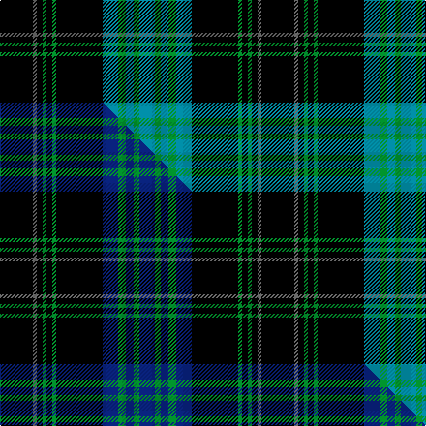

This page is one **sett** — a single exact thread-count. It belongs to the [tartan](/setts/k17n2k3g2k3g2k24t8g4t4g3t8/)
(the same proportion at any scale), whose colour order is pattern [BGBGBKGKGKBK](/stripes/bgbgbkgkgkbk/).

Part of the [Kells Irish Pubs](/tartans/kells-irish-pubs/) tartan — the named design grouping this sett with its other cloths.

Sourced from tartans-authority.  It is a [12 stripe tartan](/stripes/stripes12/).

Original link https://www.tartanregister.gov.uk/tartanDetails.aspx?ref=10106

Dataset <small>— provenance for this record, inherited from the source manifest</small>

<dl class="dataset-prov">
<dt>source</dt><dd><a href="/sources/tartans-authority/">Scottish Tartans Authority</a></dd>
<dt>data captured from</dt><dd><a href="https://github.com/thetartan/tartan-database/blob/master/data/tartans-authority/data.csv">https://github.com/thetartan/tartan-database/blob/master/data/tartans-authority/data.csv</a></dd>
<dt>data date</dt><dd>1st January 2008 <small>(this record)</small></dd>
<dt>licence</dt><dd><a href="https://creativecommons.org/licenses/by-nc-nd/4.0/">CC BY-NC-ND 4.0</a></dd>
</dl>

Capture chain <small>— the hands this data passed through, oldest first; each capture carries its own licence</small>

<ol class="capture-chain">
<li><a href="https://www.tartansauthority.com/">Scottish Tartans Authority</a> <small>the heritage body's archive — its tartan-ferret record browser is retired (links repaired to the SRT, above)</small></li>
<li><a href="https://github.com/thetartan/tartan-database">thetartan/tartan-database</a> <small>2016-2017</small> · <a href="https://creativecommons.org/licenses/by-nc-nd/4.0/">CC BY-NC-ND 4.0</a> <small>Levko Kravets's frozen compilation — the capture we vendored, and where its CC licence text came from</small></li>
<li>this dictionary <small>captured 2026-06-10 · commit 5bf86c7566</small> <small>each re-capture is a git commit to data/sources</small></li>
</ol>

## Register references

External register numbers recorded for this tartan.

- Scottish Tartans Authority (ITI): 10106

## Thread count
K/34 N4 K6 G4 K6 G4 K48 T16 G8 T8 G6 T/16

One full sett is **270 threads**.

## Palette
<table><thead><tr><th>Colour</th><th>Shade</th><th>OKLCh</th></tr></thead><tbody><tr><td>T</td><td><code style="background-color:#00879F;">#00879F</code> <small style="color:#888">#00879F</small></td><td><small style="color:#888">oklch(57.4% 0.102 216.1)</small></td></tr><tr><td>G</td><td><code style="background-color:#008B2A;">#008B2A</code> <small style="color:#888">#008B2A</small></td><td><small style="color:#888">oklch(55.4% 0.170 145.9)</small></td></tr><tr><td>K</td><td><code style="background-color:#000000;">#000000</code> <small style="color:#888">#000000</small></td><td><small style="color:#888">oklch(0.0% 0.000 0.0)</small></td></tr><tr><td>N</td><td><code style="background-color:#636363;">#636363</code> <small style="color:#888">#636363</small></td><td><small style="color:#888">oklch(50.0% 0.000 89.9)</small></td></tr></tbody></table>

# Sample pattern

## Compared to the master

This cloth is one sett of its design; the master sett (the exemplar the design is anchored on) is below for comparison.

Its **ΔTartan distance** from the master is **0.13** — the same measure the nearest-tartans table ranks by (0 is identical; a re-scale of the same cloth is near 0, a recolour or a different proportion further).

<figure class="master-compare" style="margin:0">

this sett
master sett ★

<figcaption style="color:#888;font-size:smaller">One weave of this sett against the <a href="/setts/k17n2k3g2k3g2k24db8g4db4g3db8/">master sett ★</a>, split on the diagonal: a shared proportion runs seamlessly across it with only the shades shifting; a different proportion breaks on it.</figcaption>
</figure>

## Nearest tartan variants

The nearest existing variants by ΔTartan distance, with this cloth at the top so the swatches line up against it.

ΔTartan

Threads

Variant

Sett

—

270

<a href="/variants/s12/k17n2k3g2k3g2k24t8g4t4g3t8~x2/">Kells Irish Pubs (Corporate)</a>

<a href="/ttd/edit/#slug=k17n2k3g2k3g2k24db8g4db4g3db8~x2&amp;base=k17n2k3g2k3g2k24t8g4t4g3t8~x2" title="compare in the TTD">0.13</a>

270

<a href="/variants/s12/k17n2k3g2k3g2k24db8g4db4g3db8~x2/">Kells Irish Pubs</a>

<a href="/ttd/edit/#slug=k4dg13k4g8k44g8k4dg13k4w3~x2~dg1806142-g2203152&amp;base=k17n2k3g2k3g2k24t8g4t4g3t8~x2" title="compare in the TTD">1.74</a>

406

<a href="/variants/s10/k4dg13k4g8k44g8k4dg13k4w3~x2~dg1806142-g2203152/">Childers</a>

<a href="/ttd/edit/#slug=g11db1k1g2k12y1k12g2k2g11k2g2k12y1~x4&amp;base=k17n2k3g2k3g2k24t8g4t4g3t8~x2" title="compare in the TTD">2.25</a>

528

<a href="/variants/s14/g11db1k1g2k12y1k12g2k2g11k2g2k12y1~x4/">Hopetoun Rejected design</a>

<a href="/ttd/edit/#slug=g2dr4g2k16g2k16g4k2g2k2g4k4db8k1lb2~x2&amp;base=k17n2k3g2k3g2k24t8g4t4g3t8~x2" title="compare in the TTD">2.47</a>

276

<a href="/variants/s15/g2dr4g2k16g2k16g4k2g2k2g4k4db8k1lb2~x2/">MacKean Hunting</a>

<a href="/ttd/edit/#slug=dg4k4dg23k11r2k2r2k20w4~x2&amp;base=k17n2k3g2k3g2k24t8g4t4g3t8~x2" title="compare in the TTD">2.49</a>

272

<a href="/variants/s9/dg4k4dg23k11r2k2r2k20w4~x2/">New Golf Club</a>

<a href="/ttd/edit/#slug=k36w3k10w3dg28dr6k18~x2~dg1804158&amp;base=k17n2k3g2k3g2k24t8g4t4g3t8~x2" title="compare in the TTD">2.53</a>

308

<a href="/variants/s7/k36w3k10w3dg28dr6k18~x2~dg1804158/">Wild Highlanders</a>

<a href="/ttd/edit/#slug=g2r4g2k16g4k16g4k2g2k2g4k4db8k1w2~x2&amp;base=k17n2k3g2k3g2k24t8g4t4g3t8~x2" title="compare in the TTD">2.57</a>

284

<a href="/variants/s15/g2r4g2k16g4k16g4k2g2k2g4k4db8k1w2~x2/">MacKean Hunting Family Tartan</a>

<a href="/ttd/edit/#slug=y4k3w3k44y4k22n22w3k3y4&amp;base=k17n2k3g2k3g2k24t8g4t4g3t8~x2" title="compare in the TTD">2.65</a>

216

<a href="/variants/s10/y4k3w3k44y4k22n22w3k3y4/">Ashers of Nairn</a>

<a href="/ttd/edit/#slug=k8g28k8dg17k88dg17k8g28k8r6~g1903114-dg1405139&amp;base=k17n2k3g2k3g2k24t8g4t4g3t8~x2" title="compare in the TTD">2.71</a>

418

<a href="/variants/s10/k8g28k8dg17k88dg17k8g28k8r6~g1903114-dg1405139/">Childers (Gurkha Rifles)</a>

<a href="/ttd/edit/#slug=k5w5k5t11k3n17k30t3~x2&amp;base=k17n2k3g2k3g2k24t8g4t4g3t8~x2" title="compare in the TTD">2.73</a>

300

<a href="/variants/s8/k5w5k5t11k3n17k30t3~x2/">Australian Police</a>

## Neighbour map

Every grey dot is one of 13620 variants placed by the first two principal components of the ΔTartan feature space (42% of its variance). Red is this tartan; blue dots are its nearest — click one to open its page.

<svg viewBox="0 0 640 380" role="img" style="max-width:100%;height:auto;border:1px solid #e0e0e0;border-radius:4px;display:block" xmlns="http://www.w3.org/2000/svg"><image href="/nn/cloud.v1.png" width="640" height="380"/><a href="/variants/s12/k17n2k3g2k3g2k24db8g4db4g3db8~x2/"><circle cx="284.7" cy="146.8" r="4" fill="#3465a4"><title>Kells Irish Pubs</title></circle></a><a href="/variants/s10/k4dg13k4g8k44g8k4dg13k4w3~x2~dg1806142-g2203152/"><circle cx="269.6" cy="134.3" r="4" fill="#3465a4"><title>Childers</title></circle></a><a href="/variants/s14/g11db1k1g2k12y1k12g2k2g11k2g2k12y1~x4/"><circle cx="262.9" cy="141.4" r="4" fill="#3465a4"><title>Hopetoun Rejected design</title></circle></a><a href="/variants/s15/g2dr4g2k16g2k16g4k2g2k2g4k4db8k1lb2~x2/"><circle cx="242.0" cy="109.8" r="4" fill="#3465a4"><title>MacKean Hunting</title></circle></a><a href="/variants/s9/dg4k4dg23k11r2k2r2k20w4~x2/"><circle cx="244.7" cy="156.8" r="4" fill="#3465a4"><title>New Golf Club</title></circle></a><a href="/variants/s7/k36w3k10w3dg28dr6k18~x2~dg1804158/"><circle cx="206.6" cy="155.2" r="4" fill="#3465a4"><title>Wild Highlanders</title></circle></a><a href="/variants/s15/g2r4g2k16g4k16g4k2g2k2g4k4db8k1w2~x2/"><circle cx="223.2" cy="110.1" r="4" fill="#3465a4"><title>MacKean Hunting Family Tartan</title></circle></a><a href="/variants/s10/y4k3w3k44y4k22n22w3k3y4/"><circle cx="309.9" cy="123.1" r="4" fill="#3465a4"><title>Ashers of Nairn</title></circle></a><a href="/variants/s10/k8g28k8dg17k88dg17k8g28k8r6~g1903114-dg1405139/"><circle cx="276.9" cy="138.0" r="4" fill="#3465a4"><title>Childers (Gurkha Rifles)</title></circle></a><a href="/variants/s8/k5w5k5t11k3n17k30t3~x2/"><circle cx="226.5" cy="171.2" r="4" fill="#3465a4"><title>Australian Police</title></circle></a><circle cx="259.9" cy="141.6" r="5" fill="#c00000"/><text x="320" y="376" text-anchor="middle" font-size="11" fill="#999">ground</text><text x="11" y="190" text-anchor="middle" font-size="11" fill="#999" transform="rotate(-90 11 190)">complexity</text></svg>

ID: /variants/s12/k17n2k3g2k3g2k24t8g4t4g3t8~x2/
