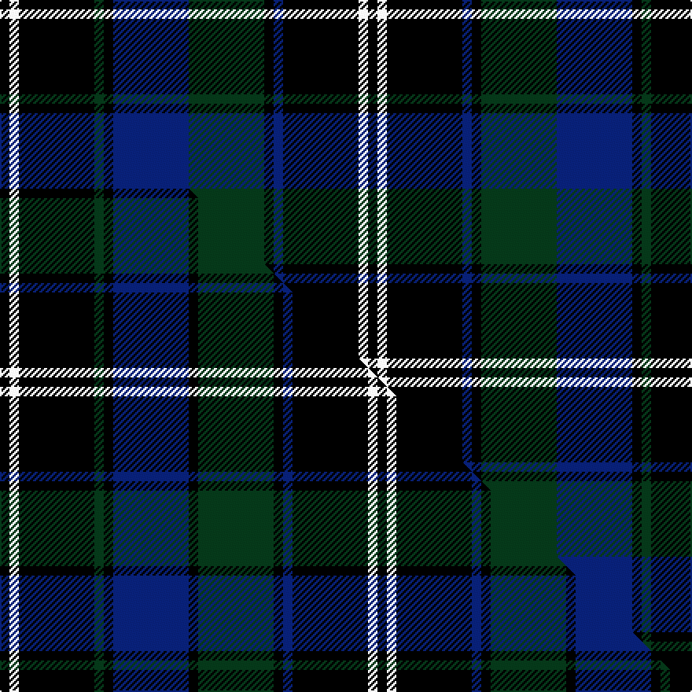

This page is one **sett** — a single exact thread-count. It belongs to the [tartan](/setts/k1w1k8dg1k1db8dg8k1db1k8w1k1/)
(the same proportion at any scale), whose colour order is pattern [KWKBKGBKGKWK](/stripes/kwkbkgbkgkwk/).

Part of the [Chess](/tartans/chess/) tartan — the named design grouping this sett with its other cloths.

Sourced from tartans-authority.  It is a [12 stripe tartan](/stripes/stripes12/).

Original link https://www.tartanregister.gov.uk/tartanDetails.aspx?ref=7824

Dataset <small>— provenance for this record, inherited from the source manifest</small>

<dl class="dataset-prov">
<dt>source</dt><dd><a href="/sources/tartans-authority/">Scottish Tartans Authority</a></dd>
<dt>data captured from</dt><dd><a href="https://github.com/thetartan/tartan-database/blob/master/data/tartans-authority/data.csv">https://github.com/thetartan/tartan-database/blob/master/data/tartans-authority/data.csv</a></dd>
<dt>data date</dt><dd>Jan. 2006 <small>(this record)</small></dd>
<dt>licence</dt><dd><a href="https://creativecommons.org/licenses/by-nc-nd/4.0/">CC BY-NC-ND 4.0</a></dd>
</dl>

Capture chain <small>— the hands this data passed through, oldest first; each capture carries its own licence</small>

<ol class="capture-chain">
<li><a href="https://www.tartansauthority.com/">Scottish Tartans Authority</a> <small>the heritage body's archive — its tartan-ferret record browser is retired (links repaired to the SRT, above)</small></li>
<li><a href="https://github.com/thetartan/tartan-database">thetartan/tartan-database</a> <small>2016-2017</small> · <a href="https://creativecommons.org/licenses/by-nc-nd/4.0/">CC BY-NC-ND 4.0</a> <small>Levko Kravets's frozen compilation — the capture we vendored, and where its CC licence text came from</small></li>
<li>this dictionary <small>captured 2026-06-10 · commit 5bf86c7566</small> <small>each re-capture is a git commit to data/sources</small></li>
</ol>

## Register references

External register numbers recorded for this tartan.

- Scottish Tartans Authority (ITI): 7824

## Thread count
K/6 W6 K48 DG6 K6 DB48 DG48 K6 DB6 K48 W6 K/6

One full sett is **468 threads**.

## Palette
<table><thead><tr><th>Colour</th><th>Shade</th><th>OKLCh</th></tr></thead><tbody><tr><td>DB</td><td><code style="background-color:#082077;">#082077</code> <small style="color:#888">#082077</small></td><td><small style="color:#888">oklch(30.0% 0.149 265.1)</small></td></tr><tr><td>DG</td><td><code style="background-color:#053819;">#053819</code> <small style="color:#888">#053819</small></td><td><small style="color:#888">oklch(30.0% 0.075 151.3)</small></td></tr><tr><td>K</td><td><code style="background-color:#000000;">#000000</code> <small style="color:#888">#000000</small></td><td><small style="color:#888">oklch(0.0% 0.000 0.0)</small></td></tr><tr><td>W</td><td><code style="background-color:#F7F7F7;">#F7F7F7</code> <small style="color:#888">#F7F7F7</small></td><td><small style="color:#888">oklch(97.6% 0.000 89.9)</small></td></tr></tbody></table>

# Sample pattern

## Compared to the master

This cloth is one sett of its design; the master sett (the exemplar the design is anchored on) is below for comparison.

Its **ΔTartan distance** from the master is **1.02** — the same measure the nearest-tartans table ranks by (0 is identical; a re-scale of the same cloth is near 0, a recolour or a different proportion further).

<figure class="master-compare" style="margin:0">

this sett
master sett ★

<figcaption style="color:#888;font-size:smaller">One weave of this sett against the <a href="/setts/k1w1k8dg1k1db8k1dg8k1db1k8w1k1/">master sett ★</a>, split on the diagonal: a shared proportion runs seamlessly across it with only the shades shifting; a different proportion breaks on it.</figcaption>
</figure>

## Nearest tartan variants

The nearest existing variants by ΔTartan distance, with this cloth at the top so the swatches line up against it.

ΔTartan

Threads

Variant

Sett

—

468

<a href="/variants/s12/k1w1k8dg1k1db8dg8k1db1k8w1k1~x6/">Chess (Universal)</a>

<a href="/ttd/edit/#slug=k1w1k8dg1k1db8k1dg8k1db1k8w1k1~x6&amp;base=k1w1k8dg1k1db8dg8k1db1k8w1k1~x6" title="compare in the TTD">1.02</a>

480

<a href="/variants/s13/k1w1k8dg1k1db8k1dg8k1db1k8w1k1~x6/">Chess</a>

<a href="/ttd/edit/#slug=k1g8k9r1k1r1k9db8r1~x6&amp;base=k1w1k8dg1k1db8dg8k1db1k8w1k1~x6" title="compare in the TTD">2.10</a>

456

<a href="/variants/s9/k1g8k9r1k1r1k9db8r1~x6/">Guthrie</a>

<a href="/ttd/edit/#slug=k3g3k20r2k2r2db20g3db3~x2&amp;base=k1w1k8dg1k1db8dg8k1db1k8w1k1~x6" title="compare in the TTD">2.28</a>

220

<a href="/variants/s9/k3g3k20r2k2r2db20g3db3~x2/">Hume or Home</a>

<a href="/ttd/edit/#slug=db56k6g24k6db8k21y6k21db8k6g24k6db56&amp;base=k1w1k8dg1k1db8dg8k1db1k8w1k1~x6" title="compare in the TTD">2.40</a>

384

<a href="/variants/s13/db56k6g24k6db8k21y6k21db8k6g24k6db56/">Murray of Elibank</a>

<a href="/ttd/edit/#slug=y1db4y1db3y1k8y1k8db6y1db1y1~x4&amp;base=k1w1k8dg1k1db8dg8k1db1k8w1k1~x6" title="compare in the TTD">2.44</a>

280

<a href="/variants/s12/y1db4y1db3y1k8y1k8db6y1db1y1~x4/">Clergy (WCWM)</a>

<a href="/ttd/edit/#slug=k3dt2y3k2y5dt18g3k3g2dt3~x2~dt1204274&amp;base=k1w1k8dg1k1db8dg8k1db1k8w1k1~x6" title="compare in the TTD">2.56</a>

164

<a href="/variants/s10/k3db2y3k2y5db18g3k3g2db3~x2~db1204274/">St Andrews University Corporate Tartan</a>

<a href="/ttd/edit/#slug=dp3k2n6k2n2k18dg13lb2dg2k6dp2~x2&amp;base=k1w1k8dg1k1db8dg8k1db1k8w1k1~x6" title="compare in the TTD">2.56</a>

222

<a href="/variants/s11/dp3k2n6k2n2k18dg13lb2dg2k6dp2~x2/">Dama Resort</a>

<a href="/ttd/edit/#slug=k1dr1dg7k8w1k8dr1dg2dr1dg4dr1~x4&amp;base=k1w1k8dg1k1db8dg8k1db1k8w1k1~x6" title="compare in the TTD">2.62</a>

272

<a href="/variants/s11/k1dr1dg7k8w1k8dr1dg2dr1dg4dr1~x4/">Episcopal Clergy</a>

<a href="/ttd/edit/#slug=k15lb3k3w4k3lb3k15db4k4db30k4~x2&amp;base=k1w1k8dg1k1db8dg8k1db1k8w1k1~x6" title="compare in the TTD">2.62</a>

314

<a href="/variants/s11/k15lb3k3w4k3lb3k15db4k4db30k4~x2/">Shalom (Fashion)</a>

<a href="/ttd/edit/#slug=k40db10g6k2g3k2~x2&amp;base=k1w1k8dg1k1db8dg8k1db1k8w1k1~x6" title="compare in the TTD">2.63</a>

168

<a href="/variants/s6/k40db10g6k2g3k2~x2/">Daks (Chino Check)</a>

## Neighbour map

Every grey dot is one of 13620 variants placed by the first two principal components of the ΔTartan feature space (42% of its variance). Red is this tartan; blue dots are its nearest — click one to open its page.

<svg viewBox="0 0 640 380" role="img" style="max-width:100%;height:auto;border:1px solid #e0e0e0;border-radius:4px;display:block" xmlns="http://www.w3.org/2000/svg"><image href="/nn/cloud.v1.png" width="640" height="380"/><a href="/variants/s13/k1w1k8dg1k1db8k1dg8k1db1k8w1k1~x6/"><circle cx="220.9" cy="155.2" r="4" fill="#3465a4"><title>Chess</title></circle></a><a href="/variants/s9/k1g8k9r1k1r1k9db8r1~x6/"><circle cx="207.2" cy="172.9" r="4" fill="#3465a4"><title>Guthrie</title></circle></a><a href="/variants/s9/k3g3k20r2k2r2db20g3db3~x2/"><circle cx="218.6" cy="155.8" r="4" fill="#3465a4"><title>Hume or Home</title></circle></a><a href="/variants/s13/db56k6g24k6db8k21y6k21db8k6g24k6db56/"><circle cx="233.1" cy="165.3" r="4" fill="#3465a4"><title>Murray of Elibank</title></circle></a><a href="/variants/s12/y1db4y1db3y1k8y1k8db6y1db1y1~x4/"><circle cx="227.5" cy="185.8" r="4" fill="#3465a4"><title>Clergy (WCWM)</title></circle></a><a href="/variants/s10/k3db2y3k2y5db18g3k3g2db3~x2~db1204274/"><circle cx="251.4" cy="167.5" r="4" fill="#3465a4"><title>St Andrews University Corporate Tartan</title></circle></a><a href="/variants/s11/dp3k2n6k2n2k18dg13lb2dg2k6dp2~x2/"><circle cx="205.9" cy="154.7" r="4" fill="#3465a4"><title>Dama Resort</title></circle></a><a href="/variants/s11/k1dr1dg7k8w1k8dr1dg2dr1dg4dr1~x4/"><circle cx="246.2" cy="181.5" r="4" fill="#3465a4"><title>Episcopal Clergy</title></circle></a><a href="/variants/s11/k15lb3k3w4k3lb3k15db4k4db30k4~x2/"><circle cx="225.6" cy="145.9" r="4" fill="#3465a4"><title>Shalom (Fashion)</title></circle></a><a href="/variants/s6/k40db10g6k2g3k2~x2/"><circle cx="245.5" cy="142.6" r="4" fill="#3465a4"><title>Daks (Chino Check)</title></circle></a><circle cx="214.1" cy="161.0" r="5" fill="#c00000"/><text x="320" y="376" text-anchor="middle" font-size="11" fill="#999">ground</text><text x="11" y="190" text-anchor="middle" font-size="11" fill="#999" transform="rotate(-90 11 190)">complexity</text></svg>

ID: /variants/s12/k1w1k8dg1k1db8dg8k1db1k8w1k1~x6/
