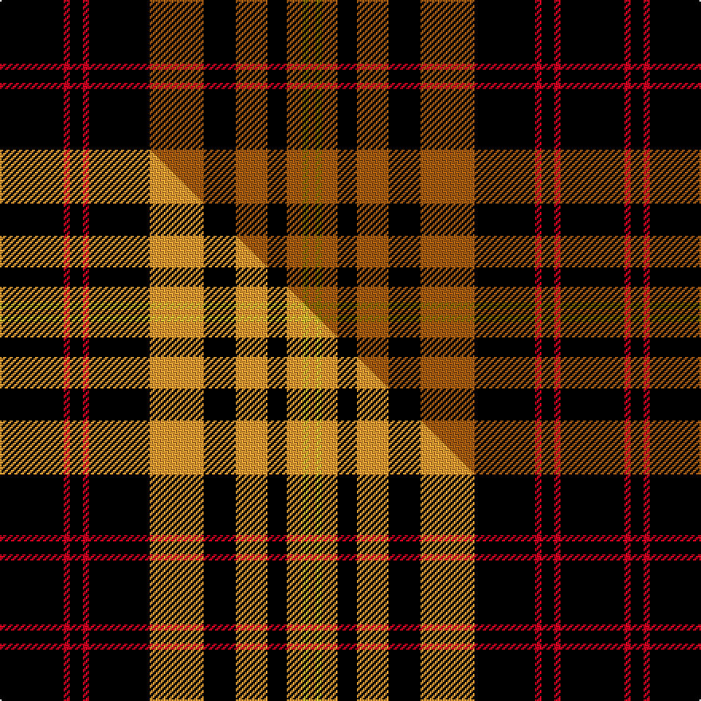

This is one **variant** — a specific cloth: this exact thread count and colourway, with its own
provenance below. It is one weaving of the [sett](/tartans/m/ma/malt-the/) (the scale-free proportion — the
same cloth at any scale or shade), whose colour order is pattern [KRKRKRKRKRGR](/stripes/krkrkrkrkrgr/).

Part of the [Malt, The](/tartans/m/ma/malt-the/) tartan — the named design grouping this sett with its other cloths.

Sourced from tartans-authority.  It is a [12 stripe tartan](/stripes/stripes12/).

Original link <code>http://www.tartansauthority.com/tartan-ferret/display/10183/</code> — retired · [Internet Archive copy](https://web.archive.org/web/*/http://www.tartansauthority.com/tartan-ferret/display/10183/*)

Dataset <small>— provenance for this record, inherited from the source manifest</small>

<dl class="dataset-prov">
<dt>source</dt><dd><a href="/sources/tartans-authority/">Scottish Tartans Authority</a></dd>
<dt>data captured from</dt><dd><a href="https://github.com/thetartan/tartan-database/blob/master/data/tartans-authority/data.csv">https://github.com/thetartan/tartan-database/blob/master/data/tartans-authority/data.csv</a></dd>
<dt>data date</dt><dd>2nd Mar. 2010 <small>(this record)</small></dd>
<dt>licence</dt><dd><a href="https://creativecommons.org/licenses/by-nc-nd/4.0/">CC BY-NC-ND 4.0</a></dd>
</dl>

Capture chain <small>— the hands this data passed through, oldest first; each capture carries its own licence</small>

<ol class="capture-chain">
<li><a href="https://www.tartansauthority.com/">Scottish Tartans Authority</a> <small>the heritage body’s archive — its tartan-ferret record browser is retired; dead record links are shown unlinked, with an Internet Archive copy (ITI numbers are not SRT references)</small></li>
<li><a href="https://github.com/thetartan/tartan-database">thetartan/tartan-database</a> <small>2016-2017</small> · <a href="https://creativecommons.org/licenses/by-nc-nd/4.0/">CC BY-NC-ND 4.0</a> <small>Levko Kravets's frozen compilation — the capture we vendored, and where its CC licence text came from</small></li>
<li>this dictionary <small>captured 2026-06-10 · commit 5bf86c7566</small> <small>each re-capture is a git commit to data/sources</small></li>
</ol>

## Register references

External register numbers recorded for this tartan.

- Scottish Register of Tartans: [10183](https://www.tartanregister.gov.uk/tartanDetails?ref=10183)
- Scottish Tartans Authority (ITI): 10183

## Thread count
K/40 R4 K8 R4 K38 O34 K20 O20 K12 O10 Y4 O/4

One full sett is **352 threads**.

## Palette
<table><thead><tr><th>Colour</th><th>Shade</th><th>OKLCh</th></tr></thead><tbody><tr><td>O</td><td><code style="background-color:#A65C11;">#A65C11</code> <small style="color:#888">#A65C11</small></td><td><small style="color:#888">oklch(55.0% 0.125 58.3)</small></td></tr><tr><td>K</td><td><code style="background-color:#000000;">#000000</code> <small style="color:#888">#000000</small></td><td><small style="color:#888">oklch(0.0% 0.000 0.0)</small></td></tr><tr><td>R</td><td><code style="background-color:#D60020;">#D60020</code> <small style="color:#888">#D60020</small></td><td><small style="color:#888">oklch(55.2% 0.224 25.5)</small></td></tr><tr><td>Y</td><td><code style="background-color:#8B6E00;">#8B6E00</code> <small style="color:#888">#8B6E00</small></td><td><small style="color:#888">oklch(55.1% 0.113 90.4)</small></td></tr></tbody></table>

# Sample pattern

## Compared to the master

This cloth is one sett of its design; the master sett (the exemplar the design is anchored on) is below for comparison.

Its **ΔTartan distance** from the master is **0.14** — the same measure the nearest-tartans table ranks by (0 is identical; a re-scale of the same cloth is near 0, a recolour or a different proportion further).

<figure class="master-compare" style="margin:0">

this sett
master sett ★

<figcaption style="color:#888;font-size:smaller">One weave of this sett against the <a href="/setts/k20r2k4r2k19lo17k10lo10k6lo5ly2lo2/">master sett ★</a>, split on the diagonal: a shared proportion runs seamlessly across it with only the shades shifting; a different proportion breaks on it.</figcaption>
</figure>

## Nearest tartan variants

The nearest existing variants by ΔTartan distance, with this cloth at the top so the swatches line up against it.

ΔTartan

Threads

Variant

Sett

—

352

<a href="/variants/s12/k20r2k4r2k19o17k10o10k6o5y2o2~x2/">Malt, The (Corporate)</a>

<a href="/ttd/edit/#slug=k20r2k4r2k19lo17k10lo10k6lo5ly2lo2~x2&amp;base=k20r2k4r2k19o17k10o10k6o5y2o2~x2" title="compare in the TTD">0.14</a>

352

<a href="/variants/s12/k20r2k4r2k19lo17k10lo10k6lo5ly2lo2~x2/">Malt, The</a>

<a href="/ttd/edit/#slug=dp2r1k4y2k12y8k12y2k4y1w2~x2&amp;base=k20r2k4r2k19o17k10o10k6o5y2o2~x2" title="compare in the TTD">2.47</a>

192

<a href="/variants/s11/dp2r1k4y2k12y8k12y2k4y1w2~x2/">Gary Personal Tartan</a>

<a href="/ttd/edit/#slug=dp2r1k4lo2k12lo8k12lo2k4lo1w2~x4&amp;base=k20r2k4r2k19o17k10o10k6o5y2o2~x2" title="compare in the TTD">2.57</a>

384

<a href="/variants/s11/dp2r1k4lo2k12lo8k12lo2k4lo1w2~x4/">Gary (Personal)</a>

<a href="/ttd/edit/#slug=dr3o26k12o3k16o4k16o3k12o26ly3~x2&amp;base=k20r2k4r2k19o17k10o10k6o5y2o2~x2" title="compare in the TTD">2.61</a>

484

<a href="/variants/s11/dr3o26k12o3k16o4k16o3k12o26ly3~x2/">Wcwm 1713</a>

<a href="/ttd/edit/#slug=dy2w2r13k17r2k17w2dy4w2k17r2k17w2r13w2k17r2k17r13w2~x2&amp;base=k20r2k4r2k19o17k10o10k6o5y2o2~x2" title="compare in the TTD">2.75</a>

652

<a href="/variants/s20/dy2w2r13k17r2k17w2dy4w2k17r2k17w2r13w2k17r2k17r13w2~x2/">Holy Sepulchre Corporate Tartan</a>

<a href="/ttd/edit/#slug=k1lb1y7k8lb1k8lb1y2lb1k4lb1~x4&amp;base=k20r2k4r2k19o17k10o10k6o5y2o2~x2" title="compare in the TTD">2.93</a>

272

<a href="/variants/s11/k1lb1y7k8lb1k8lb1y2lb1k4lb1~x4/">Priest</a>

<a href="/ttd/edit/#slug=k1lb1y7k8lb1k8lb1y2lb1k4lb1~x2&amp;base=k20r2k4r2k19o17k10o10k6o5y2o2~x2" title="compare in the TTD">2.93</a>

136

<a href="/variants/s11/k1lb1y7k8lb1k8lb1y2lb1k4lb1~x2/">Priest</a>

<a href="/ttd/edit/#slug=dr12k2ly2k2dr2k2ly2k2dr12k9dr12k2ly2k2~x2&amp;base=k20r2k4r2k19o17k10o10k6o5y2o2~x2" title="compare in the TTD">2.93</a>

232

<a href="/variants/s14/dr12k2ly2k2dr2k2ly2k2dr12k9dr12k2ly2k2~x2/">City of New Bern 300 (District)</a>

<a href="/ttd/edit/#slug=r4k11n8dg2n8k13dg2k13r5k2~x2&amp;base=k20r2k4r2k19o17k10o10k6o5y2o2~x2" title="compare in the TTD">2.96</a>

260

<a href="/variants/s10/r4k11n8dg2n8k13dg2k13r5k2~x2/">Process Safety Solutions Ltd</a>

<a href="/ttd/edit/#slug=ly4k2dr7k15dr3k3dr3k7dr28g7dr6g2~x2&amp;base=k20r2k4r2k19o17k10o10k6o5y2o2~x2" title="compare in the TTD">3.03</a>

336

<a href="/variants/s12/ly4k2dr7k15dr3k3dr3k7dr28g7dr6g2~x2/">Walker, Evening (Name)</a>

## Neighbour map

Every grey dot is one of 13656 variants placed by the first two principal components of the ΔTartan feature space (42% of its variance). Red is this tartan; blue dots are its nearest — click one to open its page. The map is a flat projection of a many-dimensional space — [how to read it](/posts/neighbourhood-maps/).

<svg viewBox="0 0 640 380" role="img" style="max-width:100%;height:auto;border:1px solid #e0e0e0;border-radius:4px;display:block" xmlns="http://www.w3.org/2000/svg"><image href="/nn/cloud.v1.png" width="640" height="380"/><a href="/variants/s12/k20r2k4r2k19lo17k10lo10k6lo5ly2lo2~x2/"><circle cx="247.0" cy="149.4" r="4" fill="#3465a4"><title>Malt, The</title></circle></a><a href="/variants/s11/dp2r1k4y2k12y8k12y2k4y1w2~x2/"><circle cx="271.7" cy="132.4" r="4" fill="#3465a4"><title>Gary Personal Tartan</title></circle></a><a href="/variants/s11/dp2r1k4lo2k12lo8k12lo2k4lo1w2~x4/"><circle cx="260.6" cy="127.2" r="4" fill="#3465a4"><title>Gary (Personal)</title></circle></a><a href="/variants/s11/dr3o26k12o3k16o4k16o3k12o26ly3~x2/"><circle cx="222.8" cy="169.2" r="4" fill="#3465a4"><title>Wcwm 1713</title></circle></a><a href="/variants/s20/dy2w2r13k17r2k17w2dy4w2k17r2k17w2r13w2k17r2k17r13w2~x2/"><circle cx="242.7" cy="132.2" r="4" fill="#3465a4"><title>Holy Sepulchre Corporate Tartan</title></circle></a><a href="/variants/s11/k1lb1y7k8lb1k8lb1y2lb1k4lb1~x4/"><circle cx="267.5" cy="174.4" r="4" fill="#3465a4"><title>Priest</title></circle></a><a href="/variants/s11/k1lb1y7k8lb1k8lb1y2lb1k4lb1~x2/"><circle cx="267.5" cy="174.4" r="4" fill="#3465a4"><title>Priest</title></circle></a><a href="/variants/s14/dr12k2ly2k2dr2k2ly2k2dr12k9dr12k2ly2k2~x2/"><circle cx="271.9" cy="126.5" r="4" fill="#3465a4"><title>City of New Bern 300 (District)</title></circle></a><a href="/variants/s10/r4k11n8dg2n8k13dg2k13r5k2~x2/"><circle cx="218.0" cy="199.2" r="4" fill="#3465a4"><title>Process Safety Solutions Ltd</title></circle></a><a href="/variants/s12/ly4k2dr7k15dr3k3dr3k7dr28g7dr6g2~x2/"><circle cx="277.2" cy="142.0" r="4" fill="#3465a4"><title>Walker, Evening (Name)</title></circle></a><circle cx="265.3" cy="154.6" r="5" fill="#c00000"/><text x="320" y="376" text-anchor="middle" font-size="11" fill="#999">ground</text><text x="11" y="190" text-anchor="middle" font-size="11" fill="#999" transform="rotate(-90 11 190)">complexity</text></svg>

ID: /variants/s12/k20r2k4r2k19o17k10o10k6o5y2o2~x2/
