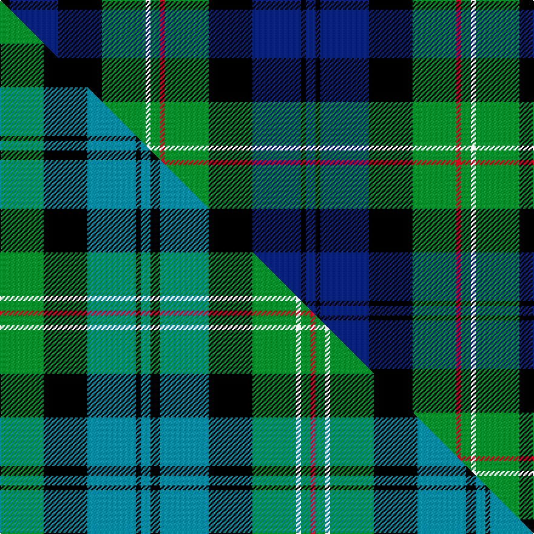

This is one **variant** — a specific cloth: this exact thread count and colourway, with its own
provenance below. It is one weaving of the [sett](/tartans/s/sp/spar-ltd/) (the scale-free proportion — the
same cloth at any scale or shade), whose colour order is pattern [BKBKGRGWGKBK](/stripes/bkbkgrgwgkbk/).

Part of the [Spar Ltd](/tartans/s/sp/spar-ltd/) tartan — the named design grouping this sett with its other cloths.

Sourced from weddslist.  It is a [12 stripe tartan](/stripes/stripes12/).

Original link [http://www.weddslist.com/cgi-bin/tartans/pg.pl?source=sts](http://www.weddslist.com/cgi-bin/tartans/pg.pl?source=sts)

Dataset <small>— provenance for this record, inherited from the source manifest</small>

<dl class="dataset-prov">
<dt>source</dt><dd><a href="/sources/weddslist/">Weddslist</a></dd>
<dt>data captured from</dt><dd><a href="https://github.com/thetartan/tartan-database/blob/master/data/weddslist/data.csv">https://github.com/thetartan/tartan-database/blob/master/data/weddslist/data.csv</a></dd>
<dt>data date</dt><dd>2016-11-17 <small>(dataset default)</small></dd>
<dt>licence</dt><dd><a href="https://creativecommons.org/licenses/by-nc-nd/4.0/">CC BY-NC-ND 4.0</a></dd>
</dl>

Capture chain <small>— the hands this data passed through, oldest first; each capture carries its own licence</small>

<ol class="capture-chain">
<li><a href="https://www.weddslist.com/tartans/">Weddslist</a> <small>the living privately compiled reference</small></li>
<li><a href="https://github.com/thetartan/tartan-database">thetartan/tartan-database</a> <small>2016-2017</small> · <a href="https://creativecommons.org/licenses/by-nc-nd/4.0/">CC BY-NC-ND 4.0</a> <small>Levko Kravets's frozen compilation — the capture we vendored, and where its CC licence text came from</small></li>
<li>this dictionary <small>captured 2026-06-10 · commit 5bf86c7566</small> <small>each re-capture is a git commit to data/sources</small></li>
</ol>

## Thread count
K/8 DB40 K36 G36 W4 G8 R4 G36 K36 DB40 K4 DB/8

One full sett is **504 threads**.

## Palette
<table><thead><tr><th>Colour</th><th>Shade</th><th>OKLCh</th></tr></thead><tbody><tr><td>DB</td><td><code style="background-color:#082077;">#082077</code> <small style="color:#888">#082077</small></td><td><small style="color:#888">oklch(30.0% 0.149 265.1)</small></td></tr><tr><td>G</td><td><code style="background-color:#008B2A;">#008B2A</code> <small style="color:#888">#008B2A</small></td><td><small style="color:#888">oklch(55.4% 0.170 145.9)</small></td></tr><tr><td>K</td><td><code style="background-color:#000000;">#000000</code> <small style="color:#888">#000000</small></td><td><small style="color:#888">oklch(0.0% 0.000 0.0)</small></td></tr><tr><td>W</td><td><code style="background-color:#F7F7F7;">#F7F7F7</code> <small style="color:#888">#F7F7F7</small></td><td><small style="color:#888">oklch(97.6% 0.000 89.9)</small></td></tr><tr><td>R</td><td><code style="background-color:#D60020;">#D60020</code> <small style="color:#888">#D60020</small></td><td><small style="color:#888">oklch(55.2% 0.224 25.5)</small></td></tr></tbody></table>

# Sample pattern

[Sample sheet (PDF)](swatch.pdf) — the woven sample, thread count and palette on one printable A4, rendered on demand (the same sheet the TTD print page downloads).

## Compared to the master

This cloth is one sett of its design; the master sett (the exemplar the design is anchored on) is below for comparison.

Its **ΔTartan distance** from the master is **0.16** — the same measure the nearest-tartans table ranks by (0 is identical; a re-scale of the same cloth is near 0, a recolour or a different proportion further).

<figure class="master-compare" style="margin:0">

this sett
master sett ★

<figcaption style="color:#888;font-size:smaller">One weave of this sett against the <a href="/setts/g9k9t10k1t2k2t10k9g9w1g2r1/">master sett ★</a>, split on the diagonal: a shared proportion runs seamlessly across it with only the shades shifting; a different proportion breaks on it.</figcaption>
</figure>

## Nearest tartan variants

The nearest existing variants by ΔTartan distance, with this cloth at the top so the swatches line up against it.

ΔTartan

Threads

Variant

Sett

—

504

<a href="/variants/s12/k2db10k9g9w1g2r1g9k9db10k1db2~x4/">Spar (UK) Ltd</a>

<a href="/ttd/edit/#slug=g9k9t10k1t2k2t10k9g9w1g2r1~x4&amp;base=k2db10k9g9w1g2r1g9k9db10k1db2~x4" title="compare in the TTD">0.16</a>

480

<a href="/variants/s12/g9k9t10k1t2k2t10k9g9w1g2r1~x4/">Spar (UK) Ltd</a>

<a href="/ttd/edit/#slug=db20k2db4k2db20k17g18dr2g4lb2g18k18~x2&amp;base=k2db10k9g9w1g2r1g9k9db10k1db2~x4" title="compare in the TTD">0.36</a>

432

<a href="/variants/s12/db20k2db4k2db20k17g18dr2g4lb2g18k18~x2/">Spar (UK) Ltd Corporate Tartan</a>

<a href="/ttd/edit/#slug=db10k2db2k2db2k8g8k1w2k1g8k8db9r2~x2&amp;base=k2db10k9g9w1g2r1g9k9db10k1db2~x4" title="compare in the TTD">1.03</a>

236

<a href="/variants/s14/db10k2db2k2db2k8g8k1w2k1g8k8db9r2~x2/">MacKenzie (Miniture) Clan Tartan</a>

<a href="/ttd/edit/#slug=r2db10k10g10w1k4w1g10k10db10r1~x4&amp;base=k2db10k9g9w1g2r1g9k9db10k1db2~x4" title="compare in the TTD">1.07</a>

540

<a href="/variants/s11/r2db10k10g10w1k4w1g10k10db10r1~x4/">Rose</a>

<a href="/ttd/edit/#slug=db17dr2k16g17k2g17k16dr2db17lr2~x2&amp;base=k2db10k9g9w1g2r1g9k9db10k1db2~x4" title="compare in the TTD">1.23</a>

394

<a href="/variants/s10/db17dr2k16g17k2g17k16dr2db17lr2~x2/">Mitchell</a>

<a href="/ttd/edit/#slug=y3k1g10k7db10g2db2g2db10k7g10k1lb3~x2&amp;base=k2db10k9g9w1g2r1g9k9db10k1db2~x4" title="compare in the TTD">1.25</a>

260

<a href="/variants/s13/y3k1g10k7db10g2db2g2db10k7g10k1lb3~x2/">Doon Valley Crafters</a>

<a href="/ttd/edit/#slug=db18k10g9k2r2k2g9k10db9w2~x2&amp;base=k2db10k9g9w1g2r1g9k9db10k1db2~x4" title="compare in the TTD">1.34</a>

252

<a href="/variants/s10/db18k10g9k2r2k2g9k10db9w2~x2/">Robertson Hunting Clan Tartan</a>

<a href="/ttd/edit/#slug=db10k1db1k1db1k6g6k1y2k1g6k6db6r3~x2&amp;base=k2db10k9g9w1g2r1g9k9db10k1db2~x4" title="compare in the TTD">1.34</a>

178

<a href="/variants/s14/db10k1db1k1db1k6g6k1y2k1g6k6db6r3~x2/">MacLeod of Skye</a>

<a href="/ttd/edit/#slug=db11k1db1w1db1k8g8y1g8k8db8w1db1~x2&amp;base=k2db10k9g9w1g2r1g9k9db10k1db2~x4" title="compare in the TTD">1.35</a>

208

<a href="/variants/s13/db11k1db1w1db1k8g8y1g8k8db8w1db1~x2/">Logan Rogers Hunting</a>

<a href="/ttd/edit/#slug=k8r1db8w1db8r1k8g8k1g8~x2&amp;base=k2db10k9g9w1g2r1g9k9db10k1db2~x4" title="compare in the TTD">1.36</a>

176

<a href="/variants/s10/k8r1db8w1db8r1k8g8k1g8~x2/">Hunter Clan Tartan</a>

## Neighbour map

Every grey dot is one of 13662 variants placed by the first two principal components of the ΔTartan feature space (42% of its variance). Red is this tartan; blue dots are its nearest — click one to open its page. The map is a flat projection of a many-dimensional space — [how to read it](/posts/neighbourhood-maps/).

<svg viewBox="0 0 640 380" role="img" style="max-width:100%;height:auto;border:1px solid #e0e0e0;border-radius:4px;display:block" xmlns="http://www.w3.org/2000/svg"><image href="/nn/cloud.v1.png" width="640" height="380"/><a href="/variants/s12/g9k9t10k1t2k2t10k9g9w1g2r1~x4/"><circle cx="106.3" cy="168.6" r="4" fill="#3465a4"><title>Spar (UK) Ltd</title></circle></a><a href="/variants/s12/db20k2db4k2db20k17g18dr2g4lb2g18k18~x2/"><circle cx="123.9" cy="167.3" r="4" fill="#3465a4"><title>Spar (UK) Ltd Corporate Tartan</title></circle></a><a href="/variants/s14/db10k2db2k2db2k8g8k1w2k1g8k8db9r2~x2/"><circle cx="108.9" cy="158.5" r="4" fill="#3465a4"><title>MacKenzie (Miniture) Clan Tartan</title></circle></a><a href="/variants/s11/r2db10k10g10w1k4w1g10k10db10r1~x4/"><circle cx="103.3" cy="175.9" r="4" fill="#3465a4"><title>Rose</title></circle></a><a href="/variants/s10/db17dr2k16g17k2g17k16dr2db17lr2~x2/"><circle cx="99.4" cy="187.8" r="4" fill="#3465a4"><title>Mitchell</title></circle></a><a href="/variants/s13/y3k1g10k7db10g2db2g2db10k7g10k1lb3~x2/"><circle cx="105.9" cy="168.4" r="4" fill="#3465a4"><title>Doon Valley Crafters</title></circle></a><a href="/variants/s10/db18k10g9k2r2k2g9k10db9w2~x2/"><circle cx="114.5" cy="177.8" r="4" fill="#3465a4"><title>Robertson Hunting Clan Tartan</title></circle></a><a href="/variants/s14/db10k1db1k1db1k6g6k1y2k1g6k6db6r3~x2/"><circle cx="113.8" cy="155.5" r="4" fill="#3465a4"><title>MacLeod of Skye</title></circle></a><a href="/variants/s13/db11k1db1w1db1k8g8y1g8k8db8w1db1~x2/"><circle cx="133.2" cy="148.4" r="4" fill="#3465a4"><title>Logan Rogers Hunting</title></circle></a><a href="/variants/s10/k8r1db8w1db8r1k8g8k1g8~x2/"><circle cx="93.0" cy="187.2" r="4" fill="#3465a4"><title>Hunter Clan Tartan</title></circle></a><circle cx="114.6" cy="167.6" r="5" fill="#c00000"/><text x="320" y="376" text-anchor="middle" font-size="11" fill="#999">ground</text><text x="11" y="190" text-anchor="middle" font-size="11" fill="#999" transform="rotate(-90 11 190)">complexity</text></svg>

ID: /variants/s12/k2db10k9g9w1g2r1g9k9db10k1db2~x4/
