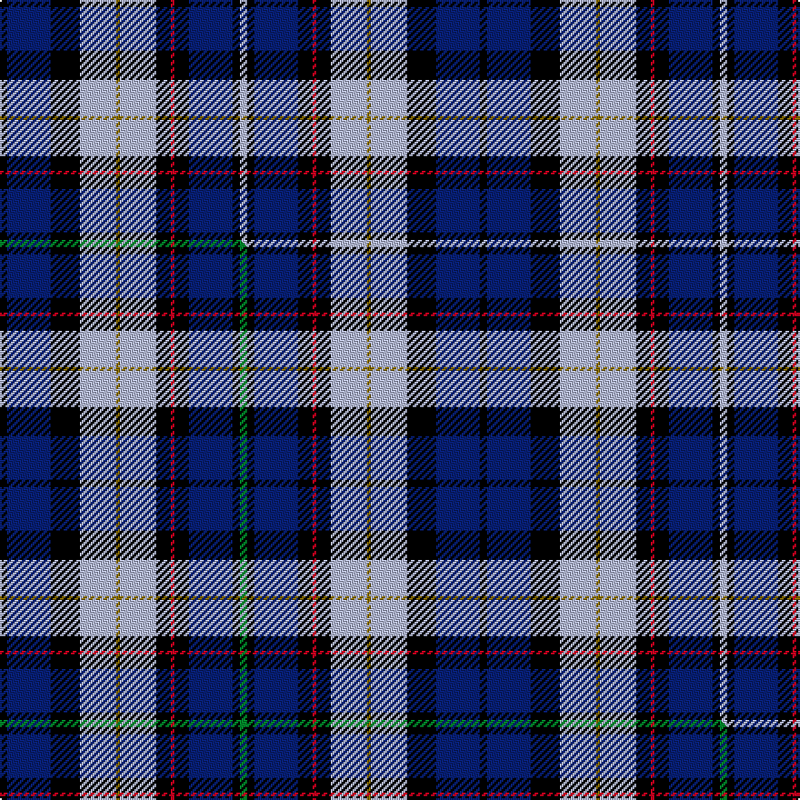

This is one **variant** — a specific cloth: this exact thread count and colourway, with its own
provenance below. It is one weaving of the [sett](/setts/k2db12k8lb10y1lb10k4r1k4db12k2lb2/) (the scale-free proportion — the
same cloth at any scale or shade), whose colour order is pattern [KBKWGWKRKBKW](/stripes/kbkwgwkrkbkw/).

Part of the [Auchinachie](/tartans/auchinachie/) tartan — the named design grouping this sett with its other cloths.

Sourced from tartans-authority.  It is a [12 stripe tartan](/stripes/stripes12/).

Original link [https://www.tartanregister.gov.uk/tartanDetails.aspx?ref=10014](https://www.tartanregister.gov.uk/tartanDetails.aspx?ref=10014)

## Provenance

Earliest known date: Mar. 2009 This is a family tartan designed for Mr Peter Auchinachie, and available for use by all of the name.

2 attestations — the source records this cloth was collapsed from (oldest owns this page)

<ul>
<li>Mar. 2009 — Auchinachie (Name) (tartans-authority, <a href="https://www.tartanregister.gov.uk/tartanDetails.aspx?ref=10014">record</a>)  <em>This is a family tartan designed for Mr Peter Auchinachie, and available for use by all of the name.</em></li>
<li>undated — Auchinachie Name Tartan (house-of-tartan, <a href="http://www.house-of-tartan.scotland.net/house/TartanViewjs.asp?colr=Def&tnam=10014">record</a>) </li>
</ul>

Dataset <small>— provenance for this record, inherited from the source manifest</small>

<dl class="dataset-prov">
<dt>source</dt><dd><a href="/sources/tartans-authority/">Scottish Tartans Authority</a></dd>
<dt>data captured from</dt><dd><a href="https://github.com/thetartan/tartan-database/blob/master/data/tartans-authority/data.csv">https://github.com/thetartan/tartan-database/blob/master/data/tartans-authority/data.csv</a></dd>
<dt>data date</dt><dd>Mar. 2009 <small>(this record)</small></dd>
<dt>licence</dt><dd><a href="https://creativecommons.org/licenses/by-nc-nd/4.0/">CC BY-NC-ND 4.0</a></dd>
</dl>

Capture chain <small>— the hands this data passed through, oldest first; each capture carries its own licence</small>

<ol class="capture-chain">
<li><a href="https://www.tartansauthority.com/">Scottish Tartans Authority</a> <small>the heritage body's archive — its tartan-ferret record browser is retired (links repaired to the SRT, above)</small></li>
<li><a href="https://github.com/thetartan/tartan-database">thetartan/tartan-database</a> <small>2016-2017</small> · <a href="https://creativecommons.org/licenses/by-nc-nd/4.0/">CC BY-NC-ND 4.0</a> <small>Levko Kravets's frozen compilation — the capture we vendored, and where its CC licence text came from</small></li>
<li>this dictionary <small>captured 2026-06-10 · commit 5bf86c7566</small> <small>each re-capture is a git commit to data/sources</small></li>
</ol>

## Register references

External register numbers recorded for this tartan.

- Scottish Register of Tartans: [10014](https://www.tartanregister.gov.uk/tartanDetails?ref=10014)
- Scottish Tartans Authority (ITI): 10014

## Thread count
K/4 DB24 K16 LB20 Y2 LB20 K8 R2 K8 DB24 K4 LB/4

One full sett is **264 threads**.

## Palette
<table><thead><tr><th>Colour</th><th>Shade</th><th>OKLCh</th></tr></thead><tbody><tr><td>LB</td><td><code style="background-color:#B5BBDE;">#B5BBDE</code> <small style="color:#888">#B5BBDE</small></td><td><small style="color:#888">oklch(79.9% 0.050 277.6)</small></td></tr><tr><td>DB</td><td><code style="background-color:#082077;">#082077</code> <small style="color:#888">#082077</small></td><td><small style="color:#888">oklch(30.0% 0.149 265.1)</small></td></tr><tr><td>K</td><td><code style="background-color:#000000;">#000000</code> <small style="color:#888">#000000</small></td><td><small style="color:#888">oklch(0.0% 0.000 0.0)</small></td></tr><tr><td>R</td><td><code style="background-color:#D60020;">#D60020</code> <small style="color:#888">#D60020</small></td><td><small style="color:#888">oklch(55.2% 0.224 25.5)</small></td></tr><tr><td>Y</td><td><code style="background-color:#8B6E00;">#8B6E00</code> <small style="color:#888">#8B6E00</small></td><td><small style="color:#888">oklch(55.1% 0.113 90.4)</small></td></tr></tbody></table>

# Sample pattern

## Compared to the master

This cloth is one sett of its design; the master sett (the exemplar the design is anchored on) is below for comparison.

Its **ΔTartan distance** from the master is **1.02** — the same measure the nearest-tartans table ranks by (0 is identical; a re-scale of the same cloth is near 0, a recolour or a different proportion further).

<figure class="master-compare" style="margin:0">

this sett
master sett ★

<figcaption style="color:#888;font-size:smaller">One weave of this sett against the <a href="/setts/k2db12k8lb10y1lb10k4r1k4db12k2g2/">master sett ★</a>, split on the diagonal: a shared proportion runs seamlessly across it with only the shades shifting; a different proportion breaks on it.</figcaption>
</figure>

## Nearest tartan variants

The nearest existing variants by ΔTartan distance, with this cloth at the top so the swatches line up against it.

ΔTartan

Threads

Variant

Sett

—

264

<a href="/variants/s12/k2db12k8lb10y1lb10k4r1k4db12k2lb2~x2/">Auchinachie (Name)</a>

<a href="/ttd/edit/#slug=k2db12k8lb10y1lb10k4r1k4db12k2g2~x2&amp;base=k2db12k8lb10y1lb10k4r1k4db12k2lb2~x2" title="compare in the TTD">1.02</a>

264

<a href="/variants/s12/k2db12k8lb10y1lb10k4r1k4db12k2g2~x2/">Auchinachie</a>

<a href="/ttd/edit/#slug=dr3k2w18db18k3db3k3db18k18w18k2lo3~x2&amp;base=k2db12k8lb10y1lb10k4r1k4db12k2lb2~x2" title="compare in the TTD">2.12</a>

424

<a href="/variants/s12/dr3k2w18db18k3db3k3db18k18w18k2lo3~x2/">MacEwan Arisaid (Dance)</a>

<a href="/ttd/edit/#slug=db4k4db10k10dy2k10lr4db8lr12db2dp1~x2&amp;base=k2db12k8lb10y1lb10k4r1k4db12k2lb2~x2" title="compare in the TTD">2.17</a>

258

<a href="/variants/s11/db4k4db10k10dy2k10lr4db8lr12db2dp1~x2/">Dutton, Stuart (Personal)</a>

<a href="/ttd/edit/#slug=bi5k15lb5n9lb2b2lb2b2n9k3~x2~bi2011271-b1610274&amp;base=k2db12k8lb10y1lb10k4r1k4db12k2lb2~x2" title="compare in the TTD">2.28</a>

200

<a href="/variants/s10/bi5k15lb5n9lb2b2lb2b2n9k3~x2~bi2011271-b1610274/">Ryukoku University Heian Senior High School</a>

<a href="/ttd/edit/#slug=r1k1lb2k2lb2k1lb4k1db9lo1~x4&amp;base=k2db12k8lb10y1lb10k4r1k4db12k2lb2~x2" title="compare in the TTD">2.40</a>

184

<a href="/variants/s10/r1k1lb2k2lb2k1lb4k1db9lo1~x4/">Thompson Variant</a>

<a href="/ttd/edit/#slug=db15k4db4k4db4k16b16k2g3k2b16k16db18k1w2~x2~db1106275-b2603265&amp;base=k2db12k8lb10y1lb10k4r1k4db12k2lb2~x2" title="compare in the TTD">2.45</a>

458

<a href="/variants/s15/db15k4db4k4db4k16b16k2g3k2b16k16db18k1w2~x2~db1106275-b2603265/">McCruden, Raymond (Personal)</a>

<a href="/ttd/edit/#slug=w7db10k7db7lb7db45k21g21lb4k4w7~x2&amp;base=k2db12k8lb10y1lb10k4r1k4db12k2lb2~x2" title="compare in the TTD">2.54</a>

532

<a href="/variants/s11/w7db10k7db7lb7db45k21g21lb4k4w7~x2/">Utah State University</a>

<a href="/ttd/edit/#slug=db20dr3k10lo2lb15w2lb4w2lb15lo2k10dr3db20~x2&amp;base=k2db12k8lb10y1lb10k4r1k4db12k2lb2~x2" title="compare in the TTD">2.62</a>

352

<a href="/variants/s13/db20dr3k10lo2lb15w2lb4w2lb15lo2k10dr3db20~x2/">U.S. Forces Thurso</a>

<a href="/ttd/edit/#slug=db6k1db1k1db1k6lb6k1w1k1lb6k6db6k1r1~x4&amp;base=k2db12k8lb10y1lb10k4r1k4db12k2lb2~x2" title="compare in the TTD">2.63</a>

332

<a href="/variants/s15/db6k1db1k1db1k6lb6k1w1k1lb6k6db6k1r1~x4/">MacKenzie Blue</a>

<a href="/ttd/edit/#slug=r4t11k4t4k4t4k21dt21w4dt21k21t20k1r4~x2~t2503227-dt1204274&amp;base=k2db12k8lb10y1lb10k4r1k4db12k2lb2~x2" title="compare in the TTD">2.64</a>

560

<a href="/variants/s14/r4t11k4t4k4t4k21db21w4db21k21t20k1r4~x2~t2503227-db1204274/">McCaig (2016)</a>

## Neighbour map

Every grey dot is one of 13621 variants placed by the first two principal components of the ΔTartan feature space (42% of its variance). Red is this tartan; blue dots are its nearest — click one to open its page.

<svg viewBox="0 0 640 380" role="img" style="max-width:100%;height:auto;border:1px solid #e0e0e0;border-radius:4px;display:block" xmlns="http://www.w3.org/2000/svg"><image href="/nn/cloud.v1.png" width="640" height="380"/><a href="/variants/s12/k2db12k8lb10y1lb10k4r1k4db12k2g2~x2/"><circle cx="88.6" cy="135.8" r="4" fill="#3465a4"><title>Auchinachie</title></circle></a><a href="/variants/s12/dr3k2w18db18k3db3k3db18k18w18k2lo3~x2/"><circle cx="102.0" cy="153.3" r="4" fill="#3465a4"><title>MacEwan Arisaid (Dance)</title></circle></a><a href="/variants/s11/db4k4db10k10dy2k10lr4db8lr12db2dp1~x2/"><circle cx="112.0" cy="164.9" r="4" fill="#3465a4"><title>Dutton, Stuart (Personal)</title></circle></a><a href="/variants/s10/bi5k15lb5n9lb2b2lb2b2n9k3~x2~bi2011271-b1610274/"><circle cx="90.5" cy="177.4" r="4" fill="#3465a4"><title>Ryukoku University Heian Senior High School</title></circle></a><a href="/variants/s10/r1k1lb2k2lb2k1lb4k1db9lo1~x4/"><circle cx="126.5" cy="146.6" r="4" fill="#3465a4"><title>Thompson Variant</title></circle></a><a href="/variants/s15/db15k4db4k4db4k16b16k2g3k2b16k16db18k1w2~x2~db1106275-b2603265/"><circle cx="141.4" cy="124.6" r="4" fill="#3465a4"><title>McCruden, Raymond (Personal)</title></circle></a><a href="/variants/s11/w7db10k7db7lb7db45k21g21lb4k4w7~x2/"><circle cx="144.9" cy="143.9" r="4" fill="#3465a4"><title>Utah State University</title></circle></a><a href="/variants/s13/db20dr3k10lo2lb15w2lb4w2lb15lo2k10dr3db20~x2/"><circle cx="92.8" cy="137.3" r="4" fill="#3465a4"><title>U.S. Forces Thurso</title></circle></a><a href="/variants/s15/db6k1db1k1db1k6lb6k1w1k1lb6k6db6k1r1~x4/"><circle cx="94.5" cy="157.8" r="4" fill="#3465a4"><title>MacKenzie Blue</title></circle></a><a href="/variants/s14/r4t11k4t4k4t4k21db21w4db21k21t20k1r4~x2~t2503227-db1204274/"><circle cx="130.0" cy="120.8" r="4" fill="#3465a4"><title>McCaig (2016)</title></circle></a><circle cx="110.5" cy="148.8" r="5" fill="#c00000"/><text x="320" y="376" text-anchor="middle" font-size="11" fill="#999">ground</text><text x="11" y="190" text-anchor="middle" font-size="11" fill="#999" transform="rotate(-90 11 190)">complexity</text></svg>

ID: /variants/s12/k2db12k8lb10y1lb10k4r1k4db12k2lb2~x2/
