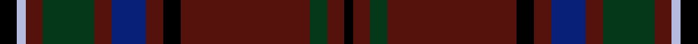

This page is one **sett** — a single exact thread-count. It belongs to the [tartan](/setts/k2lb1dr2dg6dr2db4dr2k2dr15dg2dr2k1/)
(the same proportion at any scale), whose colour order is pattern [KBGBKBBBGBWK](/stripes/kbgbkbbbgbwk/).

Part of the [MacClure](/tartans/macclure/) tartan — the named design grouping this sett with its other cloths.

Sourced from register-of-tartans.  It is a [12 stripe tartan](/stripes/stripes12/).

Original link https://www.tartanregister.gov.uk/tartanDetails.aspx?ref=2314

2 attestations — the source records this cloth was collapsed from (oldest owns this page)

<ul>
<li>01/01/1999 — MacClure (register-of-tartans, <a href="https://www.tartanregister.gov.uk/tartanDetails.aspx?ref=2314">record</a>)  <em>Designed by Phil Smith in 2004 for all MacClures and originally woven by DC Dalgliesh.</em></li>
<li>pre 2002 — MacClure (Name) (tartans-authority, <a href="http://www.tartansauthority.com/tartan-ferret/display/3330/">record</a>)  <em>Designed by Phil Smith for all MacClures. (Phil Smith Sept 2004) and originally woven by D C Dalgliesh. Lochcarron swatch.</em></li>
</ul>

## Register references

External register numbers recorded for this tartan.

- Scottish Register of Tartans: [2314](https://www.tartanregister.gov.uk/tartanDetails.aspx?ref=2314)
- Scottish Tartans Authority (ITI): 3330
- Scottish Tartans World Register: 2773

## Thread count
K/8 LB4 DR8 DG24 DR8 DB16 DR8 K8 DR60 DG8 DR8 K/4

One full sett is **316 threads**.

## Palette
<table><thead><tr><th>Colour</th><th>Shade</th><th>OKLCh</th></tr></thead><tbody><tr><td>DB</td><td><code style="background-color:#082077;">#082077</code> <small style="color:#888">#082077</small></td><td><small style="color:#888">oklch(30.0% 0.149 265.1)</small></td></tr><tr><td>DG</td><td><code style="background-color:#053819;">#053819</code> <small style="color:#888">#053819</small></td><td><small style="color:#888">oklch(30.0% 0.075 151.3)</small></td></tr><tr><td>DR</td><td><code style="background-color:#55120C;">#55120C</code> <small style="color:#888">#55120C</small></td><td><small style="color:#888">oklch(30.0% 0.099 29.3)</small></td></tr><tr><td>K</td><td><code style="background-color:#000000;">#000000</code> <small style="color:#888">#000000</small></td><td><small style="color:#888">oklch(0.0% 0.000 0.0)</small></td></tr><tr><td>LB</td><td><code style="background-color:#B5BBDE;">#B5BBDE</code> <small style="color:#888">#B5BBDE</small></td><td><small style="color:#888">oklch(79.9% 0.050 277.6)</small></td></tr></tbody></table>

# Sample pattern

## Nearest variants

The nearest existing variants by ΔTartan distance, with this cloth at the top so the swatches line up against it.

ΔTartan

Threads

Variant

Sett

—

316

<a href="/variants/s12/k2lb1dr2dg6dr2db4dr2k2dr15dg2dr2k1~x4/">MacClure</a>

<a href="/ttd/edit/#slug=k2lr1dr2g6dr2db4dr2k2dr15g2dr2k1~x4&amp;base=k2lb1dr2dg6dr2db4dr2k2dr15dg2dr2k1~x4" title="compare in the TTD">0.30</a>

316

<a href="/variants/s12/k2lr1dr2g6dr2db4dr2k2dr15g2dr2k1~x4/">MacClure Clan/Family Tartan</a>

## Neighbour map

Every grey dot is one of 13620 variants placed by the first two principal components of the ΔTartan feature space (42% of its variance). Red is this tartan; blue dots are its nearest — click one to open its page.

<svg viewBox="0 0 640 380" role="img" style="max-width:100%;height:auto;border:1px solid #e0e0e0;border-radius:4px;display:block" xmlns="http://www.w3.org/2000/svg"><image href="/nn/cloud.v1.png" width="640" height="380"/><a href="/variants/s12/k2lr1dr2g6dr2db4dr2k2dr15g2dr2k1~x4/"><circle cx="273.4" cy="119.8" r="4" fill="#3465a4"><title>MacClure Clan/Family Tartan</title></circle></a><circle cx="333.2" cy="139.2" r="5" fill="#c00000"/><text x="320" y="376" text-anchor="middle" font-size="11" fill="#999">ground</text><text x="11" y="190" text-anchor="middle" font-size="11" fill="#999" transform="rotate(-90 11 190)">complexity</text></svg>

ID: /variants/s12/k2lb1dr2dg6dr2db4dr2k2dr15dg2dr2k1~x4/
