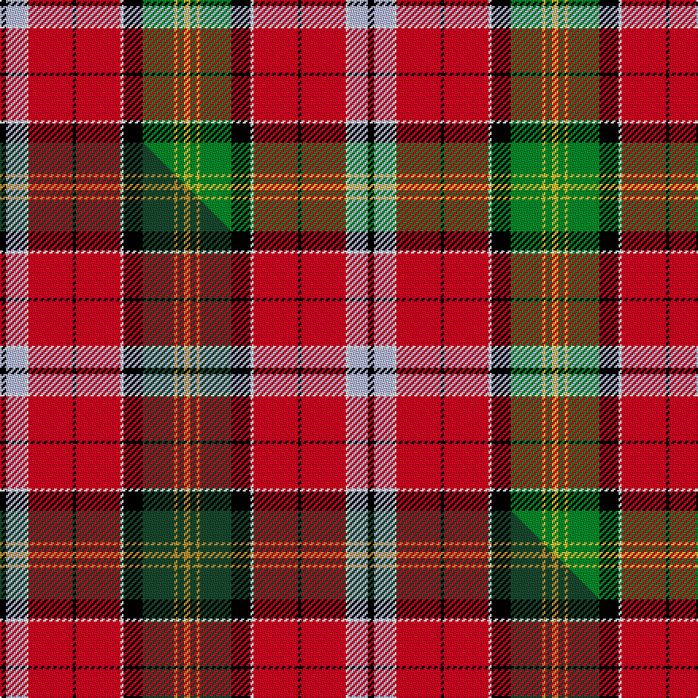

This is one **variant** — a specific cloth: this exact thread count and colourway, with its own
provenance below. It is one weaving of the [sett](/setts/k2lb6w1r14k1r14w1k6g10ly1g2ly2/) (the scale-free proportion — the
same cloth at any scale or shade), whose colour order is pattern [KWWRKRWKGYGY](/stripes/kwwrkrwkgygy/).

Part of the [Ogg of Tarragann](/tartans/o/og/ogg-of-tarragann/) tartan — the named design grouping this sett with its other cloths.

Sourced from tartans-authority.  It is a [12 stripe tartan](/stripes/stripes12/).

Original link [https://www.tartanregister.gov.uk/tartanDetails.aspx?ref=10178](https://www.tartanregister.gov.uk/tartanDetails.aspx?ref=10178)

Dataset <small>— provenance for this record, inherited from the source manifest</small>

<dl class="dataset-prov">
<dt>source</dt><dd><a href="/sources/tartans-authority/">Scottish Tartans Authority</a></dd>
<dt>data captured from</dt><dd><a href="https://github.com/thetartan/tartan-database/blob/master/data/tartans-authority/data.csv">https://github.com/thetartan/tartan-database/blob/master/data/tartans-authority/data.csv</a></dd>
<dt>data date</dt><dd>9th Feb. 1994 <small>(this record)</small></dd>
<dt>licence</dt><dd><a href="https://creativecommons.org/licenses/by-nc-nd/4.0/">CC BY-NC-ND 4.0</a></dd>
</dl>

Capture chain <small>— the hands this data passed through, oldest first; each capture carries its own licence</small>

<ol class="capture-chain">
<li><a href="https://www.tartansauthority.com/">Scottish Tartans Authority</a> <small>the heritage body's archive — its tartan-ferret record browser is retired (links repaired to the SRT, above)</small></li>
<li><a href="https://github.com/thetartan/tartan-database">thetartan/tartan-database</a> <small>2016-2017</small> · <a href="https://creativecommons.org/licenses/by-nc-nd/4.0/">CC BY-NC-ND 4.0</a> <small>Levko Kravets's frozen compilation — the capture we vendored, and where its CC licence text came from</small></li>
<li>this dictionary <small>captured 2026-06-10 · commit 5bf86c7566</small> <small>each re-capture is a git commit to data/sources</small></li>
</ol>

## Register references

External register numbers recorded for this tartan.

- Scottish Tartans Authority (ITI): 10178

## Thread count
K/4 LB12 W2 R28 K2 R28 W2 K12 G20 LY2 G4 LY/4

One full sett is **232 threads**.

## Palette
<table><thead><tr><th>Colour</th><th>Shade</th><th>OKLCh</th></tr></thead><tbody><tr><td>LB</td><td><code style="background-color:#B5BBDE;">#B5BBDE</code> <small style="color:#888">#B5BBDE</small></td><td><small style="color:#888">oklch(79.9% 0.050 277.6)</small></td></tr><tr><td>LY</td><td><code style="background-color:#DCBC32;">#DCBC32</code> <small style="color:#888">#DCBC32</small></td><td><small style="color:#888">oklch(80.0% 0.150 95.2)</small></td></tr><tr><td>G</td><td><code style="background-color:#008B2A;">#008B2A</code> <small style="color:#888">#008B2A</small></td><td><small style="color:#888">oklch(55.4% 0.170 145.9)</small></td></tr><tr><td>K</td><td><code style="background-color:#000000;">#000000</code> <small style="color:#888">#000000</small></td><td><small style="color:#888">oklch(0.0% 0.000 0.0)</small></td></tr><tr><td>W</td><td><code style="background-color:#F7F7F7;">#F7F7F7</code> <small style="color:#888">#F7F7F7</small></td><td><small style="color:#888">oklch(97.6% 0.000 89.9)</small></td></tr><tr><td>R</td><td><code style="background-color:#D60020;">#D60020</code> <small style="color:#888">#D60020</small></td><td><small style="color:#888">oklch(55.2% 0.224 25.5)</small></td></tr></tbody></table>

# Sample pattern

## Compared to the master

This cloth is one sett of its design; the master sett (the exemplar the design is anchored on) is below for comparison.

Its **ΔTartan distance** from the master is **0.10** — the same measure the nearest-tartans table ranks by (0 is identical; a re-scale of the same cloth is near 0, a recolour or a different proportion further).

<figure class="master-compare" style="margin:0">

this sett
master sett ★

<figcaption style="color:#888;font-size:smaller">One weave of this sett against the <a href="/setts/k2lb6w1r14k1r14w1k6dg10ly1dg2ly2/">master sett ★</a>, split on the diagonal: a shared proportion runs seamlessly across it with only the shades shifting; a different proportion breaks on it.</figcaption>
</figure>

## Nearest tartan variants

The nearest existing variants by ΔTartan distance, with this cloth at the top so the swatches line up against it.

ΔTartan

Threads

Variant

Sett

—

232

<a href="/variants/s12/k2lb6w1r14k1r14w1k6g10ly1g2ly2~x2/">Ogg of Tarragann (Personal)</a>

<a href="/ttd/edit/#slug=k2lb6w1r14k1r14w1k6dg10ly1dg2ly2~x2~dg1403152-ly2705081&amp;base=k2lb6w1r14k1r14w1k6g10ly1g2ly2~x2" title="compare in the TTD">0.10</a>

232

<a href="/variants/s12/k2lb6w1r14k1r14w1k6dg10ly1dg2ly2~x2~dg1403152-ly2705081/">Ogg of Tarragann</a>

<a href="/ttd/edit/#slug=r14lb4k6y1k2w2k2g12r6k2r2w1~x2&amp;base=k2lb6w1r14k1r14w1k6g10ly1g2ly2~x2" title="compare in the TTD">1.59</a>

186

<a href="/variants/s12/r14lb4k6y1k2w2k2g12r6k2r2w1~x2/">Stewart Prince Charles Edward Clan Tartan</a>

<a href="/ttd/edit/#slug=w2k1t2lb1dg4r1dg4r3k3r12lb1r2k1~x4&amp;base=k2lb6w1r14k1r14w1k6g10ly1g2ly2~x2" title="compare in the TTD">1.59</a>

284

<a href="/variants/s13/w2k1t2lb1dg4r1dg4r3k3r12lb1r2k1~x4/">Peacock (Personal)</a>

<a href="/ttd/edit/#slug=lb16k12y4k4w6k4g32r50lb6r8k3&amp;base=k2lb6w1r14k1r14w1k6g10ly1g2ly2~x2" title="compare in the TTD">1.80</a>

271

<a href="/variants/s11/lb16k12y4k4w6k4g32r50lb6r8k3/">MacLean of Duart #3</a>

<a href="/ttd/edit/#slug=k2g12r2k2r2k2r16y2r3db6r3k1g8k1r3w2~x2&amp;base=k2lb6w1r14k1r14w1k6g10ly1g2ly2~x2" title="compare in the TTD">1.97</a>

260

<a href="/variants/s16/k2g12r2k2r2k2r16y2r3db6r3k1g8k1r3w2~x2/">Innes (D C Stewart)</a>

<a href="/ttd/edit/#slug=k1r14lb8k9y1k2w2k2g10r15k4r12w1~x2&amp;base=k2lb6w1r14k1r14w1k6g10ly1g2ly2~x2" title="compare in the TTD">1.97</a>

320

<a href="/variants/s13/k1r14lb8k9y1k2w2k2g10r15k4r12w1~x2/">Wilson's, No 1</a>

<a href="/ttd/edit/#slug=r44g25k2w6k2y3k16lb12r6lb12k16y3k2w6r44~x2&amp;base=k2lb6w1r14k1r14w1k6g10ly1g2ly2~x2" title="compare in the TTD">1.98</a>

620

<a href="/variants/s15/r44g25k2w6k2y3k16lb12r6lb12k16y3k2w6r44~x2/">Wilson's, No 17</a>

<a href="/ttd/edit/#slug=r30w2lb4k4y2k2w6k2lb11k15y3g20r14w4r4k2r8~x2&amp;base=k2lb6w1r14k1r14w1k6g10ly1g2ly2~x2" title="compare in the TTD">2.00</a>

456

<a href="/variants/s17/r30w2lb4k4y2k2w6k2lb11k15y3g20r14w4r4k2r8~x2/">Wilson's No.156</a>

<a href="/ttd/edit/#slug=k2r14lb8k9y1k2w2k2g10r15k4r12w2~x2&amp;base=k2lb6w1r14k1r14w1k6g10ly1g2ly2~x2" title="compare in the TTD">2.04</a>

324

<a href="/variants/s13/k2r14lb8k9y1k2w2k2g10r15k4r12w2~x2/">Harden (Name)</a>

<a href="/ttd/edit/#slug=r25w4k4g25y3k15lb13r5lb5r15g4r5k2g3~x2&amp;base=k2lb6w1r14k1r14w1k6g10ly1g2ly2~x2" title="compare in the TTD">2.06</a>

456

<a href="/variants/s14/r25w4k4g25y3k15lb13r5lb5r15g4r5k2g3~x2/">Wilson's, No 226</a>

## Neighbour map

Every grey dot is one of 13621 variants placed by the first two principal components of the ΔTartan feature space (42% of its variance). Red is this tartan; blue dots are its nearest — click one to open its page.

<svg viewBox="0 0 640 380" role="img" style="max-width:100%;height:auto;border:1px solid #e0e0e0;border-radius:4px;display:block" xmlns="http://www.w3.org/2000/svg"><image href="/nn/cloud.v1.png" width="640" height="380"/><a href="/variants/s12/k2lb6w1r14k1r14w1k6dg10ly1dg2ly2~x2~dg1403152-ly2705081/"><circle cx="162.4" cy="106.5" r="4" fill="#3465a4"><title>Ogg of Tarragann</title></circle></a><a href="/variants/s12/r14lb4k6y1k2w2k2g12r6k2r2w1~x2/"><circle cx="120.4" cy="109.5" r="4" fill="#3465a4"><title>Stewart Prince Charles Edward Clan Tartan</title></circle></a><a href="/variants/s13/w2k1t2lb1dg4r1dg4r3k3r12lb1r2k1~x4/"><circle cx="166.5" cy="104.6" r="4" fill="#3465a4"><title>Peacock (Personal)</title></circle></a><a href="/variants/s11/lb16k12y4k4w6k4g32r50lb6r8k3/"><circle cx="136.3" cy="99.2" r="4" fill="#3465a4"><title>MacLean of Duart #3</title></circle></a><a href="/variants/s16/k2g12r2k2r2k2r16y2r3db6r3k1g8k1r3w2~x2/"><circle cx="152.0" cy="92.4" r="4" fill="#3465a4"><title>Innes (D C Stewart)</title></circle></a><a href="/variants/s13/k1r14lb8k9y1k2w2k2g10r15k4r12w1~x2/"><circle cx="167.4" cy="107.7" r="4" fill="#3465a4"><title>Wilson's, No 1</title></circle></a><a href="/variants/s15/r44g25k2w6k2y3k16lb12r6lb12k16y3k2w6r44~x2/"><circle cx="168.2" cy="74.9" r="4" fill="#3465a4"><title>Wilson's, No 17</title></circle></a><a href="/variants/s17/r30w2lb4k4y2k2w6k2lb11k15y3g20r14w4r4k2r8~x2/"><circle cx="116.7" cy="88.1" r="4" fill="#3465a4"><title>Wilson's No.156</title></circle></a><a href="/variants/s13/k2r14lb8k9y1k2w2k2g10r15k4r12w2~x2/"><circle cx="155.9" cy="111.6" r="4" fill="#3465a4"><title>Harden (Name)</title></circle></a><a href="/variants/s14/r25w4k4g25y3k15lb13r5lb5r15g4r5k2g3~x2/"><circle cx="105.2" cy="117.2" r="4" fill="#3465a4"><title>Wilson's, No 226</title></circle></a><circle cx="157.2" cy="107.2" r="5" fill="#c00000"/><text x="320" y="376" text-anchor="middle" font-size="11" fill="#999">ground</text><text x="11" y="190" text-anchor="middle" font-size="11" fill="#999" transform="rotate(-90 11 190)">complexity</text></svg>

ID: /variants/s12/k2lb6w1r14k1r14w1k6g10ly1g2ly2~x2/
