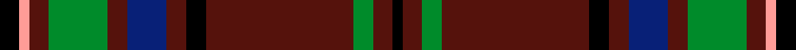
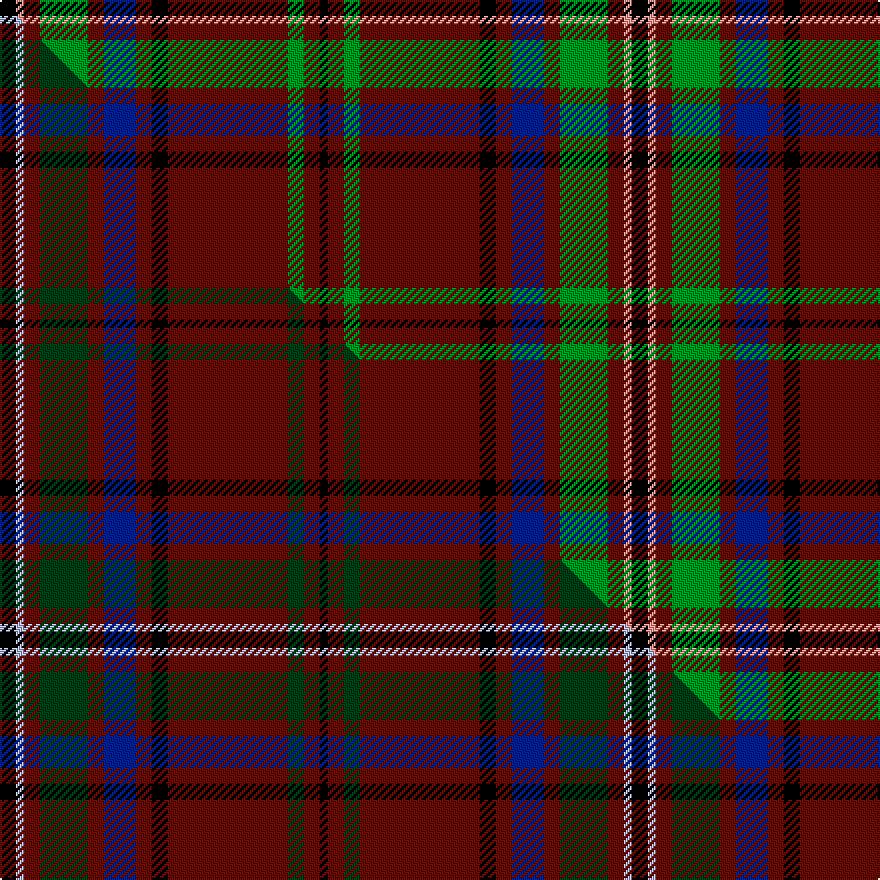

This page is one **sett** — a single exact thread-count. It belongs to the [tartan](/setts/k2lr1dr2g6dr2db4dr2k2dr15g2dr2k1/)
(the same proportion at any scale), whose colour order is pattern [KBGBKBBBGBYK](/stripes/kbgbkbbbgbyk/).

Part of the [MacClure](/tartans/macclure/) tartan — the named design grouping this sett with its other cloths.

Sourced from house-of-tartan.  It is a [12 stripe tartan](/stripes/stripes12/).

Original link http://www.house-of-tartan.scotland.net/house/TartanViewjs.asp?colr=Def&tnam=3330

## Provenance

Earliest known date: pre 2002 Designed by Phil Smith for all MacClures. (note by Phil Smith Sept 2004) and originally woven by D C Dalgliesh. MacClures and MacLures are a sept of MacLeod.

## Thread count
K/8 LR4 DR8 G24 DR8 DB16 DR8 K8 DR60 G8 DR8 K/4

One full sett is **316 threads**.

## Palette
<table><thead><tr><th>Colour</th><th>Shade</th><th>OKLCh</th></tr></thead><tbody><tr><td>DB</td><td><code style="background-color:#082077;">#082077</code> <small style="color:#888">#082077</small></td><td><small style="color:#888">oklch(30.0% 0.149 265.1)</small></td></tr><tr><td>DR</td><td><code style="background-color:#55120C;">#55120C</code> <small style="color:#888">#55120C</small></td><td><small style="color:#888">oklch(30.0% 0.099 29.3)</small></td></tr><tr><td>G</td><td><code style="background-color:#008B2A;">#008B2A</code> <small style="color:#888">#008B2A</small></td><td><small style="color:#888">oklch(55.4% 0.170 145.9)</small></td></tr><tr><td>K</td><td><code style="background-color:#000000;">#000000</code> <small style="color:#888">#000000</small></td><td><small style="color:#888">oklch(0.0% 0.000 0.0)</small></td></tr><tr><td>LR</td><td><code style="background-color:#FF9C97;">#FF9C97</code> <small style="color:#888">#FF9C97</small></td><td><small style="color:#888">oklch(79.3% 0.119 23.2)</small></td></tr></tbody></table>

# Sample pattern

## Compared to the master

This cloth is one sett of its design; the master sett (the exemplar the design is anchored on) is below for comparison.

Its **ΔTartan distance** from the master is **1.85** — the same measure the nearest-tartans table ranks by (0 is identical; a re-scale of the same cloth is near 0, a recolour or a different proportion further).

<figure class="master-compare" style="margin:0">

this sett
master sett ★

<figcaption style="color:#888;font-size:smaller">One weave of this sett against the <a href="/setts/k2lb1dr2dg6dr2db4dr2k2dr15dg2dr2k1/">master sett ★</a>, split on the diagonal: a shared proportion runs seamlessly across it with only the shades shifting; a different proportion breaks on it.</figcaption>
</figure>

## Nearest variants

The nearest existing variants by ΔTartan distance, with this cloth at the top so the swatches line up against it.

ΔTartan

Threads

Variant

Sett

—

316

<a href="/variants/s12/k2lr1dr2g6dr2db4dr2k2dr15g2dr2k1~x4/">MacClure Clan/Family Tartan</a>

<a href="/ttd/edit/#slug=dr5r2k3dr4g43dr6k7lb2dr47g2dr3r2g4~x2&amp;base=k2lr1dr2g6dr2db4dr2k2dr15g2dr2k1~x4" title="compare in the TTD">2.86</a>

502

<a href="/variants/s13/dr5r2k3dr4g43dr6k7lb2dr47g2dr3r2g4~x2/">Glen Coe (District)</a>

## Neighbour map

Every grey dot is one of 13620 variants placed by the first two principal components of the ΔTartan feature space (42% of its variance). Red is this tartan; blue dots are its nearest — click one to open its page.

<svg viewBox="0 0 640 380" role="img" style="max-width:100%;height:auto;border:1px solid #e0e0e0;border-radius:4px;display:block" xmlns="http://www.w3.org/2000/svg"><image href="/nn/cloud.v1.png" width="640" height="380"/><a href="/variants/s13/dr5r2k3dr4g43dr6k7lb2dr47g2dr3r2g4~x2/"><circle cx="288.7" cy="82.3" r="4" fill="#3465a4"><title>Glen Coe (District)</title></circle></a><circle cx="273.4" cy="119.8" r="5" fill="#c00000"/><text x="320" y="376" text-anchor="middle" font-size="11" fill="#999">ground</text><text x="11" y="190" text-anchor="middle" font-size="11" fill="#999" transform="rotate(-90 11 190)">complexity</text></svg>

ID: /variants/s12/k2lr1dr2g6dr2db4dr2k2dr15g2dr2k1~x4/
