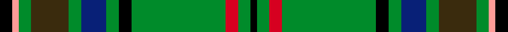

This page is one **sett** — a single exact thread-count. It belongs to the [tartan](/setts/k2lr1g2dy6g2db4g2k2g15r2g2k1/)
(the same proportion at any scale), whose colour order is pattern [KGRGKGBGGGYK](/stripes/kgrgkgbgggyk/).

Part of the [MacClure Hunting](/tartans/macclure-hunting/) tartan — the named design grouping this sett with its other cloths.

Sourced from house-of-tartan.  It is a [12 stripe tartan](/stripes/stripes12/).

Original link http://www.house-of-tartan.scotland.net/house/TartanViewjs.asp?colr=Def&tnam=3331

## Provenance

Earliest known date: pre 2002 Designed by Phil Smith for all MacClures. (note by Phil Smith Sept 2004) and originally woven by D C Dalgliesh. MacClures and MacLures are a sept of MacLeod.

## Thread count
K/8 LR4 G8 DY24 G8 DB16 G8 K8 G60 R8 G8 K/4

One full sett is **316 threads**.

## Palette
<table><thead><tr><th>Colour</th><th>Shade</th><th>OKLCh</th></tr></thead><tbody><tr><td>DB</td><td><code style="background-color:#082077;">#082077</code> <small style="color:#888">#082077</small></td><td><small style="color:#888">oklch(30.0% 0.149 265.1)</small></td></tr><tr><td>G</td><td><code style="background-color:#008B2A;">#008B2A</code> <small style="color:#888">#008B2A</small></td><td><small style="color:#888">oklch(55.4% 0.170 145.9)</small></td></tr><tr><td>K</td><td><code style="background-color:#000000;">#000000</code> <small style="color:#888">#000000</small></td><td><small style="color:#888">oklch(0.0% 0.000 0.0)</small></td></tr><tr><td>N</td><td><code style="background-color:#B5BBDE;">#B5BBDE</code> <small style="color:#888">#B5BBDE</small></td><td><small style="color:#888">oklch(79.9% 0.050 277.6)</small></td></tr><tr><td>Na</td><td><code style="background-color:#FF9C97;">#FF9C97</code> <small style="color:#888">#FF9C97</small></td><td><small style="color:#888">oklch(79.3% 0.119 23.2)</small></td></tr><tr><td>R</td><td><code style="background-color:#D60020;">#D60020</code> <small style="color:#888">#D60020</small></td><td><small style="color:#888">oklch(55.2% 0.224 25.5)</small></td></tr><tr><td>T</td><td><code style="background-color:#3A2B0D;">#3A2B0D</code> <small style="color:#888">#3A2B0D</small></td><td><small style="color:#888">oklch(30.0% 0.049 82.0)</small></td></tr></tbody></table>

# Sample pattern

## Compared to the master

This cloth is one sett of its design; the master sett (the exemplar the design is anchored on) is below for comparison.

Its **ΔTartan distance** from the master is **0.13** — the same measure the nearest-tartans table ranks by (0 is identical; a re-scale of the same cloth is near 0, a recolour or a different proportion further).

<figure style="margin:0"><figcaption style="color:#888;font-size:smaller">this sett</figcaption></figure>
<figure style="margin:0"><figcaption style="color:#888;font-size:smaller"><a href="/setts/k2w1g2dy6g2db4g2k2g15r2g2k1/">master sett →</a></figcaption></figure>

## Nearest variants

The nearest existing variants by ΔTartan distance, with this cloth at the top so the swatches line up against it.

ΔTartan

Threads

Variant

Sett

—

316

<a href="/variants/s12/k2lr1g2dy6g2db4g2k2g15r2g2k1~x4/">MacClure Hunting Clan/Family Tartan</a>

<a href="/ttd/edit/#slug=k2w1g2dy6g2db4g2k2g15r2g2k1~x4&amp;base=k2lr1g2dy6g2db4g2k2g15r2g2k1~x4" title="compare in the TTD">0.30</a>

316

<a href="/variants/s12/k2w1g2dy6g2db4g2k2g15r2g2k1~x4/">MacClure Htg (Name)</a>

<a href="/ttd/edit/#slug=k3g3y2g30k2g3r12g6lp6k3g3~x2&amp;base=k2lr1g2dy6g2db4g2k2g15r2g2k1~x4" title="compare in the TTD">1.79</a>

280

<a href="/variants/s11/k3g3y2g30k2g3r12g6lp6k3g3~x2/">McAlifyfe (Personal)</a>

<a href="/ttd/edit/#slug=g10k1g10db1g1k1g1k1db10k1lo1dr1~x4&amp;base=k2lr1g2dy6g2db4g2k2g15r2g2k1~x4" title="compare in the TTD">2.80</a>

268

<a href="/variants/s12/g10k1g10db1g1k1g1k1db10k1lo1dr1~x4/">Old Dobbs County (District)</a>

<a href="/ttd/edit/#slug=y3g3r2g16k2db24k2g16r2g3lb3~x2&amp;base=k2lr1g2dy6g2db4g2k2g15r2g2k1~x4" title="compare in the TTD">2.98</a>

292

<a href="/variants/s11/y3g3r2g16k2db24k2g16r2g3lb3~x2/">Loch Tay</a>

<a href="/ttd/edit/#slug=ly3g3dr2g16k2db24k2g16dr2g3lb3~x2&amp;base=k2lr1g2dy6g2db4g2k2g15r2g2k1~x4" title="compare in the TTD">2.98</a>

292

<a href="/variants/s11/ly3g3dr2g16k2db24k2g16dr2g3lb3~x2/">Loch Tay (District)</a>

## Neighbour map

Every grey dot is one of 13620 variants placed by the first two principal components of the ΔTartan feature space (42% of its variance). Red is this tartan; blue dots are its nearest — click one to open its page.

<svg viewBox="0 0 640 380" role="img" style="max-width:100%;height:auto;border:1px solid #e0e0e0;border-radius:4px;display:block" xmlns="http://www.w3.org/2000/svg"><image href="/nn/cloud.v1.png" width="640" height="380"/><a href="/variants/s12/k2w1g2dy6g2db4g2k2g15r2g2k1~x4/"><circle cx="219.5" cy="107.5" r="4" fill="#3465a4"><title>MacClure Htg (Name)</title></circle></a><a href="/variants/s11/k3g3y2g30k2g3r12g6lp6k3g3~x2/"><circle cx="287.9" cy="118.8" r="4" fill="#3465a4"><title>McAlifyfe (Personal)</title></circle></a><a href="/variants/s12/g10k1g10db1g1k1g1k1db10k1lo1dr1~x4/"><circle cx="253.9" cy="134.6" r="4" fill="#3465a4"><title>Old Dobbs County (District)</title></circle></a><a href="/variants/s11/y3g3r2g16k2db24k2g16r2g3lb3~x2/"><circle cx="210.5" cy="128.3" r="4" fill="#3465a4"><title>Loch Tay</title></circle></a><a href="/variants/s11/ly3g3dr2g16k2db24k2g16dr2g3lb3~x2/"><circle cx="207.7" cy="128.5" r="4" fill="#3465a4"><title>Loch Tay (District)</title></circle></a><circle cx="223.5" cy="108.5" r="5" fill="#c00000"/><text x="320" y="376" text-anchor="middle" font-size="11" fill="#999">ground</text><text x="11" y="190" text-anchor="middle" font-size="11" fill="#999" transform="rotate(-90 11 190)">complexity</text></svg>

ID: /variants/s12/k2lr1g2dy6g2db4g2k2g15r2g2k1~x4/
