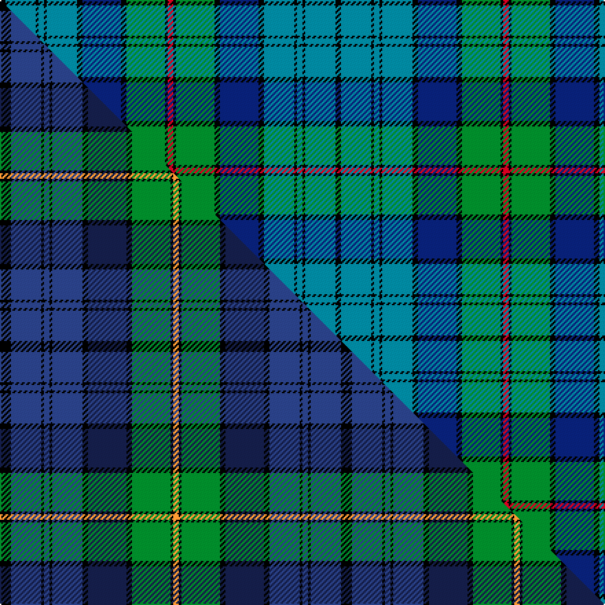

This page is one **sett** — a single exact thread-count. It belongs to the [tartan](/setts/k2t11k1t2k1t11k2db14k2g14k1r2/)
(the same proportion at any scale), whose colour order is pattern [KBKBKBKBKGKR](/stripes/kbkbkbkbkgkr/).

Part of the [Brown Ellis](/tartans/brown-ellis/) tartan — the named design grouping this sett with its other cloths.

Sourced from tartans-authority.  It is a [12 stripe tartan](/stripes/stripes12/).

Original link https://www.tartanregister.gov.uk/tartanDetails.aspx?ref=7350

Dataset <small>— provenance for this record, inherited from the source manifest</small>

<dl class="dataset-prov">
<dt>source</dt><dd><a href="/sources/tartans-authority/">Scottish Tartans Authority</a></dd>
<dt>data captured from</dt><dd><a href="https://github.com/thetartan/tartan-database/blob/master/data/tartans-authority/data.csv">https://github.com/thetartan/tartan-database/blob/master/data/tartans-authority/data.csv</a></dd>
<dt>data date</dt><dd>pre 2007 <small>(this record)</small></dd>
<dt>licence</dt><dd><a href="https://creativecommons.org/licenses/by-nc-nd/4.0/">CC BY-NC-ND 4.0</a></dd>
</dl>

Capture chain <small>— the hands this data passed through, oldest first; each capture carries its own licence</small>

<ol class="capture-chain">
<li><a href="https://www.tartansauthority.com/">Scottish Tartans Authority</a> <small>the heritage body's archive — its tartan-ferret record browser is retired (links repaired to the SRT, above)</small></li>
<li><a href="https://github.com/thetartan/tartan-database">thetartan/tartan-database</a> <small>2016-2017</small> · <a href="https://creativecommons.org/licenses/by-nc-nd/4.0/">CC BY-NC-ND 4.0</a> <small>Levko Kravets's frozen compilation — the capture we vendored, and where its CC licence text came from</small></li>
<li>this dictionary <small>captured 2026-06-10 · commit 5bf86c7566</small> <small>each re-capture is a git commit to data/sources</small></li>
</ol>

## Register references

External register numbers recorded for this tartan.

- Scottish Tartans Authority (ITI): 7350

## Thread count
K/4 T22 K2 T4 K2 T22 K4 DB28 K4 G28 K2 R/4

One full sett is **244 threads**.

## Palette
<table><thead><tr><th>Colour</th><th>Shade</th><th>OKLCh</th></tr></thead><tbody><tr><td>T</td><td><code style="background-color:#00879F;">#00879F</code> <small style="color:#888">#00879F</small></td><td><small style="color:#888">oklch(57.4% 0.102 216.1)</small></td></tr><tr><td>DB</td><td><code style="background-color:#082077;">#082077</code> <small style="color:#888">#082077</small></td><td><small style="color:#888">oklch(30.0% 0.149 265.1)</small></td></tr><tr><td>G</td><td><code style="background-color:#008B2A;">#008B2A</code> <small style="color:#888">#008B2A</small></td><td><small style="color:#888">oklch(55.4% 0.170 145.9)</small></td></tr><tr><td>K</td><td><code style="background-color:#000000;">#000000</code> <small style="color:#888">#000000</small></td><td><small style="color:#888">oklch(0.0% 0.000 0.0)</small></td></tr><tr><td>R</td><td><code style="background-color:#D60020;">#D60020</code> <small style="color:#888">#D60020</small></td><td><small style="color:#888">oklch(55.2% 0.224 25.5)</small></td></tr></tbody></table>

# Sample pattern

## Compared to the master

This cloth is one sett of its design; the master sett (the exemplar the design is anchored on) is below for comparison.

Its **ΔTartan distance** from the master is **0.45** — the same measure the nearest-tartans table ranks by (0 is identical; a re-scale of the same cloth is near 0, a recolour or a different proportion further).

<figure class="master-compare" style="margin:0">

this sett
master sett ★

<figcaption style="color:#888;font-size:smaller">One weave of this sett against the <a href="/setts/k4dbi11k1dbi2k1dbi11k2db14k2g14k1lo2/">master sett ★</a>, split on the diagonal: a shared proportion runs seamlessly across it with only the shades shifting; a different proportion breaks on it.</figcaption>
</figure>

## Nearest tartan variants

The nearest existing variants by ΔTartan distance, with this cloth at the top so the swatches line up against it.

ΔTartan

Threads

Variant

Sett

—

244

<a href="/variants/s12/k2t11k1t2k1t11k2db14k2g14k1r2~x2/">Brown Ellis (Personal)</a>

<a href="/ttd/edit/#slug=k4dbi11k1dbi2k1dbi11k2db14k2g14k1lo2~x2~dbi1605267-db1003265&amp;base=k2t11k1t2k1t11k2db14k2g14k1r2~x2" title="compare in the TTD">0.45</a>

248

<a href="/variants/s12/k4dbi11k1dbi2k1dbi11k2db14k2g14k1lo2~x2~dbi1605267-db1003265/">Brown Ellis (Personal)</a>

<a href="/ttd/edit/#slug=k4lb26k2lb4k2lb26k3db36k3dg30k3w2&amp;base=k2t11k1t2k1t11k2db14k2g14k1r2~x2" title="compare in the TTD">0.64</a>

276

<a href="/variants/s12/k4lb26k2lb4k2lb26k3db36k3dg30k3w2/">Ellis (Welsh Name)</a>

<a href="/ttd/edit/#slug=lb4g4r1db18lb4k2g16r1db6lb4k2~x2&amp;base=k2t11k1t2k1t11k2db14k2g14k1r2~x2" title="compare in the TTD">1.84</a>

236

<a href="/variants/s11/lb4g4r1db18lb4k2g16r1db6lb4k2~x2/">Coopers &amp; Lybrand</a>

<a href="/ttd/edit/#slug=t5dr3t30k6w4k6dg24dr4dg6dr3&amp;base=k2t11k1t2k1t11k2db14k2g14k1r2~x2" title="compare in the TTD">2.09</a>

174

<a href="/variants/s10/t5dr3t30k6w4k6dg24dr4dg6dr3/">Law Society of Scotland</a>

<a href="/ttd/edit/#slug=g11k2g1dr4db1dr4db13lb2db1~x4&amp;base=k2t11k1t2k1t11k2db14k2g14k1r2~x2" title="compare in the TTD">2.16</a>

264

<a href="/variants/s9/g11k2g1dr4db1dr4db13lb2db1~x4/">Dunbartonshire</a>

<a href="/ttd/edit/#slug=g30y2g5y2g4k15db29r2db29k15g5y2g4y2g17~x2&amp;base=k2t11k1t2k1t11k2db14k2g14k1r2~x2" title="compare in the TTD">2.29</a>

558

<a href="/variants/s15/g30y2g5y2g4k15db29r2db29k15g5y2g4y2g17~x2/">Unidentified (Teddy Bear)</a>

<a href="/ttd/edit/#slug=db10y3db30y5k8g16b4g16b2~x2&amp;base=k2t11k1t2k1t11k2db14k2g14k1r2~x2" title="compare in the TTD">2.34</a>

352

<a href="/variants/s9/db10y3db30y5k8g16b4g16b2~x2/">MacMillan, hunting</a>

<a href="/ttd/edit/#slug=db8dr1db2dr3db12dr1k12g12dr3g2dr1g4lb1~x2&amp;base=k2t11k1t2k1t11k2db14k2g14k1r2~x2" title="compare in the TTD">2.34</a>

230

<a href="/variants/s13/db8dr1db2dr3db12dr1k12g12dr3g2dr1g4lb1~x2/">MacDonell of Glengarry - 1914 (Clan)</a>

<a href="/ttd/edit/#slug=g11k2g1dr4db1dr4db13b2db1~x4&amp;base=k2t11k1t2k1t11k2db14k2g14k1r2~x2" title="compare in the TTD">2.40</a>

264

<a href="/variants/s9/g11k2g1dr4db1dr4db13b2db1~x4/">Dunbartonshire</a>

<a href="/ttd/edit/#slug=b15g5b5g60b13g10db67g5k5g5k5g13y10&amp;base=k2t11k1t2k1t11k2db14k2g14k1r2~x2" title="compare in the TTD">2.44</a>

411

<a href="/variants/s13/b15g5b5g60b13g10db67g5k5g5k5g13y10/">Beatrice, Princess.. (hunting)</a>

## Neighbour map

Every grey dot is one of 13620 variants placed by the first two principal components of the ΔTartan feature space (42% of its variance). Red is this tartan; blue dots are its nearest — click one to open its page.

<svg viewBox="0 0 640 380" role="img" style="max-width:100%;height:auto;border:1px solid #e0e0e0;border-radius:4px;display:block" xmlns="http://www.w3.org/2000/svg"><image href="/nn/cloud.v1.png" width="640" height="380"/><a href="/variants/s12/k4dbi11k1dbi2k1dbi11k2db14k2g14k1lo2~x2~dbi1605267-db1003265/"><circle cx="157.9" cy="143.7" r="4" fill="#3465a4"><title>Brown Ellis (Personal)</title></circle></a><a href="/variants/s12/k4lb26k2lb4k2lb26k3db36k3dg30k3w2/"><circle cx="153.7" cy="111.2" r="4" fill="#3465a4"><title>Ellis (Welsh Name)</title></circle></a><a href="/variants/s11/lb4g4r1db18lb4k2g16r1db6lb4k2~x2/"><circle cx="164.8" cy="129.5" r="4" fill="#3465a4"><title>Coopers &amp; Lybrand</title></circle></a><a href="/variants/s10/t5dr3t30k6w4k6dg24dr4dg6dr3/"><circle cx="158.8" cy="157.7" r="4" fill="#3465a4"><title>Law Society of Scotland</title></circle></a><a href="/variants/s9/g11k2g1dr4db1dr4db13lb2db1~x4/"><circle cx="180.7" cy="155.5" r="4" fill="#3465a4"><title>Dunbartonshire</title></circle></a><a href="/variants/s15/g30y2g5y2g4k15db29r2db29k15g5y2g4y2g17~x2/"><circle cx="167.8" cy="127.9" r="4" fill="#3465a4"><title>Unidentified (Teddy Bear)</title></circle></a><a href="/variants/s9/db10y3db30y5k8g16b4g16b2~x2/"><circle cx="192.9" cy="165.5" r="4" fill="#3465a4"><title>MacMillan, hunting</title></circle></a><a href="/variants/s13/db8dr1db2dr3db12dr1k12g12dr3g2dr1g4lb1~x2/"><circle cx="138.2" cy="146.4" r="4" fill="#3465a4"><title>MacDonell of Glengarry - 1914 (Clan)</title></circle></a><a href="/variants/s9/g11k2g1dr4db1dr4db13b2db1~x4/"><circle cx="192.6" cy="159.5" r="4" fill="#3465a4"><title>Dunbartonshire</title></circle></a><a href="/variants/s13/b15g5b5g60b13g10db67g5k5g5k5g13y10/"><circle cx="219.8" cy="130.0" r="4" fill="#3465a4"><title>Beatrice, Princess.. (hunting)</title></circle></a><circle cx="152.1" cy="138.7" r="5" fill="#c00000"/><text x="320" y="376" text-anchor="middle" font-size="11" fill="#999">ground</text><text x="11" y="190" text-anchor="middle" font-size="11" fill="#999" transform="rotate(-90 11 190)">complexity</text></svg>

ID: /variants/s12/k2t11k1t2k1t11k2db14k2g14k1r2~x2/
