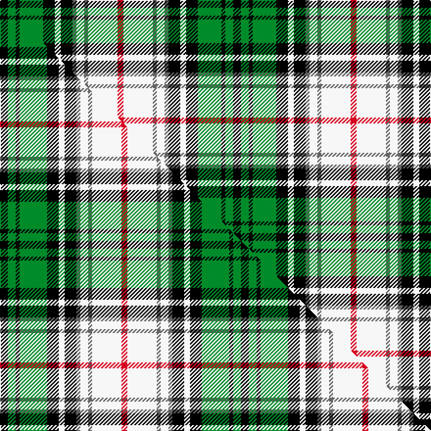

This page is one **sett** — a single exact thread-count. It belongs to the [tartan](/setts/k4g4k2g12k6w3k6n2w4n2w15r3/)
(the same proportion at any scale), whose colour order is pattern [KGKGKWKBWBWR](/stripes/kgkgkwkbwbwr/).

Part of the [Hayama Shirt Honten, The](/tartans/hayama-shirt-honten-the/) tartan — the named design grouping this sett with its other cloths.

Sourced from tartans-authority.  It is a [12 stripe tartan](/stripes/stripes12/).

Original link [https://www.tartanregister.gov.uk/tartanDetails.aspx?ref=10916](https://www.tartanregister.gov.uk/tartanDetails.aspx?ref=10916)

Dataset <small>— provenance for this record, inherited from the source manifest</small>

<dl class="dataset-prov">
<dt>source</dt><dd><a href="/sources/tartans-authority/">Scottish Tartans Authority</a></dd>
<dt>data captured from</dt><dd><a href="https://github.com/thetartan/tartan-database/blob/master/data/tartans-authority/data.csv">https://github.com/thetartan/tartan-database/blob/master/data/tartans-authority/data.csv</a></dd>
<dt>data date</dt><dd>2013 <small>(this record)</small></dd>
<dt>licence</dt><dd><a href="https://creativecommons.org/licenses/by-nc-nd/4.0/">CC BY-NC-ND 4.0</a></dd>
</dl>

Capture chain <small>— the hands this data passed through, oldest first; each capture carries its own licence</small>

<ol class="capture-chain">
<li><a href="https://www.tartansauthority.com/">Scottish Tartans Authority</a> <small>the heritage body's archive — its tartan-ferret record browser is retired (links repaired to the SRT, above)</small></li>
<li><a href="https://github.com/thetartan/tartan-database">thetartan/tartan-database</a> <small>2016-2017</small> · <a href="https://creativecommons.org/licenses/by-nc-nd/4.0/">CC BY-NC-ND 4.0</a> <small>Levko Kravets's frozen compilation — the capture we vendored, and where its CC licence text came from</small></li>
<li>this dictionary <small>captured 2026-06-10 · commit 5bf86c7566</small> <small>each re-capture is a git commit to data/sources</small></li>
</ol>

## Register references

External register numbers recorded for this tartan.

- Scottish Register of Tartans: [10916](https://www.tartanregister.gov.uk/tartanDetails?ref=10916)
- Scottish Tartans Authority (ITI): 10916

## Thread count
K/8 G8 K4 G24 K12 W6 K12 N4 W8 N4 W30 R/6

One full sett is **238 threads**.

## Palette
<table><thead><tr><th>Colour</th><th>Shade</th><th>OKLCh</th></tr></thead><tbody><tr><td>G</td><td><code style="background-color:#008B2A;">#008B2A</code> <small style="color:#888">#008B2A</small></td><td><small style="color:#888">oklch(55.4% 0.170 145.9)</small></td></tr><tr><td>K</td><td><code style="background-color:#000000;">#000000</code> <small style="color:#888">#000000</small></td><td><small style="color:#888">oklch(0.0% 0.000 0.0)</small></td></tr><tr><td>N</td><td><code style="background-color:#636363;">#636363</code> <small style="color:#888">#636363</small></td><td><small style="color:#888">oklch(50.0% 0.000 89.9)</small></td></tr><tr><td>R</td><td><code style="background-color:#D60020;">#D60020</code> <small style="color:#888">#D60020</small></td><td><small style="color:#888">oklch(55.2% 0.224 25.5)</small></td></tr><tr><td>W</td><td><code style="background-color:#F7F7F7;">#F7F7F7</code> <small style="color:#888">#F7F7F7</small></td><td><small style="color:#888">oklch(97.6% 0.000 89.9)</small></td></tr></tbody></table>

# Sample pattern

## Compared to the master

This cloth is one sett of its design; the master sett (the exemplar the design is anchored on) is below for comparison.

Its **ΔTartan distance** from the master is **0.05** — the same measure the nearest-tartans table ranks by (0 is identical; a re-scale of the same cloth is near 0, a recolour or a different proportion further).

<figure class="master-compare" style="margin:0">

this sett
master sett ★

<figcaption style="color:#888;font-size:smaller">One weave of this sett against the <a href="/setts/k4g4k2g14k6w3k6n2w4n2w15r3/">master sett ★</a>, split on the diagonal: a shared proportion runs seamlessly across it with only the shades shifting; a different proportion breaks on it.</figcaption>
</figure>

## Nearest tartan variants

The nearest existing variants by ΔTartan distance, with this cloth at the top so the swatches line up against it.

ΔTartan

Threads

Variant

Sett

—

238

<a href="/variants/s12/k4g4k2g12k6w3k6n2w4n2w15r3~x2/">Hayama Shirt Honten, The</a>

<a href="/ttd/edit/#slug=k4g4k2g14k6w3k6n2w4n2w15r3~x2&amp;base=k4g4k2g12k6w3k6n2w4n2w15r3~x2" title="compare in the TTD">0.05</a>

246

<a href="/variants/s12/k4g4k2g14k6w3k6n2w4n2w15r3~x2/">Hayama Shirt Honten, The</a>

<a href="/ttd/edit/#slug=w6y2w2y3w11g11t2k12t3k6w2~x2&amp;base=k4g4k2g12k6w3k6n2w4n2w15r3~x2" title="compare in the TTD">1.13</a>

224

<a href="/variants/s11/w6y2w2y3w11g11t2k12t3k6w2~x2/">Fitzpatrick</a>

<a href="/ttd/edit/#slug=w6y2w2y3w11g11db2k12db3k6w2~x2&amp;base=k4g4k2g12k6w3k6n2w4n2w15r3~x2" title="compare in the TTD">1.28</a>

224

<a href="/variants/s11/w6y2w2y3w11g11db2k12db3k6w2~x2/">Fitzpatrick</a>

<a href="/ttd/edit/#slug=w18dr3w3dr10w26dr3k26g28dr10g3dr3g8lo6&amp;base=k4g4k2g12k6w3k6n2w4n2w15r3~x2" title="compare in the TTD">1.44</a>

270

<a href="/variants/s13/w18dr3w3dr10w26dr3k26g28dr10g3dr3g8lo6/">Carnegie Dress #2 (Fashion)</a>

<a href="/ttd/edit/#slug=g8r1g2r3g12k12dy1lb12r3lb2r1lb8~x2&amp;base=k4g4k2g12k6w3k6n2w4n2w15r3~x2" title="compare in the TTD">1.87</a>

228

<a href="/variants/s12/g8r1g2r3g12k12dy1lb12r3lb2r1lb8~x2/">Macallan Distillery</a>

<a href="/ttd/edit/#slug=y5g2r2g12k9lb12r2lb2r2lb2~x2&amp;base=k4g4k2g12k6w3k6n2w4n2w15r3~x2" title="compare in the TTD">1.94</a>

186

<a href="/variants/s10/y5g2r2g12k9lb12r2lb2r2lb2~x2/">Lobban (Personal)</a>

<a href="/ttd/edit/#slug=db1r1db8k3g8r1g1r1g8k3w10r1w1~x4&amp;base=k4g4k2g12k6w3k6n2w4n2w15r3~x2" title="compare in the TTD">1.96</a>

368

<a href="/variants/s13/db1r1db8k3g8r1g1r1g8k3w10r1w1~x4/">Blair, dress</a>

<a href="/ttd/edit/#slug=dg17lb3dg17k15w33db8w33k15dg17lb3dg17lb3~x2&amp;base=k4g4k2g12k6w3k6n2w4n2w15r3~x2" title="compare in the TTD">2.06</a>

684

<a href="/variants/s12/dg17lb3dg17k15w33db8w33k15dg17lb3dg17lb3~x2/">MacRobart Family Tartan</a>

<a href="/ttd/edit/#slug=w16g2k5r2k10g11y2g11k2~x2&amp;base=k4g4k2g12k6w3k6n2w4n2w15r3~x2" title="compare in the TTD">2.07</a>

208

<a href="/variants/s9/w16g2k5r2k10g11y2g11k2~x2/">Unidentified #46</a>

<a href="/ttd/edit/#slug=w3k2w7k2w2k7g8k1w2k1g8k7db7r2~x2&amp;base=k4g4k2g12k6w3k6n2w4n2w15r3~x2" title="compare in the TTD">2.13</a>

226

<a href="/variants/s14/w3k2w7k2w2k7g8k1w2k1g8k7db7r2~x2/">MacKenzie Dress - 1950 (Clan)</a>

## Neighbour map

Every grey dot is one of 13621 variants placed by the first two principal components of the ΔTartan feature space (42% of its variance). Red is this tartan; blue dots are its nearest — click one to open its page.

<svg viewBox="0 0 640 380" role="img" style="max-width:100%;height:auto;border:1px solid #e0e0e0;border-radius:4px;display:block" xmlns="http://www.w3.org/2000/svg"><image href="/nn/cloud.v1.png" width="640" height="380"/><a href="/variants/s12/k4g4k2g14k6w3k6n2w4n2w15r3~x2/"><circle cx="70.5" cy="164.8" r="4" fill="#3465a4"><title>Hayama Shirt Honten, The</title></circle></a><a href="/variants/s11/w6y2w2y3w11g11t2k12t3k6w2~x2/"><circle cx="61.3" cy="186.3" r="4" fill="#3465a4"><title>Fitzpatrick</title></circle></a><a href="/variants/s11/w6y2w2y3w11g11db2k12db3k6w2~x2/"><circle cx="61.3" cy="185.3" r="4" fill="#3465a4"><title>Fitzpatrick</title></circle></a><a href="/variants/s13/w18dr3w3dr10w26dr3k26g28dr10g3dr3g8lo6/"><circle cx="68.4" cy="151.7" r="4" fill="#3465a4"><title>Carnegie Dress #2 (Fashion)</title></circle></a><a href="/variants/s12/g8r1g2r3g12k12dy1lb12r3lb2r1lb8~x2/"><circle cx="105.1" cy="149.1" r="4" fill="#3465a4"><title>Macallan Distillery</title></circle></a><a href="/variants/s10/y5g2r2g12k9lb12r2lb2r2lb2~x2/"><circle cx="72.0" cy="182.4" r="4" fill="#3465a4"><title>Lobban (Personal)</title></circle></a><a href="/variants/s13/db1r1db8k3g8r1g1r1g8k3w10r1w1~x4/"><circle cx="92.6" cy="142.4" r="4" fill="#3465a4"><title>Blair, dress</title></circle></a><a href="/variants/s12/dg17lb3dg17k15w33db8w33k15dg17lb3dg17lb3~x2/"><circle cx="98.3" cy="166.0" r="4" fill="#3465a4"><title>MacRobart Family Tartan</title></circle></a><a href="/variants/s9/w16g2k5r2k10g11y2g11k2~x2/"><circle cx="99.3" cy="177.0" r="4" fill="#3465a4"><title>Unidentified #46</title></circle></a><a href="/variants/s14/w3k2w7k2w2k7g8k1w2k1g8k7db7r2~x2/"><circle cx="54.6" cy="169.5" r="4" fill="#3465a4"><title>MacKenzie Dress - 1950 (Clan)</title></circle></a><circle cx="71.1" cy="167.2" r="5" fill="#c00000"/><text x="320" y="376" text-anchor="middle" font-size="11" fill="#999">ground</text><text x="11" y="190" text-anchor="middle" font-size="11" fill="#999" transform="rotate(-90 11 190)">complexity</text></svg>

ID: /variants/s12/k4g4k2g12k6w3k6n2w4n2w15r3~x2/
